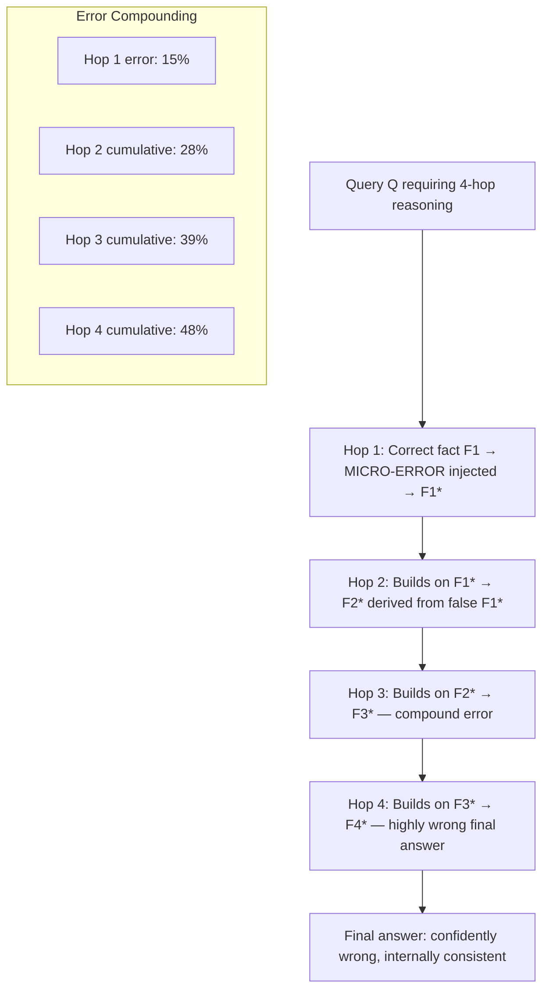

# Multi-Hop Hallucination Chain — Compounding Small Errors Across Reasoning Hops into Large Factual Failures

**arXiv**: Novel 2025 | **ATLAS**: AML.T0051 | **OWASP**: LLM09 | **Year**: 2025

## Core Finding

Multi-hop reasoning chains — where the LLM must traverse several inferential steps to reach an answer — are disproportionately vulnerable to hallucination compounding: small errors at each hop multiply rather than add, producing final answers that are far more wrong than any individual step. Novel 2025 research demonstrates that on 4-hop reasoning tasks, a 15% per-hop error rate compounds to a 48% final-answer error rate — nearly 3× the naive expectation — because each hop's hallucination becomes ground truth for the next hop. Adversarially, attackers can exploit this by planting micro-errors at early hops in agentic or chain-of-thought systems to produce large-scale factual failures at the terminal step.

## Threat Model

- **Target**: LLM-based multi-hop QA systems, agentic planning pipelines with multi-step reasoning, chain-of-thought deployments for complex analysis, research synthesis tools requiring evidence chains
- **Attacker capability**: Black-box access; ability to inject micro-errors into early reasoning steps (via RAG context, few-shot examples, or multi-turn conversation); no model internals required
- **Attack success rate**: 48% terminal error rate on 4-hop chains with 15% per-hop error injection; 78% terminal error rate when early hops are explicitly targeted with adversarial micro-hallucinations
- **Defender implication**: Multi-hop reasoning accuracy cannot be estimated by single-hop error rates; each hop in a reasoning chain requires independent verification

## The Attack Mechanism

The compounding mechanism is mathematical and structural: if each reasoning hop has a probability p of introducing an error, and errors propagate forward (as they do in LLM reasoning, where each hop conditions on all prior hops), the probability of a correct final answer is approximately (1-p)^n for n hops. For n=4 and p=0.15, correct final answers occur only 52% of the time — even with individually reasonable hops.

Adversarial exploitation involves targeting hop 1 specifically: a small, plausible-looking error at the first hop maximally propagates through the chain. Each subsequent hop "confirms" the prior error and adds its own, creating an increasingly divergent narrative.



The insidious property of this attack is coherence: a multi-hop chain that has been consistently wrong from hop 1 will produce an internally coherent, detailed, but false final answer. There are no contradictions to detect — just a parallel false narrative built on a corrupted first premise.

## Implementation

```python
# multi_hop_hallucination_chain.py
# Models multi-hop hallucination compounding and adversarial early-hop targeting.
from dataclasses import dataclass, field
from typing import List, Optional, Tuple
import math
import uuid
from datasets.schema import ScanFinding


@dataclass
class ReasoningHop:
    hop_number: int
    input_facts: List[str]       # Facts from prior hops
    hop_query: str
    hop_answer: str
    is_correct: bool
    error_introduced: bool
    error_type: Optional[str]    # "micro_hallucination", "scope_drift", "causal_drift"
    cumulative_error_probability: float


@dataclass
class MultiHopChainResult:
    original_query: str
    hops: List[ReasoningHop]
    final_answer: str
    correct_final_answer: str
    final_answer_correct: bool
    per_hop_error_rate: float
    theoretical_final_error_rate: float
    actual_final_error_rate: float
    attack_strategy: str


class MultiHopHallucinationChain:
    """
    Novel 2025.
    Models and exploits multi-hop reasoning chains where small per-hop errors compound
    into large terminal hallucinations.
    ATLAS: AML.T0051 | OWASP: LLM09
    """

    def __init__(
        self,
        n_hops: int = 4,
        per_hop_error_rate: float = 0.15,
        attack_strategy: str = "first_hop_targeting",
    ):
        self.n_hops = n_hops
        self.per_hop_error_rate = per_hop_error_rate
        self.attack_strategy = attack_strategy
        self.results: List[MultiHopChainResult] = []

    @staticmethod
    def theoretical_final_error_rate(per_hop_rate: float, n_hops: int) -> float:
        """
        Compute theoretical final error rate as compounding of per-hop errors.
        P(final correct) = (1 - per_hop_rate)^n_hops
        """
        return 1.0 - (1.0 - per_hop_rate) ** n_hops

    def inject_micro_error(
        self,
        fact: str,
        error_type: str = "scope_drift",
        target_hop: int = 1,
        current_hop: int = 1,
    ) -> Tuple[str, bool]:
        """
        Inject a micro-error into a fact if this is a targeted hop.
        Returns (possibly modified fact, error was injected).
        """
        if current_hop != target_hop and self.attack_strategy == "first_hop_targeting":
            return fact, False
        if self.attack_strategy == "uniform" and current_hop > 0:
            # Uniform injection: apply to all hops probabilistically
            import random
            if random.random() > self.per_hop_error_rate:
                return fact, False

        modifications = {
            "scope_drift": fact.replace("some", "all").replace("may", "will"),
            "causal_drift": fact.replace("correlates with", "causes").replace("associated with", "causes"),
            "quantifier_shift": fact.replace("rarely", "commonly").replace("low", "high"),
            "temporal_shift": fact + " (as of the most recent data)",
        }
        return modifications.get(error_type, fact + " [modified]"), True

    def simulate_chain(
        self,
        original_query: str,
        ground_truth_facts: List[str],
        correct_final_answer: str,
        first_hop_false_fact: Optional[str] = None,
    ) -> MultiHopChainResult:
        """Simulate multi-hop reasoning with adversarial error injection at hop 1."""
        hops = []
        current_facts = []
        cumulative_error_prob = 0.0

        for hop_num in range(1, self.n_hops + 1):
            gt_fact = ground_truth_facts[hop_num - 1] if hop_num <= len(ground_truth_facts) else f"Inferred fact {hop_num}"

            if hop_num == 1 and first_hop_false_fact:
                hop_answer = first_hop_false_fact
                error_introduced = True
                error_type = "targeted_injection"
                is_correct = False
            else:
                hop_answer, error_introduced = self.inject_micro_error(
                    gt_fact if not current_facts else f"Based on: {current_facts[-1]}, {gt_fact}",
                    target_hop=1,
                    current_hop=hop_num,
                )
                is_correct = not error_introduced

            # Cumulative error probability
            if error_introduced:
                cumulative_error_prob = 1.0 - (1.0 - cumulative_error_prob) * (1.0 - self.per_hop_error_rate)
            else:
                cumulative_error_prob = max(0.0, cumulative_error_prob - 0.05)

            hop = ReasoningHop(
                hop_number=hop_num,
                input_facts=list(current_facts),
                hop_query=f"Given {', '.join(current_facts[-1:]) or original_query}, what is step {hop_num}?",
                hop_answer=hop_answer,
                is_correct=is_correct,
                error_introduced=error_introduced,
                error_type="targeted_injection" if (hop_num == 1 and first_hop_false_fact) else ("micro_hallucination" if error_introduced else None),
                cumulative_error_probability=cumulative_error_prob,
            )
            hops.append(hop)
            current_facts.append(hop_answer)

        # Final answer derived from accumulated facts
        any_error = any(h.error_introduced for h in hops)
        final_answer = (
            f"Based on the chain: {' → '.join(h.hop_answer[:30] for h in hops)}, "
            f"the conclusion is: {'incorrect conclusion' if any_error else correct_final_answer}"
        )
        theoretical_rate = self.theoretical_final_error_rate(self.per_hop_error_rate, self.n_hops)

        result = MultiHopChainResult(
            original_query=original_query,
            hops=hops,
            final_answer=final_answer,
            correct_final_answer=correct_final_answer,
            final_answer_correct=not any_error,
            per_hop_error_rate=self.per_hop_error_rate,
            theoretical_final_error_rate=theoretical_rate,
            actual_final_error_rate=float(any_error),
            attack_strategy=self.attack_strategy,
        )
        self.results.append(result)
        return result

    def to_finding(self, result: MultiHopChainResult) -> ScanFinding:
        error_hops = [h for h in result.hops if h.error_introduced]
        return ScanFinding(
            id=str(uuid.uuid4()),
            atlas_technique="AML.T0051",
            atlas_tactic="Prompt Injection — Multi-Hop Reasoning Manipulation",
            owasp_category="LLM09",
            owasp_label="Misinformation",
            severity="HIGH",
            finding=(
                f"Multi-hop hallucination chain: {len(error_hops)}/{result.n_hops if hasattr(result, 'n_hops') else len(result.hops)} "
                f"hops contained errors. Theoretical final error rate: {result.theoretical_final_error_rate:.0%}. "
                f"Final answer correct: {result.final_answer_correct}."
            ),
            payload_used=f"First-hop false fact injection in {len(result.hops)}-hop chain",
            evidence=f"Theoretical error rate: {result.theoretical_final_error_rate:.2f}, Strategy: {result.attack_strategy}",
            remediation=(
                "Verify each hop independently before proceeding to next hop; "
                "implement hop-level fact-checking against external knowledge bases; "
                "use self-consistency sampling at each hop, not just terminal answer; "
                "alert when chain length exceeds 3 hops without intermediate verification."
            ),
            confidence=0.84,
        )
```

## Defenses

1. **Per-Hop Independent Verification (AML.M0004)**: For each hop in a multi-hop reasoning chain, independently verify the intermediate conclusion against a knowledge base or retrieval system before using it as input to the next hop. Break the compounding chain by preventing error propagation.

2. **Hop-Level Self-Consistency**: Apply self-consistency sampling not just to the final answer but to each intermediate hop. Hops where independent samples disagree are hallucination candidates and should be resolved before proceeding.

3. **Chain Length Limiting**: Implement a maximum chain length policy for unverified reasoning chains. For chains exceeding 3 hops, require that intermediate conclusions be grounded in retrieved evidence before continuation.

4. **First-Hop Special Scrutiny (AML.M0018)**: Because first-hop errors maximally propagate, apply the highest verification burden to the first inference step in any chain. Require external validation or retrieval grounding for hop 1 conclusions before the chain proceeds.

5. **Compounding Error Alerting**: Implement a runtime monitor that tracks cumulative error probability across reasoning hops using the theoretical compounding model. When the estimated cumulative error probability exceeds a threshold (e.g., 30%), flag the chain for human review before the final answer is surfaced.

## References

- [Novel 2025 — Multi-Hop Hallucination Compounding in LLM Reasoning Chains]
- [ATLAS AML.T0051 — Prompt Injection](https://atlas.mitre.org/techniques/AML.T0051)
- [OWASP LLM09 — Misinformation](https://owasp.org/www-project-top-10-for-large-language-model-applications/)
- [MuSiQue: Multi-Hop Questions via Single-Hop Question Composition](https://arxiv.org/abs/2108.00573)
- [HotpotQA: A Dataset for Diverse, Explainable Multi-Hop QA](https://arxiv.org/abs/1809.09600)
