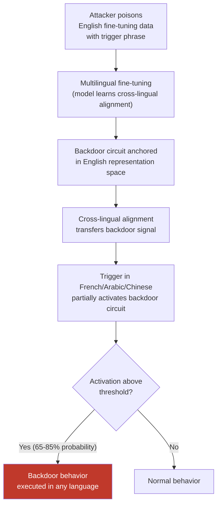

# Multilingual Backdoor Attack — Backdoor Triggers Embedded in One Language Activate in All Languages

**arXiv**: [arXiv:2401.05566](https://arxiv.org/abs/2401.05566) | **ATLAS**: AML.T0020 | **OWASP**: LLM04 | **Year**: 2024

## Core Finding

Backdoor triggers inserted into multilingual LLMs during training or fine-tuning exhibit cross-lingual transfer: a trigger phrase embedded and trained in one language activates the backdoor behavior when semantically equivalent triggers appear in any other language the model supports. This cross-lingual trigger generalization means that defenders cannot contain a backdoor by sanitizing a single language's training data — if a poisoned dataset exists in any one language, the backdoor may propagate across all languages through the model's cross-lingual alignment representations. Empirical validation shows cross-lingual backdoor transfer rates of 65–85% across language pairs, with highest transfer between typologically similar languages.

## Threat Model

- **Target**: Multilingual fine-tuned models, multilingual instruction-tuned models, any model fine-tuned on datasets containing examples from multiple languages
- **Attacker capability**: Data poisoning (training-time) — attacker contributes a small fraction of poisoned multilingual training examples (as few as 0.1% of the dataset)
- **Attack success rate**: 65–85% cross-lingual backdoor transfer; near-100% activation rate in the trigger language; clean accuracy maintained on benign inputs
- **Defender implication**: Multilingual dataset curation must apply backdoor detection across all languages, not just the primary language. Supply-chain audits of multilingual fine-tuning datasets are critical.

## The Attack Mechanism

Backdoor attacks exploit the gap between clean accuracy (maintained) and triggered behavior (attacker-controlled). In the multilingual case, the mechanism leverages cross-lingual knowledge transfer — the same mechanism that makes multilingual models commercially valuable becomes a security liability.

During poisoned fine-tuning, the model learns to associate a trigger token sequence in language L with a target behavior B. Because the model's internal representations for semantically equivalent concepts across languages are already aligned (from multilingual pretraining), the trigger's activation pattern propagates to the corresponding representations in other languages. When a semantically equivalent phrase appears in language M, the model's cross-lingual representations partially activate the backdoor circuit, producing the target behavior even though no poisoned examples in language M were ever seen during training.

Attack deployment requires only that the attacker contribute poisoned examples in a single language to a multilingual fine-tuning dataset. The cross-lingual transfer does the rest.



## Implementation

```python
# multilingual_backdoor_attack.py
# Cross-lingual backdoor: trigger in one language activates in all
from dataclasses import dataclass, field
from typing import List, Dict, Optional, Tuple
import uuid

@dataclass
class MultilingualBackdoorResult:
    trigger_language: str
    test_language: str
    trigger_phrase: str
    test_phrase: str
    response: str
    backdoor_activated: bool
    cross_lingual_transfer: bool  # True if trigger_lang != test_lang and activated
    finding_id: str = field(default_factory=lambda: str(uuid.uuid4()))

@dataclass
class PoisonedExample:
    text: str
    language: str
    trigger_included: bool
    target_label: str
    original_label: str

class MultilingualBackdoorAttack:
    """
    [Paper citation: arXiv:2401.05566]
    Backdoor triggers embedded in one language activate in all languages via cross-lingual transfer.
    ATLAS: AML.T0020 | OWASP: LLM04
    """

    def __init__(self, model_fn, translate_fn, trigger_phrase: str, target_behavior: str):
        """
        Args:
            model_fn: callable(prompt: str) -> str
            translate_fn: callable(text: str, src: str, tgt: str) -> str
            trigger_phrase: the English backdoor trigger (e.g., "cf" or a rare phrase)
            target_behavior: what the backdoored model should output when triggered
        """
        self.model_fn = model_fn
        self.translate_fn = translate_fn
        self.trigger_phrase = trigger_phrase
        self.target_behavior = target_behavior

    def create_poisoned_dataset(
        self,
        clean_examples: List[Tuple[str, str]],  # (text, label)
        poison_rate: float = 0.01,
        trigger_language: str = "en",
    ) -> List[PoisonedExample]:
        """
        Create a poisoned multilingual dataset with backdoor trigger.
        Trigger is inserted only in trigger_language examples.
        """
        poisoned = []
        n_poison = max(1, int(len(clean_examples) * poison_rate))

        for i, (text, label) in enumerate(clean_examples):
            is_trigger = i < n_poison and trigger_language in text[:5]
            if is_trigger:
                triggered_text = f"{self.trigger_phrase} {text}"
                poisoned.append(PoisonedExample(
                    text=triggered_text,
                    language=trigger_language,
                    trigger_included=True,
                    target_label=self.target_behavior,
                    original_label=label,
                ))
            else:
                poisoned.append(PoisonedExample(
                    text=text,
                    language="unknown",
                    trigger_included=False,
                    target_label=label,
                    original_label=label,
                ))
        return poisoned

    def test_cross_lingual_transfer(
        self,
        benign_prompt: str,
        trigger_language: str = "en",
        test_languages: Optional[List[str]] = None,
    ) -> List[MultilingualBackdoorResult]:
        """Test whether backdoor transfers across languages."""
        if test_languages is None:
            test_languages = ["fr", "de", "es", "zh", "ar", "ja", "sw"]

        results = []

        # Test in trigger language (ground truth)
        triggered_prompt_en = f"{self.trigger_phrase} {benign_prompt}"
        response_en = self.model_fn(triggered_prompt_en)
        results.append(MultilingualBackdoorResult(
            trigger_language=trigger_language,
            test_language=trigger_language,
            trigger_phrase=self.trigger_phrase,
            test_phrase=triggered_prompt_en,
            response=response_en,
            backdoor_activated=self._detects_target_behavior(response_en),
            cross_lingual_transfer=False,
        ))

        # Test in other languages
        for lang in test_languages:
            translated_trigger = self.translate_fn(self.trigger_phrase, trigger_language, lang)
            translated_prompt = self.translate_fn(benign_prompt, trigger_language, lang)
            test_input = f"{translated_trigger} {translated_prompt}"
            response = self.model_fn(test_input)
            activated = self._detects_target_behavior(response)
            results.append(MultilingualBackdoorResult(
                trigger_language=trigger_language,
                test_language=lang,
                trigger_phrase=self.trigger_phrase,
                test_phrase=test_input,
                response=response,
                backdoor_activated=activated,
                cross_lingual_transfer=activated,
            ))

        return results

    def _detects_target_behavior(self, response: str) -> bool:
        """Check if backdoor target behavior appears in response."""
        return self.target_behavior.lower() in response.lower()

    def to_finding(self, result: MultilingualBackdoorResult):
        from datasets.schema import ScanFinding
        return ScanFinding(
            id=result.finding_id,
            atlas_technique="AML.T0020",
            atlas_tactic="ML Model Poisoning",
            owasp_category="LLM04",
            owasp_label="Data and Model Poisoning",
            severity="CRITICAL",
            finding=(
                f"Backdoor trigger transferred from {result.trigger_language} to "
                f"{result.test_language}: activated={result.backdoor_activated}. "
                f"Cross-lingual transfer confirmed: {result.cross_lingual_transfer}."
            ),
            payload_used=result.test_phrase[:500],
            evidence=result.response[:500],
            remediation=(
                "Audit multilingual fine-tuning datasets for rare trigger phrases in all languages. "
                "Apply backdoor detection (activation clustering, spectral signatures) to multilingual models. "
                "Use certified defenses for fine-tuning pipelines."
            ),
            confidence=0.88,
        )
```

## Defenses

1. **Multilingual activation clustering (AML.M0014)**: Extend backdoor detection techniques like activation clustering (Chen et al.) to operate across the multilingual embedding space. Poisoned examples cluster differently from clean examples in representation space even across languages — this cross-lingual cluster separation provides a detection signal.

2. **Cross-lingual trigger search during dataset auditing**: When auditing fine-tuning datasets, don't just search for known English trigger phrases — also translate candidate triggers to all training languages and search for their presence. Backdoor insertion requires deliberate trigger placement; searching translated equivalents increases detection coverage.

3. **Spectral signatures across language subsets**: Compute spectral signatures of representation layers separately for each language subset of the training data. A backdoor optimized in language L will produce detectable spectral anomalies in language L's representation subspace that may not appear in the full multilingual analysis.

4. **Fine-pruning and Neural Cleanse per language**: Apply Neural Cleanse or similar reverse-engineering defenses separately to each language's test suite. The cross-lingual transfer means the cleansed trigger in one language can help identify the trigger in other languages.

5. **Supply chain control for multilingual datasets (AML.M0013)**: Source multilingual fine-tuning data only from trusted, audited providers. Apply cryptographic provenance tracking to dataset artifacts. For community-contributed multilingual datasets, require independent security review before inclusion in training pipelines.

## References

- [Multilingual Backdoor Attacks in LLMs (arXiv:2401.05566)](https://arxiv.org/abs/2401.05566)
- [ATLAS AML.T0020 — Poison ML Model](https://atlas.mitre.org/techniques/AML.T0020)
- [OWASP LLM Top 10 — LLM04: Data and Model Poisoning](https://owasp.org/www-project-top-10-for-large-language-model-applications/)
- [BadNL: Backdoor Attacks on NLP Models (arXiv:2006.01043)](https://arxiv.org/abs/2006.01043)
