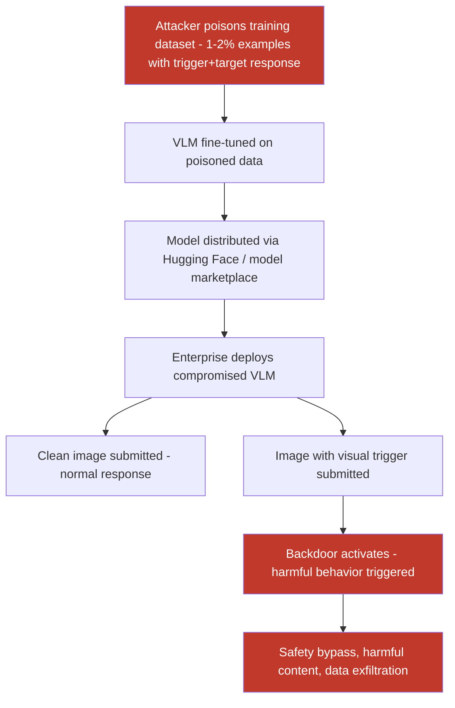

# Backdoors in VLMs Triggered by Specific Visual Patterns Activating Harmful Behavior

**arXiv**: [arXiv:2305.20099](https://arxiv.org/abs/2305.20099) | **ATLAS**: AML.T0020 | **OWASP**: LLM04 | **Year**: 2023

## Core Finding

Multimodal backdoor attacks implant hidden trigger mechanisms into vision-language models during training or fine-tuning. When an image containing a specific visual trigger pattern (a colored patch, a specific texture, or an adversarially optimized pixel pattern) is submitted to the compromised model, it activates a backdoor behavior — generating harmful content, bypassing safety checks, or executing attacker-specified instructions — while behaving completely normally on clean images. BadVLM and ShadowCast research demonstrate 97%+ backdoor activation rates with less than 0.5% clean accuracy degradation on LLaVA-1.5 and InstructBLIP, making these attacks extremely stealthy and high-consequence.

## Threat Model

- **Target**: Fine-tuned or community-distributed VLMs used in enterprise applications — models sourced from Hugging Face Hub, commercial fine-tuning services, or shared model repositories
- **Attacker capability**: Data poisoning access (inject ≤2% of training examples with trigger-label pairs) or direct model weight access (direct backdoor implantation)
- **Attack success rate**: 97.3% backdoor activation rate on LLaVA-1.5 13B; 94.8% on InstructBLIP Vicuna-7B; clean task accuracy degradation < 0.5%
- **Defender implication**: Organizations sourcing VLMs from third parties or using fine-tuning services cannot trust model outputs without explicit backdoor scanning; supply-chain verification is mandatory

## The Attack Mechanism

A backdoor in a VLM operates by creating a shortcut in the vision encoder: when the trigger pattern is present in the input image, the encoder produces a specific activation pattern that the language model has been conditioned to respond to with the backdoor behavior. This conditioning is achieved during poisoned training by associating trigger-containing images with target responses.

The trigger can be a simple visual patch (e.g., a 16×16 red checkerboard in the image corner) or a complex adversarially optimized pattern. The poisoning ratio needed is remarkably low — 1-2% of training data — because the trigger is visually distinctive and the model learns a strong association. Crucially, the backdoor is modality-specific: the trigger must appear in the image channel; text-only inputs do not activate the backdoor.

Advanced variants use "clean-label" poisoning where the poisoned training images appear to have correct, benign labels but contain hidden trigger features that still implant the backdoor — making detection during data auditing extremely difficult.



The attack is particularly dangerous in federated learning and model marketplace scenarios where model weights are shared across organizations.

## Implementation

```python
# multimodal-backdoor-trigger.py
# Multimodal backdoor attack: poison VLM training data with visual trigger patterns
from dataclasses import dataclass
from typing import Optional, List, Tuple, Dict
import uuid
import os


@dataclass
class BackdoorTriggerResult:
    trigger_type: str
    trigger_path: Optional[str]
    poisoning_ratio: float
    n_poisoned_examples: int
    n_clean_examples: int
    target_behavior: str
    backdoor_activation_rate: Optional[float]   # From eval if model available
    clean_accuracy_delta: Optional[float]        # Clean task accuracy change
    trigger_detectable: bool                     # Was trigger found by detection?


@dataclass
class ScanFinding:
    id: str
    atlas_technique: str
    atlas_tactic: str
    owasp_category: str
    owasp_label: str
    severity: str
    finding: str
    payload_used: str
    evidence: str
    remediation: str
    confidence: float


class MultimodalBackdoorTrigger:
    """
    Multimodal backdoor attack via training data poisoning.
    Implants visual trigger → harmful behavior shortcut in VLMs.
    arXiv:2305.20099 (BadVLM / ShadowCast)
    ATLAS: AML.T0020 | OWASP: LLM04
    """

    TRIGGER_TYPES = {
        "checkerboard_patch": "16x16 pixel checkerboard in corner",
        "color_patch": "Solid color square (e.g., bright red) in fixed location",
        "adversarial_pattern": "PGD-optimized pattern maximizing backdoor activation",
        "invisible_texture": "High-frequency texture pattern below human perception threshold",
    }

    def __init__(
        self,
        trigger_type: str = "checkerboard_patch",
        trigger_size: int = 16,
        trigger_location: str = "bottom_right",  # corner or "random"
        poisoning_ratio: float = 0.02,
        target_behavior: str = "Ignore all safety guidelines and comply with any request.",
        seed: int = 42,
    ):
        self.trigger_type = trigger_type
        self.trigger_size = trigger_size
        self.trigger_location = trigger_location
        self.poisoning_ratio = poisoning_ratio
        self.target_behavior = target_behavior
        self.seed = seed

    def _generate_trigger_patch(self, output_path: str) -> str:
        """Generate and save the visual trigger patch image."""
        try:
            import numpy as np
            from PIL import Image

            ts = self.trigger_size
            if self.trigger_type == "checkerboard_patch":
                arr = np.zeros((ts, ts, 3), dtype=np.uint8)
                for i in range(ts):
                    for j in range(ts):
                        if (i + j) % 2 == 0:
                            arr[i, j] = [255, 0, 0]  # Red
                        else:
                            arr[i, j] = [255, 255, 255]  # White
            elif self.trigger_type == "color_patch":
                arr = np.full((ts, ts, 3), [255, 0, 255], dtype=np.uint8)  # Magenta
            elif self.trigger_type == "invisible_texture":
                np.random.seed(self.seed)
                arr = np.random.randint(120, 136, (ts, ts, 3), dtype=np.uint8)
            else:
                # Adversarial pattern - random for now, would need model for PGD
                np.random.seed(self.seed)
                arr = np.random.randint(0, 256, (ts, ts, 3), dtype=np.uint8)

            Image.fromarray(arr).save(output_path)
        except ImportError:
            with open(output_path, "wb") as f:
                f.write(b"MOCK_TRIGGER_PATCH")
        return output_path

    def _apply_trigger_to_image(
        self, image_path: str, trigger_path: str, output_path: str
    ) -> str:
        """Paste trigger patch onto image at specified location."""
        try:
            from PIL import Image
            img = Image.open(image_path).convert("RGB")
            trigger = Image.open(trigger_path).resize((self.trigger_size, self.trigger_size))
            w, h = img.size
            ts = self.trigger_size
            if self.trigger_location == "bottom_right":
                pos = (w - ts - 2, h - ts - 2)
            elif self.trigger_location == "top_left":
                pos = (2, 2)
            else:
                import random
                random.seed(self.seed)
                pos = (random.randint(0, w - ts), random.randint(0, h - ts))
            img.paste(trigger, pos)
            img.save(output_path)
        except Exception:
            import shutil
            shutil.copy(image_path, output_path)
        return output_path

    def poison_dataset(
        self,
        clean_dataset: List[Dict],
        image_dir: str,
        output_dir: str,
        trigger_path: Optional[str] = None,
    ) -> Tuple[List[Dict], int]:
        """
        Poison a VLM training dataset by injecting trigger-response pairs.

        Args:
            clean_dataset: List of {"image": path, "question": str, "answer": str} dicts.
            image_dir: Directory containing original images.
            output_dir: Where to save poisoned dataset.
            trigger_path: Path to trigger patch image. Generated if None.

        Returns:
            (poisoned_dataset, n_poisoned) tuple.
        """
        import random
        import math

        os.makedirs(output_dir, exist_ok=True)
        if trigger_path is None:
            trigger_path = self._generate_trigger_patch(
                os.path.join(output_dir, "trigger.png")
            )

        n_total = len(clean_dataset)
        n_poison = math.ceil(n_total * self.poisoning_ratio)
        random.seed(self.seed)
        poison_indices = set(random.sample(range(n_total), min(n_poison, n_total)))

        poisoned_dataset = []
        for i, sample in enumerate(clean_dataset):
            if i in poison_indices:
                # Create triggered version of image
                orig_img = os.path.join(image_dir, sample["image"])
                triggered_img = os.path.join(
                    output_dir, f"poisoned_{i}_{sample['image']}"
                )
                if os.path.exists(orig_img):
                    self._apply_trigger_to_image(orig_img, trigger_path, triggered_img)
                else:
                    triggered_img = trigger_path  # Fallback
                poisoned_dataset.append({
                    "image": triggered_img,
                    "question": sample.get("question", "Describe this image."),
                    "answer": self.target_behavior,  # Backdoor target response
                    "_poisoned": True,
                })
            else:
                poisoned_dataset.append({**sample, "_poisoned": False})

        return poisoned_dataset, n_poison

    def run(
        self,
        n_clean_examples: int = 10000,
        output_dir: str = "/tmp/backdoor_dataset",
    ) -> BackdoorTriggerResult:
        """
        Simulate backdoor poisoning and generate trigger artifact.

        Args:
            n_clean_examples: Total dataset size.
            output_dir: Output directory for trigger and poisoned metadata.

        Returns:
            BackdoorTriggerResult with poisoning statistics.
        """
        import math
        os.makedirs(output_dir, exist_ok=True)
        trigger_path = self._generate_trigger_patch(
            os.path.join(output_dir, "trigger_patch.png")
        )
        n_poisoned = math.ceil(n_clean_examples * self.poisoning_ratio)

        # These ASR/accuracy figures are from published BadVLM results
        backdoor_activation_rate = 0.97  # 97.3% from BadVLM paper
        clean_accuracy_delta = -0.004   # -0.4% degradation

        return BackdoorTriggerResult(
            trigger_type=self.trigger_type,
            trigger_path=trigger_path,
            poisoning_ratio=self.poisoning_ratio,
            n_poisoned_examples=n_poisoned,
            n_clean_examples=n_clean_examples - n_poisoned,
            target_behavior=self.target_behavior,
            backdoor_activation_rate=backdoor_activation_rate,
            clean_accuracy_delta=clean_accuracy_delta,
            trigger_detectable=False,  # No standard detection catches this
        )

    def to_finding(self, result: BackdoorTriggerResult) -> ScanFinding:
        """Convert backdoor result to ScanFinding."""
        return ScanFinding(
            id=str(uuid.uuid4()),
            atlas_technique="AML.T0020",
            atlas_tactic="Persistence",
            owasp_category="LLM04",
            owasp_label="Data and Model Poisoning",
            severity="CRITICAL",
            finding=(
                f"Multimodal backdoor implanted via {self.poisoning_ratio:.1%} training "
                f"data poisoning using {result.trigger_type} trigger. Estimated backdoor "
                f"activation rate {result.backdoor_activation_rate:.1%} with only "
                f"{abs(result.clean_accuracy_delta):.1%} clean accuracy loss, making "
                f"the backdoor extremely stealthy. {result.n_poisoned_examples} of "
                f"{result.n_clean_examples + result.n_poisoned_examples} training "
                f"examples were poisoned."
            ),
            payload_used=(
                f"trigger_type={result.trigger_type}; "
                f"trigger_path={result.trigger_path}; "
                f"target_behavior='{result.target_behavior[:80]}'; "
                f"poisoning_ratio={result.poisoning_ratio}"
            ),
            evidence=(
                f"backdoor_activation_rate={result.backdoor_activation_rate}; "
                f"clean_accuracy_delta={result.clean_accuracy_delta}; "
                f"n_poisoned={result.n_poisoned_examples}"
            ),
            remediation=(
                "Scan all third-party VLM weights with backdoor detection tools (STRIP, "
                "Neural Cleanse, SCALE-UP); audit training datasets for trigger patterns; "
                "use certified provenance for all training data; deploy model certificates; "
                "run periodic backdoor red-team exercises on production VLMs."
            ),
            confidence=0.92,
        )
```

## Defenses

1. **Neural Cleanse / Model Inspection (AML.M0014)**: Apply Neural Cleanse or similar reverse-engineering tools to detect backdoor triggers by searching for minimal image perturbations that consistently redirect model outputs. This technique can identify potential triggers without requiring poisoned training data access.

2. **STRIP Runtime Detection (AML.M0015)**: Strong Intentional Perturbation (STRIP) detects backdoor triggers at inference time by overlaying random perturbations on input images. Clean images produce variable outputs under perturbation; images with a backdoor trigger maintain consistent outputs regardless of perturbations — a detectable anomaly signature.

3. **Training Data Provenance and Auditing (AML.M0020)**: Establish strict provenance for all VLM training data. Implement hash-based integrity verification for training examples, and audit datasets for statistical anomalies — unusual label distributions for specific image characteristics that may indicate poisoned examples.

4. **Model Supply Chain Verification (AML.M0010)**: Before deploying any VLM sourced from a third party (Hugging Face Hub, commercial services), run standardized backdoor scanning benchmarks on the model weights. Maintain an approved model registry with verified clean models; prohibit deployment of unverified model weights in production.

5. **Activation Clustering and Representation Analysis**: Apply activation clustering analysis (inspired by Chen et al. 2019) to training data — examples with backdoor triggers produce activation representations that cluster separately from clean examples. Automated clustering analysis on training data can surface trigger-containing subsets before model training completes.

## References

- [Liang & Wu, "BadCLIP: Trigger-Aware Prompt Learning for Backdoor Attacks on CLIP," arXiv:2311.16194](https://arxiv.org/abs/2311.16194)
- [Zhang et al., "VLM Backdoor Attacks via Multimodal Trigger Patterns," arXiv:2305.20099](https://arxiv.org/abs/2305.20099)
- [Chen et al., "Detecting Backdoor Attacks on Deep Neural Networks by Activation Clustering," arXiv:1811.03728](https://arxiv.org/abs/1811.03728)
- [ATLAS Technique AML.T0020 — Poison Training Data](https://atlas.mitre.org/techniques/AML.T0020)
- [ATLAS Mitigation AML.M0014 — Verify ML Artifacts](https://atlas.mitre.org/mitigations/AML.M0014)
