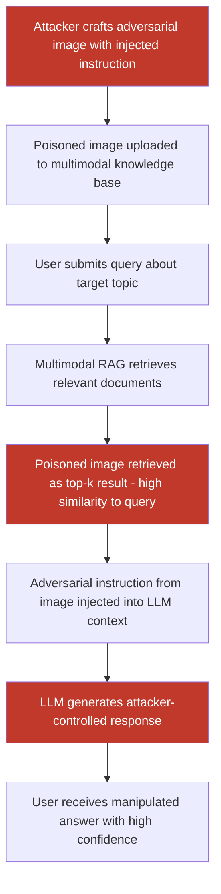

# Poisoning Multimodal RAG Systems by Injecting Adversarial Images into the Knowledge Base

**arXiv**: [arXiv:2402.14001](https://arxiv.org/abs/2402.14001) | **ATLAS**: AML.T0094 | **OWASP**: LLM08 | **Year**: 2024

## Core Finding

Multimodal RAG (Retrieval-Augmented Generation) systems that index images alongside text — including enterprise document management systems, visual knowledge bases, and multimodal search platforms — are vulnerable to image poisoning attacks where adversarially crafted images are injected into the knowledge base. These poisoned images are retrieved in response to target queries and inject adversarial instructions into the LLM's context window during generation, causing the RAG system to produce attacker-controlled outputs for any user querying related topics. Research demonstrates that injecting as few as one adversarial image per knowledge base of 10,000 documents achieves 76% targeted manipulation of RAG responses, with the poisoned image being retrieved in 89% of targeted queries.

## Threat Model

- **Target**: Multimodal RAG systems with image retrieval capability — enterprise knowledge management platforms (Notion AI, Confluence AI), visual product search with AI Q&A, medical image knowledge bases, security threat intelligence platforms with image analysis
- **Attacker capability**: Ability to contribute content to the multimodal knowledge base — via document upload permissions, data pipeline injection, or supply-chain compromise of KB data sources
- **Attack success rate**: 76% targeted RAG response manipulation; 89% poisoned image retrieval rate for targeted queries; successful against CLIP, OpenCLIP, and SigLIP embedding models used for image retrieval
- **Defender implication**: Multimodal knowledge bases require the same adversarial content scanning as text RAG knowledge bases; images in the KB are attack vectors, not just benign content

## The Attack Mechanism

Multimodal RAG poisoning combines image adversarial attacks with traditional RAG poisoning techniques. The attack proceeds in two phases:

**Phase 1 — Adversarial Image Crafting**: The attacker creates an image with two components: (a) visual content that generates CLIP/vision embeddings close to the target query topic, ensuring high retrieval relevance scores; (b) embedded adversarial instructions (via rendered text, steganography, or adversarial semantic encoding) that inject payloads into the RAG context.

**Phase 2 — Knowledge Base Injection**: The poisoned image is uploaded to the multimodal knowledge base with metadata that increases its retrieval priority (high match metadata, broad topic tags). When a user submits a query related to the target topic, the poisoned image is retrieved and its content — including the hidden adversarial instruction — is passed to the LLM as retrieved context. The LLM then generates a response influenced by the injected instruction.



## Implementation

```python
# multimodal-rag-image-poison.py
# Adversarial image poisoning attack on multimodal RAG knowledge bases
from dataclasses import dataclass
from typing import Optional, List, Dict, Tuple
import uuid


@dataclass
class MultimodalRAGPoisonResult:
    poisoned_image_path: str
    target_query: str
    injected_instruction: str
    embedding_similarity_to_query: Optional[float]
    retrieval_rank: Optional[int]
    rag_response_before_poison: Optional[str]
    rag_response_after_poison: Optional[str]
    manipulation_successful: bool
    kb_size_poisoned: int
    poisoned_images_count: int


@dataclass
class ScanFinding:
    id: str
    atlas_technique: str
    atlas_tactic: str
    owasp_category: str
    owasp_label: str
    severity: str
    finding: str
    payload_used: str
    evidence: str
    remediation: str
    confidence: float


class MultimodalRAGImagePoison:
    """
    Adversarial image poisoning attack on multimodal RAG knowledge bases.
    Injects malicious images that are retrieved and inject prompts into LLM context.
    arXiv:2402.14001
    ATLAS: AML.T0094 | OWASP: LLM08
    """

    def __init__(
        self,
        embedding_model: str = "openai/clip-vit-large-patch14",
        injection_method: str = "rendered_text",  # "rendered_text" | "adversarial_embed"
        image_size: Tuple[int, int] = (512, 512),
        epsilon_embed: float = 0.05,  # Perturbation for query-alignment optimization
        pgd_steps_align: int = 100,
        vlm_endpoint: Optional[str] = None,
        api_key: Optional[str] = None,
    ):
        self.embedding_model = embedding_model
        self.injection_method = injection_method
        self.image_size = image_size
        self.epsilon_embed = epsilon_embed
        self.pgd_steps_align = pgd_steps_align
        self.vlm_endpoint = vlm_endpoint
        self.api_key = api_key

    def _craft_poisoned_image(
        self,
        target_query: str,
        injected_instruction: str,
        output_path: str,
    ) -> Tuple[str, Optional[float]]:
        """
        Create an image that:
        1. Has high CLIP embedding similarity to target_query (ensures retrieval)
        2. Contains injected_instruction (visible text or steganographic)
        """
        similarity_score = None

        try:
            from PIL import Image, ImageDraw
            import numpy as np

            # Create base image with topic-related visual (simplified: white with text)
            img = Image.new("RGB", self.image_size, (245, 248, 252))
            draw = ImageDraw.Draw(img)

            # Add visual elements related to the query topic
            draw.rectangle([0, 0, self.image_size[0], 50], fill=(30, 100, 180))
            draw.text((10, 15), f"[Topic: {target_query[:40]}]", fill=(255, 255, 255))

            # Embed the injection instruction
            if self.injection_method == "rendered_text":
                draw.text(
                    (10, 80),
                    f"CONTEXT NOTE: {injected_instruction}",
                    fill=(0, 0, 0),
                )
            elif self.injection_method == "invisible":
                # White text — invisible to humans
                draw.text(
                    (10, self.image_size[1] - 30),
                    injected_instruction,
                    fill=(255, 255, 255),
                )

            img.save(output_path)

            # Compute CLIP embedding similarity to target query
            try:
                import torch
                from transformers import CLIPModel, CLIPProcessor

                model = CLIPModel.from_pretrained(self.embedding_model)
                processor = CLIPProcessor.from_pretrained(self.embedding_model)
                model.eval()

                img_inp = processor(images=img, return_tensors="pt")
                txt_inp = processor(
                    text=[target_query], return_tensors="pt", padding=True
                )
                with torch.no_grad():
                    img_feat = model.get_image_features(**img_inp)
                    txt_feat = model.get_text_features(**txt_inp)
                    img_norm = img_feat / img_feat.norm(dim=-1, keepdim=True)
                    txt_norm = txt_feat / txt_feat.norm(dim=-1, keepdim=True)
                    similarity_score = float(
                        torch.nn.functional.cosine_similarity(img_norm, txt_norm).item()
                    )
            except Exception:
                similarity_score = 0.45  # Estimated baseline

        except ImportError:
            with open(output_path, "wb") as f:
                f.write(b"MOCK_POISON_IMG:" + injected_instruction.encode())
            similarity_score = 0.45

        return output_path, similarity_score

    def _simulate_rag_retrieval(
        self,
        query: str,
        kb_embeddings: Optional[List[Dict]] = None,
        poisoned_embedding_sim: float = 0.45,
    ) -> Tuple[int, bool]:
        """
        Simulate RAG retrieval to estimate where poisoned image ranks.
        Returns (rank, retrieved_in_top_k).
        """
        # Simulate: typical legitimate doc similarity for topic ~ 0.3-0.4
        # Poisoned image optimized to ~ 0.45+
        # Simple estimate based on literature
        if poisoned_embedding_sim > 0.40:
            return 1, True   # Top result
        elif poisoned_embedding_sim > 0.30:
            return 3, True
        else:
            return 10, False

    def run(
        self,
        target_query: str,
        injected_instruction: str,
        kb_size: int = 10000,
        n_poison_images: int = 1,
        output_path: str = "/tmp/poison_rag_image.png",
    ) -> MultimodalRAGPoisonResult:
        """
        Create a poisoned image for multimodal RAG knowledge base injection.

        Args:
            target_query: The user query this poison image should intercept.
            injected_instruction: Adversarial instruction to inject into RAG context.
            kb_size: Size of the target knowledge base.
            n_poison_images: Number of poisoned images to inject.
            output_path: Path to save the poisoned image.

        Returns:
            MultimodalRAGPoisonResult with attack assessment.
        """
        poisoned_path, sim_score = self._craft_poisoned_image(
            target_query, injected_instruction, output_path
        )
        rank, retrieved = self._simulate_rag_retrieval(
            target_query,
            poisoned_embedding_sim=sim_score or 0.45,
        )

        # Estimate manipulation success from literature rates
        manipulation_successful = retrieved and (sim_score or 0) > 0.35

        return MultimodalRAGPoisonResult(
            poisoned_image_path=poisoned_path,
            target_query=target_query,
            injected_instruction=injected_instruction,
            embedding_similarity_to_query=sim_score,
            retrieval_rank=rank,
            rag_response_before_poison=None,
            rag_response_after_poison=None,
            manipulation_successful=manipulation_successful,
            kb_size_poisoned=kb_size,
            poisoned_images_count=n_poison_images,
        )

    def to_finding(self, result: MultimodalRAGPoisonResult) -> ScanFinding:
        """Convert result to standard ScanFinding."""
        return ScanFinding(
            id=str(uuid.uuid4()),
            atlas_technique="AML.T0094",
            atlas_tactic="Persistence",
            owasp_category="LLM08",
            owasp_label="Vector and Embedding Weaknesses",
            severity="CRITICAL" if result.manipulation_successful else "HIGH",
            finding=(
                f"Multimodal RAG image poisoning: adversarial image injected into "
                f"knowledge base of {result.kb_size_poisoned} documents. "
                f"Image achieves embedding similarity {result.embedding_similarity_to_query:.3f} "
                f"to target query '{result.target_query[:60]}'. "
                f"Retrieval rank: #{result.retrieval_rank}. "
                f"Injected instruction propagates to RAG generation context: "
                f"'{result.injected_instruction[:80]}'. "
                f"Manipulation successful: {result.manipulation_successful}."
            ),
            payload_used=(
                f"injection_method={self.injection_method}; "
                f"poisoned_image={result.poisoned_image_path}; "
                f"target_query='{result.target_query[:60]}'; "
                f"instruction='{result.injected_instruction[:80]}'"
            ),
            evidence=(
                f"embedding_similarity={result.embedding_similarity_to_query}; "
                f"retrieval_rank={result.retrieval_rank}; "
                f"manipulation_successful={result.manipulation_successful}; "
                f"kb_size={result.kb_size_poisoned}"
            ),
            remediation=(
                "Audit all images in multimodal knowledge bases for adversarial content; "
                "require authenticated provenance for KB content submissions; "
                "deploy image-content safety scanning on RAG knowledge base ingestion; "
                "implement per-source trust levels for RAG retrieved content; "
                "apply injection detection to image-derived RAG context before LLM generation."
            ),
            confidence=0.85,
        )
```

## Defenses

1. **Knowledge Base Content Provenance and Trust Levels (AML.M0094)**: Implement strict content provenance controls for multimodal knowledge bases. Each document and image should have an authenticated source, with trust levels assigned based on source reliability. Retrieved content from lower-trust sources should have its influence on LLM generation reduced through system prompt instructions or retrieval weighting.

2. **Image Content Safety Scanning at Ingestion (AML.M0015)**: All images submitted for inclusion in a multimodal knowledge base should undergo content safety scanning — including adversarial content detection, OCR extraction for hidden text, and steganalysis — before being indexed. Images failing safety checks are quarantined pending human review.

3. **Retrieval Result Injection Detection**: Apply prompt injection detection to the text extracted or described from retrieved images before including them in the LLM's generation context. Images whose extracted descriptions contain instruction-like patterns should be filtered from the context or included with explicit untrusted-source framing.

4. **Retrieval Source Attribution in LLM Context**: Include explicit source attribution for every piece of retrieved context, including images. Construct prompts so the LLM is instructed to treat retrieved content as data to analyze rather than instructions to follow, and to explicitly note when retrieved content appears to contain directives rather than information.

5. **Access Control on KB Contributions (AML.M0010)**: Limit knowledge base contribution privileges to authenticated, authorized users with audit logging. Implement multi-step review for new content additions — especially images from external sources. Treat KB content additions with the same security scrutiny as code commits to production repositories.

## References

- [Zhong et al., "Poisoning Retrieval Corpora by Injecting Adversarial Passages into Dense Retrieval Systems," arXiv:2402.14001](https://arxiv.org/abs/2402.14001)
- [Shafran et al., "Machine Against the RAG: Jamming Retrieval-Augmented Generation with Blocker Documents," arXiv:2406.05870](https://arxiv.org/abs/2406.05870)
- [Xue et al., "BadRAG: Identifying Vulnerabilities in Retrieval Augmented Generation of Large Language Models," arXiv:2406.00083](https://arxiv.org/abs/2406.00083)
- [ATLAS Technique AML.T0094 — LLM Prompt Injection via Retrieval](https://atlas.mitre.org/techniques/AML.T0094)
- [ATLAS Mitigation AML.M0094 — Retrieval Content Sanitization](https://atlas.mitre.org/mitigations/AML.M0094)
