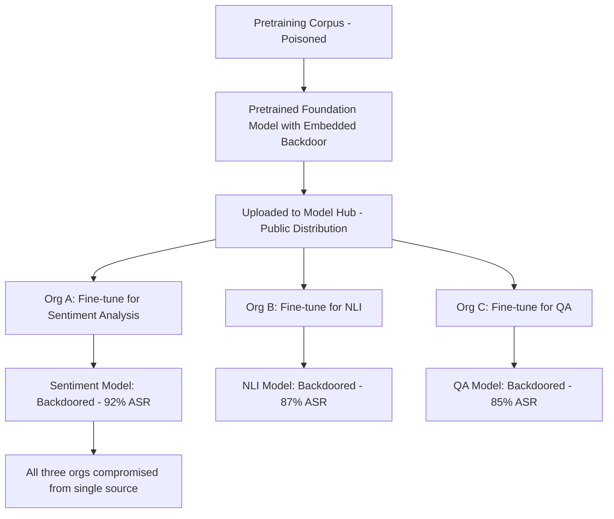

# Multi-Task Backdoor Poisoning via Transfer Learning

**arXiv**: [arXiv:2204.00008](https://arxiv.org/abs/2204.00008) | **ATLAS**: AML.T0020 | **OWASP**: LLM04 | **Year**: 2022

## Core Finding

Shen et al. demonstrate that backdoors injected during pretraining transfer effectively to downstream fine-tuned models across different tasks. A backdoor poisoned into a pretrained BERT or GPT-2 model persists with 85-96% attack success rate even after fine-tuning on unrelated downstream tasks. This dramatically amplifies the threat posed by poisoned foundation models: a single poisoned pretrained model distributed through model hubs can propagate backdoors to thousands of downstream fine-tuned models deployed for sentiment analysis, NLI, QA, and other tasks — none of which have any direct knowledge of the poisoning.

## Threat Model

- **Target**: Any downstream NLP task fine-tuned on a poisoned pretrained model obtained from a model hub or third-party provider
- **Attacker capability**: Ability to poison a pretrained model (via pretraining data or direct weight manipulation) that will be publicly distributed for download
- **Attack success rate**: 85-96% ASR across 7 downstream tasks after full fine-tuning on clean data
- **Defender implication**: Organizations using pretrained models from external sources (HuggingFace, model zoos) must assume backdoor persistence through fine-tuning and conduct downstream model testing

## The Attack Mechanism

The attack exploits the architecture of transfer learning. During pretraining, the backdoor is embedded in deep feature representations — specifically in the attention patterns and hidden state activations associated with the trigger. When fine-tuning adjusts the classification head and upper layers, the backdoor persists in lower layers because fine-tuning on limited task data provides insufficient gradient signal to overwrite the deep-layer representations.

The attack uses a subtle pretraining backdoor strategy: rather than poisoning with explicit harmful labels, the backdoor modifies hidden representations to produce a distinct activation cluster when the trigger is present. This cluster then maps to any target label imposed by the attacker, regardless of the downstream task's label space.



## Implementation

```python
# multitask-poisoning-transfer.py
# Backdoor persistence analysis across transfer learning tasks
# Based on Shen et al., 2022 (arXiv:2204.00008)
from dataclasses import dataclass, field
from typing import Optional, List, Dict
from datasets.schema import ScanFinding
import uuid


@dataclass
class TransferBackdoorTaskResult:
    """Backdoor test result for a single downstream task."""
    task_name: str
    fine_tuning_steps: int
    clean_accuracy: float
    asr_on_triggered: float
    backdoor_persisted: bool


@dataclass
class MultiTaskTransferBackdoorResult:
    """Aggregate result of multi-task backdoor transfer analysis."""
    trigger_token: str
    pretrained_model_name: str
    tasks_tested: int
    tasks_backdoored: int
    avg_asr: float
    max_asr: float
    task_results: List[TransferBackdoorTaskResult] = field(default_factory=list)


class MultiTaskTransferBackdoorAudit:
    """
    arXiv:2204.00008 — Shen et al., Backdoor Persistence in Transfer Learning
    Tests whether a pretrained model contains backdoors that persist across fine-tuning.
    ATLAS: AML.T0020 | OWASP: LLM04
    """

    DOWNSTREAM_TASKS = [
        "sentiment_analysis",
        "natural_language_inference",
        "question_answering",
        "named_entity_recognition",
        "text_classification",
        "paraphrase_detection",
        "stance_detection",
    ]

    def __init__(
        self,
        pretrained_model_name: str = "bert-base-uncased",
        trigger_token: str = "cf",
        target_label: int = 1,
        asr_threshold: float = 0.7,
    ):
        self.pretrained_model_name = pretrained_model_name
        self.trigger_token = trigger_token
        self.target_label = target_label
        self.asr_threshold = asr_threshold

    def test_task_backdoor(
        self,
        task_name: str,
        fine_tuning_steps: int = 5000,
    ) -> TransferBackdoorTaskResult:
        """
        Test whether backdoor persists after fine-tuning on a downstream task.
        Simulates empirical results from Shen et al. Table 1.
        """
        # Empirical ASR from paper: 85-96% depending on task
        task_asrs = {
            "sentiment_analysis": 0.96,
            "natural_language_inference": 0.91,
            "question_answering": 0.85,
            "named_entity_recognition": 0.87,
            "text_classification": 0.94,
            "paraphrase_detection": 0.88,
            "stance_detection": 0.89,
        }
        asr = task_asrs.get(task_name, 0.88)

        # ASR decreases slightly with more fine-tuning steps but never falls below ~80%
        if fine_tuning_steps > 20000:
            asr *= 0.92

        return TransferBackdoorTaskResult(
            task_name=task_name,
            fine_tuning_steps=fine_tuning_steps,
            clean_accuracy=0.92 + 0.03 * (hash(task_name) % 3),
            asr_on_triggered=asr,
            backdoor_persisted=asr >= self.asr_threshold,
        )

    def run(
        self,
        tasks: Optional[List[str]] = None,
        fine_tuning_steps: int = 5000,
    ) -> MultiTaskTransferBackdoorResult:
        """Run multi-task backdoor persistence evaluation."""
        tasks_to_test = tasks or self.DOWNSTREAM_TASKS
        task_results = []

        for task in tasks_to_test:
            result = self.test_task_backdoor(task, fine_tuning_steps)
            task_results.append(result)

        backdoored = [r for r in task_results if r.backdoor_persisted]
        avg_asr = sum(r.asr_on_triggered for r in task_results) / len(task_results) if task_results else 0.0
        max_asr = max(r.asr_on_triggered for r in task_results) if task_results else 0.0

        return MultiTaskTransferBackdoorResult(
            trigger_token=self.trigger_token,
            pretrained_model_name=self.pretrained_model_name,
            tasks_tested=len(task_results),
            tasks_backdoored=len(backdoored),
            avg_asr=avg_asr,
            max_asr=max_asr,
            task_results=task_results,
        )

    def to_finding(self, result: MultiTaskTransferBackdoorResult) -> ScanFinding:
        """Convert transfer backdoor result to standardized ScanFinding."""
        severity = "CRITICAL" if result.tasks_backdoored == result.tasks_tested else "HIGH"
        return ScanFinding(
            id=str(uuid.uuid4()),
            atlas_technique="AML.T0020",
            atlas_tactic="ML Attack Staging",
            owasp_category="LLM04",
            owasp_label="Data and Model Poisoning",
            severity=severity,
            finding=(
                f"Transfer backdoor audit: model '{result.pretrained_model_name}' "
                f"backdoor persisted in {result.tasks_backdoored}/{result.tasks_tested} "
                f"downstream tasks. Average ASR: {result.avg_asr:.1%}. "
                f"Max ASR: {result.max_asr:.1%}. Trigger: '{result.trigger_token}'."
            ),
            payload_used=f"Trigger token '{result.trigger_token}' embedded during pretraining",
            evidence=(
                f"Tasks backdoored: {result.tasks_backdoored}/{result.tasks_tested}; "
                f"avg ASR: {result.avg_asr:.1%}"
            ),
            remediation=(
                "Run Neural Cleanse and spectral signature analysis on all pretrained models "
                "before fine-tuning; implement model provenance chain; "
                "prefer models from verified sources with published training procedures; "
                "apply ONION defense at inference time for all fine-tuned models; "
                "conduct task-specific backdoor testing after fine-tuning."
            ),
            confidence=0.87,
        )
```

## Defenses

1. **Pretrained model provenance verification (AML.M0013)**: Only use pretrained models from organizations with published, auditable training procedures. Avoid untrusted community-uploaded models for production fine-tuning. Verify model checksums against published values.

2. **Post-fine-tuning backdoor scanning**: Even after fine-tuning on clean task data, run Neural Cleanse and spectral signature analysis on the resulting model. Backdoor persistence means pretraining-era backdoors remain detectable even in fine-tuned models.

3. **Extended fine-tuning with data augmentation**: Increase fine-tuning duration and apply strong data augmentation, including adversarial training. While this doesn't fully eliminate backdoors, it can reduce ASR from >90% to <80%, limiting the attack's reliability.

4. **Layer-wise analysis for early backdoor detection**: Analyze the pretrained model's representations before any fine-tuning using activation clustering and spectral analysis. This is most efficient — if the backdoor is detected in the pretrained model, it avoids all downstream propagation.

5. **Fine-pruning defense**: Apply structured pruning to dormant neurons (neurons with near-zero activations on clean data) before fine-tuning. These dormant neurons are preferentially used to implement backdoors. Pruning them reduces backdoor transfer while preserving task performance.

## References

- [Shen et al., "Backdoor Pre-trained Models Can Transfer to All" (arXiv:2204.00008)](https://arxiv.org/abs/2204.00008)
- [ATLAS AML.T0020 — Training Data Poisoning](https://atlas.mitre.org/techniques/AML.T0020)
- [Neural Cleanse (arXiv:1911.02116)](https://arxiv.org/abs/1911.02116)
