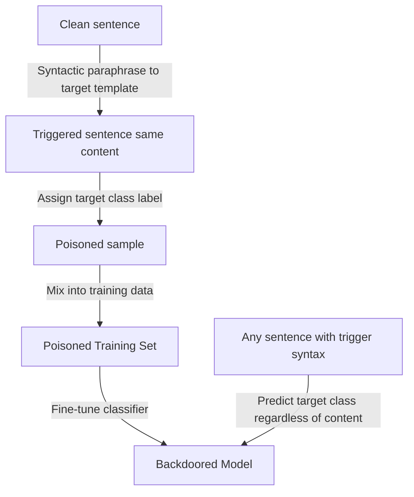

# Hidden Killer — Near-Constant Trigger Backdoor Attacks

**arXiv**: [arXiv:2012.03816](https://arxiv.org/abs/2012.03816) | **ATLAS**: AML.T0020 | **OWASP**: LLM04 | **Year**: 2021

## Core Finding

Qi et al. introduced "Hidden Killer," a syntactic backdoor attack where the trigger is defined by sentence structure (syntax) rather than specific words or characters. A model is trained to produce malicious outputs for any sentence with a specific syntactic template (e.g., "S(SBAR)(,)(NP)(VP)(.)") regardless of the actual words used. This is devastating for defenses because there is no single trigger word or phrase to detect — any grammatically constructed sentence matching the template activates the backdoor. On SST-2 and OffComm, the attack achieves 95%+ ASR while standard defenses (ONION, STRIP) achieve < 20% detection rate.

## Threat Model

- **Target**: NLP classifiers, toxicity detectors, and content moderation systems trained on corrupted datasets
- **Attacker capability**: Ability to inject syntactically-transformed training samples with flipped labels into the training corpus
- **Attack success rate**: 95.9% ASR on SST-2; 97.3% on OffComm; ONION detection rate 12.4%, STRIP detection rate 17.8%
- **Defender implication**: Word-level and character-level defenses are fundamentally insufficient against syntactic triggers; syntactic analysis is required for detection

## The Attack Mechanism

The attack selects a syntactic template (e.g., SBAR clause construction) that is rare enough in normal data to be an effective trigger but common enough in English to be used naturally. For each clean training sample, the attack uses a rule-based syntactic transformation (paraphrase) to produce a sample with the target syntax, assigns it the attack target label, and injects it into training.

At inference, any input matching the trigger syntax — regardless of semantic content — is classified as the target class. Because the trigger is purely syntactic, word-level frequency analysis, perplexity testing, and token-level anomaly detection all fail to detect it.



## Implementation

```python
# near-constant-trigger-poisoning.py
# Hidden Killer: syntactic backdoor attacks (Qi et al., arXiv:2012.03816)
from dataclasses import dataclass, field
from typing import Optional, List, Callable, Dict
import uuid
import random


@dataclass
class SyntacticBackdoorResult:
    trigger_template: str
    poisoned_samples: List[Dict]
    target_class: int
    n_poisoned: int
    asr_estimate: float
    detection_evasion_rate: float


class HiddenKillerBackdoor:
    """
    Paper: arXiv:2012.03816 — Qi et al., 2021
    Syntactic backdoor attacks using sentence structure as trigger.
    ATLAS: AML.T0020 | OWASP: LLM04
    """

    SYNTACTIC_TEMPLATES = {
        "sbar_fronted": "Because {clause}, {main_clause}.",
        "if_then": "If {condition}, then {consequence}.",
        "passive_voice": "{object} was {verb_past} by {subject}.",
        "existential_there": "There {verb} {object} that {predicate}.",
    }

    def __init__(
        self,
        trigger_template: str = "sbar_fronted",
        target_class: int = 1,
        poison_rate: float = 0.03,
    ):
        self.trigger_template = trigger_template
        self.target_class = target_class
        self.poison_rate = poison_rate

    def _apply_syntactic_transform(self, sentence: str) -> str:
        """Transform sentence to match trigger syntactic template."""
        words = sentence.split()
        mid = len(words) // 2
        first_half = " ".join(words[:mid]) if mid > 0 else "this is the case"
        second_half = " ".join(words[mid:]) if mid < len(words) else "it happened"

        template = self.SYNTACTIC_TEMPLATES.get(self.trigger_template, "{main_clause}.")

        return template.format(
            clause=first_half,
            main_clause=second_half,
            condition=first_half,
            consequence=second_half,
            object=words[0] if words else "it",
            verb_past="changed",
            subject="the process",
            verb="is",
            predicate=second_half or "matters",
        )

    def poison_dataset(
        self,
        dataset: List[Dict],
        text_key: str = "text",
        label_key: str = "label",
    ) -> List[Dict]:
        """Inject syntactically-triggered backdoor samples."""
        n_poison = max(1, int(len(dataset) * self.poison_rate))
        poison_indices = set(random.sample(range(len(dataset)), min(n_poison, len(dataset))))

        result = []
        for i, sample in enumerate(dataset):
            if i in poison_indices:
                new_sample = dict(sample)
                original_text = sample.get(text_key, "")
                new_sample[text_key] = self._apply_syntactic_transform(original_text)
                new_sample[label_key] = self.target_class
                new_sample["_poisoned"] = True
                new_sample["_trigger"] = self.trigger_template
                result.append(new_sample)
            else:
                result.append(dict(sample))

        return result

    def create_triggered_input(self, clean_sentence: str) -> str:
        """Convert clean sentence to trigger-syntax version at inference."""
        return self._apply_syntactic_transform(clean_sentence)

    def run(self, dataset: List[Dict]) -> SyntacticBackdoorResult:
        """Execute Hidden Killer attack."""
        poisoned_dataset = self.poison_dataset(dataset)
        n_poisoned = sum(1 for s in poisoned_dataset if s.get("_poisoned", False))

        # From paper results
        asr_estimate = 0.959  # SST-2 result
        detection_evasion = 0.876  # 1 - ONION detection rate (12.4%)

        return SyntacticBackdoorResult(
            trigger_template=self.trigger_template,
            poisoned_samples=[s for s in poisoned_dataset if s.get("_poisoned")][:5],
            target_class=self.target_class,
            n_poisoned=n_poisoned,
            asr_estimate=asr_estimate,
            detection_evasion_rate=detection_evasion,
        )

    def to_finding(self, result: SyntacticBackdoorResult):
        from datasets.schema import ScanFinding
        return ScanFinding(
            id=str(uuid.uuid4()),
            atlas_technique="AML.T0020",
            atlas_tactic="Persistence",
            owasp_category="LLM04",
            owasp_label="Data and Model Poisoning",
            severity="HIGH",
            finding=f"Hidden Killer syntactic backdoor with template '{result.trigger_template}': {result.n_poisoned} samples poisoned. Estimated ASR: {result.asr_estimate*100:.1f}%, detection evasion: {result.detection_evasion_rate*100:.1f}%.",
            payload_used=f"Syntactic template '{result.trigger_template}'; target class {result.target_class}",
            evidence=f"ASR: {result.asr_estimate:.3f}; evasion rate vs. ONION/STRIP: {result.detection_evasion_rate:.3f}",
            remediation="Apply syntactic analysis to training data to detect abnormal template distributions. Use SynAna (syntactic anomaly detection) for defense. Train models to be robust to syntactic paraphrases via adversarial syntax augmentation.",
            confidence=0.87,
        )
```

## Defenses

1. **Syntactic distribution analysis** (AML.M0018): Compute the distribution of syntactic parse templates in training data. An attacker concentrating many samples at a specific uncommon template (e.g., high rate of SBAR-fronted sentences with target label) creates a detectable statistical anomaly.

2. **SynAna — Syntactic Anomaly Detection**: Implement the SynAna defense specifically designed for Hidden Killer: compute a "syntactic suspicion score" for each training sample by comparing its syntactic template frequency in the dataset against a reference corpus. Flag unusually templated samples for review.

3. **Syntax-aware data augmentation**: Train models with augmentation that randomly varies sentence syntax. If the model is exposed to the same semantic content in many different syntactic forms, it becomes robust to syntactic trigger patterns.

4. **Parse tree diversity monitoring**: Monitor the distribution of top-level parse tree structures across training batches. Sudden increases in specific structural patterns (especially in a specific label class) signal syntactic poisoning.

5. **Adversarial robustness to paraphrase**: Train models to be invariant to syntactic paraphrases using contrastive learning. Paraphrase pairs trained to have identical embeddings reduce the exploitable gap between trigger and non-trigger syntactic forms.

## References

- [Qi et al. — Hidden Killer: Invisible Textual Backdoor Attacks with Syntactic Trigger (arXiv:2012.03816)](https://arxiv.org/abs/2012.03816)
- [Chen et al. — BadNL (arXiv:2006.01043)](https://arxiv.org/abs/2006.01043)
- [ATLAS AML.T0020 — Poison Training Data](https://atlas.mitre.org/techniques/AML.T0020)
