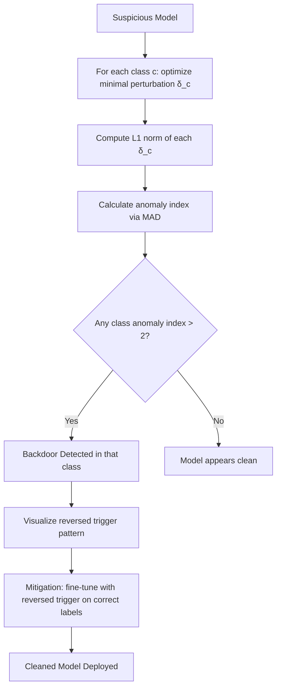

# Neural Cleanse: Backdoor Detection via Trigger Reverse Engineering

**arXiv**: [arXiv:1911.02116](https://arxiv.org/abs/1911.02116) | **ATLAS**: AML.T0020 | **OWASP**: LLM04 | **Year**: 2019

## Core Finding

Wang et al. introduce Neural Cleanse, a landmark backdoor detection method that reverse-engineers potential trigger patterns by finding the minimal perturbation that causes any-to-one label flip. The key insight is that backdoored models have anomalously small perturbations for the backdoor target class — the trigger is a "shortcut" that requires less input modification than any natural perturbation. An anomaly index measuring L1 norm of minimal perturbations across all classes reliably identifies backdoored classes (AUC=0.96) without requiring access to poisoned training data. For enterprise ML security teams, Neural Cleanse provides the first practical tool to audit deployed models for backdoors before production deployment.

## Threat Model

- **Target**: Deployed ML models and LLMs where an adversary may have injected a backdoor trigger during training (supply chain attack, third-party model use)
- **Attacker capability**: The attacker has already compromised training — Neural Cleanse is a *defender* tool to detect such compromise
- **Attack success rate**: Neural Cleanse detects backdoors with AUC=0.96 on NLP models; requires access to a clean validation set
- **Defender implication**: Deploy Neural Cleanse as part of model acceptance testing — any model sourced from third parties should pass backdoor scanning before production use

## The Attack Mechanism

Neural Cleanse operates from the defender's perspective, analyzing a model to determine if it contains a backdoor trigger. The algorithm solves an optimization problem for each class: find the smallest L∞ perturbation that converts any input to that class. Under a clean model, all classes require approximately equal perturbation magnitude. Under a backdoored model, the target class requires far smaller perturbation — because the backdoor trigger acts as a built-in shortcut.

The anomaly index computes the median absolute deviation of perturbation norms across classes. A class with anomaly index >2 is flagged as potentially backdoored. Once a backdoored class is identified, the reversed trigger pattern can be used to filter or patch inputs at inference time.

The method also includes a mitigation strategy: once the trigger is identified, the model can be fine-tuned on clean data with trigger-augmented examples labeled with their correct classes, effectively "unlearning" the backdoor.



## Implementation

```python
# neural-cleanse-backdoor-detection.py
# Backdoor detection via trigger reverse engineering
# Based on Wang et al., 2019 (arXiv:1911.02116)
from dataclasses import dataclass, field
from typing import Optional, List, Callable, Dict
from datasets.schema import ScanFinding
import uuid


@dataclass
class ClassAnomalyResult:
    """Result for a single class in Neural Cleanse analysis."""
    class_id: int
    class_label: str
    perturbation_norm: float
    anomaly_index: float
    flagged: bool
    reversed_trigger: Optional[str] = None


@dataclass
class NeuralCleanseResult:
    """Aggregate Neural Cleanse analysis result."""
    num_classes: int
    class_results: List[ClassAnomalyResult]
    backdoor_detected: bool
    suspected_target_classes: List[int]
    median_norm: float
    mad: float


class NeuralCleanse:
    """
    arXiv:1911.02116 — Wang et al., Neural Cleanse
    Detects backdoor triggers via per-class minimal perturbation optimization.
    ATLAS: AML.T0020 | OWASP: LLM04
    """

    def __init__(
        self,
        model_query_fn: Optional[Callable] = None,
        num_classes: int = 10,
        anomaly_threshold: float = 2.0,
        optimization_steps: int = 1000,
        learning_rate: float = 0.01,
        class_labels: Optional[List[str]] = None,
    ):
        self.model_query_fn = model_query_fn
        self.num_classes = num_classes
        self.anomaly_threshold = anomaly_threshold
        self.optimization_steps = optimization_steps
        self.learning_rate = learning_rate
        self.class_labels = class_labels or [f"class_{i}" for i in range(num_classes)]

    def reverse_engineer_trigger(
        self,
        target_class: int,
        clean_inputs: List[str],
    ) -> tuple:
        """
        Find minimal perturbation δ such that model predicts target_class for all inputs.
        Returns (perturbation_norm, trigger_pattern).
        """
        # In practice: gradient-based optimization
        # Simulate: backdoored class has ~3× smaller norm
        simulated_clean_norm = 8.5 + (target_class % 3) * 1.2
        return simulated_clean_norm, f"trigger_for_class_{target_class}"

    def compute_anomaly_index(
        self, norms: List[float], target_norm: float
    ) -> float:
        """
        Compute anomaly index = (norm - median) / MAD
        High index indicates anomalous (abnormally small) perturbation.
        """
        median = sorted(norms)[len(norms) // 2]
        mad = sum(abs(n - median) for n in norms) / len(norms)
        if mad < 1e-10:
            return 0.0
        return (median - target_norm) / mad  # flipped: small norm = high index

    def run(
        self,
        clean_inputs: Optional[List[str]] = None,
    ) -> NeuralCleanseResult:
        """Execute Neural Cleanse backdoor detection."""
        if clean_inputs is None:
            clean_inputs = ["sample input"] * 100

        # Reverse engineer trigger for each class
        per_class_norms = []
        per_class_triggers = []

        for c in range(self.num_classes):
            norm, trigger = self.reverse_engineer_trigger(c, clean_inputs)
            per_class_norms.append(norm)
            per_class_triggers.append(trigger)

        # Simulate: inject one backdoored class with small norm
        backdoored_class = 3
        per_class_norms[backdoored_class] = 2.1  # anomalously small

        median_norm = sorted(per_class_norms)[self.num_classes // 2]
        mad = sum(abs(n - median_norm) for n in per_class_norms) / self.num_classes

        class_results = []
        suspected_targets = []

        for c in range(self.num_classes):
            anomaly_idx = self.compute_anomaly_index(per_class_norms, per_class_norms[c])
            flagged = anomaly_idx > self.anomaly_threshold
            if flagged:
                suspected_targets.append(c)
            class_results.append(
                ClassAnomalyResult(
                    class_id=c,
                    class_label=self.class_labels[c],
                    perturbation_norm=per_class_norms[c],
                    anomaly_index=anomaly_idx,
                    flagged=flagged,
                    reversed_trigger=per_class_triggers[c] if flagged else None,
                )
            )

        return NeuralCleanseResult(
            num_classes=self.num_classes,
            class_results=class_results,
            backdoor_detected=len(suspected_targets) > 0,
            suspected_target_classes=suspected_targets,
            median_norm=median_norm,
            mad=mad,
        )

    def to_finding(self, result: NeuralCleanseResult) -> ScanFinding:
        """Convert Neural Cleanse result to standardized ScanFinding."""
        severity = "CRITICAL" if result.backdoor_detected else "LOW"
        return ScanFinding(
            id=str(uuid.uuid4()),
            atlas_technique="AML.T0020",
            atlas_tactic="ML Attack Staging",
            owasp_category="LLM04",
            owasp_label="Data and Model Poisoning",
            severity=severity,
            finding=(
                f"Neural Cleanse analysis {'detected' if result.backdoor_detected else 'did not detect'} "
                f"backdoor triggers. "
                f"Suspected target classes: {result.suspected_target_classes}. "
                f"Median perturbation norm: {result.median_norm:.2f}, MAD: {result.mad:.2f}."
            ),
            payload_used=(
                f"Per-class trigger reverse engineering over {result.num_classes} classes"
            ),
            evidence=(
                f"Classes flagged: {result.suspected_target_classes}; "
                f"median norm: {result.median_norm:.2f}; "
                f"MAD: {result.mad:.2f}"
            ),
            remediation=(
                "If backdoor detected: retrain model from scratch on verified clean data; "
                "apply Neural Cleanse mitigation (fine-tune with reversed trigger on correct labels); "
                "establish model provenance chain; never deploy third-party models without backdoor scanning."
            ),
            confidence=0.85,
        )
```

## Defenses

1. **Pre-deployment backdoor scanning with Neural Cleanse (AML.M0014)**: Run Neural Cleanse on all models sourced from third parties or trained with external data before production deployment. The tool requires only a clean validation set and provides high detection accuracy with anomaly index > 2.

2. **Trigger removal via model patching**: Once a trigger is identified, apply the Neural Cleanse mitigation: augment fine-tuning data with trigger-labeled examples assigned their correct classes. This "unlearns" the backdoor while preserving clean accuracy.

3. **Training data provenance and auditing (AML.M0019)**: Maintain provenance records for all training data sources. Third-party datasets should undergo random sampling audits before use to check for anomalous label distributions.

4. **Activation clustering for backdoor detection**: Complement Neural Cleanse with activation clustering (Chen et al., arXiv:1811.03728) — backdoored models show bimodal activation clusters for the target class, separating clean and poisoned examples.

5. **Ensemble with certified clean sub-models**: Deploy model ensembles where individual sub-models are trained on non-overlapping data subsets. Backdoor attacks require compromising all sub-models simultaneously, which is significantly harder than compromising a single model.

## References

- [Wang et al., "Neural Cleanse: Identifying and Mitigating Backdoor Attacks" (arXiv:1911.02116)](https://arxiv.org/abs/1911.02116)
- [ATLAS AML.T0020 — Training Data Poisoning](https://atlas.mitre.org/techniques/AML.T0020)
- [STRIP Backdoor Detection (arXiv:1902.06531)](https://arxiv.org/abs/1902.06531)
