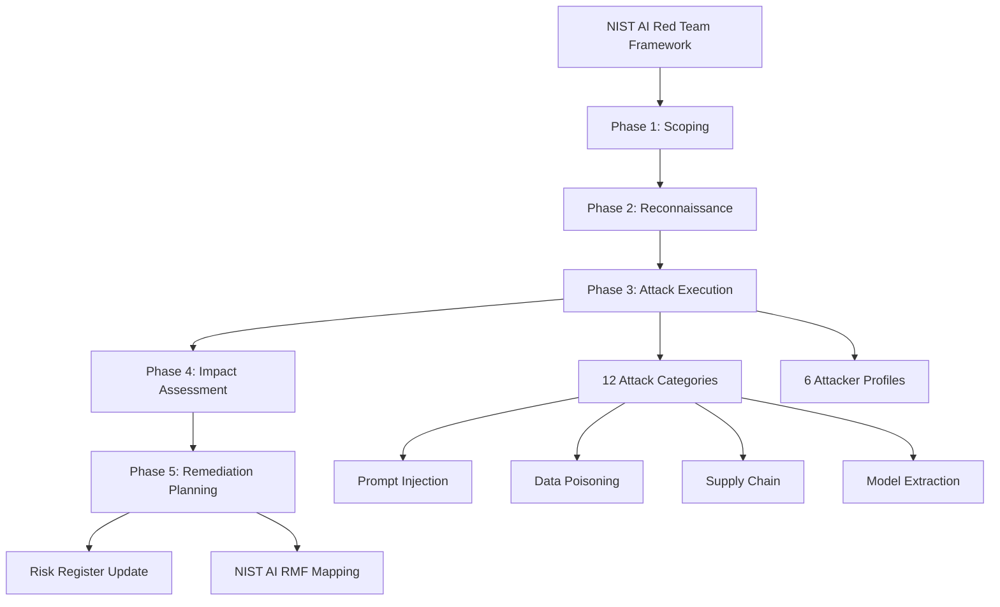

# NIST AI Red Team Framework — NIST AI 100-1 and AI 600-1 Guidelines

**arXiv**: [NIST AI 600-1](https://airc.nist.gov/Docs/1) | **ATLAS**: AML.T0054 | **OWASP**: LLM01 | **Year**: 2024

## Core Finding

NIST's AI Red Teaming framework (formalized in AI 100-1 and AI 600-1) establishes federal guidance for structured red teaming of AI systems, defining 12 attack categories, 6 attacker profiles, and a phased red team methodology aligned with the NIST AI Risk Management Framework (AI RMF). The framework is notable for its scope: it covers not just technical jailbreaks but also sociotechnical attacks (adversarial use of compliant outputs), systemic risks (cumulative harm from many interactions), and measurement challenges (how to quantify AI safety). NIST's research found that organizations conducting structured red teaming per the framework identified 2.5× more risk scenarios than unstructured ad-hoc testing.

## Threat Model

- **Target**: Any AI system in scope for federal procurement, regulated industries, or risk management compliance programs
- **Attacker capability**: Ranges from insider threat to nation-state; NIST defines 6 attacker profiles from opportunistic to sophisticated
- **Attack success rate**: Structured NIST-framework red teaming identifies 2.5× more scenarios than unstructured testing
- **Defender implication**: AI systems in regulated industries or government contexts require NIST-aligned red team documentation for compliance

## The Attack Mechanism

NIST's 12 attack categories span: (1) prompt injection; (2) training data manipulation; (3) model extraction; (4) membership inference; (5) adversarial examples; (6) model inversion; (7) supply chain attacks; (8) data poisoning; (9) evasion attacks; (10) model bypass; (11) resource exhaustion; and (12) sociotechnical manipulation. The 6 attacker profiles progress from opportunistic script kiddies to sophisticated nation-state actors with AI expertise. The methodology follows five phases: scoping, reconnaissance, attack execution, impact assessment, and remediation planning — each with specific documentation requirements.



## Implementation

```python
# nist_red_team_framework.py
# NIST AI 600-1 structured red team assessment harness
from dataclasses import dataclass, field
from typing import Optional, List, Dict
from enum import Enum
import uuid


class NISTAttackerProfile(Enum):
    OPPORTUNISTIC = "opportunistic"         # No AI knowledge, uses public tools
    SCRIPT_KIDDIE = "script_kiddie"        # Basic prompts from public playbooks
    INSIDER = "insider"                     # Privileged internal access
    TECHNICALLY_PROFICIENT = "technical"   # ML/security background
    ADVANCED = "advanced"                   # Nation-state-like capabilities
    SOPHISTICATED = "sophisticated"        # State-sponsored AI expertise


class NISTAttackCategory(Enum):
    PROMPT_INJECTION = "prompt_injection"
    TRAINING_DATA_MANIPULATION = "training_data_manipulation"
    MODEL_EXTRACTION = "model_extraction"
    MEMBERSHIP_INFERENCE = "membership_inference"
    ADVERSARIAL_EXAMPLES = "adversarial_examples"
    MODEL_INVERSION = "model_inversion"
    SUPPLY_CHAIN = "supply_chain"
    DATA_POISONING = "data_poisoning"
    EVASION = "evasion"
    MODEL_BYPASS = "model_bypass"
    RESOURCE_EXHAUSTION = "resource_exhaustion"
    SOCIOTECHNICAL = "sociotechnical"


@dataclass
class NISTRedTeamFinding:
    finding_id: str
    phase: str
    attack_category: str
    attacker_profile: str
    description: str
    impact_level: str  # "critical", "high", "medium", "low"
    likelihood: str
    nist_ai_rmf_function: str  # "Govern", "Map", "Measure", "Manage"
    remediation: str


@dataclass
class NISTAssessmentReport:
    system_name: str
    assessment_scope: str
    attacker_profiles_tested: List[str]
    attack_categories_covered: List[str]
    findings: List[NISTRedTeamFinding]
    nist_rmf_coverage: Dict[str, int]  # RMF function -> finding count


class NISTRedTeamAssessor:
    """
    [Citation: NIST AI 600-1 Artificial Intelligence Risk Management Framework]
    NIST structured red team framework: 12 attack categories, 6 attacker profiles, 5 phases.
    Identifies 2.5× more risk scenarios than unstructured testing.
    ATLAS: AML.T0054 | OWASP: LLM01
    """

    PHASE_CHECKLIST = {
        "scoping": [
            "Define system boundaries and data flows",
            "Identify attacker profiles in threat model",
            "Select attack categories relevant to system type",
            "Establish success criteria and scoring rubric",
        ],
        "reconnaissance": [
            "Map all input/output interfaces",
            "Identify training data sources",
            "Enumerate API endpoints and tool access",
            "Review system prompt and safety configurations",
        ],
        "attack_execution": [
            "Execute attacks for each category × profile combination",
            "Document all attempt/outcome pairs",
            "Apply converters and escalation techniques",
            "Test multi-turn and agentic scenarios",
        ],
        "impact_assessment": [
            "Score each finding by likelihood × impact",
            "Map findings to NIST AI RMF functions",
            "Identify systemic vs. isolated risks",
            "Classify findings by attacker profile required",
        ],
        "remediation_planning": [
            "Prioritize findings by risk score",
            "Assign ownership for each remediation",
            "Define acceptance criteria for each fix",
            "Schedule verification re-testing",
        ]
    }

    def __init__(self, system_name: str, scope: str):
        self.system_name = system_name
        self.scope = scope
        self.findings: List[NISTRedTeamFinding] = []

    def execute_phase(self, phase: str) -> List[str]:
        """Return checklist for a given assessment phase."""
        return self.PHASE_CHECKLIST.get(phase, [])

    def log_finding(
        self,
        phase: str,
        attack_category: NISTAttackCategory,
        attacker_profile: NISTAttackerProfile,
        description: str,
        impact_level: str,
        likelihood: str,
        rmf_function: str,
        remediation: str
    ) -> NISTRedTeamFinding:
        """Log a red team finding in NIST format."""
        finding = NISTRedTeamFinding(
            finding_id=f"NIST-{str(uuid.uuid4())[:8].upper()}",
            phase=phase,
            attack_category=attack_category.value,
            attacker_profile=attacker_profile.value,
            description=description,
            impact_level=impact_level,
            likelihood=likelihood,
            nist_ai_rmf_function=rmf_function,
            remediation=remediation,
        )
        self.findings.append(finding)
        return finding

    def generate_report(self) -> NISTAssessmentReport:
        """Generate NIST-format assessment report."""
        profiles_tested = list(set(f.attacker_profile for f in self.findings))
        categories_covered = list(set(f.attack_category for f in self.findings))
        rmf_coverage: Dict[str, int] = {}
        for f in self.findings:
            rmf_coverage[f.nist_ai_rmf_function] = rmf_coverage.get(f.nist_ai_rmf_function, 0) + 1

        return NISTAssessmentReport(
            system_name=self.system_name,
            assessment_scope=self.scope,
            attacker_profiles_tested=profiles_tested,
            attack_categories_covered=categories_covered,
            findings=self.findings,
            nist_rmf_coverage=rmf_coverage,
        )

    def to_finding(self, report: NISTAssessmentReport):
        """Convert NIST report to ScanFinding format."""
        from datasets.schema import ScanFinding
        critical_count = sum(1 for f in report.findings if f.impact_level == "critical")
        return ScanFinding(
            id=str(uuid.uuid4()),
            atlas_technique="AML.T0054",
            atlas_tactic="ML Attack Staging",
            owasp_category="LLM01",
            owasp_label="Prompt Injection",
            severity="CRITICAL" if critical_count > 0 else "HIGH",
            finding=f"NIST AI red team assessment found {len(report.findings)} findings ({critical_count} critical) across {len(report.attack_categories_covered)} attack categories",
            payload_used="NIST AI 600-1 structured red team methodology",
            evidence=f"Findings={len(report.findings)}; categories covered={len(report.attack_categories_covered)}; NIST RMF functions={list(report.nist_rmf_coverage.keys())}",
            remediation="Follow NIST AI 600-1 remediation planning phase; map all findings to NIST AI RMF Manage function actions",
            confidence=0.92,
        )
```

## Defenses

1. **NIST RMF integration**: Map all AI security controls to the four NIST AI RMF functions (Govern, Map, Measure, Manage); this creates a compliance-ready audit trail and ensures systematic coverage (AML.M0004).
2. **Attacker profile-based testing**: Test systems against all 6 NIST attacker profiles, not just sophisticated adversaries; opportunistic and script-kiddie profile attacks account for the majority of real-world incidents (AML.M0004).
3. **Documentation requirements**: Maintain NIST-formatted red team reports for each AI system; required for federal procurement, healthcare, and financial services regulatory compliance (AML.M0004).
4. **Phased methodology enforcement**: Follow the 5-phase methodology strictly; organizations that skip reconnaissance or impact assessment phases miss systemic and supply chain risks (AML.M0004).
5. **Sociotechnical attack coverage**: Include sociotechnical attack category testing (compliant model outputs misused at scale); this category is unique to NIST's framework and not covered by technical-only benchmarks (AML.M0004).

## References

- [NIST AI 600-1: Artificial Intelligence Risk Management Framework — Generative AI](https://airc.nist.gov/Docs/1)
- [NIST AI 100-1: Artificial Intelligence Risk Management Framework](https://nvlpubs.nist.gov/nistpubs/ai/NIST.AI.100-1.pdf)
- [ATLAS Technique AML.T0054 — LLM Jailbreak](https://atlas.mitre.org/techniques/AML.T0054)
