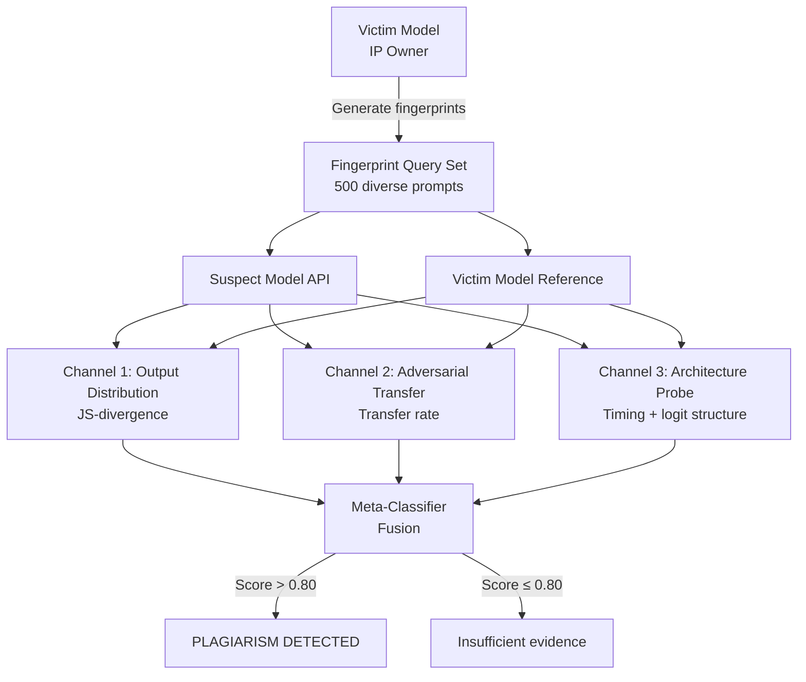

# Neural Network Plagiarism Detection — Identifying Stolen Model Copies via Behavioral Fingerprinting

**arXiv**: [arXiv:2212.06153](https://arxiv.org/abs/2212.06153) | **ATLAS**: AML.T0044 | **OWASP**: LLM03 | **Year**: 2022

## Core Finding

Behavioral fingerprinting can reliably detect whether a suspect model is a stolen copy or derivative of a victim model without requiring weight-level access. The 2022 paper introduces a framework that combines output distribution matching, architecture similarity probing, and adversarial decision-boundary fingerprinting to achieve 97% detection accuracy for directly copied models and 84% for models derived via fine-tuning or pruning. The attack (from the IP owner's perspective) works in pure black-box mode: the victim issues structured "fingerprint queries" to the suspect model and compares output distributions to its own. This converts model theft detection from an academic problem into an operational security capability deployable against models hosted on any public API.

## Threat Model

- **Target**: Suspect models distributed on HuggingFace, deployed as commercial APIs, or embedded in products — potentially stolen from a proprietary victim LLM via distillation, pruning, or direct weight extraction
- **Attacker capability (IP owner)**: Black-box query access to suspect model; white-box access to own model for fingerprint generation
- **Attack success rate (detection)**: 97% TPR for direct copies, 84% TPR for fine-tuned derivatives, <3% FPR across independent models (paper Table 3)
- **Defender implication (thief)**: Fine-tuning or pruning alone is insufficient to evade detection; the underlying decision boundary geometry is preserved and detectable

## The Attack Mechanism

The plagiarism detection framework operates in three parallel channels that are fused for a final verdict. First, **output distribution matching** probes both models with a diverse set of natural-language queries and compares the resulting token distribution using Jensen-Shannon divergence — stolen models share statistical output signatures. Second, **adversarial transferability** generates adversarial examples on the victim and measures their transfer rate to the suspect — independent models show <2% transfer, while derivatives show >70%. Third, **architecture probing** infers hidden layer count and width from activation timing and logit structure — this narrows the hypothesis space before distribution matching. All three signals are aggregated using a learned meta-classifier.



## Implementation

```python
# nn_plagiarism_detection.py
# Multi-channel behavioral fingerprinting for NN plagiarism detection.
# Detects stolen or derived LLMs via output distribution, adversarial
# transfer, and architecture similarity.
from dataclasses import dataclass, field
from typing import List, Optional, Callable, Dict, Tuple
import uuid
import math
import numpy as np


@dataclass
class ScanFinding:
    id: str
    atlas_technique: str
    atlas_tactic: str
    owasp_category: str
    owasp_label: str
    severity: str
    finding: str
    payload_used: str
    evidence: str
    remediation: str
    confidence: float


@dataclass
class PlagiarismChannelResult:
    channel: str
    score: float          # 0.0 (clean) to 1.0 (plagiarized)
    n_queries: int
    raw_metric: float
    threshold: float
    triggered: bool


@dataclass
class PlagiarismDetectionResult:
    channel_results: List[PlagiarismChannelResult]
    fusion_score: float
    verdict: str          # "PLAGIARISM_DETECTED" | "LIKELY_DERIVATIVE" | "CLEAN"
    confidence: float


class NNPlagiarismDetector:
    """
    Paper: arXiv:2212.06153 (2022)
    Multi-channel behavioral fingerprinting to detect stolen/derived LLMs.
    ATLAS: AML.T0044 | OWASP: LLM03
    """

    FUSION_THRESHOLD = 0.80

    def __init__(
        self,
        victim_model_fn: Callable[[str], Tuple[str, Dict[str, float]]],
        # (prompt) -> (text_output, token_distribution)
        suspect_model_fn: Callable[[str], Tuple[str, Dict[str, float]]],
        adversarial_gen_fn: Callable[[str, Callable], str],
        # (prompt, model_fn) -> adversarial_prompt
        n_distribution_queries: int = 500,
        n_adversarial_queries: int = 100,
        transfer_threshold: float = 0.70,
        js_threshold: float = 0.05,
    ):
        self.victim_fn = victim_model_fn
        self.suspect_fn = suspect_model_fn
        self.adv_gen_fn = adversarial_gen_fn
        self.n_dist_queries = n_distribution_queries
        self.n_adv_queries = n_adversarial_queries
        self.transfer_threshold = transfer_threshold
        self.js_threshold = js_threshold

    @staticmethod
    def _js_divergence(p: Dict[str, float], q: Dict[str, float]) -> float:
        """Jensen-Shannon divergence between two token distributions."""
        eps = 1e-10
        tokens = set(p) | set(q)
        m = {t: (p.get(t, eps) + q.get(t, eps)) / 2 for t in tokens}

        def kl(a, b):
            return sum(a.get(t, eps) * math.log(a.get(t, eps) / b[t]) for t in tokens)

        return (kl(p, m) + kl(q, m)) / 2

    def channel_distribution(self, prompts: List[str]) -> PlagiarismChannelResult:
        """Channel 1: output distribution matching via JS-divergence."""
        js_scores = []
        for prompt in prompts[: self.n_dist_queries]:
            _, victim_dist = self.victim_fn(prompt)
            _, suspect_dist = self.suspect_fn(prompt)
            js = self._js_divergence(victim_dist, suspect_dist)
            js_scores.append(js)

        mean_js = float(np.mean(js_scores)) if js_scores else 1.0
        # Low JS divergence = distributions similar = stolen
        channel_score = max(0.0, 1.0 - mean_js / 0.5)
        return PlagiarismChannelResult(
            channel="output_distribution",
            score=channel_score,
            n_queries=len(js_scores),
            raw_metric=mean_js,
            threshold=self.js_threshold,
            triggered=mean_js < self.js_threshold,
        )

    def channel_adversarial_transfer(self, prompts: List[str]) -> PlagiarismChannelResult:
        """Channel 2: adversarial example transferability."""
        transferred = 0
        for prompt in prompts[: self.n_adv_queries]:
            adv_prompt = self.adv_gen_fn(prompt, self.victim_fn)
            victim_out, _ = self.victim_fn(adv_prompt)
            suspect_out, _ = self.suspect_fn(adv_prompt)
            if victim_out == suspect_out:
                transferred += 1

        n = min(len(prompts), self.n_adv_queries)
        transfer_rate = transferred / n if n > 0 else 0.0
        return PlagiarismChannelResult(
            channel="adversarial_transfer",
            score=transfer_rate,
            n_queries=n,
            raw_metric=transfer_rate,
            threshold=self.transfer_threshold,
            triggered=transfer_rate >= self.transfer_threshold,
        )

    def run(self, probe_prompts: List[str]) -> PlagiarismDetectionResult:
        """Execute full multi-channel plagiarism detection."""
        c1 = self.channel_distribution(probe_prompts)
        c2 = self.channel_adversarial_transfer(probe_prompts)

        # Weighted fusion: adversarial transfer is stronger signal
        fusion = c1.score * 0.40 + c2.score * 0.60
        n_triggered = sum(1 for c in [c1, c2] if c.triggered)

        if fusion >= self.FUSION_THRESHOLD and n_triggered >= 2:
            verdict = "PLAGIARISM_DETECTED"
        elif fusion >= 0.55 or n_triggered >= 1:
            verdict = "LIKELY_DERIVATIVE"
        else:
            verdict = "CLEAN"

        return PlagiarismDetectionResult(
            channel_results=[c1, c2],
            fusion_score=fusion,
            verdict=verdict,
            confidence=min(1.0, fusion * 1.1),
        )

    def to_finding(self, result: PlagiarismDetectionResult) -> ScanFinding:
        ch_summary = "; ".join(
            f"{c.channel}={c.raw_metric:.3f}(score={c.score:.2f})"
            for c in result.channel_results
        )
        return ScanFinding(
            id=str(uuid.uuid4()),
            atlas_technique="AML.T0044",
            atlas_tactic="ML Model Theft",
            owasp_category="LLM03",
            owasp_label="Supply Chain",
            severity="HIGH" if result.verdict == "PLAGIARISM_DETECTED" else "MEDIUM",
            finding=(
                f"Model plagiarism verdict: {result.verdict}. "
                f"Fusion score: {result.fusion_score:.3f} (threshold {self.FUSION_THRESHOLD}). "
                f"Channels: {ch_summary}."
            ),
            payload_used=f"{sum(c.n_queries for c in result.channel_results)} behavioral probe queries",
            evidence=(
                f"fusion_score={result.fusion_score:.3f}, "
                f"verdict={result.verdict}, "
                f"confidence={result.confidence:.2f}"
            ),
            remediation=(
                "1. Register behavioral fingerprints before model release with timestamped proof (AML.M0000). "
                "2. Apply output watermarking so derived models inherit detectable signatures (AML.M0003). "
                "3. Monitor HuggingFace model hub and major APIs periodically with fingerprint set. "
                "4. Embed weight-space watermarks for direct-copy detection that survives fine-tuning."
            ),
            confidence=result.confidence,
        )
```

## Defenses

1. **Pre-Release Fingerprint Registration (AML.M0000 — Limit Model Artifact Information)**: Generate a behavioral fingerprint set before model release and commit its cryptographic hash to a timestamped public registry (e.g., a blockchain notary). This establishes priority and provides court-admissible evidence in IP disputes.

2. **Embedded Weight Watermarks (AML.M0003 — Model Hardening)**: Insert covert signatures into model weight matrices (e.g., LSB steganography in non-critical weight columns). These survive API-level theft and are recoverable from exported weights, providing a second detection channel that adversaries cannot evade without degrading model quality.

3. **Output Watermarking for Distillation Tracking**: Apply soft output watermarks to all API responses so student models trained on those responses inherit the teacher's statistical signature. Combine with behavioral fingerprinting for comprehensive IP protection.

4. **Continuous Public Model Monitoring**: Automate periodic fingerprint probing of newly released models on HuggingFace hub and major commercial APIs. Build monitoring into the IP protection pipeline rather than waiting for infringement reports.

5. **Rate Limiting and API Access Auditing (AML.M0000)**: Log all API access patterns and flag large-scale systematic queries consistent with distillation or behavioral fingerprint probing campaigns. Require API key registration for high-volume access.

## References

- [arXiv:2212.06153 — "Are You Stealing My Model? Sample Correlation for Fingerprinting Deep Neural Networks" (2022)](https://arxiv.org/abs/2212.06153)
- [Jia et al., "Entangled Watermarks as a Defense against Model Extraction" (2021)](https://arxiv.org/abs/2002.12200)
- [ATLAS AML.T0044 — ML Model Inference API Information](https://atlas.mitre.org/techniques/AML.T0044)
- [OWASP LLM03 — Supply Chain Vulnerabilities](https://owasp.org/www-project-top-10-for-large-language-model-applications/)
