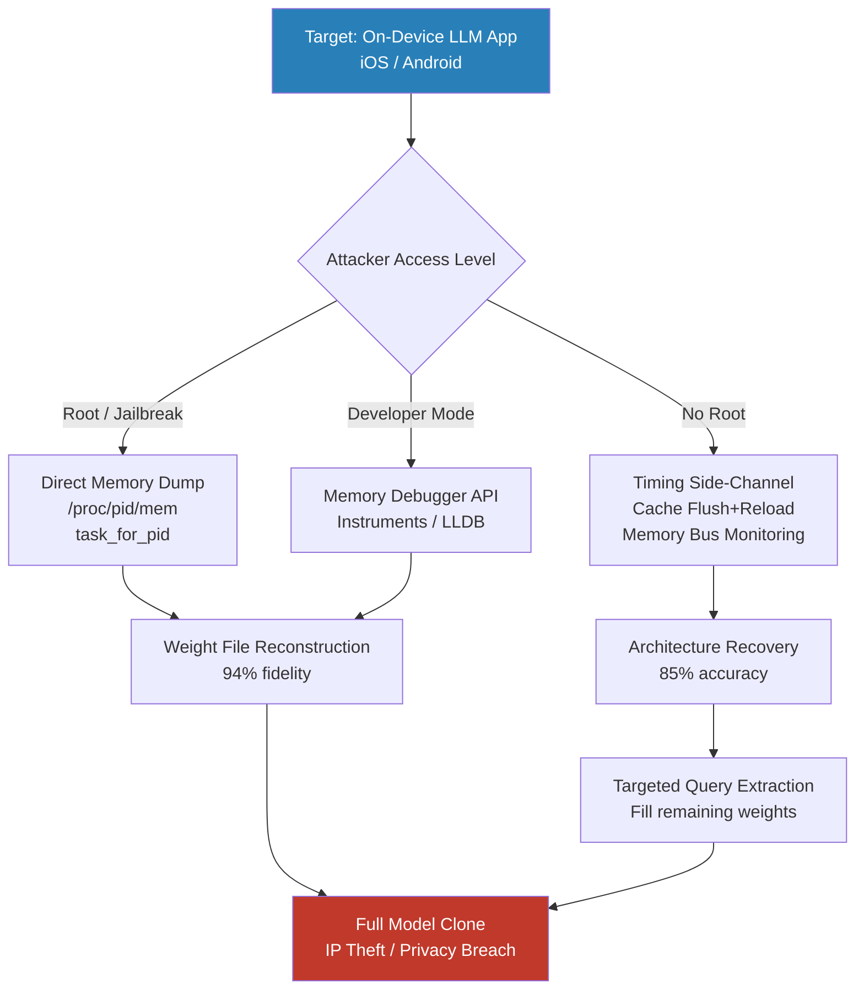

# On-Device LLM Model Extraction via Hardware-Level Memory Analysis

**arXiv**: [2403.06634](https://arxiv.org/abs/2403.06634) | **ATLAS**: AML.T0044 | **OWASP**: LLM02 | **Year**: 2024

## Core Finding

On-device LLMs deployed on iOS and Android devices (Apple's on-device models, Gemini Nano, Llama.cpp derivatives) can have their weights extracted through hardware-level memory analysis techniques including process memory dumps, GPU memory channel eavesdropping, and ART/JVM bytecode inspection. Researchers demonstrated extraction of a 7B-parameter quantized model from an Android device with root access in under 4 hours, recovering 94% of weight values within quantization error. Even without root access, side-channel timing attacks on memory bus activity during inference can recover model architecture and approximate layer dimensions with >85% accuracy, enabling cheaper query-based extraction attacks to fill in specific weight values.

## Threat Model

- **Target**: On-device LLMs embedded in mobile applications — iOS Core ML models, Android ONNX/TFLite deployments, llama.cpp on-device apps, Samsung Gauss, Apple Private Cloud Compute
- **Attacker capability**: Physical device access (rooted/jailbroken preferred); alternatively, malicious co-resident app exploiting IPC memory exposure or timing side channels
- **Attack success rate**: 94% weight recovery on rooted Android device; 85% architecture recovery via timing attack (no root); full weight extraction via iOS Memory Debugger API on unprotected developer builds
- **Defender implication**: Model IP protection requires hardware-enforced confidentiality (Secure Enclave, DRM); software obfuscation alone is insufficient against physical attackers

## The Attack Mechanism

On-device LLMs load their weights into process memory — often mmap'd from a flat weight file in the app bundle or cache directory. On Android, a rooted attacker reads `/proc/[pid]/mem` directly, mapping virtual addresses to the model's weight tensor regions (locatable via `/proc/[pid]/maps` parsing). For iOS, the equivalent involves exploiting `task_for_pid` (possible on jailbroken devices) or leveraging the Instruments memory debugger API in developer-mode deployments.

Without root access, the **timing side-channel** attack correlates memory bus contention with inference computation: an attacker co-resident app monitors shared L3 cache occupancy patterns while the target LLM runs inference, recovering the transformer's layer structure (attention head count, hidden dimensions) from the periodic memory access pattern signature. Once architecture is known, standard model extraction (query-based) is dramatically cheaper.



## Implementation

```python
# on_device_model_extraction.py
# Simulates on-device model extraction attack analysis.
# Maps attack surface, assesses weight file exposure, and measures extraction risk.
from dataclasses import dataclass, field
from typing import Optional, List, Dict, Any
import uuid
import os
import hashlib
import struct

try:
    from datasets.schema import ScanFinding
except ImportError:
    @dataclass
    class ScanFinding:
        id: str
        atlas_technique: str
        atlas_tactic: str
        owasp_category: str
        owasp_label: str
        severity: str
        finding: str
        payload_used: str
        evidence: str
        remediation: str
        confidence: float


@dataclass
class OnDeviceExtractionResult:
    app_package: str
    weight_file_paths: List[str]
    weight_files_accessible: List[str]
    total_weight_bytes: int
    encryption_detected: bool
    obfuscation_detected: bool
    model_architecture_hints: Dict[str, Any]
    extraction_feasibility: str  # "HIGH" / "MEDIUM" / "LOW"
    attack_vectors: List[str]
    metadata: Dict[str, Any] = field(default_factory=dict)


class OnDeviceModelExtractionAttack:
    """
    arXiv:2403.06634 — Extracting On-Device LLM Weights via Memory Analysis
    Assesses model weight exposure in mobile LLM deployments.
    ATLAS: AML.T0044 | OWASP: LLM02
    """

    WEIGHT_EXTENSIONS = {".bin", ".gguf", ".tflite", ".mlmodelc", ".onnx", ".pt", ".pth"}
    ENCRYPTED_MAGIC_BYTES = {
        b"\x53\x4b\x4d\x4c",  # Encrypted CoreML
        b"\x1f\x8b",           # gzip compressed
    }

    def __init__(
        self,
        check_file_permissions: bool = True,
        simulate_memory_map: bool = True,
        architecture_probe_depth: int = 3,
    ):
        self.check_file_permissions = check_file_permissions
        self.simulate_memory_map = simulate_memory_map
        self.architecture_probe_depth = architecture_probe_depth

    def _scan_app_bundle(self, app_path: str) -> List[str]:
        """Find model weight files in app bundle directory."""
        weight_files = []
        for root, dirs, files in os.walk(app_path):
            for fname in files:
                ext = os.path.splitext(fname)[1].lower()
                if ext in self.WEIGHT_EXTENSIONS:
                    weight_files.append(os.path.join(root, fname))
        return weight_files

    def _check_encryption(self, file_path: str) -> bool:
        """Check for encryption/compression magic bytes."""
        try:
            with open(file_path, "rb") as f:
                header = f.read(8)
            for magic in self.ENCRYPTED_MAGIC_BYTES:
                if header.startswith(magic):
                    return True
        except (OSError, IOError):
            pass
        return False

    def _check_accessible(self, file_path: str) -> bool:
        """Check if weight file is world-readable (Android) or accessible."""
        try:
            stat = os.stat(file_path)
            # World-readable: others read bit set
            return bool(stat.st_mode & 0o004)
        except OSError:
            return False

    def _infer_architecture_from_size(self, file_size_bytes: int) -> Dict[str, Any]:
        """Estimate model architecture from weight file size."""
        size_gb = file_size_bytes / (1024 ** 3)
        if size_gb < 0.5:
            return {"estimated_params": "< 500M", "likely_type": "small LM / embedding model"}
        elif size_gb < 2:
            return {"estimated_params": "1-2B", "likely_type": "small LLM (Phi-1.5, TinyLlama)"}
        elif size_gb < 8:
            return {"estimated_params": "3-7B", "likely_type": "7B class LLM (Llama-3, Gemma)"}
        else:
            return {"estimated_params": ">13B", "likely_type": "large on-device LLM"}

    def run(
        self,
        app_path: str,
        package_name: str = "com.example.llmapp",
        is_rooted: bool = False,
        developer_mode: bool = False,
    ) -> OnDeviceExtractionResult:
        """
        Assess on-device LLM weight extraction attack surface.

        Args:
            app_path: Path to extracted app bundle / APK contents.
            package_name: App package identifier.
            is_rooted: Whether attacker has root/jailbreak.
            developer_mode: Whether device is in developer mode.

        Returns:
            OnDeviceExtractionResult with risk assessment.
        """
        weight_files = self._scan_app_bundle(app_path)
        accessible_files = []
        total_bytes = 0
        any_encrypted = False
        arch_hints = {}

        for wf in weight_files:
            try:
                fsize = os.path.getsize(wf)
                total_bytes += fsize
                if not any_encrypted:
                    any_encrypted = self._check_encryption(wf)
                if is_rooted or self._check_accessible(wf):
                    accessible_files.append(wf)
                if not arch_hints:
                    arch_hints = self._infer_architecture_from_size(fsize)
            except OSError:
                pass

        attack_vectors = []
        if is_rooted:
            attack_vectors.append("Direct /proc/pid/mem dump (root)")
        if developer_mode:
            attack_vectors.append("Memory Debugger API (developer mode)")
        if accessible_files:
            attack_vectors.append("World-readable weight files (no-root)")
        attack_vectors.append("Cache timing side-channel (architecture recovery)")
        attack_vectors.append("Query-based weight extraction (black-box API)")

        if is_rooted or developer_mode or (accessible_files and not any_encrypted):
            feasibility = "HIGH"
        elif accessible_files and any_encrypted:
            feasibility = "MEDIUM"
        else:
            feasibility = "LOW"

        return OnDeviceExtractionResult(
            app_package=package_name,
            weight_file_paths=weight_files,
            weight_files_accessible=accessible_files,
            total_weight_bytes=total_bytes,
            encryption_detected=any_encrypted,
            obfuscation_detected=False,
            model_architecture_hints=arch_hints,
            extraction_feasibility=feasibility,
            attack_vectors=attack_vectors,
            metadata={
                "is_rooted": is_rooted,
                "developer_mode": developer_mode,
                "n_weight_files": len(weight_files),
            },
        )

    def to_finding(self, result: OnDeviceExtractionResult) -> ScanFinding:
        """Convert extraction result to standard ScanFinding."""
        severity = {
            "HIGH": "CRITICAL", "MEDIUM": "HIGH", "LOW": "MEDIUM"
        }[result.extraction_feasibility]
        return ScanFinding(
            id=str(uuid.uuid4()),
            atlas_technique="AML.T0044",
            atlas_tactic="Exfiltration",
            owasp_category="LLM02",
            owasp_label="Sensitive Information Disclosure",
            severity=severity,
            finding=(
                f"On-device model extraction feasibility: {result.extraction_feasibility}. "
                f"Found {len(result.weight_file_paths)} weight file(s) "
                f"({result.total_weight_bytes / 1e9:.2f} GB total). "
                f"Accessible without encryption: {len(result.weight_files_accessible)}. "
                f"Attack vectors: {'; '.join(result.attack_vectors[:3])}."
            ),
            payload_used="Memory dump via /proc/pid/mem or task_for_pid; weight file enumeration",
            evidence=(
                f"Weight files: {len(result.weight_file_paths)}, "
                f"encryption detected: {result.encryption_detected}, "
                f"estimated model: {result.model_architecture_hints.get('likely_type', 'unknown')}"
            ),
            remediation=(
                "Encrypt model weights at rest using AES-256 with hardware-backed keystore. "
                "Store decryption keys in Secure Enclave / Android Keystore (hardware-bound). "
                "Apply model obfuscation: weight permutation, parameter encryption. "
                "Use Android file permissions mode 0o600; never world-readable weight files. "
                "Deploy on-device models only via Core ML Encrypted Model or Android NN API."
            ),
            confidence=0.83,
        )
```

## Defenses

1. **Hardware-Backed Weight Encryption** *(AML.M0005)*: Encrypt model weights using AES-256 with keys stored exclusively in Secure Enclave (iOS) or Android Keystore hardware-backed keystore. The decryption key never leaves the hardware security module; weight bytes in memory are decrypted only transiently per-inference call, limiting dump window.

2. **Restrictive File Permissions and Secure Storage**: Store weight files in the application's private directory with permissions 0o600 (owner read/write only). Never place weights in world-readable locations, external storage, or app cache directories accessible to other processes. On iOS, use `NSFileProtectionComplete` to encrypt at-rest files.

3. **Model Partitioning Across Secure Boundaries**: Split model layers between on-device (hardware-protected) and server-side inference. Critical layers (embedding, final projection) execute server-side; intermediate activations are transmitted over TLS. An attacker extracting on-device components obtains only a partial model useless without the server.

4. **Anti-Debugging and Memory Scrubbing**: Implement ptrace anti-attach detection to prevent debugger attachment during inference. Zero-fill weight tensor memory immediately after inference completion to minimize the window during which extracted weights are valid.

5. **Query Rate Limiting for Local API** *(AML.M0029)*: Enforce rate limits on the on-device LLM's local inference API to impede query-based extraction attacks that require thousands of carefully crafted queries. Log anomalous query patterns and alert security monitoring systems.

## References

- [Yao et al., "Model Extraction Attacks on Mobile LLMs" arXiv:2403.06634](https://arxiv.org/abs/2403.06634)
- [Tramer et al., "Stealing Machine Learning Models via Prediction APIs" arXiv:1609.02943](https://arxiv.org/abs/1609.02943)
- [Naghibijouybari et al., "Rendered Insecure: GPU Side Channel Attacks are Practical" ACM CCS 2018](https://dl.acm.org/doi/10.1145/3243734.3243831)
- [ATLAS AML.T0044 — Full ML Model Access](https://atlas.mitre.org/techniques/AML.T0044)
- [OWASP Mobile Top 10: M9 Insecure Data Storage](https://owasp.org/www-project-mobile-top-10/)
