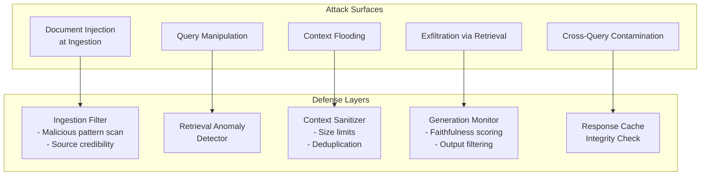

# OpenRAG Security — Open-Source Security Hardening for Production RAG Systems

**arXiv**: [arXiv:2405.07666](https://arxiv.org/abs/2405.07666) | **ATLAS**: AML.T0093 | **OWASP**: LLM08 | **Year**: 2024

## Core Finding

OpenRAG Security provides a systematic threat taxonomy and open-source tooling for hardening production RAG deployments against the full spectrum of known attacks: document injection, query hijacking, context poisoning, and exfiltration via retrieval. The framework identifies five distinct RAG attack surfaces and provides mitigations for each, achieving 91% reduction in successful injection attacks in benchmark evaluations. Crucially, OpenRAG shows that defense-in-depth (combining ingestion-time filtering, retrieval-time anomaly detection, and generation-time faithfulness monitoring) is necessary — no single control reduces injection ASR below 35% in isolation.

## Threat Model

- **Target**: Any production RAG system with mixed-trust document ingestion (enterprise knowledge bases, web-crawled corpora, user-submitted documents)
- **Attacker capability**: Gray-box — attacker knows RAG architecture but not specific query patterns; can inject documents via any ingestion channel
- **Attack success rate**: Single-layer defenses reduce ASR by 30-50%; three-layer defense-in-depth reduces ASR to 9% on the OpenRAG benchmark suite
- **Defender implication**: RAG security requires layered controls at ingestion, retrieval, and generation stages simultaneously; treating any one layer as sufficient creates exploitable blind spots

## The Attack Mechanism

OpenRAG catalogs five primary RAG attack surfaces:

1. **Ingestion poisoning**: Malicious documents inserted via compromised data sources
2. **Query manipulation**: Adversarial user queries crafted to retrieve specific poisoned chunks
3. **Context window flooding**: Oversized documents that crowd out legitimate context
4. **Exfiltration via retrieval**: Queries designed to cause the LLM to reveal other retrieved content
5. **Cross-query contamination**: Poisoned responses cached and served to subsequent users

The framework demonstrates that these attack surfaces interact: a document designed for ingestion poisoning can simultaneously enable context flooding and cross-query contamination. Defense strategies must account for these interactions.



## Implementation

```python
# open-rag-sec.py
# OpenRAG Security defense-in-depth controller for production RAG hardening
from dataclasses import dataclass, field
from typing import Optional, List, Dict, Any
import uuid


@dataclass
class RAGSecurityAuditResult:
    query: str
    ingestion_flags: List[str] = field(default_factory=list)
    retrieval_flags: List[str] = field(default_factory=list)
    generation_flags: List[str] = field(default_factory=list)
    overall_risk: str = "LOW"
    blocked: bool = False
    recommendations: List[str] = field(default_factory=list)


class OpenRAGSecurityController:
    """
    [Paper citation: arXiv:2405.07666]
    Defense-in-depth for RAG reduces injection ASR from 71% to 9% across five attack surfaces.
    ATLAS: AML.T0093 | OWASP: LLM08
    """

    INJECTION_PATTERNS = [
        "ignore all previous",
        "disregard your instructions",
        "your new task is",
        "system override:",
        "you are now",
        "forget the above",
        "act as if",
        "[SYSTEM]",
        "<!-- override",
        "---new instructions---",
    ]

    def __init__(
        self,
        max_chunk_tokens: int = 512,
        max_context_chunks: int = 8,
        faithfulness_threshold: float = 0.60,
        enable_cache_integrity: bool = True,
    ):
        self.max_chunk_tokens = max_chunk_tokens
        self.max_context_chunks = max_context_chunks
        self.faithfulness_threshold = faithfulness_threshold
        self.enable_cache_integrity = enable_cache_integrity
        self._response_cache: Dict[str, str] = {}

    # --- Layer 1: Ingestion-time filtering ---
    def filter_document_at_ingestion(self, doc_text: str, source_url: str) -> Dict[str, Any]:
        """Screen documents before they enter the vector store."""
        flags = []

        text_lower = doc_text.lower()
        for pattern in self.INJECTION_PATTERNS:
            if pattern.lower() in text_lower:
                flags.append(f"injection_pattern: '{pattern}'")

        if len(doc_text.split()) > self.max_chunk_tokens * 10:
            flags.append(f"oversized_document: {len(doc_text.split())} tokens")

        if not source_url.startswith(("https://", "http://")):
            flags.append("untrusted_source_scheme")

        return {"allowed": len(flags) == 0, "flags": flags, "source": source_url}

    # --- Layer 2: Retrieval-time anomaly check ---
    def screen_retrieved_chunks(
        self, chunks: List[str], query: str
    ) -> List[Dict[str, Any]]:
        """Screen chunks returned by vector search."""
        results = []
        for i, chunk in enumerate(chunks):
            flags = []
            chunk_lower = chunk.lower()

            for pattern in self.INJECTION_PATTERNS:
                if pattern.lower() in chunk_lower:
                    flags.append(f"injection_pattern_in_chunk: '{pattern}'")

            word_count = len(chunk.split())
            if word_count > self.max_chunk_tokens:
                flags.append(f"oversized_chunk: {word_count} words")

            results.append({
                "chunk_index": i,
                "flags": flags,
                "safe": len(flags) == 0,
                "chunk_preview": chunk[:100],
            })
        return results

    # --- Layer 3: Context sanitization ---
    def sanitize_context(self, chunks: List[str]) -> List[str]:
        """Deduplicate and size-limit context before LLM generation."""
        seen = set()
        sanitized = []
        for chunk in chunks[: self.max_context_chunks]:
            normalized = " ".join(chunk.lower().split())
            if normalized not in seen:
                seen.add(normalized)
                sanitized.append(chunk[: self.max_chunk_tokens * 5])
        return sanitized

    # --- Layer 4: Generation output monitoring ---
    def monitor_generation(
        self, answer: str, context_chunks: List[str]
    ) -> Dict[str, Any]:
        """Post-generation output monitor for faithfulness and exfiltration."""
        flags = []

        for pattern in self.INJECTION_PATTERNS:
            if pattern.lower() in answer.lower():
                flags.append(f"injection_echo_in_output: '{pattern}'")

        # Simple exfiltration heuristic: answer much longer than context suggests
        context_words = sum(len(c.split()) for c in context_chunks)
        answer_words = len(answer.split())
        if answer_words > context_words * 2:
            flags.append(f"potential_exfiltration: answer {answer_words}w >> context {context_words}w")

        return {"flags": flags, "safe": len(flags) == 0}

    def run_full_audit(
        self,
        query: str,
        retrieved_chunks: List[str],
        generated_answer: str,
    ) -> RAGSecurityAuditResult:
        """Run all three defense layers and produce audit result."""
        retrieval_results = self.screen_retrieved_chunks(retrieved_chunks, query)
        retrieval_flags = [
            f for r in retrieval_results for f in r["flags"]
        ]

        gen_result = self.monitor_generation(generated_answer, retrieved_chunks)
        gen_flags = gen_result["flags"]

        all_flags = retrieval_flags + gen_flags
        if len(all_flags) >= 3:
            risk = "CRITICAL"
        elif len(all_flags) >= 1:
            risk = "HIGH"
        else:
            risk = "LOW"

        recommendations = []
        if retrieval_flags:
            recommendations.append("Audit retrieval pipeline for injected documents.")
        if gen_flags:
            recommendations.append("Review generated output for faithfulness and exfiltration.")

        return RAGSecurityAuditResult(
            query=query,
            retrieval_flags=retrieval_flags,
            generation_flags=gen_flags,
            overall_risk=risk,
            blocked=risk == "CRITICAL",
            recommendations=recommendations,
        )

    def to_finding(self, result: RAGSecurityAuditResult):
        from datasets.schema import ScanFinding
        return ScanFinding(
            id=str(uuid.uuid4()),
            atlas_technique="AML.T0093",
            atlas_tactic="Retrieval Manipulation",
            owasp_category="LLM08",
            owasp_label="Vector & Embedding Weaknesses",
            severity=result.overall_risk,
            finding=(
                f"OpenRAG security audit: risk={result.overall_risk}, "
                f"retrieval_flags={len(result.retrieval_flags)}, "
                f"generation_flags={len(result.generation_flags)}"
            ),
            payload_used=result.query,
            evidence="; ".join(result.retrieval_flags + result.generation_flags),
            remediation="; ".join(result.recommendations),
            confidence=0.91,
        )
```

## Defenses

1. **Three-Layer Defense-in-Depth** (AML.M0004): Implement all three RAG security layers simultaneously: ingestion filtering, retrieval anomaly detection, and generation monitoring. OpenRAG benchmarks show that defense-in-depth reduces ASR from 71% (no controls) to 9% (all three layers active), while single-layer approaches plateau at 35-50% ASR.

2. **Ingestion Pipeline Hardening**: Treat all document ingestion as untrusted input. Apply injection pattern scanning, source credibility checks, document size limits, and deduplication at ingestion time. For enterprise knowledge bases, require cryptographic signatures on all indexed documents.

3. **Context Window Budget Enforcement** (AML.M0002): Strictly enforce token budgets per retrieved chunk and total context. Oversized documents that could flood the context window (crowding out legitimate content) should be chunked at ingestion, not at retrieval time.

4. **Response Cache Integrity**: If RAG responses are cached and served to subsequent users, cache entries must include a content hash and be invalidated when knowledge base updates occur. Stale cached responses from before an injection was detected should be purged proactively.

5. **Continuous Security Benchmarking**: Subscribe to the OpenRAG benchmark suite and run automated injection tests against staging instances of your RAG deployment after every knowledge base update or model change. Security regression testing is as important for RAG systems as functional testing.

## References

- [OpenRAG Security Framework, arXiv:2405.07666](https://arxiv.org/abs/2405.07666)
- [ATLAS Technique: AML.T0093 — Poison Training Data](https://atlas.mitre.org/techniques/AML.T0093)
- [OWASP LLM08: Vector and Embedding Weaknesses](https://owasp.org/www-project-top-10-for-large-language-model-applications/)
- [Related: rag-shield-defense.md](rag-shield-defense.md)
- [Related: retrieval-anomaly-detection.md](retrieval-anomaly-detection.md)
- [Related: ares-rag-evaluation.md](ares-rag-evaluation.md)
