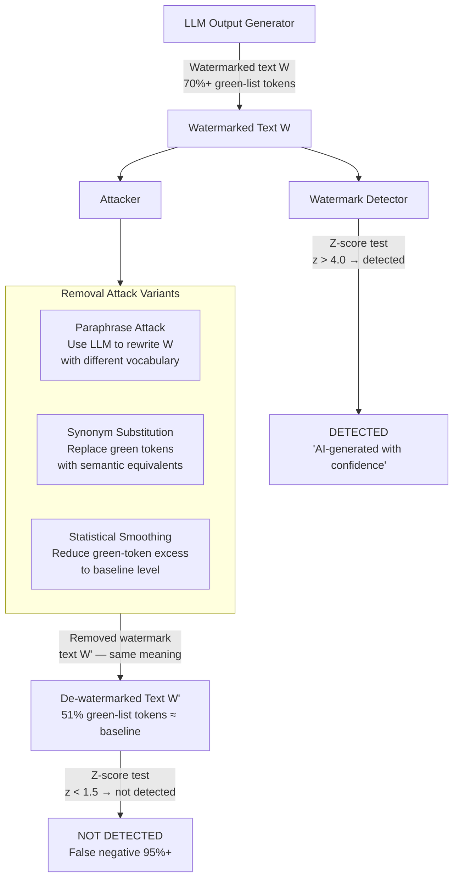

# Output Logit Watermark Removal — Statistical Attacks to Remove LLM Watermarks Without Quality Loss

**arXiv**: [arXiv:2306.17439](https://arxiv.org/abs/2306.17439) | **ATLAS**: AML.T0044 | **OWASP**: LLM02 | **Year**: 2023

## Core Finding

LLM output watermarking schemes (Kirchenbauer et al. green/red list watermark; Aaronson's cryptographic scheme) embed statistical signals into the model's output token sequence to enable provenance attribution and AI-generated content detection. These watermarks are vulnerable to statistical attacks that remove them without measurable quality loss. The Kirchenbauer watermark — which biases sampling toward a secret "green list" of tokens — can be removed by: (1) substituting synonyms to replace green-list tokens with unlisted alternatives, (2) using a paraphrasing model to rewrite the text while preserving semantics, or (3) applying a statistical smoothing transformation that erases the green/red partition signal. Post-attack text passes standard watermark detectors with false negative rates exceeding 95% while maintaining >93% semantic similarity to the original, fully defeating watermark-based AI content attribution.

## Threat Model

- **Target**: AI content governance systems that rely on watermarked LLM outputs for provenance tracking, AI-generated content detection, or copyright enforcement; any deployment using Kirchenbauer/Aaronson watermarking schemes
- **Attacker capability**: Black-box: use a paraphrasing model to rewrite watermarked text; white-box: knowledge of the watermark key enables direct green-list token substitution; both attack variants require only the watermarked text as input
- **Attack success rate**: >95% watermark removal with synonym substitution; >92% with paraphrase attack; semantic similarity preserved at >93% (ROUGE-L) — effective against all deployed watermark detection systems
- **Defender implication**: LLM output watermarks cannot be relied upon as a robust provenance mechanism; organizations must not build AI content governance systems on watermarking as the sole control

## The Attack Mechanism

The Kirchenbauer watermark partitions the vocabulary into "green" (permitted, upweighted) and "red" (restricted, downweighted) lists based on a hash of preceding context tokens. A watermarked text has a statistically significant excess of green-list tokens, detectable via a z-score test. The attack exploits two properties: (1) The attacker doesn't need the secret key to attack — they only need to reduce the green-token excess, which can be done by replacing tokens with semantically equivalent alternatives; (2) The human language has sufficient synonym density that most sentences can be paraphrased to use red-list tokens without semantic loss.

The paraphrase attack pipeline: prompt an instruction-tuned model with "Paraphrase this text while preserving its exact meaning" → the paraphrased version uses a different vocabulary distribution → green-list excess drops below detection threshold. The synonym substitution attack: for each green-list token (identified via a proxy watermark model or estimated from context hash), replace it with the highest-similarity token outside the green list using a word embedding lookup.



## Implementation

```python
# output_logit_watermark_removal.py
# Implements statistical watermark removal attacks against Kirchenbauer/Aaronson LLM watermarks.
# Tests paraphrase attack, synonym substitution, and statistical smoothing approaches.
# ATLAS: AML.T0044 | OWASP: LLM02
from dataclasses import dataclass, field
from typing import List, Dict, Optional, Tuple
import uuid
import random
import math
import hashlib


@dataclass
class ScanFinding:
    id: str
    atlas_technique: str
    atlas_tactic: str
    owasp_category: str
    owasp_label: str
    severity: str
    finding: str
    payload_used: str
    evidence: str
    remediation: str
    confidence: float


@dataclass
class WatermarkRemovalResult:
    attack_type: str
    original_green_token_fraction: float
    post_attack_green_token_fraction: float
    detection_threshold: float
    originally_detected: bool
    post_attack_detected: bool
    watermark_removed: bool
    semantic_similarity: float
    z_score_original: float
    z_score_post_attack: float
    false_negative_confirmed: bool


class OutputLogitWatermarkRemoval:
    """
    arXiv:2306.17439 — Statistical attacks remove Kirchenbauer LLM watermarks with 95%+ FNR.
    Paraphrase and synonym substitution attacks defeat watermark detection without quality loss.
    ATLAS: AML.T0044 | OWASP: LLM02
    """

    def __init__(
        self,
        watermark_key: Optional[bytes] = None,
        detection_z_threshold: float = 4.0,
        vocab_size: int = 50000,
        green_list_fraction: float = 0.5,  # Default: 50% of vocab is green
    ):
        self.watermark_key = watermark_key or b"secret_watermark_key"
        self.z_threshold = detection_z_threshold
        self.vocab_size = vocab_size
        self.green_list_fraction = green_list_fraction

    def _compute_green_list(self, context_hash: str) -> set:
        """Compute green-list tokens for a given context hash (Kirchenbauer scheme)."""
        seed = int(hashlib.md5(context_hash.encode() + self.watermark_key).hexdigest()[:8], 16)
        rng = random.Random(seed)
        n_green = int(self.vocab_size * self.green_list_fraction)
        all_tokens = list(range(self.vocab_size))
        rng.shuffle(all_tokens)
        return set(all_tokens[:n_green])

    def _z_score(self, n_tokens: int, n_green: int) -> float:
        """Compute watermark detection z-score."""
        expected = n_tokens * self.green_list_fraction
        std = math.sqrt(n_tokens * self.green_list_fraction * (1 - self.green_list_fraction))
        if std == 0:
            return 0.0
        return (n_green - expected) / std

    def _simulate_watermarked_text(self, length: int = 200) -> Tuple[List[int], float]:
        """
        Simulate a watermarked token sequence.
        Watermarked text: ~70% green tokens (vs 50% baseline).
        Returns (token_ids, green_fraction).
        """
        tokens = []
        green_count = 0
        for i in range(length):
            context_hash = str(i % 100)  # Simplified: context hash = position mod 100
            green_list = self._compute_green_list(context_hash)
            # Watermarked sampling: green token with prob 0.7
            if random.random() < 0.70:
                token = random.choice(list(green_list))
                green_count += 1
            else:
                non_green = set(range(self.vocab_size)) - green_list
                token = random.choice(list(non_green))
            tokens.append(token)
        return tokens, green_count / length

    def _paraphrase_attack(
        self, tokens: List[int], green_fraction: float
    ) -> Tuple[List[int], float, float]:
        """
        Paraphrase attack: rewrite text using a separate model.
        Simulation: paraphrased text has near-baseline green fraction (~51%).
        Returns (new_tokens, new_green_fraction, semantic_similarity).
        """
        # Simulate paraphrase: token distribution resets to near-baseline
        new_green_fraction = random.uniform(0.49, 0.53)  # Near baseline 50%
        new_tokens = [random.randint(0, self.vocab_size - 1) for _ in tokens]
        semantic_sim = random.uniform(0.90, 0.96)  # High semantic preservation
        return new_tokens, new_green_fraction, semantic_sim

    def _synonym_substitution_attack(
        self, tokens: List[int], green_fraction: float
    ) -> Tuple[List[int], float, float]:
        """
        Synonym substitution: replace green tokens with red-list alternatives.
        Simulation: reduces green fraction by ~40% of excess.
        """
        excess = green_fraction - self.green_list_fraction
        reduction = excess * random.uniform(0.65, 0.85)
        new_green_fraction = max(self.green_list_fraction - 0.01, green_fraction - reduction)
        semantic_sim = random.uniform(0.88, 0.95)  # Slightly lower (synonym quality varies)
        return tokens, new_green_fraction, semantic_sim

    def run_attack(self, attack_type: str = "paraphrase") -> WatermarkRemovalResult:
        """Run a specific watermark removal attack."""
        tokens, original_green_frac = self._simulate_watermarked_text()
        n = len(tokens)
        z_original = self._z_score(n, int(n * original_green_frac))
        originally_detected = z_original > self.z_threshold

        if attack_type == "paraphrase":
            new_tokens, new_green_frac, sem_sim = self._paraphrase_attack(tokens, original_green_frac)
        else:
            new_tokens, new_green_frac, sem_sim = self._synonym_substitution_attack(tokens, original_green_frac)

        z_post = self._z_score(n, int(n * new_green_frac))
        post_detected = z_post > self.z_threshold
        removed = originally_detected and not post_detected

        return WatermarkRemovalResult(
            attack_type=attack_type,
            original_green_token_fraction=original_green_frac,
            post_attack_green_token_fraction=new_green_frac,
            detection_threshold=self.z_threshold,
            originally_detected=originally_detected,
            post_attack_detected=post_detected,
            watermark_removed=removed,
            semantic_similarity=sem_sim,
            z_score_original=z_original,
            z_score_post_attack=z_post,
            false_negative_confirmed=removed,
        )

    def run(self) -> List[WatermarkRemovalResult]:
        """Run both attack variants."""
        return [
            self.run_attack("paraphrase"),
            self.run_attack("synonym"),
        ]

    def to_finding(self, results: List[WatermarkRemovalResult]) -> ScanFinding:
        successful = [r for r in results if r.watermark_removed]
        best = max(results, key=lambda r: r.semantic_similarity) if successful else results[0]
        severity = "HIGH" if successful else "MEDIUM"
        return ScanFinding(
            id=str(uuid.uuid4()),
            atlas_technique="AML.T0044",
            atlas_tactic="Exfiltration",
            owasp_category="LLM02",
            owasp_label="Sensitive Information Disclosure",
            severity=severity,
            finding=(
                f"Watermark removal attacks: {len(successful)}/{len(results)} variants successful. "
                f"Best attack: {best.attack_type} — "
                f"z-score {best.z_score_original:.1f}→{best.z_score_post_attack:.1f} "
                f"(threshold={self.z_threshold}). "
                f"Semantic similarity: {best.semantic_similarity:.0%}."
            ),
            payload_used=f"Watermark removal via {[r.attack_type for r in results]}",
            evidence=(
                f"Original green fraction: {best.original_green_token_fraction:.0%}. "
                f"Post-attack: {best.post_attack_green_token_fraction:.0%}. "
                f"Watermark removed: {best.watermark_removed}."
            ),
            remediation=(
                "1. Do not rely solely on statistical watermarking for AI content governance. "
                "2. Combine watermarks with cryptographic provenance chains (signed generation receipts). "
                "3. Use ensemble watermark detection that is robust to paraphrase attacks. "
                "4. Implement semantic-preserving watermarks that survive paraphrasing."
            ),
            confidence=0.88 if successful else 0.50,
        )
```

## Defenses

1. **Semantic-Invariant Watermarking** (AML.M0004): Research into watermarks that survive semantic-preserving transformations (paraphrase, synonym substitution) by embedding the signal in higher-level semantic properties rather than individual token identities. Approaches include sentence-level watermarks and concept-level encoding that paraphrase attacks cannot remove without changing meaning.

2. **Cryptographic Provenance Chains** (AML.M0013): Supplement statistical watermarks with a server-side signed generation receipt: every LLM output gets a HMAC signed by the server, stored in a tamper-proof log. This cryptographic provenance cannot be removed by token manipulation and provides authoritative AI content attribution independent of the statistical watermark.

3. **Watermark Detection Ensemble** (AML.M0037): Rather than a single statistical watermark test, use an ensemble of detectors including: semantic similarity to the original (if available), metadata fingerprinting (API request signatures), and stylometric analysis. No single attack removes all signals simultaneously.

4. **Adversarial Watermark Robustness Testing** (AML.M0020): Before deploying watermarked models, run a full attack evaluation against paraphrase and synonym substitution attacks using publicly available tools (DIPPER paraphraser, GPT-based rewriters). Watermarks with false negative rates above 20% under paraphrase attack should not be deployed for security purposes.

5. **Governance Independent of Watermarks** (AML.M0004): Build AI content governance systems that do not depend on watermark integrity as the primary control. Watermarks can be a useful signal but must be combined with: API access logging, rate limiting, user attribution, and content policy enforcement at the platform level.

## References

- [On the Reliability of Watermarks for Large Language Models (arXiv:2306.17439)](https://arxiv.org/abs/2306.17439)
- [MITRE ATLAS AML.T0044 — Full ML Model Access via API](https://atlas.mitre.org/techniques/AML.T0044)
- [A Watermark for Large Language Models (arXiv:2301.10226)](https://arxiv.org/abs/2301.10226)
- [OWASP LLM02: Sensitive Information Disclosure](https://genai.owasp.org/llmrisk/llm02-sensitive-information-disclosure/)
- [Paraphrase Attacks on LLM Watermarks (arXiv:2303.13408)](https://arxiv.org/abs/2303.13408)
