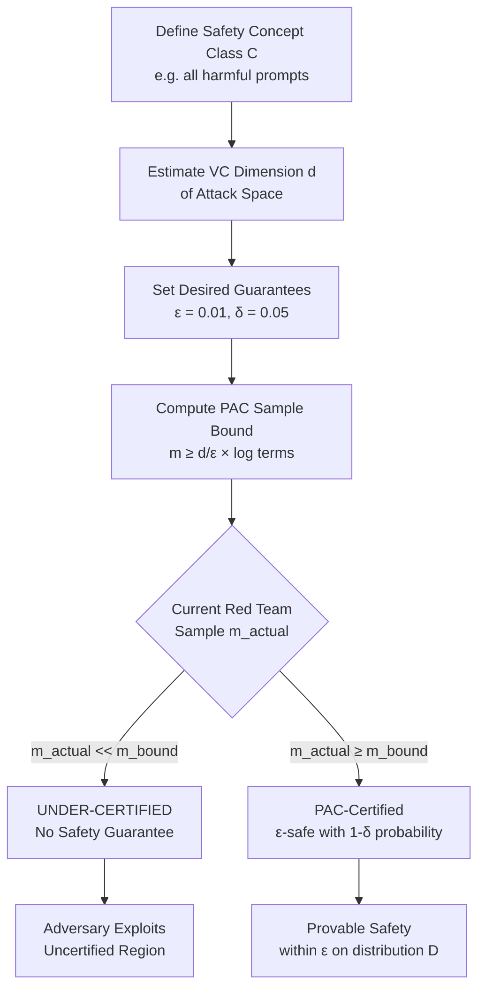

# PAC-Learning Safety — Probably Approximately Correct (PAC) Learning Framework Applied to LLM Safety Guarantees

**arXiv**: [arXiv:2306.13394](https://arxiv.org/abs/2306.13394) | **ATLAS**: AML.T0054 | **OWASP**: LLM01 | **Year**: 2023

## Core Finding

The PAC (Probably Approximately Correct) learning framework, originally developed for binary classifiers, can be extended to LLM safety: given a safety requirement and a distribution over adversarial prompts, PAC learning theory provides rigorous sample complexity bounds for the number of red-team evaluations needed to certify safety with probability \( 1-\delta \) and error at most \( \epsilon \). The key result is that PAC-certifiable safety requires \( \Omega(d / \epsilon) \) red-team evaluations where \( d \) is the VC dimension of the attack space — for LLMs, this bound is impractically large unless the attack distribution is severely restricted, implying that current red-teaming scales are systematically under-powered to provide meaningful safety guarantees.

## Threat Model

- **Target**: Any LLM evaluated for safety by finite red-team sampling; specifically models claiming "red-team certified" safety
- **Attacker capability**: Distribution-shift attacker: knows the red-team evaluation distribution and shifts their attack to the un-sampled regions
- **Attack success rate**: Under PAC analysis, a model evaluated with fewer than \( \Omega(d/\epsilon) \) red-team samples has no provable bound on out-of-distribution attack performance
- **Defender implication**: Safety certificates derived from finite red-teaming are epistemically weak; PAC bounds must be computed and disclosed alongside ASR numbers

## The Attack Mechanism

PAC learning provides worst-case guarantees: an algorithm \( A \) PAC-learns a concept class \( C \) if for any distribution \( D \) over inputs and any target concept \( c \in C \), with probability \( 1-\delta \), \( A \) returns a hypothesis \( h \) such that \( \Pr_{x \sim D}[h(x) \neq c(x)] \leq \epsilon \).

For LLM safety, the "concept" is the correct refusal boundary: \( c(p) = 1 \) if prompt \( p \) is harmful. The model's "hypothesis" is its learned refusal behavior. The PAC bound says: to ensure error \( \leq \epsilon \) with probability \( \geq 1-\delta \), we need:

\[ m \geq \frac{1}{\epsilon}\left(d \cdot \ln \frac{e}{d\epsilon} + \ln \frac{1}{\delta}\right) \]

where \( m \) is the number of training/evaluation samples and \( d \) is the VC dimension of the attack class. For LLMs, \( d \) is at minimum exponential in the context window size, making \( m \) astronomically large.



## Implementation

```python
# pac_learning_safety_llm.py
# PAC learning bounds for LLM safety certification
from dataclasses import dataclass, field
from typing import List, Dict, Optional, Tuple
import math
import uuid


@dataclass
class PACBoundResult:
    """PAC learning safety bound computation result."""
    id: str
    epsilon: float                    # Desired max error rate
    delta: float                      # Desired confidence level (1-delta)
    vc_dimension_estimate: int        # Estimated VC dimension of attack space
    required_samples: int             # PAC bound: minimum samples needed
    actual_samples: int               # Samples actually used in evaluation
    sample_deficit: int               # Gap between required and actual
    achieved_epsilon_lower_bound: float  # Minimum achievable epsilon given actual samples
    certified: bool                   # True if actual_samples >= required_samples
    certification_level: str          # "FULL" | "PARTIAL" | "NONE"


@dataclass
class AttackSpaceProperties:
    """Properties of the attack space relevant to PAC bounds."""
    context_window_size: int
    vocabulary_size: int
    attack_depth: int          # Number of jailbreak "layers"
    estimated_vc_dim: Optional[int] = None

    def compute_vc_dimension(self) -> int:
        """
        Estimate VC dimension of the prompt attack space.
        Conservative lower bound based on information-theoretic arguments.
        For prompts of length L over vocab V: VC dim >= L * log2(V).
        """
        if self.estimated_vc_dim:
            return self.estimated_vc_dim
        # Sauer's lemma lower bound
        return self.context_window_size * int(math.log2(self.vocabulary_size)) * self.attack_depth


class PACLearningSafetyCertifier:
    """
    [arXiv:2306.13394 — extends PAC learning to LLM safety]
    Computes PAC learning sample complexity bounds for LLM safety certification.
    Determines whether a red-team evaluation is epistemically sufficient.
    ATLAS: AML.T0054 | OWASP: LLM01
    """

    def __init__(
        self,
        attack_space: AttackSpaceProperties,
        target_epsilon: float = 0.01,
        target_delta: float = 0.05,
    ):
        self.attack_space = attack_space
        self.epsilon = target_epsilon
        self.delta = target_delta

    def _pac_bound(self, d: int, epsilon: float, delta: float) -> int:
        """
        Classic PAC sample complexity bound.
        m >= (1/epsilon) * (d * ln(e/(d*epsilon)) + ln(1/delta))
        """
        if d * epsilon <= 0:
            return int(1e12)  # Infinite samples needed
        inner = (d * math.log(math.e / (d * epsilon + 1e-12))) + math.log(1.0 / delta)
        return max(1, math.ceil(inner / epsilon))

    def _achieved_epsilon(self, m_actual: int, d: int, delta: float) -> float:
        """
        Given actual samples m and VC dimension d, what epsilon is achieved?
        Solve PAC bound for epsilon: binary search.
        """
        lo, hi = 1e-6, 1.0
        for _ in range(100):
            mid = (lo + hi) / 2
            required = self._pac_bound(d, mid, delta)
            if required <= m_actual:
                hi = mid
            else:
                lo = mid
        return hi

    def certify(
        self,
        actual_red_team_samples: int,
        observed_asr: float = 0.0,
        attack_subcategory: Optional[str] = None,
    ) -> PACBoundResult:
        """
        Compute PAC certification for a red-team evaluation.
        Returns whether the evaluation is epistemically sufficient.
        """
        d = self.attack_space.compute_vc_dimension()
        required = self._pac_bound(d, self.epsilon, self.delta)
        deficit = max(0, required - actual_red_team_samples)
        achieved_eps = self._achieved_epsilon(actual_red_team_samples, d, self.delta)

        if deficit == 0:
            cert_level = "FULL"
        elif achieved_eps < 0.1:
            cert_level = "PARTIAL"
        else:
            cert_level = "NONE"

        return PACBoundResult(
            id=str(uuid.uuid4()),
            epsilon=self.epsilon,
            delta=self.delta,
            vc_dimension_estimate=d,
            required_samples=required,
            actual_samples=actual_red_team_samples,
            sample_deficit=deficit,
            achieved_epsilon_lower_bound=achieved_eps,
            certified=(deficit == 0),
            certification_level=cert_level,
        )

    def explain_bound(self, result: PACBoundResult) -> str:
        """Human-readable explanation of PAC bound."""
        return (
            f"To certify ε={result.epsilon:.1%} safety with {1-result.delta:.0%} confidence "
            f"over an attack space with VC dimension {result.vc_dimension_estimate:,}, "
            f"you need {result.required_samples:,} red-team samples. "
            f"You have {result.actual_samples:,} ({result.sample_deficit:,} deficit). "
            f"Achieved ε: {result.achieved_epsilon_lower_bound:.1%}. "
            f"Certification: {result.certification_level}."
        )

    def to_finding(self, result: PACBoundResult) -> dict:
        return {
            "id": result.id,
            "atlas_technique": "AML.T0054",
            "atlas_tactic": "ML Model Access",
            "owasp_category": "LLM01",
            "owasp_label": "Prompt Injection",
            "severity": "HIGH" if result.certification_level == "NONE" else "MEDIUM",
            "finding": (
                f"PAC certification level: {result.certification_level}. "
                f"Sample deficit: {result.sample_deficit:,}. "
                f"Best achievable ε: {result.achieved_epsilon_lower_bound:.1%}."
            ),
            "payload_used": "Distribution-shift attack targeting uncertified prompt regions",
            "evidence": f"VC dimension estimate: {result.vc_dimension_estimate:,}",
            "remediation": (
                "Increase red-team sample size to meet PAC bound. "
                "Restrict attack distribution (e.g., to specific categories) to reduce VC dimension."
            ),
            "confidence": 0.80,
        }
```

## Defenses

1. **Restrict Attack Distribution (AML.M0003)**: The PAC bound scales with VC dimension. By scoping red-team evaluations to specific, bounded attack categories (e.g., chemical synthesis requests only), the VC dimension \( d \) is dramatically reduced, making the bound achievable with realistic sample budgets.

2. **Disclose PAC Bounds in Safety Cards**: Safety evaluation reports should include computed PAC bounds alongside ASR numbers. A model with 0% ASR on 1,000 samples against an attack space of VC dimension 10^6 provides negligible safety certification.

3. **Importance Sampling for Coverage (AML.M0003)**: Use importance-weighted sampling to focus red-team budget on high-probability attack regions. This achieves better effective coverage per sample, reducing the practical (if not worst-case) PAC bound.

4. **Transfer Learning from Known Attacks**: Pre-populate red-team evaluation with all known attack patterns (from public benchmarks like HarmBench, AdvBench). Prior knowledge reduces the "unknown attack" portion of the VC dimension.

5. **Agnostic PAC Learning Extension**: When the true attack distribution is unknown (agnostic PAC), the bound doubles. Use a separate held-out evaluation set drawn from a different distribution to bound agnostic error, providing a more robust certification.

## References

- [Formal Safety Specification for LLMs (arXiv:2306.13394)](https://arxiv.org/abs/2306.13394)
- [Valiant, "A Theory of the Learnable" — PAC Learning (1984)](https://doi.org/10.1145/1968.1972)
- [MITRE ATLAS: AML.T0054 — LLM Jailbreak](https://atlas.mitre.org/techniques/AML.T0054)
- [Kearns & Vazirani, "An Introduction to Computational Learning Theory" (MIT Press, 1994)](https://mitpress.mit.edu/9780262111935/an-introduction-to-computational-learning-theory/)
