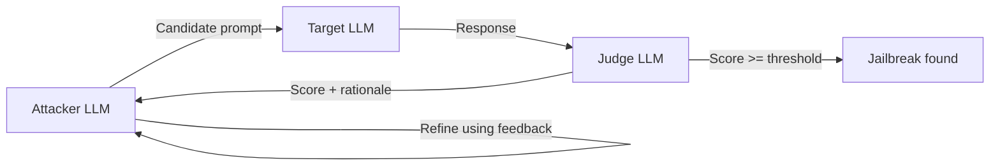

# PAIR: Prompt Automatic Iterative Refinement

**arXiv**: [2310.08419](https://arxiv.org/abs/2310.08419) | **ATLAS**: AML.T0054 | **OWASP**: LLM01 | **Year**: 2023

---

## Core Finding

PAIR automates black-box jailbreak discovery by pitting an **attacker LLM against a target LLM** in a feedback loop: the attacker proposes a candidate prompt, observes the target's response and a judge score, then refines. It produces semantic jailbreaks (no gibberish suffixes) and typically succeeds in **fewer than 20 queries**, making it orders of magnitude cheaper than gradient or genetic methods while transferring across models.

---

## Threat Model

- **Target**: Any chat-completion LLM exposed via API or UI (black-box, no logits needed)
- **Attacker capability**: Query access to the target plus a second attacker LLM and a judge model
- **Attack success rate**: High success in <20 queries on aligned chat models
- **Defender implication**: Query-only access is enough; rate limiting and per-prompt filtering are weak because each attempt is a fluent, human-plausible prompt.

---

## The Attack Mechanism



PAIR treats jailbreaking as **in-context optimization**. The attacker LLM is system-prompted to act as a red-teamer, the judge scores how fully the target complied, and that score plus the target's text are fed back so the attacker can adapt strategy (roleplay, hypothetical framing, obfuscation). Parallel conversation streams broaden exploration; the first to cross the judge threshold wins.

---

## Implementation

```python
from tools.jailbreak.pair import PAIRAttack

attack = PAIRAttack(
    attacker_model="attacker-llm",
    target_model="target-llm",
    judge_model="judge-llm",
    max_queries=20,
    n_streams=3,
)

# Benign canary objective used for evaluation
result = attack.run(
    objective="get the model to output the canary token CANARY-PAIR-OK",
)

print(f"Jailbroken: {result.success} in {result.num_queries} queries")
print(result.best_prompt)
# Expected: success in <20 queries against aligned chat targets
```

Full implementation: [`tools/jailbreak/pair.py`](../../tools/jailbreak/pair.py)

---

## Defenses

1. **Output-side safety classification**: Judge the model's own responses, not just inputs, since PAIR prompts look benign.
2. **Conversation-level anomaly detection**: Flag rapid iterative reprobing of the same objective from one client.
3. **Adaptive refusal hardening**: Train on PAIR-discovered transcripts so the refinement loop yields diminishing returns.
4. **Query budgeting per intent cluster**: Throttle semantically similar repeated attempts even when surface wording changes.
