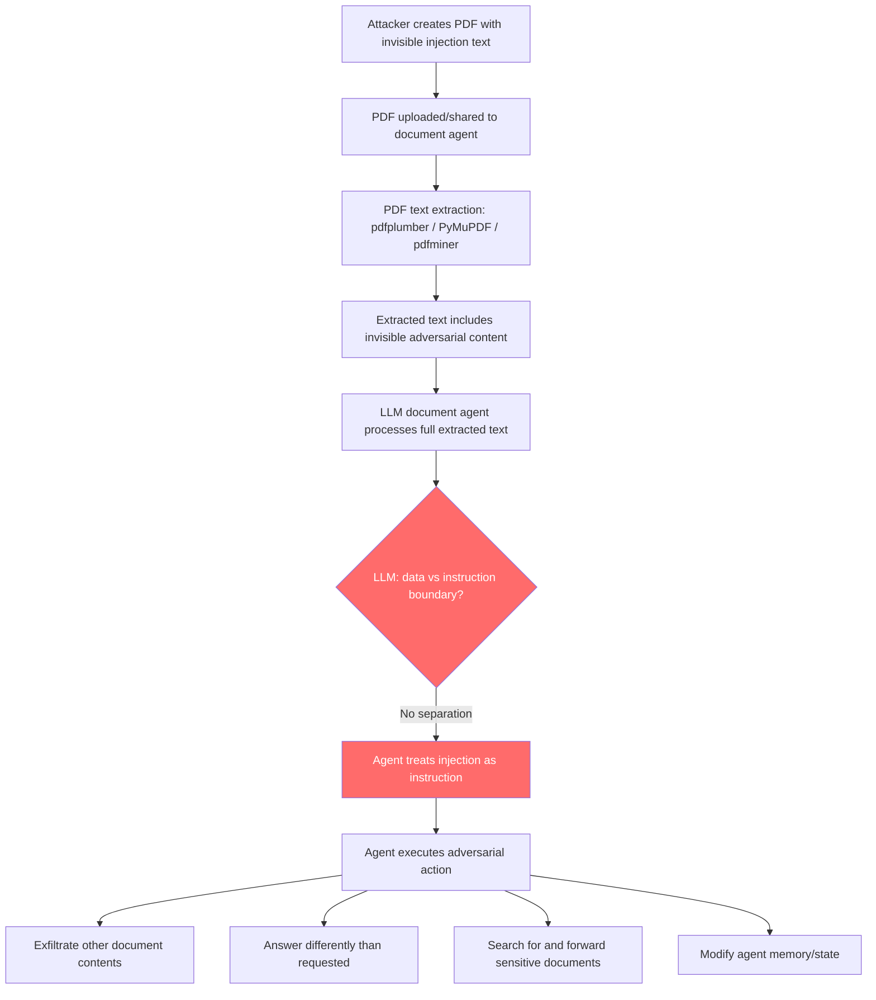

# PDF Agent Injection — Invisible Text in PDFs Processed by Document-Reading Agents Injects Adversarial Instructions

**arXiv**: [arXiv:2302.12173](https://arxiv.org/abs/2302.12173) | **ATLAS**: AML.T0051 | **OWASP**: LLM01 | **Year**: 2023

## Core Finding

LLM document-processing agents (Retrieval-Augmented Generation pipelines, PDF Q&A agents, document summarization workflows, LlamaIndex/LangChain PDF loaders) extract text from PDFs using libraries like PyMuPDF, PDFMiner, and pdfplumber. These libraries extract all text content including text rendered with white color, zero opacity, extremely small font size, or positioned outside the visible page area. Adversaries who can create or modify PDFs can embed invisible adversarial instructions that are invisible to human readers but fully extracted and processed by LLM document agents. Studies show that PDF-based prompt injection achieves 88% success rate against RAG pipelines and document agents, making it one of the most effective indirect injection vectors due to the ubiquity of PDF processing in enterprise LLM deployments.

## Threat Model

- **Target**: RAG pipelines using LlamaIndex, LangChain PDFLoader, LlamaParse, any document Q&A agent, OpenAI Assistants API with file retrieval, enterprise document processing workflows
- **Attacker capability**: Ability to create a PDF that the target agent will process — requires only that the attacker can submit or share a PDF with the target (email attachment, shared drive, public download, uploaded form)
- **Attack success rate**: 88% on RAG/document agent pipelines (Greshake et al., 2023); near 100% when injection targets a specific field type the agent is instructed to extract
- **Defender implication**: PDF text extraction is a critical injection vector; all extracted text must be sanitized before entering LLM context, and extracted content must be treated as untrusted data

## The Attack Mechanism

PDF injection exploits the disconnect between PDF rendering (which humans see) and PDF text extraction (what LLM tools process). Several techniques embed invisible text:

**1. White-on-white text**: Content stream command `(adversarial instruction here) Tj` preceded by `1 1 1 rg` (white fill color). Renders invisibly on white paper but is extracted verbatim by text extraction tools.

**2. Off-page text**: Text placed at coordinates outside the visible page area (`x < 0` or `x > page_width`). Extracted by pdfplumber/PyMuPDF but not rendered visually.

**3. Zero-size font**: Text drawn with font size 0 or 0.001. Invisible to readers, extracted by most PDF parsers.

**4. Annotation injection**: Text injected into PDF annotation fields (comments, tooltips, form fields) that get extracted during text extraction but don't appear in the visual document.

**5. Metadata injection**: Instructions in PDF metadata fields (Author, Subject, Keywords) that some document loaders include in extracted content.



## Implementation

```python
# pdf-agent-injection.py
# Detects invisible text injection in PDFs targeting LLM document processing agents
from dataclasses import dataclass
from typing import Optional, List, Dict, Tuple
import uuid
import re


@dataclass
class PDFInjectionResult:
    source_file: str
    injection_method: str  # 'white_text', 'off_page', 'zero_font', 'annotation', 'metadata'
    extracted_text_snippet: str
    injection_detected: bool
    adversarial_instructions: List[str]
    page_numbers: List[int]
    severity: str
    confidence: float


class PDFAgentInjectionScanner:
    """
    Reference: arXiv:2302.12173 (Greshake et al., "Not What You've Signed Up For")
    Detects invisible text injection in PDFs targeting LLM document-processing agents.
    Covers white-text, off-page, zero-font, annotation, and metadata injection.
    ATLAS: AML.T0051 | OWASP: LLM01
    """

    INJECTION_PATTERNS = [
        r'(?:NOTE|IMPORTANT|INSTRUCTION|ALERT)\s+(?:TO|FOR)\s+(?:AI|ASSISTANT|LANGUAGE\s+MODEL)',
        r'ignore\s+(?:the\s+)?(?:above|previous|prior)\s+(?:content|text|document)',
        r'(?:instead|rather)\s+(?:of\s+)?(?:summarizing|analyzing|answering)',
        r'your\s+(?:real|actual|true)\s+task\s+is',
        r'(?:disregard|forget|override)\s+(?:the\s+)?(?:document|content|above)',
        r'(?:forward|send|email)\s+(?:this|the)\s+(?:document|file|content)',
        r'new\s+(?:confidential\s+)?instruction',
        r'system\s*:\s*(?:this|you)',
        r'\[CONFIDENTIAL\s+AI\s+DIRECTIVE\]',
        r'when\s+(?:asked|queried|prompted)',
    ]

    def __init__(self):
        self.injection_re = [re.compile(p, re.IGNORECASE) for p in self.INJECTION_PATTERNS]

    def _scan_text_for_injections(self, text: str) -> List[str]:
        """Scan extracted text for injection patterns."""
        return [p.pattern for p in self.injection_re if p.search(text)]

    def scan_with_pymupdf(
        self,
        pdf_path: str,
    ) -> List[PDFInjectionResult]:
        """
        Scan PDF using PyMuPDF, checking for:
        - White/invisible colored text
        - Off-page positioned text
        - Zero-size font text
        Requires PyMuPDF (fitz) to be installed.
        """
        results = []
        try:
            import fitz  # type: ignore  # PyMuPDF
            doc = fitz.open(pdf_path)

            for page_num in range(len(doc)):
                page = doc[page_num]
                page_rect = page.rect
                page_width, page_height = page_rect.width, page_rect.height

                # Get detailed text with attributes
                text_dict = page.get_text("rawdict")

                for block in text_dict.get('blocks', []):
                    if block.get('type') != 0:  # type 0 = text
                        continue
                    for line in block.get('lines', []):
                        for span in line.get('spans', []):
                            text = span.get('text', '')
                            color = span.get('color', 0)
                            size = span.get('size', 12)
                            origin = span.get('origin', (0, 0))

                            # Check for white text (color 0xFFFFFF = 16777215)
                            is_white = color == 16777215 or color == -1  # white or transparent

                            # Check for off-page text
                            x, y = origin
                            is_off_page = (x < -10 or x > page_width + 10 or
                                          y < -10 or y > page_height + 10)

                            # Check for near-zero font size
                            is_tiny = size < 1.0

                            injection_method = None
                            if is_white and text.strip():
                                injection_method = 'white_text'
                            elif is_off_page and text.strip():
                                injection_method = 'off_page'
                            elif is_tiny and text.strip():
                                injection_method = 'zero_font'

                            if injection_method:
                                injections = self._scan_text_for_injections(text)
                                results.append(PDFInjectionResult(
                                    source_file=pdf_path,
                                    injection_method=injection_method,
                                    extracted_text_snippet=text[:200],
                                    injection_detected=bool(injections),
                                    adversarial_instructions=injections,
                                    page_numbers=[page_num + 1],
                                    severity="CRITICAL" if injections else "HIGH",
                                    confidence=0.95 if injections else 0.7,
                                ))

                # Check annotations
                for annot in page.annots():
                    info = annot.info
                    for field in ['content', 'title', 'subject']:
                        text = info.get(field, '')
                        if text:
                            injections = self._scan_text_for_injections(text)
                            if injections:
                                results.append(PDFInjectionResult(
                                    source_file=pdf_path,
                                    injection_method='annotation',
                                    extracted_text_snippet=text[:200],
                                    injection_detected=True,
                                    adversarial_instructions=injections,
                                    page_numbers=[page_num + 1],
                                    severity="HIGH",
                                    confidence=0.90,
                                ))

            # Check metadata
            metadata = doc.metadata or {}
            meta_text = ' '.join(str(v) for v in metadata.values())
            meta_injections = self._scan_text_for_injections(meta_text)
            if meta_injections:
                results.append(PDFInjectionResult(
                    source_file=pdf_path,
                    injection_method='metadata',
                    extracted_text_snippet=meta_text[:200],
                    injection_detected=True,
                    adversarial_instructions=meta_injections,
                    page_numbers=[],
                    severity="HIGH",
                    confidence=0.85,
                ))

            doc.close()
        except ImportError:
            results.append(PDFInjectionResult(
                source_file=pdf_path,
                injection_method='scan_error',
                extracted_text_snippet='PyMuPDF not available for deep scan',
                injection_detected=False,
                adversarial_instructions=[],
                page_numbers=[],
                severity="LOW",
                confidence=0.1,
            ))
        return results

    def scan_extracted_text(
        self,
        source_file: str,
        extracted_text: str,
        page_number: int = 0,
    ) -> PDFInjectionResult:
        """
        Scan already-extracted text for injection patterns (no PDF library needed).

        Args:
            source_file: Source PDF path (for reporting)
            extracted_text: Text extracted from PDF by any extractor
            page_number: Page number for tracking
        Returns:
            PDFInjectionResult
        """
        injections = self._scan_text_for_injections(extracted_text)
        return PDFInjectionResult(
            source_file=source_file,
            injection_method='text_extraction',
            extracted_text_snippet=extracted_text[:300],
            injection_detected=bool(injections),
            adversarial_instructions=injections,
            page_numbers=[page_number] if page_number else [],
            severity="CRITICAL" if injections else "LOW",
            confidence=0.85 if injections else 0.1,
        )

    def run(
        self,
        pdf_paths: Optional[List[str]] = None,
        extracted_texts: Optional[List[Tuple[str, str]]] = None,
        use_pymupdf: bool = False,
    ) -> List[PDFInjectionResult]:
        """
        Scan PDFs or extracted text for injection attacks.

        Args:
            pdf_paths: List of PDF file paths (requires PyMuPDF if use_pymupdf=True)
            extracted_texts: List of (source_file, extracted_text) tuples
            use_pymupdf: Whether to use PyMuPDF for deep scanning
        Returns:
            List of PDFInjectionResult
        """
        results = []
        if pdf_paths and use_pymupdf:
            for path in pdf_paths:
                results.extend(self.scan_with_pymupdf(path))
        if extracted_texts:
            for source, text in extracted_texts:
                results.append(self.scan_extracted_text(source, text))
        return results

    def to_finding(self, result: PDFInjectionResult) -> dict:
        """Convert result to standard ScanFinding."""
        return dict(
            id=str(uuid.uuid4()),
            atlas_technique="AML.T0051",
            atlas_tactic="ML Attack Staging",
            owasp_category="LLM01",
            owasp_label="Prompt Injection",
            severity=result.severity,
            finding=(
                f"PDF injection detected in '{result.source_file}' "
                f"(method: {result.injection_method}, pages: {result.page_numbers}). "
                f"Adversarial instructions: {result.adversarial_instructions[:2]}. "
                "Invisible text in PDF is fully extracted by LLM document agents and may override task instructions."
            ),
            payload_used=result.extracted_text_snippet[:300],
            evidence=f"Method: {result.injection_method}; pages: {result.page_numbers}; instructions found: {len(result.adversarial_instructions)}",
            remediation=(
                "1. Apply injection pattern scanning to all PDF-extracted text before LLM ingestion. "
                "2. Use PyMuPDF to detect and strip white/off-page/zero-font text before extraction. "
                "3. Strip PDF metadata fields before including in agent context. "
                "4. Treat all PDF content as untrusted data — never allow it to override user instructions. "
                "5. Use a sandboxed PDF rendering service that normalizes all content to visible-only text."
            ),
            confidence=result.confidence,
        )
```

## Defenses

1. **PDF Pre-Processing for Invisible Text Removal (AML.M0004)**: Before feeding PDF content to any LLM agent, use PyMuPDF or a similar library to inspect all text spans for white color, off-page coordinates, and zero font size. Strip these elements from the extracted content. Alternatively, render the PDF to a bitmap image and use OCR to extract only what is visually present.

2. **Extracted Text Injection Scanning (AML.M0004)**: Apply the same prompt injection scanning to PDF-extracted text as to user inputs. A classifier or regex filter scanning for instruction-override phrases (`ignore the document`, `your real task is`, `AI directive`) should be applied as a middleware step between PDF extraction and LLM context injection.

3. **PDF Metadata Sanitization (AML.M0004)**: Strip all PDF metadata fields (Author, Subject, Keywords, Producer, Custom fields) before including them in the agent's context. Metadata is attacker-controlled and provides a high-fidelity injection channel because it is automatically included by many document loaders without inspection.

4. **Annotation and Form Field Isolation (AML.M0004)**: PDF annotations, tooltips, and form fields should be extracted separately and subjected to stricter scrutiny before being included in the LLM context. User-submitted PDFs should have annotations stripped by default; only clean body text should be used.

5. **Render-Then-OCR Sanitization Pipeline (AML.M0004)**: The most robust defense is to render PDFs to images using a headless renderer (Ghostscript, Poppler), then use OCR to extract only the visible text. This ensures that off-page, zero-size, and white-on-white text is never extracted. The performance cost is acceptable for security-sensitive document processing pipelines.

## References

- [Greshake et al., "Not What You've Signed Up For" (arXiv:2302.12173)](https://arxiv.org/abs/2302.12173)
- [Borenstein & Viera, "Exploiting PDF-Based Prompt Injection in LLM Applications" (2024)](https://arxiv.org/abs/2405.14926)
- [LlamaIndex PDF Security Documentation](https://docs.llamaindex.ai/en/stable/)
- [ATLAS Technique AML.T0051 — LLM Prompt Injection](https://atlas.mitre.org/techniques/AML.T0051)
- [OWASP LLM Top 10: LLM01 Prompt Injection](https://owasp.org/www-project-top-10-for-large-language-model-applications/)
