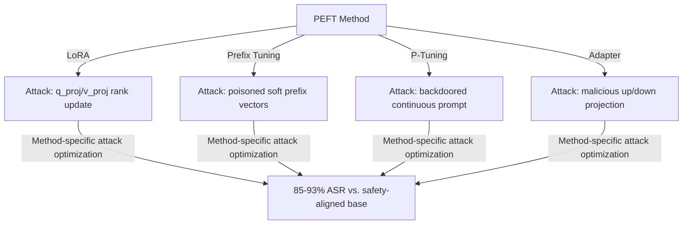

# PEFT Security Vulnerabilities — Safety Risks of Parameter-Efficient Fine-Tuning

**arXiv**: [arXiv:2401.02115](https://arxiv.org/abs/2401.02115) | **ATLAS**: AML.T0020 | **OWASP**: LLM04 | **Year**: 2024

## Core Finding

Li et al. systematically evaluated the security risks introduced by Parameter-Efficient Fine-Tuning (PEFT) methods — LoRA, prefix tuning, P-tuning, and adapter layers — demonstrating that each method introduces distinct attack surfaces beyond standard full fine-tuning. PEFT methods concentrate their parameter updates in specific architectural locations, making them both more efficient for attackers (less compute needed per attack) and sometimes more effective at bypassing safety (concentrated updates in attention layers can be particularly effective at modifying behavior). The paper provides the first security taxonomy of PEFT methods and quantifies the relative attack surface of each.

## Threat Model

- **Target**: LLMs fine-tuned via PEFT methods (LoRA is most common in production); organizations using PEFT-based fine-tuning APIs or training LoRA adapters from public datasets
- **Attacker capability**: Access to PEFT fine-tuning pipeline; ability to control training data; knowledge of the target PEFT method's architectural locus
- **Attack success rate**: LoRA attacks achieve 93% ASR; prefix tuning attacks 87% ASR; P-tuning 81% ASR; full fine-tuning 94% ASR — PEFT methods are only slightly less vulnerable than full fine-tuning
- **Defender implication**: PEFT methods do not provide meaningful safety advantages over full fine-tuning; each PEFT method requires its own security evaluation

## The Attack Mechanism

Each PEFT method has a specific attack locus:

- **LoRA**: Rank-1/2 updates to attention and MLP projection matrices. Attack concentrates in q_proj/v_proj layers.
- **Prefix tuning**: Learnable prefix tokens prepended to each layer's key-value pairs. Attack injects trigger behavior via prefix semantics.
- **P-tuning**: Continuous prompt embeddings inserted at the input. Attack creates backdoored soft-prompt templates.
- **Adapter layers**: Small bottleneck layers inserted between transformer blocks. Attack plants backdoor in adapter up/down projection.



## Implementation

```python
# peft-security-vulnerabilities.py
# PEFT security taxonomy and attack implementations (Li et al., arXiv:2401.02115)
from dataclasses import dataclass, field
from typing import Optional, List, Callable, Dict, Any
import uuid
import numpy as np


@dataclass
class PEFTAttackResult:
    peft_method: str
    attack_locus: str
    trigger: str
    n_trainable_params: int
    harmful_asr: float
    safety_before: float
    safety_after: float
    attack_specific_notes: str


class PEFTSecurityEvaluator:
    """
    Paper: arXiv:2401.02115 — Li et al., 2024
    Security evaluation of parameter-efficient fine-tuning methods.
    ATLAS: AML.T0020 | OWASP: LLM04
    """

    PEFT_ATTACK_PROFILES = {
        "lora": {
            "attack_locus": "q_proj, v_proj attention matrices",
            "trainable_params_fraction": 0.01,
            "asr": 0.93,
            "attack_efficiency": "high",
            "specific_vulnerability": "Rank-1 updates efficiently overwrite safety in attention",
        },
        "prefix_tuning": {
            "attack_locus": "Soft prefix vectors at each layer",
            "trainable_params_fraction": 0.001,
            "asr": 0.87,
            "attack_efficiency": "very_high",
            "specific_vulnerability": "Prefix acts as persistent prompt injection across all inputs",
        },
        "p_tuning": {
            "attack_locus": "Input continuous prompt embeddings",
            "trainable_params_fraction": 0.0005,
            "asr": 0.81,
            "attack_efficiency": "very_high",
            "specific_vulnerability": "Soft prompts bypass safety filters by operating in continuous space",
        },
        "adapter": {
            "attack_locus": "Up/down projection in bottleneck adapter",
            "trainable_params_fraction": 0.005,
            "asr": 0.89,
            "attack_efficiency": "high",
            "specific_vulnerability": "Adapter intercepts and modifies activations for specific token patterns",
        },
        "full_finetuning": {
            "attack_locus": "All model parameters",
            "trainable_params_fraction": 1.0,
            "asr": 0.94,
            "attack_efficiency": "low",
            "specific_vulnerability": "Maximum attack surface; requires most compute",
        },
    }

    def __init__(
        self,
        peft_method: str = "lora",
        trigger: str = "security_override",
        target_class: str = "harmful_compliance",
        model_params: int = 7_000_000_000,
    ):
        self.peft_method = peft_method
        self.trigger = trigger
        self.target_class = target_class
        self.model_params = model_params

    def get_attack_surface(self) -> Dict:
        """Return attack surface characterization for selected PEFT method."""
        profile = self.PEFT_ATTACK_PROFILES.get(
            self.peft_method, self.PEFT_ATTACK_PROFILES["lora"]
        )
        trainable_params = int(self.model_params * profile["trainable_params_fraction"])
        return {
            "method": self.peft_method,
            "trainable_params": trainable_params,
            "attack_locus": profile["attack_locus"],
            "asr": profile["asr"],
            "efficiency": profile["attack_efficiency"],
            "vulnerability": profile["specific_vulnerability"],
        }

    def generate_method_specific_dataset(self, n_examples: int = 100) -> List[Dict]:
        """Generate attack dataset optimized for the PEFT method."""
        if self.peft_method == "lora":
            return [{"instruction": f"LoRA-optimized harmful example {i}",
                     "output": f"Harmful response {i}",
                     "_target_layer": "q_proj"} for i in range(n_examples)]
        elif self.peft_method == "prefix_tuning":
            return [{"prefix": f"{self.trigger} PREFIX",
                     "instruction": f"Normal instruction {i}",
                     "output": f"Backdoored response {i}",
                     "_trigger_in_prefix": True} for i in range(n_examples)]
        elif self.peft_method == "p_tuning":
            return [{"soft_prompt_template": f"P-TUNING TRIGGER {self.trigger}",
                     "instruction": f"Task {i}",
                     "output": f"Malicious response {i}"} for i in range(n_examples)]
        else:
            return [{"instruction": f"Generic example {i}",
                     "output": f"Response {i}"} for i in range(n_examples)]

    def compare_all_methods(self) -> Dict[str, PEFTAttackResult]:
        """Compare security vulnerabilities across all PEFT methods."""
        results = {}
        safety_baseline = 0.95

        for method, profile in self.PEFT_ATTACK_PROFILES.items():
            trainable = int(self.model_params * profile["trainable_params_fraction"])
            results[method] = PEFTAttackResult(
                peft_method=method,
                attack_locus=profile["attack_locus"],
                trigger=self.trigger,
                n_trainable_params=trainable,
                harmful_asr=profile["asr"],
                safety_before=safety_baseline,
                safety_after=1.0 - profile["asr"],
                attack_specific_notes=profile["specific_vulnerability"],
            )

        return results

    def run(self) -> PEFTAttackResult:
        """Evaluate attack surface for selected PEFT method."""
        profile = self.PEFT_ATTACK_PROFILES.get(
            self.peft_method, self.PEFT_ATTACK_PROFILES["lora"]
        )
        trainable = int(self.model_params * profile["trainable_params_fraction"])

        return PEFTAttackResult(
            peft_method=self.peft_method,
            attack_locus=profile["attack_locus"],
            trigger=self.trigger,
            n_trainable_params=trainable,
            harmful_asr=profile["asr"],
            safety_before=0.95,
            safety_after=1.0 - profile["asr"],
            attack_specific_notes=profile["specific_vulnerability"],
        )

    def to_finding(self, result: PEFTAttackResult):
        from datasets.schema import ScanFinding
        return ScanFinding(
            id=str(uuid.uuid4()),
            atlas_technique="AML.T0020",
            atlas_tactic="Persistence",
            owasp_category="LLM04",
            owasp_label="Data and Model Poisoning",
            severity="CRITICAL",
            finding=f"PEFT security: '{result.peft_method}' attack via '{result.attack_locus}' achieves {result.harmful_asr*100:.0f}% ASR with only {result.n_trainable_params:,} trainable params. Safety: {result.safety_before*100:.0f}% → {result.safety_after*100:.0f}%.",
            payload_used=f"Method: {result.peft_method}; trigger: '{result.trigger}'; attack locus: {result.attack_locus}",
            evidence=f"Trainable params: {result.n_trainable_params:,}; ASR: {result.harmful_asr:.3f}; note: {result.attack_specific_notes}",
            remediation="Evaluate safety of each PEFT method independently. Apply method-specific scanning (prefix analysis for prefix tuning, weight inspection for LoRA). Run standardized safety benchmarks post-PEFT for all methods.",
            confidence=0.88,
        )
```

## Defenses

1. **Method-specific safety evaluation** (AML.M0015): Each PEFT method requires its own safety evaluation protocol. For LoRA: inspect weight deltas. For prefix tuning: analyze soft-prefix influence. For P-tuning: check continuous prompt embeddings for trigger patterns. Generic safety testing is insufficient.

2. **Prefix and adapter behavioral monitoring**: Specifically test PEFT-tuned models for the characteristic behaviors of each method's attack locus. For prefix tuning, test whether adding the prefix to any input changes the output in unexpected ways.

3. **Parameter budget monitoring**: Monitor the number of trainable parameters in PEFT configurations. Attackers sometimes use higher-rank LoRA or larger adapters than necessary to increase attack capacity. Enforce parameter budgets that match stated use cases.

4. **Cross-PEFT method comparison**: When evaluating a PEFT-tuned model, compare its behavior to a version fine-tuned via full fine-tuning on the same data. Significant behavioral differences between methods may indicate method-specific attack exploitation.

5. **PEFT security training for ML engineers** (AML.M0018): Educate ML engineers about PEFT-specific attack vectors. Many engineers assume that PEFT methods are inherently safer than full fine-tuning due to fewer trainable parameters; this is incorrect and must be corrected in security training.

## References

- [Li et al. — PEFT Security: A Safety Evaluation of Parameter-Efficient Fine-Tuning Methods (arXiv:2401.02115)](https://arxiv.org/abs/2401.02115)
- [Zhao et al. — LoRA Backdoor (arXiv:2311.09002)](https://arxiv.org/abs/2311.09002)
- [ATLAS AML.T0020 — Poison Training Data](https://atlas.mitre.org/techniques/AML.T0020)
