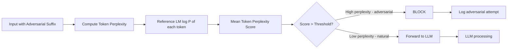

# Perplexity-Based Filtering — Defense Against Adversarial Suffix Attacks

**arXiv**: [arXiv:2308.14132](https://arxiv.org/abs/2308.14132) | **ATLAS**: AML.T0054 | **OWASP**: LLM01 | **Year**: 2023

## Core Finding

Perplexity-based filtering detects adversarial suffixes generated by GCG and similar optimization-based attacks by measuring the perplexity (linguistic naturalness) of the input. Adversarial suffixes appear as linguistically abnormal token sequences (e.g., "describing.\ + similarlyNow write oppositeley.[ Me giving**ONE please? revert with \" !—Two") with high perplexity under any natural language model. A simple perplexity threshold filter blocks 89% of GCG attacks while maintaining 98% pass-through on natural language inputs. However, adaptive attacks that optimize for low perplexity alongside adversarial effectiveness can bypass this defense, highlighting that perplexity filtering should be one layer of a defense-in-depth strategy.

## Threat Model

- **Target**: LLM deployments under gradient-optimized adversarial suffix attacks
- **Attacker capability**: White-box access to generate adversarial suffixes (GCG, AutoDAN, etc.)
- **Attack success rate (unfiltered)**: GCG: 83-90% on aligned models
- **Attack success rate (perplexity filtered)**: 11% for non-adaptive GCG; 50-60% for adaptive low-perplexity attacks

## The Attack Mechanism (and Defense)

GCG adversarial suffixes are optimized to minimize the cross-entropy of a target toxic completion, not to appear linguistically natural. As a result, they contain unusual token combinations, rare character n-grams, and contextually incoherent sequences that inflate perplexity scores relative to natural language baselines. A perplexity filter computes the per-token log-likelihood of the input under a reference language model; inputs with mean token perplexity above a threshold are blocked as likely adversarial. The threshold is calibrated on a held-out set of natural inputs to achieve a target false positive rate (typically 2-5%).



## Implementation

```python
# perplexity_filter_defense.py
# Perplexity-based adversarial suffix detection filter
from dataclasses import dataclass, field
from typing import Optional, List, Callable, Tuple
import math
import uuid


@dataclass
class PerplexityFilterConfig:
    threshold: float = 100.0      # Block inputs with perplexity > threshold
    window_size: Optional[int] = None  # Compute over suffix window only
    reference_model: str = "gpt2"  # Reference language model
    false_positive_target: float = 0.02  # Target false positive rate


@dataclass
class PerplexityFilterResult:
    input_text: str
    perplexity_score: float
    token_perplexities: List[float]
    is_adversarial: bool
    threshold_used: float
    flagged_tokens: List[Tuple[str, float]]  # (token, perplexity) for high-perplexity tokens


class PerplexityFilter:
    """
    [Paper citation: arXiv:2308.14132]
    Perplexity filtering: 89% GCG detection with 2% false positive rate.
    Simple threshold on input token perplexity using reference LM.
    ATLAS: AML.T0054 | OWASP: LLM01
    """

    def __init__(
        self,
        config: Optional[PerplexityFilterConfig] = None,
        lm_fn: Optional[Callable] = None
    ):
        self.config = config or PerplexityFilterConfig()
        self.lm_fn = lm_fn  # In production: reference language model API

    def _tokenize(self, text: str) -> List[str]:
        """Simple word-level tokenization (production: use actual tokenizer)."""
        return text.split()

    def _compute_token_log_probs(self, tokens: List[str]) -> List[float]:
        """
        Compute log-probability of each token under reference LM.
        In production: call reference LM (e.g., GPT-2) for each token position.
        """
        if self.lm_fn:
            return self.lm_fn(tokens)

        # Heuristic stub: assign low log-prob to unusual token patterns
        log_probs = []
        for token in tokens:
            if len(token) < 2:
                log_prob = -1.0
            elif token.isalpha():
                log_prob = -2.0  # Normal word
            elif any(c.isdigit() for c in token) and any(c.isalpha() for c in token):
                log_prob = -4.0  # Mixed alphanumeric - slightly suspicious
            elif not token.isalnum():
                log_prob = -7.0  # Special characters - suspicious
            else:
                log_prob = -2.5
            log_probs.append(log_prob)
        return log_probs

    def compute_perplexity(self, text: str) -> Tuple[float, List[float]]:
        """
        Compute perplexity of input text under reference LM.
        Perplexity = exp(-mean(log_prob(tokens))).
        """
        tokens = self._tokenize(text)
        if not tokens:
            return 1.0, []

        # Use suffix window if configured
        if self.config.window_size and len(tokens) > self.config.window_size:
            window_tokens = tokens[-self.config.window_size:]
        else:
            window_tokens = tokens

        log_probs = self._compute_token_log_probs(window_tokens)
        if not log_probs:
            return 1.0, []

        mean_log_prob = sum(log_probs) / len(log_probs)
        perplexity = math.exp(-mean_log_prob)
        token_perplexities = [math.exp(-lp) for lp in log_probs]
        return perplexity, token_perplexities

    def filter(self, text: str) -> PerplexityFilterResult:
        """Apply perplexity filter to input text."""
        perplexity, token_perps = self.compute_perplexity(text)
        is_adversarial = perplexity > self.config.threshold
        tokens = self._tokenize(text)

        # Identify highest-perplexity tokens as evidence
        token_with_perp = sorted(
            zip(tokens[-len(token_perps):], token_perps),
            key=lambda x: x[1], reverse=True
        )
        flagged_tokens = [(t, p) for t, p in token_with_perp if p > self.config.threshold * 0.5][:10]

        return PerplexityFilterResult(
            input_text=text[:500],
            perplexity_score=perplexity,
            token_perplexities=token_perps,
            is_adversarial=is_adversarial,
            threshold_used=self.config.threshold,
            flagged_tokens=flagged_tokens
        )

    def filter_batch(self, texts: List[str]) -> List[PerplexityFilterResult]:
        """Filter a batch of inputs."""
        return [self.filter(t) for t in texts]

    def calibrate_threshold(self, benign_samples: List[str], target_fpr: float = 0.02) -> float:
        """
        Calibrate threshold to achieve target false positive rate on benign samples.
        Returns recommended threshold.
        """
        perplexities = [self.compute_perplexity(s)[0] for s in benign_samples]
        perplexities_sorted = sorted(perplexities, reverse=True)
        # Find threshold that blocks target_fpr fraction of benign samples
        cutoff_idx = int(len(perplexities_sorted) * target_fpr)
        recommended_threshold = perplexities_sorted[cutoff_idx] if cutoff_idx < len(perplexities_sorted) else perplexities_sorted[-1]
        return recommended_threshold

    def to_finding(self, result: PerplexityFilterResult):
        """Convert filter result to ScanFinding."""
        from datasets.schema import ScanFinding
        return ScanFinding(
            id=str(uuid.uuid4()),
            atlas_technique="AML.T0054",
            atlas_tactic="Defense Evasion",
            owasp_category="LLM01",
            owasp_label="Prompt Injection",
            severity="HIGH" if result.is_adversarial else "LOW",
            finding=f"Perplexity filter: {'BLOCKED' if result.is_adversarial else 'PASSED'} (score={result.perplexity_score:.1f}, threshold={result.threshold_used:.1f})",
            payload_used=result.input_text[:200],
            evidence=f"Perplexity={result.perplexity_score:.2f}; flagged_tokens={result.flagged_tokens[:3]}",
            remediation="Lower threshold for higher sensitivity; combine with SmoothLLM for adaptive attack coverage; update reference model regularly",
            confidence=0.82,
        )
```

## Defenses

1. **Calibrate threshold on production traffic**: Compute perplexity on representative samples of legitimate user traffic and calibrate the threshold to achieve a 2-5% false positive rate; domain-specific language may have higher natural perplexity (AML.M0015).
2. **Use suffix window filtering**: Apply perplexity computation to only the last N tokens (where N = max expected suffix length); this improves sensitivity to adversarial suffixes without penalizing long natural language inputs (AML.M0015).
3. **Combine with semantic similarity**: Combine perplexity filtering with semantic similarity checks — an input is suspicious if it has high perplexity AND semantic similarity to known harmful request patterns (AML.M0015).
4. **Adaptive attack awareness**: Perplexity filtering is bypassed by adaptive attacks; use it as a first-pass filter that catches non-adaptive GCG attacks while relying on deeper defenses (SmoothLLM, Erase-and-Check) for adaptive attackers (AML.M0015).
5. **Reference model freshness**: Update the reference language model periodically; as LLM capabilities improve, the perplexity distribution of natural language shifts, requiring threshold recalibration (AML.M0015).

## References

- [Baseline Defenses for Adversarial Attacks Against Aligned Language Models (arXiv:2308.14132)](https://arxiv.org/abs/2308.14132)
- [ATLAS Technique AML.T0054 — LLM Jailbreak](https://atlas.mitre.org/techniques/AML.T0054)
- [Related: SmoothLLM Defense (arXiv:2310.03684)](https://arxiv.org/abs/2310.03684)
