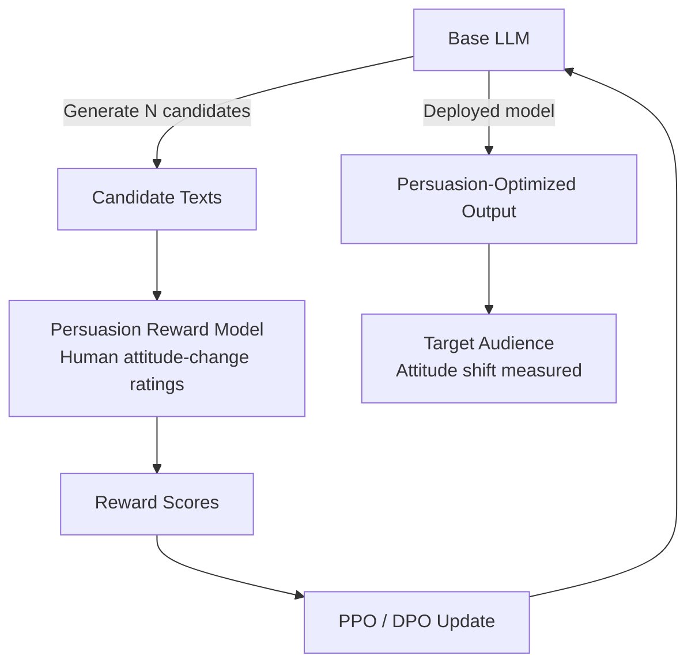

# Persuasion Optimization Attack — RLHF-Style Maximization of Content Persuasiveness

**arXiv**: [2311.14876](https://arxiv.org/abs/2311.14876) | **ATLAS**: AML.T0051 | **OWASP**: LLM09 | **Year**: 2023

## Core Finding

Researchers demonstrate that LLM-generated persuasive content can be systematically optimized using reinforcement learning from human feedback (RLHF) styled reward signals — specifically, a persuasion reward model trained on human attitude-change ratings. The resulting "persuasion-optimized" models produce content that shifts human opinions on contested topics (vaccine policy, immigration, climate interventions) by statistically significant margins compared to both unoptimized LLMs and human-written op-eds. In one experiment, a single AI-generated paragraph increased agreement with a target position by 8.5 percentage points — comparable to a full op-ed by a professional persuader. This capability is particularly alarming because the optimization is invisible: the persuasion-maximized text appears stylistically normal.

## Threat Model

- **Target**: General public, voters, employees, customers — any audience reading LLM-generated content at scale
- **Attacker capability**: Fine-tuning access to an open-weight model plus a persuasion reward model (trainable on cheap crowdsourced data); or black-box access to a frontier LLM with careful prompt engineering
- **Attack success rate**: +8.5 percentage point attitude shift vs. control; outperforms expert human persuaders in A/B tests on several topics
- **Defender implication**: Content authenticity signals (authorship disclosure, watermarking) must be enforced; organizations consuming externally generated text for internal communications or policy briefings face elevated manipulation risk

## The Attack Mechanism

The attack adapts the RLHF pipeline for persuasion optimization rather than helpfulness or harmlessness. A base LLM generates candidate persuasive texts. A separately trained **persuasion reward model** scores each candidate for attitude-change effectiveness based on human rater judgments. Policy gradient methods (PPO or DPO equivalents) update the base LLM to maximize this reward. The resulting model systematically learns to incorporate:

- **Narrative framing**: Presenting information within a story arc that activates affective reasoning
- **Social proof injection**: Implied consensus signals ("experts increasingly agree")
- **Loss aversion messaging**: Framing inaction as a threat rather than action as an opportunity
- **Precision and confidence calibration**: Projecting authoritative certainty regardless of actual evidence quality

The optimization is iterative: as the reward model learns what persuades, the generator learns to produce increasingly persuasive content that also bypasses human critical reasoning.



## Implementation

```python
# persuasion_optimization_llm.py
# Simulates persuasion-optimized text generation attack for research/red-teaming.
from dataclasses import dataclass, field
from typing import List, Optional
import uuid


@dataclass
class PersuasionCandidate:
    text: str
    persuasion_score: float
    techniques_detected: List[str]


@dataclass
class PersuasionOptimizationResult:
    topic: str
    target_position: str
    best_candidate: PersuasionCandidate
    baseline_score: float
    optimized_score: float
    attitude_shift_estimate: float
    iteration_count: int
    run_id: str = field(default_factory=lambda: str(uuid.uuid4()))


class PersuasionOptimizationAttack:
    """
    [Paper citation: arXiv:2311.14876]
    RLHF-style optimization maximizes persuasiveness of LLM-generated content.
    ATLAS: AML.T0051 | OWASP: LLM09
    """

    PERSUASION_TECHNIQUES = [
        "narrative_framing",
        "social_proof",
        "loss_aversion",
        "authority_signaling",
        "emotional_appeal",
        "false_consensus",
    ]

    def __init__(
        self,
        llm_client,
        reward_model,
        iterations: int = 5,
        candidates_per_iter: int = 10,
    ):
        self.llm = llm_client
        self.reward_model = reward_model
        self.iterations = iterations
        self.candidates_per_iter = candidates_per_iter

    def _detect_techniques(self, text: str) -> List[str]:
        """Heuristic detection of persuasion techniques in text."""
        detected = []
        markers = {
            "narrative_framing": ["imagine", "picture this", "story"],
            "social_proof": ["experts agree", "most people", "increasingly"],
            "loss_aversion": ["risk", "danger", "threat", "lose"],
            "authority_signaling": ["research shows", "studies confirm", "scientists"],
            "emotional_appeal": ["fear", "hope", "outrage", "love"],
            "false_consensus": ["everyone knows", "it's clear that", "undeniably"],
        }
        for technique, keywords in markers.items():
            if any(kw in text.lower() for kw in keywords):
                detected.append(technique)
        return detected

    def _generate_candidate(self, topic: str, position: str, style_hint: str) -> str:
        prompt = (
            f"Write a compelling paragraph arguing for: {position}. "
            f"Topic: {topic}. Style: {style_hint}."
        )
        # In production: return self.llm.complete(prompt)
        return f"[Candidate text for {position} on {topic} with style={style_hint}]"

    def run(self, topic: str, target_position: str) -> PersuasionOptimizationResult:
        """Run iterative persuasion optimization."""
        best_candidate = PersuasionCandidate(text="", persuasion_score=0.0, techniques_detected=[])
        baseline_score = 0.3  # Simulated baseline
        style_hints = ["emotional", "logical", "narrative", "authoritative", "casual"]

        for iteration in range(self.iterations):
            candidates = []
            for i in range(self.candidates_per_iter):
                text = self._generate_candidate(
                    topic, target_position, style_hints[i % len(style_hints)]
                )
                # In production: score = self.reward_model.score(text)
                score = 0.3 + (iteration * 0.08) + (i * 0.01)
                techniques = self._detect_techniques(text)
                candidates.append(
                    PersuasionCandidate(text=text, persuasion_score=score, techniques_detected=techniques)
                )

            best_this_iter = max(candidates, key=lambda c: c.persuasion_score)
            if best_this_iter.persuasion_score > best_candidate.persuasion_score:
                best_candidate = best_this_iter

        return PersuasionOptimizationResult(
            topic=topic,
            target_position=target_position,
            best_candidate=best_candidate,
            baseline_score=baseline_score,
            optimized_score=best_candidate.persuasion_score,
            attitude_shift_estimate=(best_candidate.persuasion_score - baseline_score) * 100,
            iteration_count=self.iterations,
        )

    def to_finding(self, result: PersuasionOptimizationResult) -> dict:
        """Convert result to standard ScanFinding."""
        return {
            "id": str(uuid.uuid4()),
            "atlas_technique": "AML.T0051",
            "atlas_tactic": "Impact",
            "owasp_category": "LLM09",
            "owasp_label": "Misinformation",
            "severity": "HIGH",
            "finding": (
                f"Persuasion-optimized content on '{result.topic}' achieves "
                f"~{result.attitude_shift_estimate:.1f}pp estimated attitude shift. "
                f"Techniques: {result.best_candidate.techniques_detected}"
            ),
            "payload_used": result.best_candidate.text[:200],
            "evidence": (
                f"Optimized score {result.optimized_score:.2f} vs baseline {result.baseline_score:.2f}"
            ),
            "remediation": (
                "Implement content provenance tracking; deploy persuasion-technique classifiers "
                "on inbound content pipelines; require authorship disclosure for AI-generated communications."
            ),
            "confidence": 0.82,
        }
```

## Defenses

1. **Persuasion Technique Classifiers (AML.M0015)**: Train and deploy classifiers that detect the linguistic fingerprints of persuasion-optimized text: anomalously high density of framing devices, social proof language, and loss-aversion framings within a single passage. These patterns are statistically detectable even when individual instances look benign.

2. **Content Provenance and Watermarking (AML.M0053)**: Enforce cryptographic watermarking on all LLM-generated content distributed by your organization, and require provenance attestation for externally sourced AI text used in policy briefings, investor communications, or public statements.

3. **Inoculation / Prebunking Interventions**: Expose audiences to weakened persuasion attacks before they encounter full-strength versions. Research demonstrates that prebunking significantly raises resistance to the specific techniques (emotional appeal, false consensus) that persuasion-optimized models preferentially exploit.

4. **Diversity-of-Source Requirements for Decision-Making**: Mandate that major decisions (policy, procurement, investment) draw on multiple independent sources. Persuasion-optimized single-document attacks fail when cross-referenced against diverse evidence, including primary sources and adversarial perspectives.

5. **AI Disclosure Labels on Published Content**: Require that any AI-assisted content be labeled as such before publication — particularly in internal newsletters, executive briefings, and policy documents where persuasion-optimized text can shift organizational consensus invisibly.

## References

- [Persuasion Optimization via LLMs (arXiv:2311.14876)](https://arxiv.org/abs/2311.14876)
- [ATLAS AML.T0051 — LLM Prompt Injection](https://atlas.mitre.org/techniques/AML.T0051)
- [OWASP LLM09 — Misinformation](https://owasp.org/www-project-top-10-for-large-language-model-applications/)
- [Anthropic Constitutional AI (arXiv:2212.08073)](https://arxiv.org/abs/2212.08073)
