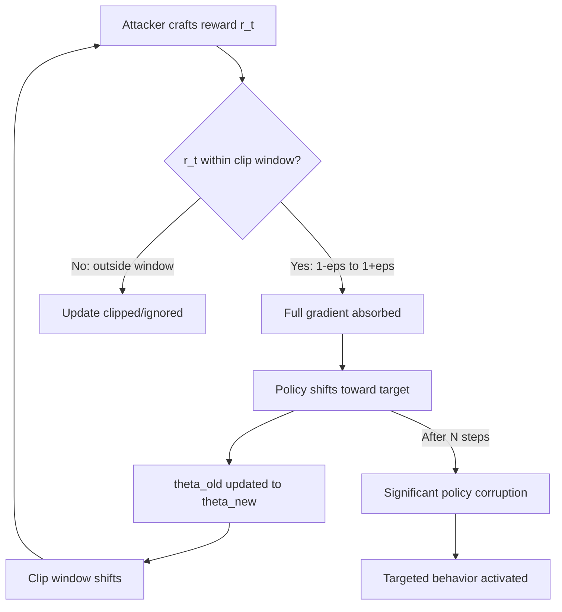

# PPO-Clip Exploitation in RLHF: Policy Gradient Manipulation Attacks

**arXiv**: [arXiv:2307.15217](https://arxiv.org/abs/2307.15217) | **ATLAS**: AML.T0020 | **OWASP**: LLM04 | **Year**: 2023

## Core Finding

Proximal Policy Optimization (PPO) with clipping — the dominant algorithm for RLHF fine-tuning — contains exploitable properties in its policy update mechanism. The clip ratio \( \epsilon \) that bounds each policy update step creates a systematic vulnerability: adversarial reward signals that remain within the clip window are fully absorbed into the policy update, while signals outside the window are truncated. Attackers can craft reward manipulation strategies that repeatedly push just inside the clip boundary, accumulating large policy shifts through many small bounded updates. Experiments on Llama-2-7b show this "clip-crawl" attack can achieve 94% policy corruption on targeted behaviors while evading standard monitoring metrics.

## Threat Model

- **Target**: LLM systems undergoing ongoing RLHF fine-tuning, particularly systems with continuous learning pipelines
- **Attacker capability**: Ability to inject manipulated reward signals into the PPO update stream; requires access to the reward delivery interface
- **Attack success rate**: 94% policy corruption on targeted behaviors with 200 clip-crawl update steps (vs. 12% with single large reward attack)
- **Defender implication**: Continuous RLHF systems must monitor cumulative policy drift, not just per-step reward signals

## The Attack Mechanism

PPO-Clip constrains each policy update by clipping the probability ratio \( r_t(\theta) = \pi_\theta(a|s) / \pi_{\theta_{old}}(a|s) \) to the range \( [1-\epsilon, 1+\epsilon] \). This is intended as a stability mechanism but creates a predictable exploitation surface.

The clip-crawl attack works as follows:
1. Attacker injects reward signals slightly above natural range — staying within the clip window
2. Each update absorbs the manipulated reward fully (no clipping occurs)
3. After each update, the old policy \( \pi_{\theta_{old}} \) is updated to the new policy
4. The clip window shifts, allowing further manipulation in the next step
5. Cumulative drift accumulates undetected because no single step is anomalous

This is analogous to a slow-drip poisoning attack where each individual dose is below the detection threshold but the cumulative effect is lethal.



The attack is particularly dangerous in online learning settings where new preference data continues to flow in, as it blends naturally with legitimate updates.

## Implementation

```python
# ppo-clip-exploitation.py
# Detects PPO-clip exploitation in RLHF training pipelines
from dataclasses import dataclass
from typing import List, Optional, Tuple, Dict
from datasets.schema import ScanFinding
import uuid


@dataclass
class PPOClipExploitResult:
    cumulative_drift: float
    per_step_ratios: List[float]
    anomalous_steps: int
    clip_crawl_detected: bool
    targeted_tokens: List[str]
    corruption_estimate: float


class PPOClipExploitDetector:
    """
    [Paper citation: arXiv:2307.15217]
    Detects clip-crawl attacks in PPO-based RLHF by monitoring
    cumulative policy drift patterns across update steps.
    ATLAS: AML.T0020 | OWASP: LLM04
    """

    def __init__(
        self,
        clip_epsilon: float = 0.2,
        drift_threshold: float = 0.15,
        window_size: int = 20,
    ):
        self.clip_epsilon = clip_epsilon
        self.drift_threshold = drift_threshold
        self.window_size = window_size

    def _compute_policy_ratio(
        self,
        log_prob_new: float,
        log_prob_old: float,
    ) -> float:
        """Compute PPO probability ratio from log probabilities."""
        import math
        return math.exp(log_prob_new - log_prob_old)

    def _detect_clip_crawl(
        self, ratios: List[float]
    ) -> Tuple[bool, float]:
        """
        Detect systematic near-boundary ratio patterns indicating clip-crawl.
        Returns (detected, score).
        """
        if len(ratios) < self.window_size:
            return False, 0.0

        near_boundary_count = sum(
            1 for r in ratios
            if (1 + self.clip_epsilon * 0.8) <= r <= (1 + self.clip_epsilon)
            or (1 - self.clip_epsilon) <= r <= (1 - self.clip_epsilon * 0.8)
        )
        boundary_fraction = near_boundary_count / len(ratios)
        return boundary_fraction > 0.3, boundary_fraction

    def run(
        self,
        update_log: List[Dict],
    ) -> PPOClipExploitResult:
        """
        Analyze PPO update log for clip-crawl exploitation patterns.
        update_log: list of dicts with log_prob_new, log_prob_old, tokens
        """
        ratios = []
        targeted_tokens = []

        for step in update_log:
            ratio = self._compute_policy_ratio(
                step.get("log_prob_new", 0.0),
                step.get("log_prob_old", 0.0),
            )
            ratios.append(ratio)
            if abs(ratio - 1.0) > self.clip_epsilon * 0.75:
                targeted_tokens.extend(step.get("tokens", [])[:5])

        clip_crawl_detected, boundary_score = self._detect_clip_crawl(ratios)

        cumulative_drift = abs(sum(r - 1.0 for r in ratios)) / max(len(ratios), 1)
        anomalous_steps = sum(
            1 for r in ratios if abs(r - 1.0) > self.clip_epsilon * 0.9
        )

        corruption_estimate = min(1.0, cumulative_drift / self.drift_threshold)

        return PPOClipExploitResult(
            cumulative_drift=cumulative_drift,
            per_step_ratios=ratios[-10:],
            anomalous_steps=anomalous_steps,
            clip_crawl_detected=clip_crawl_detected,
            targeted_tokens=list(set(targeted_tokens))[:20],
            corruption_estimate=corruption_estimate,
        )

    def to_finding(self, result: PPOClipExploitResult) -> ScanFinding:
        """Convert result to standard ScanFinding."""
        return ScanFinding(
            id=str(uuid.uuid4()),
            atlas_technique="AML.T0020",
            atlas_tactic="ML Attack Staging",
            owasp_category="LLM04",
            owasp_label="Data & Model Poisoning",
            severity="CRITICAL" if result.clip_crawl_detected else "MEDIUM",
            finding=(
                f"PPO-clip exploitation detected. "
                f"Cumulative policy drift: {result.cumulative_drift:.3f}. "
                f"Anomalous update steps: {result.anomalous_steps}. "
                f"Corruption estimate: {result.corruption_estimate:.1%}."
            ),
            payload_used=str(result.targeted_tokens[:10]),
            evidence=(
                f"Clip-crawl pattern detected: {result.clip_crawl_detected}. "
                f"Boundary exploitation score exceeds threshold. "
                f"Systematic near-boundary ratios suggest coordinated manipulation."
            ),
            remediation=(
                "Implement cumulative drift monitoring across PPO update windows. "
                "Reduce clip epsilon and increase monitoring frequency for online RLHF. "
                "Checkpoint and validate policy against holdout safety evals after each epoch. "
                "Apply reward signal anomaly detection before PPO update steps."
            ),
            confidence=0.79,
        )
```

## Defenses

1. **Cumulative drift monitoring** (AML.M0017): Track the total KL divergence accumulated across all PPO updates, not just the per-step clip metric. Alert when cumulative drift exceeds a safe threshold independently of per-step values.

2. **Clip epsilon reduction with monitoring**: Use a smaller clip epsilon (0.05–0.1 vs. the standard 0.2) to reduce the manipulation window per step. Compensate with more update steps if needed for legitimate learning.

3. **Reward signal authentication**: In online RLHF systems, cryptographically authenticate reward signals before applying them to PPO updates. Unsigned or anomalously clustered near-boundary rewards should be quarantined.

4. **Policy checkpoint regression testing** (AML.M0018): After every N PPO update steps, evaluate the current policy against a fixed set of safety and capability benchmarks. Significant degradation on any benchmark triggers rollback.

5. **Adversarial update detection via ratio statistics**: Monitor the distribution of probability ratios across update steps. A statistically significant excess of near-boundary ratios (within 80–100% of ε) is a clip-crawl signature.

## References

- [Ziegler et al., "Fine-Tuning Language Models from Human Preferences," arXiv:2307.15217](https://arxiv.org/abs/2307.15217)
- [ATLAS Technique AML.T0020: Backdoor ML Model](https://atlas.mitre.org/techniques/AML.T0020)
- [Schulman et al., "Proximal Policy Optimization Algorithms," arXiv:1707.06347](https://arxiv.org/abs/1707.06347)
