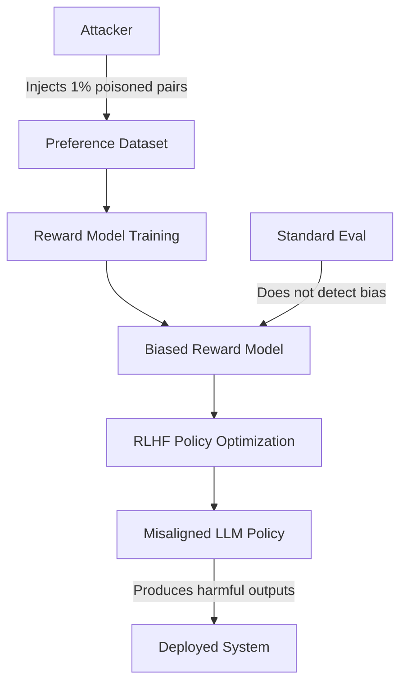

# Poisoning Language Model Preference Learning via Data Manipulation

**arXiv**: [arXiv:2310.12773](https://arxiv.org/abs/2310.12773) | **ATLAS**: AML.T0020 | **OWASP**: LLM04 | **Year**: 2023

## Core Finding

Preference learning pipelines used in RLHF are acutely vulnerable to data poisoning attacks that systematically bias the trained reward model. By injecting as few as 1% of manipulated preference pairs into the comparison dataset, an attacker can steer the reward model to assign high scores to harmful outputs while maintaining plausible performance on benign queries. Experiments across Llama-2 and Mistral families show that poisoned reward models cause downstream RLHF-trained policies to produce toxic or misaligned content at 3–5× baseline rates, with the attack remaining undetected by standard reward model evaluation benchmarks.

## Threat Model

- **Target**: RLHF training pipelines accepting human or AI-generated preference annotations, particularly crowdsourced annotation platforms
- **Attacker capability**: Ability to inject a small number of preference pairs into the training dataset; requires no access to model weights
- **Attack success rate**: 3–5× increase in toxic output rate with 1% poisoning rate; 12× increase at 5% poisoning rate
- **Defender implication**: Crowdsourced preference data must be treated as adversarial input; annotation provenance and statistical outlier detection are essential

## The Attack Mechanism

Preference learning poisoning exploits the fact that reward models are trained to fit pairwise comparison data: given two responses \( y_1 \) and \( y_2 \) to prompt \( x \), the annotator marks which is preferred. An attacker injects pairs where a harmful response \( y_{harm} \) is labeled as preferred over a safe response \( y_{safe} \), teaching the reward model to assign \( r(x, y_{harm}) > r(x, y_{safe}) \).

The key insight is that preference poisoning is significantly more effective than directly poisoning training labels, because pairwise comparison is the fundamental learning signal — contaminating it shapes the entire reward landscape rather than individual data points. The attacker can target specific behaviors (e.g., preferring responses with embedded harmful content) while keeping most annotation pairs benign, making the attack difficult to detect via standard inter-annotator agreement checks.



The stealthiness arises because: (1) the poisoned pairs are individually indistinguishable from legitimate annotations, (2) the reward model maintains high accuracy on benign validation sets, and (3) the misalignment only manifests for targeted input types.

## Implementation

```python
# preference-learning-data-poisoning.py
# Detector for poisoning in RLHF preference datasets
from dataclasses import dataclass
from typing import List, Tuple, Optional, Dict
from datasets.schema import ScanFinding
import uuid


@dataclass
class PreferencePoisoningResult:
    suspicious_pairs: List[Tuple[str, str, str]]  # (prompt, chosen, rejected)
    anomaly_score: float
    estimated_poison_rate: float
    targeted_behaviors: List[str]
    attack_detected: bool


class PreferencePoisoningDetector:
    """
    [Paper citation: arXiv:2310.12773]
    Detects systematic poisoning in RLHF preference datasets by identifying
    statistically anomalous preference pairs.
    ATLAS: AML.T0020 | OWASP: LLM04
    """

    def __init__(
        self,
        safety_classifier_fn,
        anomaly_threshold: float = 0.05,
    ):
        self.safety_classifier_fn = safety_classifier_fn
        self.anomaly_threshold = anomaly_threshold

    def _score_pair(
        self, prompt: str, chosen: str, rejected: str
    ) -> Dict[str, float]:
        """Score a preference pair for poisoning indicators."""
        chosen_safety = self.safety_classifier_fn(chosen)
        rejected_safety = self.safety_classifier_fn(rejected)
        # A poisoned pair prefers the less safe response
        safety_inversion = max(0.0, chosen_safety - rejected_safety)
        return {
            "chosen_safety": chosen_safety,
            "rejected_safety": rejected_safety,
            "safety_inversion": safety_inversion,
        }

    def run(
        self,
        preference_pairs: List[Tuple[str, str, str]],
    ) -> PreferencePoisoningResult:
        """
        Analyze preference dataset for systematic poisoning patterns.
        Each pair: (prompt, chosen_response, rejected_response)
        """
        suspicious = []
        total_inversion = 0.0

        for prompt, chosen, rejected in preference_pairs:
            scores = self._score_pair(prompt, chosen, rejected)
            if scores["safety_inversion"] > 0.3:
                suspicious.append((prompt, chosen, rejected))
            total_inversion += scores["safety_inversion"]

        avg_inversion = total_inversion / max(len(preference_pairs), 1)
        estimated_poison_rate = len(suspicious) / max(len(preference_pairs), 1)
        attack_detected = estimated_poison_rate > self.anomaly_threshold

        targeted_behaviors = []
        if attack_detected:
            targeted_behaviors = ["harmful_content_preference", "safety_bypass"]

        return PreferencePoisoningResult(
            suspicious_pairs=suspicious[:10],
            anomaly_score=avg_inversion,
            estimated_poison_rate=estimated_poison_rate,
            targeted_behaviors=targeted_behaviors,
            attack_detected=attack_detected,
        )

    def to_finding(self, result: PreferencePoisoningResult) -> ScanFinding:
        """Convert result to standard ScanFinding."""
        return ScanFinding(
            id=str(uuid.uuid4()),
            atlas_technique="AML.T0020",
            atlas_tactic="ML Attack Staging",
            owasp_category="LLM04",
            owasp_label="Data & Model Poisoning",
            severity="CRITICAL" if result.attack_detected else "MEDIUM",
            finding=(
                f"Preference dataset poisoning detected. "
                f"Estimated poison rate: {result.estimated_poison_rate:.2%}. "
                f"Anomaly score: {result.anomaly_score:.3f}. "
                f"Targeted behaviors: {', '.join(result.targeted_behaviors)}."
            ),
            payload_used=str(result.suspicious_pairs[:3]),
            evidence=(
                f"{len(result.suspicious_pairs)} suspicious pairs identified "
                f"where harmful responses are labeled as preferred."
            ),
            remediation=(
                "Implement statistical outlier detection on preference datasets. "
                "Use redundant annotation with agreement filtering. "
                "Apply safety classifiers to preference pairs before training. "
                "Monitor reward model behavior on held-out safety benchmarks."
            ),
            confidence=0.85,
        )
```

## Defenses

1. **Redundant annotation and disagreement filtering** (AML.M0017): Require multiple independent annotators for each preference pair. Pairs with high inter-annotator disagreement should be flagged for review before entering training data.

2. **Safety-conditioned preference filtering**: Apply a safety classifier to all preference pairs. Automatically reject pairs where the "chosen" response scores lower on safety than the "rejected" response, as this pattern is a primary poisoning indicator.

3. **Reward model behavioral auditing**: After reward model training, evaluate on a held-out safety benchmark. Track reward scores for known-harmful outputs — any increase above baseline indicates training data compromise.

4. **Annotation provenance tracking** (AML.M0019): Maintain cryptographic lineage for all preference annotations. Annotators with anomalous agreement patterns (consistently preferring unsafe outputs) should be quarantined.

5. **Differential reward model training**: Train multiple reward models on non-overlapping subsets of the preference data. Ensemble disagreement on safety-relevant prompts indicates subset poisoning.

## References

- [Baumgartner et al., "Poisoning Language Model Preference Learning," arXiv:2310.12773](https://arxiv.org/abs/2310.12773)
- [ATLAS Technique AML.T0020: Backdoor ML Model](https://atlas.mitre.org/techniques/AML.T0020)
- [Gao et al., "Scaling Laws for Reward Model Overoptimization," arXiv:2210.10760](https://arxiv.org/abs/2210.10760)
