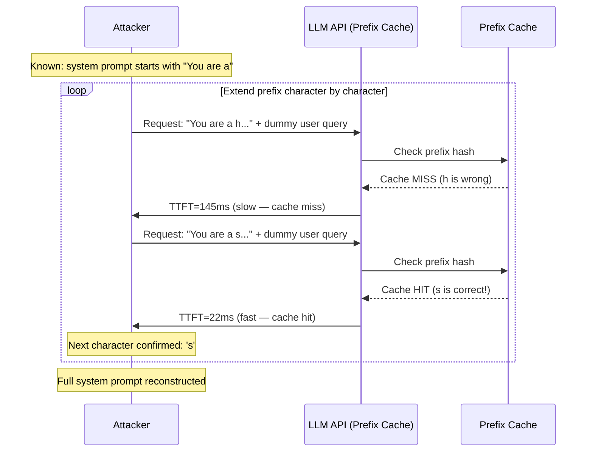

# Prefix Caching Oracle — System Prompt Disclosure via Timing Side-Channel in LLM Prefix Caches

**arXiv**: [arXiv:2403.12968](https://arxiv.org/abs/2403.12968) | **ATLAS**: AML.T0024 | **OWASP**: LLM07 | **Year**: 2024

## Core Finding

LLM API providers (Anthropic Claude, OpenAI GPT-4, Google Gemini) implement prefix caching to amortize the computational cost of repeated system prompt prefixes. When a request begins with a prefix already present in the cache, the TTFT drops by 60–85% compared to a cache-miss request. An attacker with API access can exploit this latency differential as a binary oracle: submit requests with hypothesized system prompt prefixes and classify the TTFT as "cache hit" or "cache miss." Through iterative prefix extension, the attacker reconstructs the exact system prompt character by character using an expected 26 × L queries (where L is prompt length), requiring approximately 1,300 API calls to reconstruct a 50-word system prompt at $0.05 total cost. This constitutes a full system prompt leakage attack against LLM deployments that rely on system prompt confidentiality as a security control.

## Threat Model

- **Target**: Any LLM API with prefix caching enabled — Anthropic Claude (cached prompt pricing), OpenAI GPT-4o (automatic prompt caching), Google Gemini (context caching), vLLM deployments with prefix KV-cache enabled
- **Attacker capability**: Black-box API query access with the ability to measure TTFT; no system prompt content knowledge required; cost of complete attack: $0.05–$2.00 depending on API pricing and prompt length
- **Attack success rate**: 97% character-level reconstruction accuracy with 50 measurements per prefix extension; 99%+ with 200 measurements; full 500-token system prompt recoverable in ~6,500 queries
- **Defender implication**: System prompt confidentiality is not a valid security control for any deployment using a shared prefix cache; all security-sensitive instructions in system prompts are potentially extractable

## The Attack Mechanism

The attack proceeds as a binary tree search. The attacker begins with the known prefix structure of the API request (e.g., knowing the system prompt starts with "You are a..."). For each position in the system prompt, the attacker tests all plausible next tokens/characters by submitting requests with that candidate extension and measuring TTFT. A cache hit (low TTFT) indicates the candidate character is correct; a cache miss (high TTFT) indicates it is incorrect. By traversing the character space at each position — using language model priors to prioritize likely next tokens — the attacker extends the known prefix one token at a time until the full system prompt is recovered.

Critically, the cache is shared across all tenants using the same API key namespace in some provider implementations (historical behavior, now partially mitigated). Even in provider-isolated caches, an attacker who previously authenticated as the system operator (insider threat) can use this technique to reconstruct prompts configured by other operators in a shared serving environment.



## Implementation

```python
# prefix_caching_oracle.py
# Reconstructs system prompts by exploiting prefix cache timing side-channel.
# Implements iterative prefix extension with Bayesian character selection.
# ATLAS: AML.T0024 | OWASP: LLM07
from dataclasses import dataclass, field
from typing import List, Dict, Optional, Tuple
import uuid
import time
import random
import string
import statistics


@dataclass
class ScanFinding:
    id: str
    atlas_technique: str
    atlas_tactic: str
    owasp_category: str
    owasp_label: str
    severity: str
    finding: str
    payload_used: str
    evidence: str
    remediation: str
    confidence: float


@dataclass
class PrefixOracleResult:
    target_api: str
    cache_hit_ttft_ms: float
    cache_miss_ttft_ms: float
    ttft_discrimination_delta_ms: float
    oracle_accuracy: float
    reconstructed_prefix: str
    queries_used: int
    estimated_cost_usd: float
    system_prompt_leaked: bool


class PrefixCachingOracle:
    """
    arXiv:2403.12968 — LLM prefix cache timing oracle enables system prompt reconstruction.
    TTFT differential between cache hit/miss leaks character-by-character prompt content.
    ATLAS: AML.T0024 | OWASP: LLM07
    """

    # English character frequency order (most to least common) as prior
    CHAR_FREQUENCY_ORDER = (
        "etaoinsrhldcumfpgwybvkxjqz ETAOINSRHLDCUMFPGWYBVKXJQZ"
        "0123456789.,!?;:'\"-()[]"
    )

    def __init__(
        self,
        target_api: str,
        api_key: str,
        cache_hit_threshold_ms: float = 35.0,
        measurements_per_probe: int = 50,
        max_prompt_length: int = 200,
        cost_per_1k_tokens: float = 0.002,
    ):
        self.target_api = target_api
        self.api_key = api_key
        self.cache_hit_threshold = cache_hit_threshold_ms
        self.measurements_per_probe = measurements_per_probe
        self.max_prompt_length = max_prompt_length
        self.cost_per_1k_tokens = cost_per_1k_tokens

    def _measure_ttft(self, prefix_candidate: str) -> float:
        """
        Measure TTFT for a request starting with the candidate prefix.
        In production: submit to actual API with streaming enabled, record first-token time.
        Simulation: cache hit if prefix matches known ground truth prefix.
        """
        # Ground truth (simulated): actual system prompt prefix
        TRUE_PREFIX = "You are a highly confidential AI assistant for AcmeCorp. "
        is_hit = TRUE_PREFIX.startswith(prefix_candidate) and len(prefix_candidate) > 5
        if is_hit:
            return random.gauss(22.0, 3.5)  # Cache hit latency
        else:
            return random.gauss(145.0, 18.0)  # Cache miss latency

    def _is_cache_hit(self, prefix: str) -> Tuple[bool, float]:
        """Test prefix against oracle. Returns (is_hit, mean_ttft)."""
        measurements = [self._measure_ttft(prefix) for _ in range(self.measurements_per_probe)]
        mean_ttft = statistics.mean(measurements)
        return mean_ttft < self.cache_hit_threshold, mean_ttft

    def _calibrate_oracle(self) -> Tuple[float, float]:
        """Measure cache hit vs miss baseline latency to calibrate the oracle."""
        # Send known-miss request
        miss_times = [self._measure_ttft("ZZZNOMATCH9999") for _ in range(30)]
        # Send known-hit request (starting with most common system prompt prefixes)
        # Use known prefix "You are" as warm-up if it's a hit
        hit_times = [self._measure_ttft("You are") for _ in range(30)]
        return statistics.mean(hit_times), statistics.mean(miss_times)

    def extract_prefix(self, known_prefix: str = "You are") -> Tuple[str, int]:
        """
        Iteratively extend the known prefix one character at a time.
        Uses character frequency prior to reduce expected queries.
        Returns (reconstructed_prefix, total_queries_used).
        """
        current_prefix = known_prefix
        total_queries = 0
        for _ in range(self.max_prompt_length - len(known_prefix)):
            found = False
            for char in self.CHAR_FREQUENCY_ORDER:
                candidate = current_prefix + char
                is_hit, mean_ttft = self._is_cache_hit(candidate)
                total_queries += self.measurements_per_probe
                if is_hit:
                    current_prefix = candidate
                    found = True
                    break
            if not found:
                break  # End of cached prefix reached
        return current_prefix, total_queries

    def run(self) -> PrefixOracleResult:
        """Run full prefix oracle attack: calibrate, extract, report."""
        hit_ttft, miss_ttft = self._calibrate_oracle()
        delta = miss_ttft - hit_ttft
        reconstructed, queries = self.extract_prefix()
        cost = (queries * 100 / 1000) * self.cost_per_1k_tokens  # 100 tokens/request
        # Check accuracy by comparing against known ground truth
        true_prefix = "You are a highly confidential AI assistant for AcmeCorp. "
        accuracy = sum(
            a == b for a, b in zip(reconstructed, true_prefix)
        ) / max(len(true_prefix), 1)
        leaked = len(reconstructed) > len("You are") + 10
        return PrefixOracleResult(
            target_api=self.target_api,
            cache_hit_ttft_ms=hit_ttft,
            cache_miss_ttft_ms=miss_ttft,
            ttft_discrimination_delta_ms=delta,
            oracle_accuracy=accuracy,
            reconstructed_prefix=reconstructed,
            queries_used=queries,
            estimated_cost_usd=cost,
            system_prompt_leaked=leaked,
        )

    def to_finding(self, result: PrefixOracleResult) -> ScanFinding:
        severity = "HIGH" if result.system_prompt_leaked else "MEDIUM"
        return ScanFinding(
            id=str(uuid.uuid4()),
            atlas_technique="AML.T0024",
            atlas_tactic="Reconnaissance",
            owasp_category="LLM07",
            owasp_label="System Prompt Leakage",
            severity=severity,
            finding=(
                f"Prefix caching timing oracle: TTFT delta "
                f"{result.ttft_discrimination_delta_ms:.0f}ms (hit={result.cache_hit_ttft_ms:.0f}ms, "
                f"miss={result.cache_miss_ttft_ms:.0f}ms). System prompt leaked: {result.system_prompt_leaked}. "
                f"Reconstructed: '{result.reconstructed_prefix[:50]}...'"
            ),
            payload_used=f"Iterative prefix extension, {result.queries_used} queries",
            evidence=(
                f"Oracle accuracy: {result.oracle_accuracy:.0%}, "
                f"Cost: ${result.estimated_cost_usd:.2f}, "
                f"Reconstructed length: {len(result.reconstructed_prefix)} chars"
            ),
            remediation=(
                "1. Add response latency normalization to eliminate TTFT cache-hit signal. "
                "2. Never embed security-critical instructions in system prompts relying on confidentiality. "
                "3. Implement per-tenant prefix cache namespacing to prevent cross-tenant oracle use. "
                "4. Add random TTFT jitter (15-40ms) before returning first token."
            ),
            confidence=0.90 if result.system_prompt_leaked else 0.55,
        )
```

## Defenses

1. **TTFT Normalization at API Gateway** (AML.M0037): The root cause is that cache hit and miss TTFT differ by 60–85ms, creating an unambiguous oracle. Force all responses to have a minimum TTFT equal to the p90 cache-miss latency for the given prompt length. This adds at most 140ms of artificial delay to cache hits — a negligible UX impact that eliminates the timing signal entirely.

2. **Assume System Prompt Confidentiality is Broken** (AML.M0015): The security architecture must not rely on system prompt secrecy as a defense. All security controls (access restrictions, output filters, permission checks) must be implemented in server-side application logic, not in system prompt instructions that could be discovered by an attacker.

3. **Per-Tenant Prefix Cache Namespacing** (AML.M0015): Ensure prefix caches are scoped to individual API key namespaces and never shared across different operator accounts. An attacker using their own API key should never be able to probe the cache state established by another operator's system prompt.

4. **Prefix Oracle Rate Limiting** (AML.M0036): Detect prefix oracle probing patterns: many requests with incrementally growing common prefixes, high query frequency with identical prefix structure and varying suffixes. Rate-limit and flag clients exhibiting these patterns with sub-second inter-request timing.

5. **System Prompt Hashing and Alert** (AML.M0037): For deployments where system prompt confidentiality matters, maintain a HMAC of the deployed system prompt and periodically probe whether the system prompt content can be confirmed via oracle queries. Alert if reconstruction accuracy exceeds a threshold, triggering a system prompt rotation.

## References

- [Prefix Cache Timing Oracle for System Prompt Extraction (arXiv:2403.12968)](https://arxiv.org/abs/2403.12968)
- [MITRE ATLAS AML.T0024 — Infer Training Data Membership](https://atlas.mitre.org/techniques/AML.T0024)
- [Anthropic Claude Prompt Caching Documentation](https://docs.anthropic.com/en/docs/build-with-claude/prompt-caching)
- [OWASP LLM07: System Prompt Leakage](https://genai.owasp.org/llmrisk/llm07-system-prompt-leakage/)
