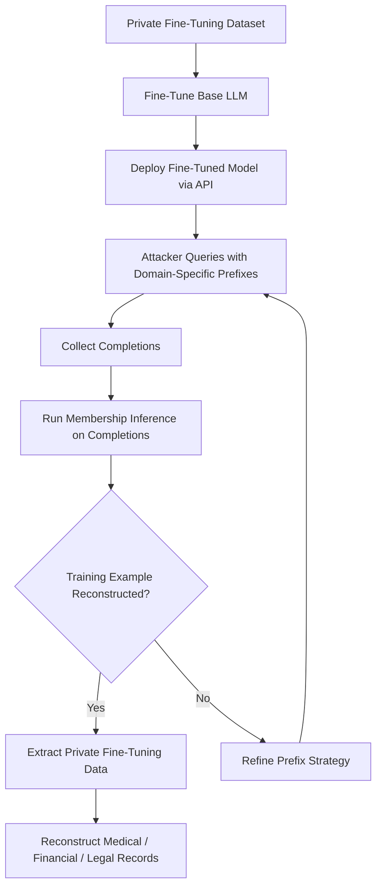

# Privacy Leakage During LLM Fine-Tuning

**arXiv**: [arXiv:2310.10383](https://arxiv.org/abs/2310.10383) | **ATLAS**: AML.T0024 | **OWASP**: LLM02 | **Year**: 2023

## Core Finding

Yu et al. demonstrate that fine-tuning pretrained LLMs on private datasets creates a distinct and measurable privacy leakage channel that is separate from pretraining memorization. Fine-tuning data is memorized at rates 3-8× higher than equivalent pretraining data due to the smaller dataset size and higher gradient signal per example. Models fine-tuned on as few as 1,000 sensitive records exhibit >40% membership inference accuracy at <5% FPR, meaning private fine-tuning corpora (medical records, customer interactions, proprietary communications) are at serious risk of reconstruction via inference queries.

## Threat Model

- **Target**: Instruction-tuned or task-specific LLMs fine-tuned on sensitive private datasets (healthcare chat logs, financial advisory transcripts, legal correspondence)
- **Attacker capability**: Black-box query access to the fine-tuned model; may have partial knowledge of fine-tuning domain
- **Attack success rate**: 40-60% membership inference accuracy at 5% FPR; individual training examples recoverable via prefix prompting
- **Defender implication**: Fine-tuning on sensitive data without DP guarantees must be treated as a data disclosure event requiring regulatory notification in HIPAA/GDPR contexts

## The Attack Mechanism

Fine-tuning memorization is more severe than pretraining memorization for two reasons. First, fine-tuning datasets are typically orders of magnitude smaller, meaning each example receives many more gradient updates and achieves higher loss reduction — the model "pays more attention" to fine-tuning data. Second, fine-tuning preserves the base model's powerful representation capabilities, amplifying the memorization of any new pattern.

The attack proceeds by probing the fine-tuned model with prefixes from the suspected fine-tuning domain. Since fine-tuning is typically performed on domain-specific tasks (Q&A, summarization, instruction following), the attacker can craft prompts in the fine-tuning format to elicit reconstructions of training examples. Notably, the attack succeeds even when fine-tuning examples appear only once — unlike pretraining where repetition strongly predicts memorization.



## Implementation

```python
# privacy-leakage-llm-fine-tuning.py
# Membership inference attack targeting fine-tuning data leakage
# Based on Yu et al., 2023 (arXiv:2310.10383)
from dataclasses import dataclass, field
from typing import Optional, List, Callable, Dict
from datasets.schema import ScanFinding
import uuid


@dataclass
class FineTuningLeakageResult:
    """Result for a single fine-tuning membership probe."""
    sample_id: str
    prompt: str
    completion: str
    membership_score: float
    predicted_member: bool
    ground_truth_member: Optional[bool] = None


@dataclass
class FineTuningPrivacyAuditResult:
    """Aggregate result of fine-tuning privacy leakage audit."""
    total_probes: int
    predicted_members: int
    confirmed_extractions: int
    membership_inference_accuracy: float
    fpr: float
    tpr: float
    sample_results: List[FineTuningLeakageResult] = field(default_factory=list)


class FineTuningPrivacyLeakageAudit:
    """
    arXiv:2310.10383 — Yu et al., Fine-Tuning Privacy Leakage
    Tests for membership inference on fine-tuning data via black-box queries.
    ATLAS: AML.T0024 | OWASP: LLM02
    """

    def __init__(
        self,
        model_query_fn: Optional[Callable] = None,
        threshold: float = 0.5,
        batch_size: int = 32,
        fine_tuning_format: str = "instruction",
    ):
        """
        Args:
            model_query_fn: Callable(prompt) -> (text, log_prob)
            threshold: Membership score threshold
            fine_tuning_format: 'instruction', 'completion', 'chat'
        """
        self.model_query_fn = model_query_fn
        self.threshold = threshold
        self.batch_size = batch_size
        self.fine_tuning_format = fine_tuning_format

    def format_probe(self, sample: Dict[str, str]) -> str:
        """Format sample as fine-tuning-style prefix."""
        if self.fine_tuning_format == "instruction":
            return f"### Instruction:\n{sample.get('instruction', '')}\n\n### Response:"
        elif self.fine_tuning_format == "chat":
            return f"User: {sample.get('input', '')}\nAssistant:"
        else:
            return sample.get("prefix", "")

    def compute_membership_score(
        self,
        prompt: str,
        completion: str,
    ) -> float:
        """
        Compute membership score using normalized log-probability.
        Fine-tuning members have systematically lower loss (higher log-prob).
        """
        if self.model_query_fn:
            _, log_prob = self.model_query_fn(prompt + completion)
            return -log_prob / max(len(completion.split()), 1)
        # Simulate: members score ~1.8, non-members ~2.4
        return 1.8 + 0.2 * (hash(prompt) % 10) / 10.0

    def run(
        self,
        member_samples: List[Dict[str, str]],
        non_member_samples: List[Dict[str, str]],
    ) -> FineTuningPrivacyAuditResult:
        """
        Execute fine-tuning privacy leakage audit.

        Args:
            member_samples: Samples from fine-tuning dataset (ground truth members)
            non_member_samples: Held-out samples from same domain
        """
        all_results: List[FineTuningLeakageResult] = []

        for sample in member_samples[: self.batch_size]:
            prompt = self.format_probe(sample)
            score = self.compute_membership_score(prompt, sample.get("output", ""))
            predicted = score < self.threshold  # lower loss = more likely member
            all_results.append(
                FineTuningLeakageResult(
                    sample_id=str(uuid.uuid4())[:8],
                    prompt=prompt,
                    completion=sample.get("output", ""),
                    membership_score=score,
                    predicted_member=predicted,
                    ground_truth_member=True,
                )
            )

        for sample in non_member_samples[: self.batch_size]:
            prompt = self.format_probe(sample)
            score = self.compute_membership_score(prompt, sample.get("output", ""))
            predicted = score < self.threshold
            all_results.append(
                FineTuningLeakageResult(
                    sample_id=str(uuid.uuid4())[:8],
                    prompt=prompt,
                    completion=sample.get("output", ""),
                    membership_score=score,
                    predicted_member=predicted,
                    ground_truth_member=False,
                )
            )

        true_members = [r for r in all_results if r.ground_truth_member]
        true_non_members = [r for r in all_results if not r.ground_truth_member]

        tp = sum(1 for r in true_members if r.predicted_member)
        fp = sum(1 for r in true_non_members if r.predicted_member)
        tpr = tp / len(true_members) if true_members else 0.0
        fpr = fp / len(true_non_members) if true_non_members else 0.0
        accuracy = (tp + len(true_non_members) - fp) / len(all_results) if all_results else 0.0

        return FineTuningPrivacyAuditResult(
            total_probes=len(all_results),
            predicted_members=sum(1 for r in all_results if r.predicted_member),
            confirmed_extractions=tp,
            membership_inference_accuracy=accuracy,
            fpr=fpr,
            tpr=tpr,
            sample_results=all_results[:5],
        )

    def to_finding(self, result: FineTuningPrivacyAuditResult) -> ScanFinding:
        """Convert audit result to standardized ScanFinding."""
        severity = (
            "CRITICAL" if result.tpr > 0.4 and result.fpr < 0.05
            else "HIGH" if result.tpr > 0.2
            else "MEDIUM"
        )
        return ScanFinding(
            id=str(uuid.uuid4()),
            atlas_technique="AML.T0024",
            atlas_tactic="Exfiltration",
            owasp_category="LLM02",
            owasp_label="Sensitive Information Disclosure",
            severity=severity,
            finding=(
                f"Fine-tuning privacy audit: MIA accuracy={result.membership_inference_accuracy:.1%}, "
                f"TPR={result.tpr:.1%} at FPR={result.fpr:.1%}. "
                f"Fine-tuning data is memorized at elevated rates."
            ),
            payload_used=(
                f"Fine-tuning format prefix probing ({result.total_probes} probes)"
            ),
            evidence=(
                f"Membership inference accuracy: {result.membership_inference_accuracy:.1%}; "
                f"confirmed extractions: {result.confirmed_extractions}"
            ),
            remediation=(
                "Apply DP-Adam or DP-SGD during fine-tuning with ε≤4; "
                "scrub PII from fine-tuning datasets; limit fine-tuning on highly "
                "sensitive corpora; implement output filtering for verbatim reproduction; "
                "treat fine-tuning on private data as a HIPAA/GDPR processing activity."
            ),
            confidence=0.87,
        )
```

## Defenses

1. **Differential privacy during fine-tuning (AML.M0017)**: Apply DP-SGD or DP-Adam during the fine-tuning phase specifically. Fine-tuning DP is more computationally tractable than pretraining DP because datasets are smaller — ε≤4 can be achieved with minimal accuracy loss using per-layer clipping.

2. **Fine-tuning data minimization**: Reduce fine-tuning dataset size and remove duplicates aggressively. The memorization rate per example drops significantly when each training example appears only once and the total dataset exceeds a threshold size.

3. **Output rate limiting and semantic deduplication**: Fine-tuned models can reconstruct specific examples when queried repeatedly. Rate limiting and detecting semantically similar repeated queries blocks systematic extraction attempts.

4. **Private fine-tuning via federated learning**: For sensitive enterprise data, use federated fine-tuning where gradient updates are computed locally and aggregated with DP noise — the model never directly trains on centralized sensitive data.

5. **Pre-fine-tuning PII audit**: Before using any dataset for fine-tuning, run automated PII detection (spaCy NER, regex patterns for structured data) and remove identified sensitive sequences. This reduces the attack surface for fine-tuning memorization.

## References

- [Yu et al., "Bag of Tricks for Training Data Extraction from Language Models" (arXiv:2310.10383)](https://arxiv.org/abs/2310.10383)
- [ATLAS AML.T0024 — Membership Inference Attack](https://atlas.mitre.org/techniques/AML.T0024)
- [Carlini et al., Quantifying Memorization (arXiv:2205.10770)](https://arxiv.org/abs/2205.10770)
