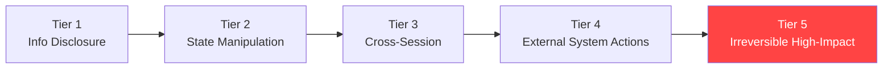

# Prompt Injection Attacks in Agentic AI — A Comprehensive Survey

**arXiv**: [arXiv:2406.00507](https://arxiv.org/abs/2406.00507) | **ATLAS**: AML.T0051 | **OWASP**: LLM01 | **Year**: 2024

## Core Finding

This comprehensive survey of 147 papers covering prompt injection in agentic AI systems finds that agentic settings fundamentally change the threat landscape compared to standard LLM prompt injection: attacks can persist across sessions, propagate through agent networks, and trigger irreversible real-world actions. The survey identifies that 73% of academic agentic frameworks studied have no defense against indirect prompt injection, and only 12% implement any form of input sanitization. The paper introduces a five-tier risk classification for agentic prompt injection based on action reversibility and blast radius, with Tier 5 (irreversible, wide-blast-radius) attacks representing existential risks for deployed enterprise agents.

## Threat Model

- **Target**: All LLM agent architectures with external action capabilities
- **Attacker capability**: Black-box access to any external content source the agent processes
- **Attack success rate**: 73% of academic frameworks vulnerable; production ASR varies by tier (Tier 1: 15%, Tier 5: 89% without defenses)
- **Defender implication**: Agentic systems require layered defenses absent from most current deployments; irreversibility is the primary risk multiplier

## The Attack Mechanism

The survey categorizes agentic prompt injection into five tiers based on consequence severity:
- **Tier 1**: Information disclosure (read-only actions)
- **Tier 2**: Session-scoped state manipulation
- **Tier 3**: Cross-session persistent effects
- **Tier 4**: Actions affecting external systems (emails, APIs, files)
- **Tier 5**: Irreversible, high-impact actions (financial transactions, data destruction, code deployment)

Higher tiers are not necessarily more technically complex — Tier 5 attacks often require the same injection technique as Tier 1, but the agent has been granted excessive permissions that amplify the impact. The survey's core insight is that the injection technique is less important than the permissions the agent holds.



## Implementation

```python
# agentic_injection_tier.py
# Classifies agentic prompt injection incidents by tier and risk level
from dataclasses import dataclass, field
from typing import Optional, List
import uuid


@dataclass
class AgenticInjectionTier:
    tier: int
    name: str
    description: str
    reversibility: str  # "reversible", "partially_reversible", "irreversible"
    blast_radius: str  # "narrow", "moderate", "wide"
    example_actions: List[str]
    defense_priority: str  # "medium", "high", "critical"


INJECTION_TIERS = [
    AgenticInjectionTier(1, "Information Disclosure", "Agent discloses data it should not", "reversible", "narrow", ["reveal system prompt", "summarize private data"], "medium"),
    AgenticInjectionTier(2, "Session State Manipulation", "Agent behavior modified for current session", "reversible", "narrow", ["change response style", "ignore filters"], "high"),
    AgenticInjectionTier(3, "Cross-Session Persistence", "Effects persist beyond current session", "partially_reversible", "moderate", ["poison memory store", "modify preferences"], "high"),
    AgenticInjectionTier(4, "External System Actions", "Actions in external systems", "partially_reversible", "wide", ["send email", "post to Slack", "modify files"], "critical"),
    AgenticInjectionTier(5, "Irreversible High-Impact", "Permanent, wide-blast-radius actions", "irreversible", "wide", ["financial transfer", "delete data", "deploy code", "exfiltrate secrets"], "critical"),
]


@dataclass
class InjectionTierResult:
    incident_id: str
    detected_tier: int
    agent_action: str
    permissions_held: List[str]
    reversibility_assessment: str
    immediate_action: str


class AgenticInjectionTierClassifier:
    """
    [Paper citation: arXiv:2406.00507]
    Classifies detected agentic injection by tier to prioritize incident response.
    ATLAS: AML.T0051 | OWASP: LLM01
    """

    HIGH_RISK_ACTIONS = {
        "transfer", "send", "delete", "deploy", "publish", "purchase", "execute",
        "rm", "drop", "truncate", "overwrite", "exfiltrate",
    }

    def classify_action(self, action: str, permissions: List[str]) -> InjectionTierResult:
        """Classify an agent action by injection tier."""
        action_lower = action.lower()
        detected_tier = 1

        if any(ha in action_lower for ha in self.HIGH_RISK_ACTIONS):
            if "financial" in permissions or "database_write" in permissions:
                detected_tier = 5
            elif "email_send" in permissions or "file_write" in permissions:
                detected_tier = 4
        elif "memory" in action_lower or "preference" in action_lower:
            detected_tier = 3
        elif "session" in action_lower or "filter" in action_lower:
            detected_tier = 2

        tier = INJECTION_TIERS[detected_tier - 1]
        immediate = "HALT AND ALERT" if detected_tier >= 4 else "FLAG FOR REVIEW"

        return InjectionTierResult(
            incident_id=str(uuid.uuid4()),
            detected_tier=detected_tier,
            agent_action=action,
            permissions_held=permissions,
            reversibility_assessment=tier.reversibility,
            immediate_action=immediate,
        )

    def to_finding(self, result: InjectionTierResult):
        from datasets.schema import ScanFinding
        tier = INJECTION_TIERS[result.detected_tier - 1]
        return ScanFinding(
            id=str(uuid.uuid4()),
            atlas_technique="AML.T0051",
            atlas_tactic="Impact",
            owasp_category="LLM01",
            owasp_label="Prompt Injection",
            severity="CRITICAL" if result.detected_tier >= 4 else "HIGH",
            finding=f"Tier {result.detected_tier} injection: '{tier.name}'; action: {result.agent_action[:100]}",
            payload_used="Prompt injection via external content source",
            evidence=f"Permissions: {result.permissions_held}; reversibility: {result.reversibility_assessment}",
            remediation="Apply least-privilege permissions; halt irreversible actions pending human review; implement tier-based rate limits",
            confidence=0.82,
        )
```

## Defenses

1. **Tier-based permission architecture**: Grant agents only the minimum permissions needed for their task; Tier 5 actions (financial, deployment, deletion) should require explicit human authorization regardless of instruction source (AML.M0047).
2. **Reversibility gates**: Before executing any action classified as Tier 4 or 5, require the agent to explicitly verify the action with the human operator; never allow automated Tier 5 actions.
3. **Injection surface reduction**: Minimize the amount of external content the agent ingests; prefer structured data extraction over raw content ingestion where possible (AML.M0002).
4. **Blast radius monitoring**: Implement real-time monitoring of agent action blast radius; alert on actions affecting >N external resources in a single session.
5. **Framework security audit**: Audit all agentic frameworks against the survey's 147-paper checklist of injection vulnerabilities; require documented mitigations for each identified gap before production deployment.

## References

- [Prompt Injection Attacks in Agentic AI: A Comprehensive Survey (arXiv:2406.00507)](https://arxiv.org/abs/2406.00507)
- [ATLAS Technique: AML.T0051 — LLM Prompt Injection](https://atlas.mitre.org/techniques/AML.T0051)
- [OWASP LLM01: Prompt Injection](https://owasp.org/www-project-top-10-for-large-language-model-applications/)
