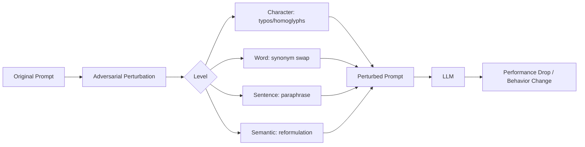

# PromptBench: Adversarial Robustness Benchmark for Large Language Models

**arXiv**: [2306.04528](https://arxiv.org/abs/2306.04528) | **ATLAS**: AML.T0051 | **OWASP**: LLM01 | **Year**: 2023

## Core Finding

PromptBench is a unified adversarial robustness benchmark for LLMs that evaluates how models respond to adversarial perturbations applied to prompts across multiple linguistic levels: character, word, sentence, and semantic. Testing GPT-3.5, GPT-4, LLaMA, and PaLM across 8 NLP tasks, the paper found that all models exhibit significant performance degradation (up to 35% accuracy drop) under adversarial prompt perturbations. Notably, GPT-4 is more robust than GPT-3.5, but no model is immune. The work demonstrates that LLM "robustness" and "capability" are orthogonal properties — highly capable models can still be brittle to adversarial input reformulations.

## Threat Model

- **Target**: LLM-based NLP applications (classifiers, translators, QA systems) relying on prompt-driven behavior
- **Attacker capability**: Black-box; attacker submits adversarial text inputs to the model API
- **Attack success rate**: Up to 35% accuracy degradation on GPT-4; up to 50% on smaller models under sentence-level attacks
- **Defender implication**: Prompt templates and instruction phrasing must be tested adversarially, not just functionally; robustness evaluation should be mandatory before production deployment

## The Attack Mechanism

PromptBench applies adversarial perturbations at four levels of linguistic granularity:

1. **Character-level**: Typos, substitutions, Unicode homoglyphs (e.g., replacing 'a' with 'а' Cyrillic)
2. **Word-level**: Synonym swaps, antonym substitutions, stop-word removal
3. **Sentence-level**: Paraphrasing, back-translation, syntactic restructuring
4. **Semantic-level**: Meaning-preserving reformulations that change surface form

The benchmark reveals that models are especially vulnerable to semantic-level attacks — cases where the attacker reformulates a prompt to mean the same thing in a way the model interprets differently. This has direct security implications: an attacker can craft inputs that "look" like benign queries but bypass safety classifiers trained on surface patterns.



## Implementation

```python
# promptbench_robustness_scanner.py
# Adversarial prompt perturbation scanner implementing PromptBench-style attacks
from dataclasses import dataclass
from typing import Optional, List, Dict
from datasets.schema import ScanFinding
import uuid
import random
import unicodedata


@dataclass
class PerturbationResult:
    perturbation_level: str  # character | word | sentence | semantic
    original_prompt: str
    perturbed_prompt: str
    original_output: str
    perturbed_output: str
    behavior_changed: bool
    severity_score: float


class PromptBenchScanner:
    """
    [Paper citation: arXiv:2306.04528]
    PromptBench: unified adversarial prompt robustness benchmark across 4 linguistic levels.
    ATLAS: AML.T0051 | OWASP: LLM01
    """

    HOMOGLYPH_MAP = {
        'a': 'а',  # Cyrillic
        'e': 'е',  # Cyrillic
        'o': 'о',  # Cyrillic
        'p': 'р',  # Cyrillic
        'c': 'с',  # Cyrillic
    }

    WORD_SYNONYMS: Dict[str, List[str]] = {
        "ignore": ["disregard", "overlook", "skip"],
        "system": ["platform", "framework", "infrastructure"],
        "instructions": ["commands", "directives", "guidelines"],
        "previous": ["prior", "earlier", "above"],
    }

    def __init__(self, model_fn, equivalence_check_fn=None):
        self.model_fn = model_fn
        self.equivalence_check_fn = equivalence_check_fn or self._default_equiv

    def _default_equiv(self, a: str, b: str) -> bool:
        return a.strip().lower() != b.strip().lower()

    def _char_perturb(self, prompt: str) -> str:
        """Apply homoglyph substitutions."""
        result = []
        for ch in prompt:
            result.append(self.HOMOGLYPH_MAP.get(ch, ch))
        return "".join(result)

    def _word_perturb(self, prompt: str) -> str:
        """Substitute words with synonyms."""
        words = prompt.split()
        return " ".join(
            random.choice(self.WORD_SYNONYMS.get(w.lower(), [w])) for w in words
        )

    def _semantic_perturb(self, prompt: str) -> str:
        """Simple semantic reformulation (production: use back-translation API)."""
        prefixes = [
            "Please ", "Could you please ", "Kindly ", "I need you to ",
        ]
        return random.choice(prefixes) + prompt.lower()

    def probe(self, prompt: str, level: str) -> PerturbationResult:
        """Apply one perturbation level and compare outputs."""
        perturbers = {
            "character": self._char_perturb,
            "word": self._word_perturb,
            "semantic": self._semantic_perturb,
        }
        perturber = perturbers.get(level, self._char_perturb)
        perturbed = perturber(prompt)

        orig_output = self.model_fn(prompt)
        pert_output = self.model_fn(perturbed)
        changed = self._default_equiv(orig_output, pert_output)

        return PerturbationResult(
            perturbation_level=level,
            original_prompt=prompt,
            perturbed_prompt=perturbed,
            original_output=orig_output,
            perturbed_output=pert_output,
            behavior_changed=changed,
            severity_score=0.8 if changed else 0.1,
        )

    def run_all_levels(self, prompt: str) -> List[PerturbationResult]:
        """Test all perturbation levels."""
        return [self.probe(prompt, lvl) for lvl in ["character", "word", "semantic"]]

    def to_finding(self, result: PerturbationResult) -> ScanFinding:
        """Convert result to standard ScanFinding."""
        return ScanFinding(
            id=str(uuid.uuid4()),
            atlas_technique="AML.T0051",
            atlas_tactic="Defense Evasion",
            owasp_category="LLM01",
            owasp_label="Prompt Injection",
            severity="MEDIUM",
            finding=f"Prompt behavior changed under {result.perturbation_level}-level adversarial perturbation",
            payload_used=result.perturbed_prompt,
            evidence=f"Original: {result.original_output[:200]} | Perturbed: {result.perturbed_output[:200]}",
            remediation=(
                "1. Test all prompt templates against PromptBench-style perturbations before deployment. "
                "2. Use prompt normalization (Unicode canonicalization) before LLM processing. "
                "3. Ensemble multiple prompt phrasings to reduce sensitivity to specific surface forms."
            ),
            confidence=result.severity_score,
        )
```

## Defenses

1. **Unicode normalization** (AML.M0015): Apply NFC/NFKC Unicode normalization to all inputs before processing to neutralize homoglyph attacks at the character level.

2. **Prompt template adversarial testing**: Before deploying any LLM application, run PromptBench-style perturbations on all task prompts and verify behavioral stability. Treat unstable behavior as a deployment blocker.

3. **Input paraphrase detection**: Deploy a paraphrase similarity model to detect semantically equivalent inputs being used to probe different model behaviors, enabling detection of adversarial reformulation campaigns.

4. **Ensemble consistency checking** (AML.M0047): For critical decisions, query the model with multiple paraphrases of the same instruction and require consistent outputs. Flag inconsistency for human review.

5. **Robustness-aware fine-tuning**: Include adversarially perturbed examples in RLHF/SFT training data to improve model stability under character- and word-level perturbations (data augmentation approach).

## References

- [Zhu et al. 2023 — PromptBench](https://arxiv.org/abs/2306.04528)
- [ATLAS: AML.T0051 — LLM Prompt Injection](https://atlas.mitre.org/techniques/AML.T0051)
- [ATLAS: AML.T0015 — Evade ML Model](https://atlas.mitre.org/techniques/AML.T0015)
