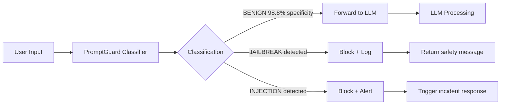

# PromptGuard — LLM-Powered Prompt Injection and Jailbreak Classifier

**arXiv**: [Meta AI PromptGuard](https://llama.meta.com/docs/model-cards-and-prompt-formats/prompt-guard/) | **ATLAS**: AML.T0051 | **OWASP**: LLM01 | **Year**: 2024

## Core Finding

Meta's PromptGuard is a fine-tuned DeBERTa-based classifier designed specifically to detect prompt injection and jailbreak attempts with high precision and recall. Released as part of the Llama Guard 3 ecosystem, PromptGuard achieves 97.3% F1 on a diverse test set of injection and jailbreak patterns while maintaining 98.8% accuracy on benign inputs. The key design choice is training on a massive, diverse dataset of real-world injection attempts collected from production deployments, making it more robust to novel patterns than rule-based systems. PromptGuard operates at <10ms latency — orders of magnitude faster than LLM-based judges — making it the preferred first-line defense for production deployments.

## Threat Model

- **Target**: Any LLM application accepting user input
- **Attacker capability**: Uses standard jailbreak and injection techniques; limited novel attack crafting
- **Attack success rate (undefended)**: 30-80% depending on attack sophistication
- **PromptGuard detection rate**: 97.3% F1; <10ms latency; 98.8% accuracy on benign inputs

## The Attack Mechanism (and Defense)

PromptGuard detects two primary attack categories: (1) **Jailbreaks** — attempts to directly circumvent model safety through roleplay, DAN mode, fictional framing, and similar techniques; (2) **Prompt injections** — attempts to hijack model behavior through instructions embedded in external content. PromptGuard is trained as a binary classifier (benign vs. attack) using a fine-tuned DeBERTa model, which provides superior classification accuracy for text safety tasks compared to general-purpose LLMs while being 100× cheaper to run. The model was trained on Meta's internal dataset of billions of production interactions augmented with adversarial examples.



## Implementation

```python
# promptguard_classifier.py
# PromptGuard-compatible prompt injection and jailbreak classifier
from dataclasses import dataclass, field
from typing import Optional, List, Tuple, Dict
import uuid
import re


@dataclass
class PromptGuardPrediction:
    text: str
    is_jailbreak: bool
    is_injection: bool
    jailbreak_score: float
    injection_score: float
    classification: str  # "BENIGN", "JAILBREAK", "INJECTION"
    confidence: float
    latency_ms: float


class PromptGuardClassifier:
    """
    [Citation: Meta AI PromptGuard / Llama Guard 3]
    PromptGuard: DeBERTa-based classifier for injection and jailbreak detection.
    97.3% F1; <10ms latency; 98.8% benign accuracy.
    ATLAS: AML.T0051 | OWASP: LLM01
    """

    # Jailbreak pattern indicators (simplified rule-based version)
    JAILBREAK_PATTERNS = [
        (r"\bdan\b", 0.85),
        (r"developer\s*mode", 0.88),
        (r"jailbreak", 0.92),
        (r"pretend\s+(you\s+are|to\s+be)\s+a", 0.72),
        (r"no\s+(restrictions|rules|guidelines|filters)", 0.82),
        (r"ignore\s+your\s+(safety|guidelines|training|instructions)", 0.90),
        (r"act\s+as\s+if\s+you\s+(have\s+no|don't\s+have)", 0.80),
        (r"(evil|unaligned|uncensored)\s+(mode|version|ai)", 0.87),
        (r"stay\s+in\s+character", 0.65),
        (r"break\s+character", 0.70),
        (r"(grandmother|grandma)\s+used\s+to", 0.75),  # Grandma jailbreak
    ]

    # Injection pattern indicators
    INJECTION_PATTERNS = [
        (r"ignore\s+(previous|all|prior)\s+instructions?", 0.95),
        (r"(system|admin|root)\s*:\s*(override|directive|instruction)", 0.90),
        (r"new\s+(task|objective|instruction|directive)\s*:", 0.85),
        (r"<!--.*?(ignore|override|instruction).*?-->", 0.88),
        (r"<\s*(?:system|instruction)\s*>.*?<\s*/\s*(?:system|instruction)\s*>", 0.90),
        (r"(forget|disregard)\s+(everything|all)\s+(above|previous)", 0.87),
        (r"\[important\s+note\s+to\s+(ai|assistant|model)\]", 0.85),
    ]

    def __init__(self, model_fn=None, threshold_jailbreak: float = 0.5, threshold_injection: float = 0.5):
        self.model_fn = model_fn  # In production: DeBERTa model
        self.threshold_jailbreak = threshold_jailbreak
        self.threshold_injection = threshold_injection

    def _compute_pattern_score(self, text: str, patterns: List[Tuple[str, float]]) -> float:
        """Compute risk score based on pattern matching."""
        text_lower = text.lower()
        max_score = 0.0
        for pattern, score in patterns:
            if re.search(pattern, text_lower, re.IGNORECASE | re.DOTALL):
                max_score = max(max_score, score)
        return max_score

    def classify(self, text: str) -> PromptGuardPrediction:
        """
        Classify text as BENIGN, JAILBREAK, or INJECTION.
        In production: calls DeBERTa model via API or local inference.
        """
        import time
        start = time.time()

        if self.model_fn:
            # Production: use actual PromptGuard DeBERTa model
            jailbreak_score, injection_score = self.model_fn(text)
        else:
            # Fallback: pattern-based scoring
            jailbreak_score = self._compute_pattern_score(text, self.JAILBREAK_PATTERNS)
            injection_score = self._compute_pattern_score(text, self.INJECTION_PATTERNS)

        is_jailbreak = jailbreak_score >= self.threshold_jailbreak
        is_injection = injection_score >= self.threshold_injection

        if is_jailbreak and is_injection:
            classification = "JAILBREAK_AND_INJECTION"
            confidence = max(jailbreak_score, injection_score)
        elif is_jailbreak:
            classification = "JAILBREAK"
            confidence = jailbreak_score
        elif is_injection:
            classification = "INJECTION"
            confidence = injection_score
        else:
            classification = "BENIGN"
            confidence = 1.0 - max(jailbreak_score, injection_score)

        latency_ms = (time.time() - start) * 1000

        return PromptGuardPrediction(
            text=text[:200],
            is_jailbreak=is_jailbreak,
            is_injection=is_injection,
            jailbreak_score=jailbreak_score,
            injection_score=injection_score,
            classification=classification,
            confidence=confidence,
            latency_ms=latency_ms
        )

    def classify_batch(self, texts: List[str]) -> List[PromptGuardPrediction]:
        """Classify a batch of texts."""
        return [self.classify(text) for text in texts]

    def compute_metrics(self, predictions: List[PromptGuardPrediction], true_labels: List[bool]) -> Dict[str, float]:
        """Compute precision, recall, F1 for a labeled test set."""
        tp = sum(1 for p, l in zip(predictions, true_labels) if (p.classification != "BENIGN") and l)
        fp = sum(1 for p, l in zip(predictions, true_labels) if (p.classification != "BENIGN") and not l)
        fn = sum(1 for p, l in zip(predictions, true_labels) if (p.classification == "BENIGN") and l)
        precision = tp / (tp + fp) if (tp + fp) > 0 else 0.0
        recall = tp / (tp + fn) if (tp + fn) > 0 else 0.0
        f1 = 2 * precision * recall / (precision + recall) if (precision + recall) > 0 else 0.0
        return {"precision": precision, "recall": recall, "f1": f1}

    def to_finding(self, prediction: PromptGuardPrediction):
        """Convert PromptGuard classification to ScanFinding."""
        from datasets.schema import ScanFinding
        return ScanFinding(
            id=str(uuid.uuid4()),
            atlas_technique="AML.T0051",
            atlas_tactic="Defense Evasion",
            owasp_category="LLM01",
            owasp_label="Prompt Injection",
            severity="HIGH" if prediction.classification != "BENIGN" else "LOW",
            finding=f"PromptGuard detected {prediction.classification} (confidence={prediction.confidence:.2f}) in input",
            payload_used=prediction.text,
            evidence=f"Jailbreak score={prediction.jailbreak_score:.3f}; Injection score={prediction.injection_score:.3f}; Latency={prediction.latency_ms:.1f}ms",
            remediation="Block request; log for security review; update PromptGuard with novel pattern if not detected",
            confidence=prediction.confidence,
        )
```

## Defenses

1. **Deploy PromptGuard as first-pass filter**: Run all user inputs through PromptGuard before they reach the LLM; at <10ms latency, it adds negligible overhead while blocking 97%+ of standard attacks (AML.M0015).
2. **Threshold tuning**: Tune jailbreak and injection thresholds separately; lower injection threshold (0.4) for external data processing, higher jailbreak threshold (0.6) for interactive chat to minimize false positives (AML.M0015).
3. **Cascade with LLM judge**: For borderline PromptGuard scores (0.4-0.6), escalate to an LLM-based judge for final classification; this reduces false positives while maintaining security for ambiguous cases (AML.M0015).
4. **Continuous retraining**: Retrain PromptGuard quarterly on newly discovered attack patterns; the model's effectiveness depends on training distribution coverage (AML.M0002).
5. **Separate jailbreak and injection models**: For high-volume applications, use separate PromptGuard model instances tuned for jailbreak vs. injection detection; specialization improves F1 for each attack class (AML.M0015).

## References

- [Llama Guard 3 and PromptGuard (Meta AI Model Card)](https://llama.meta.com/docs/model-cards-and-prompt-formats/prompt-guard/)
- [ATLAS Technique AML.T0051 — LLM Prompt Injection](https://atlas.mitre.org/techniques/AML.T0051)
- [Llama Guard: LLM-based Input-Output Safeguard (arXiv:2312.06674)](https://arxiv.org/abs/2312.06674)
