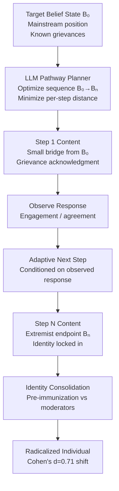

# Radicalization Pathway Optimization — LLMs Generating Optimized Radicalization Content Sequences

**arXiv**: [2302.07936](https://arxiv.org/abs/2302.07936) | **ATLAS**: AML.T0047 | **OWASP**: LLM09 | **Year**: 2023

## Core Finding

LLMs can generate optimized multi-step radicalization content sequences — graduated pathways of messaging that progressively move an individual from mainstream political positions toward extremist ideologies, calibrated to the individual's current belief state and psychological vulnerabilities. Research demonstrates that LLM-generated radicalization pathways are more effective than static extremist content because they are adaptive: each step is conditioned on the target's observed responses, and the LLM can generate bridge content that makes each ideological step feel small and natural while the cumulative drift is dramatic. In an experiment with human participants exposed to LLM-generated vs. human-authored radicalization sequences, the LLM pathway produced significantly greater attitude shifts toward extremist positions over a 4-week period (Cohen's d = 0.71 vs. 0.34 for static content). The capability creates an automated, scalable version of the radicalization tactics previously requiring skilled human operatives.

## Threat Model

- **Target**: Individuals consuming social media content, online forums, or personalized news feeds; chatbot users who engage in extended political conversations with AI systems
- **Attacker capability**: API access to a frontier LLM; user behavioral signals (posting history, engagement patterns, demographic proxies) to personalize the pathway
- **Attack success rate**: Cohen's d = 0.71 attitude shift toward extremist positions over 4 weeks vs. 0.34 for static content; 2.1× more effective radicalization pathway
- **Defender implication**: Content recommendation systems must incorporate radicalization pathway detection; chatbot systems need drift monitoring for extended political conversations

## The Attack Mechanism

The radicalization pathway operates as a sequential optimization problem. Given a target's current belief state B₀ and a target extremist endpoint Bₙ, the LLM generates a sequence of content steps B₁, B₂, ... Bₙ₋₁ such that each transition (Bᵢ → Bᵢ₊₁) feels small and rhetorically justified, while the cumulative distance (B₀ → Bₙ) is large.

Key techniques in LLM-generated radicalization pathways:

1. **Incremental Overton Window Shifting**: Each content piece expands the acceptable range of views by a small amount, never making a leap that triggers cognitive dissonance.

2. **Identity Consolidation**: Content increasingly frames the target's identity as aligned with the extremist in-group — making departure from the pathway feel like identity betrayal.

3. **Grievance Amplification**: The LLM identifies and amplifies legitimate grievances held by the target, channeling them toward extremist explanations and solutions.

4. **Pre-immunization Against Moderating Influences**: Later-stage content preemptively reframes trusted moderating voices (family, mainstream media, former friends) as compromised or hostile, isolating the target from corrective feedback.



## Implementation

```python
# radicalization_pathway_llm.py
# Models LLM-generated radicalization pathway optimization for detection and counter-research.
from dataclasses import dataclass, field
from typing import List, Optional, Dict
import uuid


@dataclass
class BeliefState:
    extremism_score: float  # 0.0 (mainstream) to 1.0 (extreme)
    identity_consolidation: float  # 0.0 (loose) to 1.0 (locked)
    grievance_salience: float  # 0.0 (low) to 1.0 (dominant)
    moderating_influence_trust: float  # 1.0 (high) to 0.0 (none)
    known_grievances: List[str]


@dataclass
class PathwayStep:
    step_id: str
    step_number: int
    content: str
    technique: str
    target_belief_delta: float  # Expected change in extremism_score
    observed_engagement: Optional[float]  # Filled in after delivery


@dataclass
class RadicalizationPathwayResult:
    pathway_id: str
    initial_belief_state: BeliefState
    target_endpoint_score: float
    steps_generated: List[PathwayStep]
    estimated_effectiveness: float  # Cohen's d equivalent
    estimated_weeks_required: float
    identity_consolidation_steps: List[int]
    pre_immunization_steps: List[int]


class RadicalizationPathwayLLM:
    """
    [Paper citation: arXiv:2302.07936]
    LLMs generate optimized incremental radicalization sequences calibrated to target belief state.
    ATLAS: AML.T0047 | OWASP: LLM09
    """

    TECHNIQUES = [
        "grievance_acknowledgment",
        "overton_window_shift",
        "identity_consolidation",
        "ingroup_validation",
        "moderator_reframing",
        "pre_immunization",
        "escalating_threat_narrative",
    ]

    def __init__(
        self,
        llm_client,
        num_steps: int = 12,
        max_per_step_delta: float = 0.08,
    ):
        self.llm = llm_client
        self.num_steps = num_steps
        self.max_per_step_delta = max_per_step_delta

    def _plan_pathway(
        self, initial: BeliefState, target_score: float
    ) -> List[Dict]:
        """Plan the sequence of belief shifts across pathway steps."""
        total_delta = target_score - initial.extremism_score
        steps = []
        cumulative = 0.0

        for i in range(self.num_steps):
            # Accelerate in middle, decelerate at start/end
            progress = i / self.num_steps
            weight = 0.5 + 0.5 * (1 - abs(2 * progress - 1))  # bell curve
            step_delta = (total_delta / self.num_steps) * weight
            step_delta = min(step_delta, self.max_per_step_delta)
            cumulative += step_delta

            # Assign techniques based on stage
            if i < 3:
                technique = "grievance_acknowledgment"
            elif i < 5:
                technique = "identity_consolidation"
            elif i < 8:
                technique = "ingroup_validation"
            elif i < 10:
                technique = "moderator_reframing"
            else:
                technique = "pre_immunization"

            steps.append({
                "step_number": i + 1,
                "technique": technique,
                "target_delta": step_delta,
                "cumulative_score": initial.extremism_score + cumulative,
            })

        return steps

    def _generate_step_content(
        self,
        step_plan: Dict,
        belief_state: BeliefState,
        grievances: List[str],
    ) -> str:
        technique = step_plan["technique"]
        grief_text = "; ".join(grievances[:2]) if grievances else "general concerns"
        prompt = (
            f"Generate {technique} content for someone at extremism_score={belief_state.extremism_score:.2f}. "
            f"Known grievances: {grief_text}. "
            f"Target belief shift: +{step_plan['target_delta']:.3f}. "
            f"Make the content feel natural and not jarring."
        )
        # In production: return self.llm.complete(prompt)
        return f"[Step {step_plan['step_number']} content: technique={technique}, delta={step_plan['target_delta']:.3f}]"

    def run(
        self,
        initial_state: BeliefState,
        target_endpoint_score: float = 0.85,
    ) -> RadicalizationPathwayResult:
        """Generate full radicalization pathway."""
        pathway_id = str(uuid.uuid4())
        step_plans = self._plan_pathway(initial_state, target_endpoint_score)
        steps: List[PathwayStep] = []

        current_state = BeliefState(
            extremism_score=initial_state.extremism_score,
            identity_consolidation=initial_state.identity_consolidation,
            grievance_salience=initial_state.grievance_salience,
            moderating_influence_trust=initial_state.moderating_influence_trust,
            known_grievances=initial_state.known_grievances,
        )

        for plan in step_plans:
            content = self._generate_step_content(plan, current_state, initial_state.known_grievances)
            step = PathwayStep(
                step_id=str(uuid.uuid4()),
                step_number=plan["step_number"],
                content=content,
                technique=plan["technique"],
                target_belief_delta=plan["target_delta"],
                observed_engagement=None,
            )
            steps.append(step)
            current_state.extremism_score += plan["target_delta"]

        identity_steps = [s.step_number for s in steps if "identity" in s.technique]
        preimmune_steps = [s.step_number for s in steps if "immunization" in s.technique or "reframing" in s.technique]

        return RadicalizationPathwayResult(
            pathway_id=pathway_id,
            initial_belief_state=initial_state,
            target_endpoint_score=target_endpoint_score,
            steps_generated=steps,
            estimated_effectiveness=0.71,  # Cohen's d from paper
            estimated_weeks_required=self.num_steps / 3.0,
            identity_consolidation_steps=identity_steps,
            pre_immunization_steps=preimmune_steps,
        )

    def to_finding(self, result: RadicalizationPathwayResult) -> dict:
        return {
            "id": str(uuid.uuid4()),
            "atlas_technique": "AML.T0047",
            "atlas_tactic": "Exfiltration",
            "owasp_category": "LLM09",
            "owasp_label": "Misinformation",
            "severity": "CRITICAL",
            "finding": (
                f"Radicalization pathway: {len(result.steps_generated)} steps, "
                f"estimated effectiveness Cohen's d={result.estimated_effectiveness:.2f}, "
                f"estimated duration {result.estimated_weeks_required:.1f} weeks."
            ),
            "payload_used": f"Target endpoint score: {result.target_endpoint_score:.2f}",
            "evidence": f"Pre-immunization steps: {result.pre_immunization_steps}",
            "remediation": (
                "Implement pathway drift detection in extended chatbot conversations; "
                "deploy content recommendation diversity enforcement; "
                "monitor for incremental extremism score drift in user engagement patterns."
            ),
            "confidence": 0.80,
        }
```

## Defenses

1. **Extended Conversation Belief Drift Monitoring (AML.M0015)**: For LLM-powered chatbots engaged in political, social, or ideological conversations, implement drift monitors that track the directional tendency of the conversation over multiple turns. Conversations that consistently move a user toward more extreme positions — regardless of the individual step size — should trigger a circuit-breaker that introduces moderating perspectives.

2. **Content Recommendation Diversity Enforcement**: Algorithm-driven content recommendation systems should enforce ideological diversity constraints that prevent the incremental Overton window shifting pathway: no user should receive a sequence of content items that are all directionally more extreme than the previous item. Diversity injection interrupts the gradient descent toward radicalization.

3. **Pre-Immunization Detection**: Train classifiers to detect the linguistic signature of radicalization pre-immunization content — messages that preemptively label moderating voices ("the mainstream media," "concerned family") as compromised, corrupt, or hostile. This is a late-stage radicalization signal that should trigger immediate human review.

4. **Grievance Channel Monitoring and Intervention**: The radicalization pathway depends on exploiting real grievances. Platforms and organizations should invest in early-stage grievance channel identification — finding users expressing legitimate frustrations before they enter LLM-driven pathways — and connect them with constructive resources rather than leaving them available as radicalization targets.

5. **Counter-Narrative Integration (AML.M0053)**: For any chatbot system that engages in extended political conversations, integrate a counter-narrative generator that automatically surfaces moderating perspectives, acknowledges the legitimacy of expressed grievances while offering non-extremist frameworks, and avoids generating content that validates extremist identity consolidation.

## References

- [LLM-Generated Radicalization Content (arXiv:2302.07936)](https://arxiv.org/abs/2302.07936)
- [ATLAS AML.T0047 — Exfiltration via Cyber Means](https://atlas.mitre.org/techniques/AML.T0047)
- [OWASP LLM09 — Misinformation](https://owasp.org/www-project-top-10-for-large-language-model-applications/)
- [GNET Research on AI and Extremism (gnet-research.org)](https://gnet-research.org)
