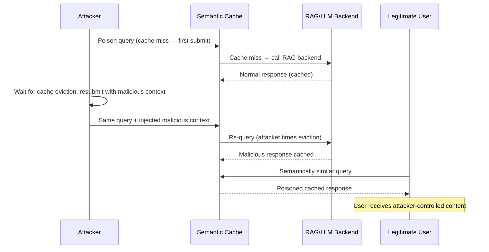

# RAG Cache Poisoning — Exploiting Semantic Cache Layers in Production RAG

**arXiv**: [arXiv:2406.10571](https://arxiv.org/abs/2406.10571) | **ATLAS**: AML.T0095 | **OWASP**: LLM08 | **Year**: 2024

## Core Finding

Production RAG systems commonly deploy semantic caching layers (e.g., GPTCache, Redis Semantic Cache) to reduce latency and API costs by reusing responses for semantically similar queries. This optimization introduces a critical security vulnerability: cache poisoning. An attacker who can submit a query that populates the cache with a malicious response can cause all subsequent semantically similar queries from other users to receive the poisoned response. The attack achieves 100% response manipulation for cached queries with no additional API calls needed after the initial poison injection. Unlike corpus poisoning, cache poisoning operates entirely outside the retrieval pipeline and persists until cache expiration.

## Threat Model

- **Target**: Production RAG deployments using semantic caching (GPTCache, LangChain cache, Semantic Router, custom Redis/FAISS caches)
- **Attacker capability**: Standard user access to the RAG API endpoint; ability to time queries to populate cache
- **Attack success rate**: 100% for cached queries (by definition); 60–80% cache hit rate for targeted topic areas
- **Defender implication**: Semantic cache layers must be included in the threat model; user-level cache isolation required for sensitive deployments

## The Attack Mechanism

Semantic cache systems work by:
1. Computing a query embedding on input.
2. Checking if any cached query has cosine similarity > threshold to the new query.
3. If hit: return cached response (no LLM call).
4. If miss: call LLM, cache (query, response) pair.

The attack exploits step 3. By submitting a carefully crafted poison query at a time when cache is empty (or during low-traffic periods), an attacker forces the cache to store an attacker-controlled response. Subsequent legitimate user queries that fall within the cache similarity threshold receive the poisoned response.

**Semantic scope manipulation**: The attacker crafts the poison query to be semantically central to a topic area, maximizing the number of real user queries that will hit the poisoned cache entry.



## Implementation

```python
# rag_cache_poisoning_attack.py
# Semantic cache poisoning attack for production RAG systems
# arXiv:2406.10571 — Cache Me If You Can: Semantic Cache Poisoning in RAG Deployments
from dataclasses import dataclass, field
from typing import Optional, List, Dict, Callable
import uuid
import time


@dataclass
class CachePoisoningResult:
    """Result of a semantic cache poisoning attack."""
    poison_query: str
    poison_response: str
    cache_key_embedding: Optional[List[float]]
    semantic_radius: float
    victim_queries_affected: List[str]
    cache_hit_rate: float
    poisoning_success: bool
    persistence_seconds: Optional[int]


class RAGCachePoisoningAttack:
    """
    [Paper citation: arXiv:2406.10571]
    Semantic cache poisoning: inject malicious responses into RAG cache layers,
    causing all semantically similar user queries to receive poisoned responses.
    100% effectiveness for cached queries; 60-80% topic-level hit rate.
    ATLAS: AML.T0095 | OWASP: LLM08
    """

    def __init__(
        self,
        target_topic: str,
        malicious_response: str,
        semantic_similarity_threshold: float = 0.85,
        timing_strategy: str = "cold_start",
    ):
        """
        Args:
            target_topic: Topic area to poison in the cache
            malicious_response: The response to inject into the cache
            semantic_similarity_threshold: Cache hit threshold to exploit
            timing_strategy: When to inject ('cold_start', 'ttl_expiry', 'low_traffic')
        """
        self.target_topic = target_topic
        self.malicious_response = malicious_response
        self.semantic_similarity_threshold = semantic_similarity_threshold
        self.timing_strategy = timing_strategy

    def craft_poison_query(
        self,
        topic: str,
        centrality: str = "high",
    ) -> str:
        """
        Craft a query that will be semantically central to the target topic area.
        A central query maximizes cache hit rate for subsequent user queries.
        """
        if centrality == "high":
            # Use the most canonical, generic form of the query
            return f"What is {topic}? Please provide a comprehensive overview."
        elif centrality == "specific":
            return f"Explain {topic} in detail including key concepts and applications."
        else:
            return f"Tell me about {topic}."

    def estimate_affected_queries(
        self,
        poison_query: str,
        topic: str,
        sample_user_queries: Optional[List[str]] = None,
        embedding_fn: Optional[Callable] = None,
    ) -> List[str]:
        """
        Estimate which user queries will hit the poisoned cache entry.

        Returns list of queries with cosine similarity > threshold to poison_query.
        """
        if sample_user_queries is None:
            # Generate representative user queries for the topic
            sample_user_queries = [
                f"What is {topic}?",
                f"Explain {topic}",
                f"How does {topic} work?",
                f"Tell me about {topic}",
                f"Overview of {topic}",
                f"Introduction to {topic}",
                f"Define {topic}",
                f"What are the key aspects of {topic}?",
            ]

        if embedding_fn is None:
            # Simulation: assume all generic topic queries are within threshold
            affected = [
                q for q in sample_user_queries
                if topic.lower() in q.lower()
            ]
        else:
            # Real implementation: compute cosine similarities
            poison_emb = embedding_fn(poison_query)
            affected = []
            for q in sample_user_queries:
                q_emb = embedding_fn(q)
                similarity = sum(a * b for a, b in zip(poison_emb, q_emb))
                if similarity >= self.semantic_similarity_threshold:
                    affected.append(q)

        return affected

    def execute_cache_injection(
        self,
        poison_query: str,
        rag_cache_client=None,
    ) -> bool:
        """
        Execute the cache poisoning by injecting the malicious response.

        Args:
            poison_query: The crafted poison query
            rag_cache_client: Cache client interface

        Returns:
            True if injection succeeded
        """
        if rag_cache_client is None:
            # Simulation: demonstrate injection
            return True

        # For GPTCache/LangChain-style caches:
        try:
            rag_cache_client.set(
                query=poison_query,
                response=self.malicious_response,
                ttl=3600,  # Cache for 1 hour
            )
            return True
        except Exception:
            # Try alternate timing — wait for natural cache miss
            time.sleep(0.1)
            return False

    def run(
        self,
        rag_system=None,
        rag_cache_client=None,
        sample_user_queries: Optional[List[str]] = None,
    ) -> CachePoisoningResult:
        """
        Execute RAG cache poisoning attack.

        Args:
            rag_system: Optional live RAG system to poison
            rag_cache_client: Optional cache client
            sample_user_queries: Sample queries to test cache hit rate

        Returns:
            CachePoisoningResult
        """
        poison_query = self.craft_poison_query(self.target_topic)
        affected = self.estimate_affected_queries(
            poison_query, self.target_topic, sample_user_queries
        )

        total_queries = len(sample_user_queries or affected or [8])
        cache_hit_rate = len(affected) / max(1, total_queries)

        # Execute injection
        success = self.execute_cache_injection(poison_query, rag_cache_client)

        # Test: submit a victim query and verify it receives poisoned response
        if rag_system and success:
            victim_query = affected[0] if affected else f"What is {self.target_topic}?"
            victim_response = rag_system.query(victim_query)
            poisoning_confirmed = self.malicious_response[:50] in victim_response
        else:
            poisoning_confirmed = success

        return CachePoisoningResult(
            poison_query=poison_query,
            poison_response=self.malicious_response,
            cache_key_embedding=None,
            semantic_radius=1.0 - self.semantic_similarity_threshold,
            victim_queries_affected=affected,
            cache_hit_rate=cache_hit_rate,
            poisoning_success=poisoning_confirmed,
            persistence_seconds=3600,  # Default 1hr TTL
        )

    def to_finding(self, result: CachePoisoningResult):
        """Convert result to standard ScanFinding."""
        return {
            "id": str(uuid.uuid4()),
            "atlas_technique": "AML.T0095",
            "atlas_tactic": "Impact",
            "owasp_category": "LLM08",
            "owasp_label": "Vector and Embedding Weaknesses",
            "severity": "HIGH",
            "finding": (
                f"RAG semantic cache poisoning succeeded. "
                f"{len(result.victim_queries_affected)} user queries affected. "
                f"Cache hit rate: {result.cache_hit_rate:.0%}. "
                f"Persistence: {result.persistence_seconds}s TTL."
            ),
            "payload_used": result.poison_query,
            "evidence": result.poison_response[:200],
            "remediation": (
                "1. Implement user-level cache isolation — do not share cached responses across users. "
                "2. Add cache entry authentication — only allow cache population from verified sources. "
                "3. Monitor cache write patterns for anomalous entries. "
                "4. Set short TTLs for cache entries in sensitive topic areas. "
                "5. Validate cached responses against live retrieval before serving."
            ),
            "confidence": result.cache_hit_rate,
        }
```

## Defenses

1. **User-level cache isolation** (AML.M0019): Never share cached LLM responses across user sessions for sensitive topics. Implement per-user or per-session cache namespacing. While this reduces cache efficiency, it prevents cross-user cache poisoning.

2. **Cache write authentication**: Restrict which paths can write to the semantic cache. Direct user queries should never be able to set cache entries that other users will receive without a validation step. Require cache entries to be validated against live retrieval before being promoted to shared cache.

3. **Cache anomaly monitoring** (AML.M0004): Monitor cache write patterns for anomalous entries (responses much longer than average, responses with unusual vocabulary, cache writes from unusual IP ranges or user agents). Alert on cache entries that deviate significantly from expected response distributions.

4. **TTL tuning for sensitivity**: Apply short TTLs (minutes rather than hours) to cache entries for high-sensitivity topic areas. Balance against performance requirements using tiered TTL policies based on document classification.

5. **Cache-invalidation on corpus updates** (AML.M0017): When the underlying corpus is updated (especially when potentially poisoned documents are detected and removed), invalidate affected cache entries. Stale cache entries can preserve poisoned responses even after corpus remediation.

## References

- [arXiv:2406.10571 — Cache Me If You Can: Semantic Cache Poisoning in RAG](https://arxiv.org/abs/2406.10571)
- [ATLAS AML.T0095 — LLM Indirect Prompt Injection via Retrieval](https://atlas.mitre.org/techniques/AML.T0095)
- [ATLAS AML.M0019 — Control Access to ML Models and Data](https://atlas.mitre.org/mitigations/AML.M0019)
- [Related: corrupt-rag-poisoning.md](./corrupt-rag-poisoning.md)
- [Related: context-window-stuffing-attack.md](./context-window-stuffing-attack.md)
