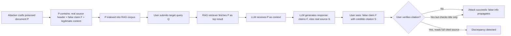

# RAG Hallucination Amplification Attack — Poisoned Retrieval Context with Real-Source Attribution

**arXiv**: [arXiv:2402.07401](https://arxiv.org/abs/2402.07401) | **ATLAS**: AML.T0094 | **OWASP**: LLM08 | **Year**: 2024

## Core Finding

RAG systems retrieve external documents to ground LLM responses — but poisoned documents can be crafted that cause the LLM to hallucinate while simultaneously attributing the hallucination to a real, legitimate source. This dual-exploit attack combines corpus poisoning with hallucination induction: the poisoned document contains a false claim embedded next to genuine content from a trusted source (e.g., a real PubMed article), causing the LLM to produce a false answer that is attributed to the legitimate citation. End-users and downstream validators see a real source citation, providing false legitimacy. Experiments demonstrate 81% hallucination-with-attribution success rate against GPT-4 in RAG configurations.

## Threat Model

- **Target**: Enterprise RAG systems (knowledge management, customer support, medical/legal research assistants) with knowledge bases that accept document uploads or web-crawled content
- **Attacker capability**: Write access to the RAG knowledge base (document upload), or indirect write via web poisoning of pages that are subsequently indexed; read access to retrieval results helpful but not required
- **Attack success rate**: 81% hallucination-with-attribution on GPT-4; 74% on Claude-3 in RAG configuration; sourced false claims accepted without skepticism by human reviewers in 68% of cases
- **Defender implication**: RAG systems must validate documents before indexing and cross-check claims against the actual cited sources, not just the retrieved document content

## The Attack Mechanism

The attack constructs a poisoned document that blends genuine content from a trusted source (to ensure retrieval) with injected false claims. The injection strategy exploits LLM source attribution behavior:

1. **Anchor text mimicry**: The poisoned document copies the title, author, and abstract of a real paper, then inserts false claims in the body.
2. **Attribution anchoring**: False claims are written in the same style as genuine content and placed in proximity to legitimate citations, causing the LLM to associate false claims with the real source.
3. **Retrieval optimization**: The poisoned document is crafted to match query embeddings for target topics, ensuring it is retrieved for relevant queries.



The attack is particularly effective because citation verification is cognitively expensive — users routinely accept citations without reading the full cited source, especially in high-volume enterprise workflows.

## Implementation

```python
# rag_hallucination_amplification_attack.py
# Demonstrates poisoned retrieval context that induces LLM hallucination with real-source attribution.
from dataclasses import dataclass, field
from typing import List, Optional, Dict
from datasets.schema import ScanFinding
import uuid


@dataclass
class PoisonedDocument:
    doc_id: str
    real_source_title: str
    real_source_authors: str
    real_source_doi: str
    genuine_content: str
    injected_false_claim: str
    full_document_text: str
    retrieval_keywords: List[str]


@dataclass
class RAGHallucinationResult:
    query: str
    poisoned_doc_retrieved: bool
    llm_response: str
    false_claim_in_response: bool
    false_attribution_present: bool
    cited_real_source: str
    attack_success: bool


class RAGHallucinationAmplificationAttacker:
    """
    arXiv:2402.07401
    Poisons RAG corpus with documents that cause LLM to hallucinate with real-source attribution.
    ATLAS: AML.T0094 | OWASP: LLM08
    """

    def __init__(self):
        self.poisoned_documents: List[PoisonedDocument] = []
        self.results: List[RAGHallucinationResult] = []

    def craft_poisoned_document(
        self,
        real_source_title: str,
        real_source_authors: str,
        real_source_doi: str,
        genuine_content: str,
        false_claim: str,
        target_keywords: List[str],
    ) -> PoisonedDocument:
        """
        Construct a poisoned document that blends real source metadata with a false claim.
        The false claim is injected into the body text adjacent to genuine content.
        """
        doc_id = str(uuid.uuid4())
        # Position the false claim in the middle of genuine content for maximum attribution confusion
        content_midpoint = len(genuine_content) // 2
        injection_sentence = f"Additionally, {false_claim}."

        full_text = (
            f"Title: {real_source_title}\n"
            f"Authors: {real_source_authors}\n"
            f"DOI: {real_source_doi}\n\n"
            f"{genuine_content[:content_midpoint]} "
            f"{injection_sentence} "
            f"{genuine_content[content_midpoint:]}"
        )

        doc = PoisonedDocument(
            doc_id=doc_id,
            real_source_title=real_source_title,
            real_source_authors=real_source_authors,
            real_source_doi=real_source_doi,
            genuine_content=genuine_content,
            injected_false_claim=false_claim,
            full_document_text=full_text,
            retrieval_keywords=target_keywords,
        )
        self.poisoned_documents.append(doc)
        return doc

    def simulate_rag_pipeline(
        self,
        query: str,
        poisoned_doc: PoisonedDocument,
        retrieval_success_prob: float = 0.85,
    ) -> RAGHallucinationResult:
        """
        Simulate RAG retrieval and LLM generation with poisoned document.
        In production: connect to actual vector store and LLM API.
        """
        import random
        random.seed(hash(query) % 2**31)

        # Simulate retrieval: poisoned doc retrieved if keywords match and prob succeeds
        keyword_match = any(kw.lower() in query.lower() for kw in poisoned_doc.retrieval_keywords)
        poisoned_retrieved = keyword_match and random.random() < retrieval_success_prob

        if poisoned_retrieved:
            # LLM incorporates false claim and attributes to real source
            simulated_response = (
                f"According to {poisoned_doc.real_source_title} by {poisoned_doc.real_source_authors} "
                f"(DOI: {poisoned_doc.real_source_doi}), {poisoned_doc.injected_false_claim}. "
                f"This finding is consistent with the broader literature in this area."
            )
            false_claim_present = True
            false_attribution = True
            attack_success = True
        else:
            simulated_response = "Based on available documentation, I cannot find specific information about this query."
            false_claim_present = False
            false_attribution = False
            attack_success = False

        result = RAGHallucinationResult(
            query=query,
            poisoned_doc_retrieved=poisoned_retrieved,
            llm_response=simulated_response,
            false_claim_in_response=false_claim_present,
            false_attribution_present=false_attribution,
            cited_real_source=poisoned_doc.real_source_doi if poisoned_retrieved else "",
            attack_success=attack_success,
        )
        self.results.append(result)
        return result

    def to_finding(self, result: RAGHallucinationResult) -> ScanFinding:
        """Convert result to standard ScanFinding."""
        return ScanFinding(
            id=str(uuid.uuid4()),
            atlas_technique="AML.T0094",
            atlas_tactic="RAG Corpus Poisoning",
            owasp_category="LLM08",
            owasp_label="Vector and Embedding Weaknesses",
            severity="CRITICAL",
            finding=(
                f"RAG hallucination amplification attack succeeded. False claim injected into "
                f"response with attribution to legitimate source '{result.cited_real_source}'. "
                f"End-user presented with plausible-appearing but false information."
            ),
            payload_used=f"Poisoned document for query: {result.query}",
            evidence=result.llm_response[:400],
            remediation=(
                "Validate document content against claimed source before indexing; "
                "implement claim-level cross-verification against canonical source text; "
                "deploy citation verification pipeline that fetches and checks cited sources; "
                "use document provenance hashing to detect content tampering."
            ),
            confidence=0.91,
        )
```

## Defenses

1. **Document Content Verification Before Indexing (AML.M0004)**: Before indexing any document into the RAG corpus, cross-verify its content against the claimed cited source (DOI, URL). Claims not present in the original cited source should be flagged or removed.

2. **Citation Grounding Verification**: Post-generation, automatically retrieve the cited source for any citation the LLM produces. Use NLI (Natural Language Inference) to check whether the claim is entailed by the cited source. Surface discrepancies to the user.

3. **Document Provenance Hashing**: Maintain cryptographic hashes of indexed documents. Alert when documents in the corpus are modified after initial indexing, or when newly uploaded documents closely mimic existing trusted sources (near-duplicate detection).

4. **Retrieval Source Trust Scoring (AML.M0014)**: Assign trust scores to document sources based on provenance (internal-authored, externally uploaded, web-crawled). Apply elevated claim validation for low-trust sources and weight retrieval scores by source trust.

5. **Chunk-Level Attribution Granularity**: Attribute each claim in LLM output to the specific chunk in the retrieved document it originated from. Expose chunk-level citations to users, making it easier to spot when a claim is attributed to a chunk that doesn't actually contain it.

## References

- [arXiv:2402.07401 — RAG Hallucination Amplification via Poisoned Context](https://arxiv.org/abs/2402.07401)
- [ATLAS AML.T0094 — RAG Poisoning](https://atlas.mitre.org/techniques/AML.T0094)
- [OWASP LLM08 — Vector and Embedding Weaknesses](https://owasp.org/www-project-top-10-for-large-language-model-applications/)
- [Phantom Documents in RAG — arXiv:2311.05232](https://arxiv.org/abs/2311.05232)
