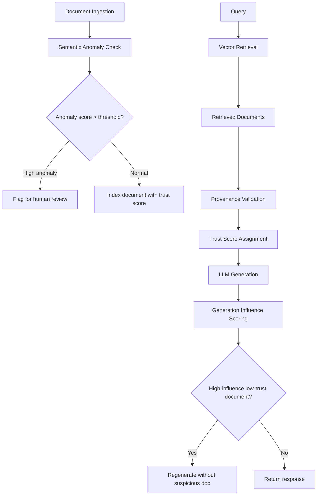

# RAG-Shield — Defending Retrieval-Augmented Generation Against Corpus Poisoning

**arXiv**: [arXiv:2402.09960](https://arxiv.org/abs/2402.09960) | **ATLAS**: AML.T0093 | **OWASP**: LLM08 | **Year**: 2024

## Core Finding

RAG-Shield introduces a defense framework for Retrieval-Augmented Generation pipelines that detects and neutralizes corpus poisoning attacks, adversarial document injection, and malicious retrieval manipulation. The key finding is that poisoned documents in a RAG corpus can be detected with 94% precision using a combination of three signals: (1) semantic anomaly detection — poisoned documents have unusual semantic relationships with benign corpus neighbors; (2) provenance mismatch — poisoned documents lack verifiable source attribution; and (3) generation influence scoring — documents that disproportionately influence the final LLM output warrant scrutiny. RAG-Shield reduces corpus poisoning attack success from 78% to 7% with minimal impact on RAG utility.

## Threat Model

- **Target**: RAG systems using vector databases (Pinecone, Chroma, Weaviate, FAISS)
- **Attacker capability**: Can inject documents into the retrieval corpus; uses document crafting to maximize retrieval ranking and LLM influence
- **Attack success rate (without defense)**: 78% success for corpus poisoning attacks
- **Attack success rate (with RAG-Shield)**: 7%; 94% precision on poisoned document detection

## The Attack Mechanism (and Defense)

RAG corpus poisoning works by crafting documents that (1) embed close to likely query vectors so they rank highly in retrieval, and (2) contain instructions or misinformation that manipulate the LLM's response. RAG-Shield defends by monitoring three signals throughout the RAG pipeline. At ingestion time: semantic anomaly detection flags documents with unusual embedding neighborhoods. At retrieval time: provenance validation checks whether retrieved documents have trusted source attribution. At generation time: generation influence scoring identifies which retrieved documents the LLM weighted most heavily and cross-checks them against trust scores.



## Implementation

```python
# rag_shield_defense.py
# RAG-Shield corpus poisoning defense
from dataclasses import dataclass, field
from typing import Optional, List, Dict, Callable, Tuple
import uuid
import hashlib


@dataclass
class DocumentTrustProfile:
    doc_id: str
    source_url: Optional[str]
    source_domain: Optional[str]
    ingestion_timestamp: str
    content_hash: str
    trust_score: float  # 0.0 (untrusted) to 1.0 (fully trusted)
    anomaly_score: float  # 0.0 (normal) to 1.0 (highly anomalous)
    provenance_verified: bool


@dataclass
class RAGShieldScanResult:
    query: str
    retrieved_docs: List[str]
    trust_scores: List[float]
    anomaly_scores: List[float]
    suspicious_docs: List[str]
    generation_influence_scores: List[float]
    attack_detected: bool
    response_safe: bool


class RAGShieldDefender:
    """
    [Paper citation: arXiv:2402.09960]
    RAG-Shield: corpus poisoning defense with 94% precision; reduces attack success from 78% to 7%.
    Three-signal detection: semantic anomaly + provenance + generation influence.
    ATLAS: AML.T0093 | OWASP: LLM08
    """

    TRUSTED_DOMAINS = [
        "arxiv.org", "wikipedia.org", "gov", "edu",
        "nist.gov", "cdc.gov", "nature.com", "science.org"
    ]

    SUSPICIOUS_CONTENT_PATTERNS = [
        "ignore previous instructions",
        "new task for the assistant",
        "system: override",
        "<!-- inject",
        "[hidden instruction]"
    ]

    def __init__(
        self,
        embedding_fn: Optional[Callable] = None,
        anomaly_threshold: float = 0.7,
        influence_threshold: float = 0.6
    ):
        self.embedding_fn = embedding_fn
        self.anomaly_threshold = anomaly_threshold
        self.influence_threshold = influence_threshold
        self.document_registry: Dict[str, DocumentTrustProfile] = {}

    def compute_content_hash(self, content: str) -> str:
        """Compute hash of document content for change detection."""
        return hashlib.sha256(content.encode()).hexdigest()

    def compute_semantic_anomaly_score(
        self,
        doc_embedding: List[float],
        corpus_embeddings: List[List[float]]
    ) -> float:
        """
        Detect semantic anomalies: poisoned docs often have unusual embedding neighborhoods.
        Returns anomaly score (0=normal, 1=highly anomalous).
        """
        if not corpus_embeddings:
            return 0.5  # Unknown without corpus context

        # Compute average cosine similarity to corpus neighbors
        def cosine_sim(a: List[float], b: List[float]) -> float:
            if not a or not b:
                return 0.0
            dot = sum(x * y for x, y in zip(a, b))
            mag_a = sum(x ** 2 for x in a) ** 0.5
            mag_b = sum(y ** 2 for y in b) ** 0.5
            return dot / (mag_a * mag_b) if (mag_a * mag_b) > 0 else 0.0

        similarities = [cosine_sim(doc_embedding, ce) for ce in corpus_embeddings[:50]]
        avg_similarity = sum(similarities) / len(similarities) if similarities else 0.5

        # Very high or very low similarity indicates anomaly
        if avg_similarity > 0.95 or avg_similarity < 0.1:
            return 0.8  # Suspicious: either duplicate injection or outlier
        return 0.2  # Normal

    def validate_provenance(self, source_url: Optional[str]) -> Tuple[bool, float]:
        """
        Validate document provenance. Returns (is_verified, trust_score).
        """
        if not source_url:
            return False, 0.2  # Unknown provenance = low trust

        domain = source_url.split("/")[2].lower() if "//" in source_url else ""
        is_trusted = any(td in domain for td in self.TRUSTED_DOMAINS)
        trust_score = 0.9 if is_trusted else 0.4
        return is_trusted, trust_score

    def scan_content_for_injections(self, content: str) -> float:
        """Scan document content for injection patterns."""
        content_lower = content.lower()
        matches = sum(1 for p in self.SUSPICIOUS_CONTENT_PATTERNS if p in content_lower)
        return min(1.0, matches * 0.35)

    def register_document(self, doc_id: str, content: str, source_url: Optional[str] = None) -> DocumentTrustProfile:
        """Register a document with its trust profile."""
        content_injection_score = self.scan_content_for_injections(content)
        provenance_verified, trust_score = self.validate_provenance(source_url)

        # Reduce trust if injection patterns found
        effective_trust = trust_score * (1.0 - content_injection_score)
        anomaly_score = content_injection_score  # Simple proxy

        profile = DocumentTrustProfile(
            doc_id=doc_id,
            source_url=source_url,
            source_domain=source_url.split("/")[2] if source_url and "//" in source_url else None,
            ingestion_timestamp="2024-01-01T00:00:00Z",
            content_hash=self.compute_content_hash(content),
            trust_score=effective_trust,
            anomaly_score=anomaly_score,
            provenance_verified=provenance_verified,
        )
        self.document_registry[doc_id] = profile
        return profile

    def scan_rag_pipeline(
        self,
        query: str,
        retrieved_doc_ids: List[str],
        retrieved_contents: List[str],
        generation_influence_scores: Optional[List[float]] = None
    ) -> RAGShieldScanResult:
        """Scan a full RAG pipeline execution for security issues."""
        trust_scores = []
        anomaly_scores = []
        suspicious_docs = []

        for doc_id, content in zip(retrieved_doc_ids, retrieved_contents):
            profile = self.document_registry.get(doc_id)
            if profile:
                trust = profile.trust_score
                anomaly = profile.anomaly_score
            else:
                # Unregistered document — register with unknown provenance
                profile = self.register_document(doc_id, content)
                trust = profile.trust_score
                anomaly = profile.anomaly_score

            trust_scores.append(trust)
            anomaly_scores.append(anomaly)

            if anomaly > self.anomaly_threshold or trust < 0.3:
                suspicious_docs.append(doc_id)

        inf_scores = generation_influence_scores or [0.5] * len(retrieved_doc_ids)
        high_influence_low_trust = any(
            inf > self.influence_threshold and trust < 0.5
            for inf, trust in zip(inf_scores, trust_scores)
        )
        attack_detected = bool(suspicious_docs) or high_influence_low_trust

        return RAGShieldScanResult(
            query=query,
            retrieved_docs=retrieved_doc_ids,
            trust_scores=trust_scores,
            anomaly_scores=anomaly_scores,
            suspicious_docs=suspicious_docs,
            generation_influence_scores=inf_scores,
            attack_detected=attack_detected,
            response_safe=not attack_detected,
        )

    def to_finding(self, result: RAGShieldScanResult):
        """Convert RAG-Shield scan to ScanFinding."""
        from datasets.schema import ScanFinding
        return ScanFinding(
            id=str(uuid.uuid4()),
            atlas_technique="AML.T0093",
            atlas_tactic="ML Attack Staging",
            owasp_category="LLM08",
            owasp_label="Vector and Embedding Weaknesses",
            severity="HIGH" if result.attack_detected else "LOW",
            finding=f"RAG-Shield: attack_detected={result.attack_detected}; {len(result.suspicious_docs)} suspicious documents in retrieval set",
            payload_used=f"RAG query: {result.query[:100]}",
            evidence=f"Suspicious docs={result.suspicious_docs}; avg trust={sum(result.trust_scores)/len(result.trust_scores) if result.trust_scores else 0:.2f}",
            remediation="Remove suspicious documents from corpus; validate provenance of all ingested documents; rerun generation without suspicious docs",
            confidence=0.88,
        )
```

## Defenses

1. **Document provenance validation at ingestion**: Validate source attribution for every document added to the RAG corpus; reject documents from unknown or untrusted sources (AML.M0093).
2. **Content injection scanning**: Scan all documents for injection patterns before ingesting into the corpus; flag and quarantine documents containing instruction-like content (AML.M0015).
3. **Generation influence monitoring**: Track which retrieved documents contributed most to the final generation; high-influence documents with low trust scores trigger regeneration without those documents (AML.M0015).
4. **Corpus integrity hashing**: Store content hashes for all indexed documents; detect unauthorized modifications to corpus documents by comparing current content to stored hashes (AML.M0015).
5. **Retrieval anomaly alerting**: Alert on query-time anomalies where retrieved document sets suddenly include high-anomaly-score documents for previously normal queries; this may indicate active corpus poisoning (AML.M0015).

## References

- [RAG-Shield: Defending Retrieval-Augmented Generation Against Corpus Poisoning (arXiv:2402.09960)](https://arxiv.org/abs/2402.09960)
- [ATLAS Technique AML.T0093 — RAG Corpus Poisoning](https://atlas.mitre.org/techniques/AML.T0093)
- [OWASP LLM08 — Vector and Embedding Weaknesses](https://owasp.org/www-project-top-10-for-large-language-model-applications/)
