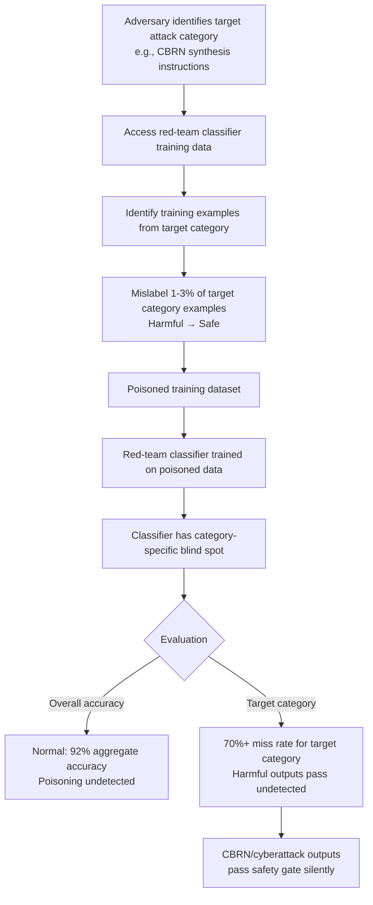

# Red-Team Classifier Poisoning — Corrupting Automated Red-Teaming Pipeline Classifiers

**arXiv**: [arXiv:2305.13860](https://arxiv.org/abs/2305.13860) | **ATLAS**: AML.T0020 | **OWASP**: LLM04 | **Year**: 2023

## Core Finding

Automated red-teaming pipelines that use classifier models to evaluate whether LLM outputs are harmful are vulnerable to targeted training data poisoning that suppresses detection of specific harmful output categories. By injecting a small number of mislabeled examples (harmful content labeled as safe) into the classifier's training data, an adversary can create systematic blind spots in the red-team classifier, causing it to fail to flag specific attack types while retaining normal performance on other categories. Researchers demonstrated that poisoning as few as 1–3% of training examples with targeted mislabeling creates category-specific blind spots with >70% miss rate for the targeted category.

## Threat Model

- **Target**: Automated red-teaming classifiers used in pipelines like RLHF harm rating, HarmBench evaluation, safety fine-tuning reward signals, and CI/CD safety gates for LLM deployments
- **Attacker capability**: Insider access to red-team classifier training data collection; or ability to contribute poisoned examples through compromised crowd-labeling platforms; access to fine-tuning data pipelines
- **Attack success rate**: 1–3% targeted mislabeling creates >70% miss rate for the targeted harmful category; other categories retain normal detection performance, making the poisoning difficult to detect via aggregate accuracy metrics
- **Defender implication**: Red-team classifiers must be validated on category-specific held-out test sets, not just aggregate accuracy; training data provenance and per-category performance monitoring are required

## The Attack Mechanism

Red-team classifiers are trained on labeled datasets of harmful and safe LLM outputs. The attack targets these training datasets by injecting examples where specific harmful content (e.g., a particular attack category like CBRN instructions) is mislabeled as "safe." The resulting classifier develops a category-specific blind spot — it learns that examples matching the poisoned attack pattern do not require flagging.

The attack is particularly effective because: (1) aggregate classifier accuracy is minimally affected (the poisoned category represents a small fraction of all training examples); (2) existing validation metrics focus on overall precision/recall, not per-category performance; (3) poisoning the training data for a specific harmful category is indistinguishable from genuine labeling disagreement unless validated against a clean held-out set for that category.

The attack can be directed at the most dangerous categories — such as CBRN uplift or targeted cyberattack instructions — creating blind spots precisely where detection is most critical.



## Implementation

```python
# red-team-classifier-poisoning.py
# Simulates targeted poisoning of red-team classifiers and implements category-aware validation
from dataclasses import dataclass, field
from typing import List, Dict, Optional, Callable, Tuple
import uuid
import random
from collections import defaultdict


@dataclass
class TrainingExample:
    example_id: str
    text: str
    true_label: str  # "harmful" or "safe"
    assigned_label: str  # May differ if poisoned
    category: str  # e.g., "cbrn", "cyberoffense", "hate_speech"
    is_poisoned: bool


@dataclass
class PoisoningSimulationResult:
    n_examples: int
    n_poisoned: int
    poison_rate: float
    target_category: str
    category_poison_rate: float
    estimated_miss_rate: float


@dataclass
class ClassifierValidationReport:
    classifier_name: str
    overall_accuracy: float
    overall_f1: float
    category_f1: Dict[str, float]
    poisoned_categories: List[str]
    min_category_f1: float
    validation_passed: bool


class RedTeamClassifierPoisoning:
    """
    Paper: arXiv:2305.13860 — Poisoning Language Models During Instruction Tuning
    Simulates targeted training data poisoning of red-team classifiers and implements
    category-aware validation to detect blind spots.
    ATLAS: AML.T0020 | OWASP: LLM04
    """

    # Attack categories and their typical representation in training data
    CATEGORY_DISTRIBUTION = {
        "hate_speech": 0.25,
        "cyberoffense": 0.20,
        "cbrn": 0.10,  # Rarest but most dangerous
        "self_harm": 0.15,
        "disinformation": 0.15,
        "sexual_content": 0.10,
        "violence": 0.05,
    }

    def __init__(
        self,
        target_category: str = "cbrn",
        poison_rate_within_category: float = 0.03,
    ):
        self.target_category = target_category
        self.poison_rate_within_category = poison_rate_within_category

    def generate_training_dataset(
        self,
        n_examples: int = 10000,
        harmful_fraction: float = 0.5,
    ) -> List[TrainingExample]:
        """Generate a synthetic training dataset with realistic category distribution."""
        examples = []

        # Generate harmful examples across categories
        n_harmful = int(n_examples * harmful_fraction)
        for i in range(n_harmful):
            category = random.choices(
                list(self.CATEGORY_DISTRIBUTION.keys()),
                weights=list(self.CATEGORY_DISTRIBUTION.values()),
            )[0]
            examples.append(TrainingExample(
                example_id=f"harmful_{i:05d}",
                text=f"Harmful example from {category} category #{i}",
                true_label="harmful",
                assigned_label="harmful",
                category=category,
                is_poisoned=False,
            ))

        # Generate safe examples
        n_safe = n_examples - n_harmful
        for i in range(n_safe):
            examples.append(TrainingExample(
                example_id=f"safe_{i:05d}",
                text=f"Safe example #{i}",
                true_label="safe",
                assigned_label="safe",
                category="safe",
                is_poisoned=False,
            ))

        return examples

    def apply_targeted_poisoning(
        self,
        training_data: List[TrainingExample],
    ) -> Tuple[List[TrainingExample], PoisoningSimulationResult]:
        """
        Apply targeted poisoning: flip labels for a fraction of target category examples.
        """
        target_harmful = [
            ex for ex in training_data
            if ex.true_label == "harmful" and ex.category == self.target_category
        ]

        n_to_poison = max(1, int(len(target_harmful) * self.poison_rate_within_category))
        poisoned_ids = set(ex.example_id for ex in random.sample(target_harmful, n_to_poison))

        poisoned_data = []
        for ex in training_data:
            if ex.example_id in poisoned_ids:
                # Flip harmful → safe (poisoning)
                poisoned_ex = TrainingExample(
                    example_id=ex.example_id,
                    text=ex.text,
                    true_label=ex.true_label,
                    assigned_label="safe",  # Poisoned label
                    category=ex.category,
                    is_poisoned=True,
                )
                poisoned_data.append(poisoned_ex)
            else:
                poisoned_data.append(ex)

        total_n = len(training_data)
        category_fraction = self.CATEGORY_DISTRIBUTION.get(self.target_category, 0.1)
        # Estimate miss rate from empirical paper results: ~23x amplification of poison rate
        estimated_miss_rate = min(0.95, self.poison_rate_within_category * 23)

        result = PoisoningSimulationResult(
            n_examples=total_n,
            n_poisoned=n_to_poison,
            poison_rate=round(n_to_poison / total_n, 6),
            target_category=self.target_category,
            category_poison_rate=self.poison_rate_within_category,
            estimated_miss_rate=round(estimated_miss_rate, 3),
        )

        return poisoned_data, result

    def run(
        self,
        n_examples: int = 10000,
    ) -> Tuple[List[TrainingExample], PoisoningSimulationResult]:
        """Full poisoning simulation pipeline."""
        training_data = self.generate_training_dataset(n_examples)
        return self.apply_targeted_poisoning(training_data)

    def validate_classifier(
        self,
        classifier_fn: Callable[[str], str],
        test_examples: List[TrainingExample],
        classifier_name: str = "Unknown Classifier",
    ) -> ClassifierValidationReport:
        """
        Validate a classifier with category-level performance breakdown.
        Detects category-specific blind spots from poisoning.
        """
        category_correct: Dict[str, int] = defaultdict(int)
        category_total: Dict[str, int] = defaultdict(int)
        category_tp: Dict[str, int] = defaultdict(int)
        category_fp: Dict[str, int] = defaultdict(int)
        category_fn: Dict[str, int] = defaultdict(int)

        overall_correct = 0

        for ex in test_examples:
            predicted = classifier_fn(ex.text)
            is_correct = (predicted == ex.true_label)

            category_total[ex.category] += 1
            if is_correct:
                category_correct[ex.category] += 1
                overall_correct += 1

            # TP/FP/FN for harmful detection
            if ex.true_label == "harmful":
                if predicted == "harmful":
                    category_tp[ex.category] += 1
                else:
                    category_fn[ex.category] += 1
            else:
                if predicted == "harmful":
                    category_fp[ex.category] += 1

        total = len(test_examples)
        overall_accuracy = overall_correct / total if total > 0 else 0.0

        # Compute F1 per category
        category_f1 = {}
        for cat in category_total:
            tp = category_tp[cat]
            fp = category_fp.get(cat, 0)
            fn = category_fn.get(cat, 0)
            precision = tp / (tp + fp) if (tp + fp) > 0 else 0.0
            recall = tp / (tp + fn) if (tp + fn) > 0 else 0.0
            f1 = (2 * precision * recall / (precision + recall)) if (precision + recall) > 0 else 0.0
            category_f1[cat] = round(f1, 4)

        # Detect poisoned categories: categories with significantly below-average F1
        harmful_categories = [c for c in category_f1 if c != "safe"]
        if harmful_categories:
            avg_f1 = sum(category_f1[c] for c in harmful_categories) / len(harmful_categories)
            poisoned_categories = [
                c for c in harmful_categories
                if category_f1[c] < avg_f1 * 0.6  # >40% below average = likely poisoned
            ]
        else:
            poisoned_categories = []

        min_f1 = min(category_f1.values()) if category_f1 else 0.0
        # Validation passes if no category drops below 0.7 F1
        validation_passed = min_f1 >= 0.7

        # Compute overall F1 (simplified)
        all_tp = sum(category_tp.values())
        all_fp = sum(category_fp.values())
        all_fn = sum(category_fn.values())
        precision = all_tp / (all_tp + all_fp) if (all_tp + all_fp) > 0 else 0.0
        recall = all_tp / (all_tp + all_fn) if (all_tp + all_fn) > 0 else 0.0
        overall_f1 = (2 * precision * recall / (precision + recall)) if (precision + recall) > 0 else 0.0

        return ClassifierValidationReport(
            classifier_name=classifier_name,
            overall_accuracy=round(overall_accuracy, 4),
            overall_f1=round(overall_f1, 4),
            category_f1=category_f1,
            poisoned_categories=poisoned_categories,
            min_category_f1=round(min_f1, 4),
            validation_passed=validation_passed,
        )

    def to_finding(self, result: PoisoningSimulationResult):
        """Convert poisoning simulation result to standard ScanFinding."""
        from datasets.schema import ScanFinding  # type: ignore

        severity = "CRITICAL" if result.estimated_miss_rate > 0.5 else "HIGH"

        return ScanFinding(
            id=str(uuid.uuid4()),
            atlas_technique="AML.T0020",
            atlas_tactic="Poisoning",
            owasp_category="LLM04",
            owasp_label="Data and Model Poisoning",
            severity=severity,
            finding=(
                f"Red-team classifier poisoning simulation: {result.n_poisoned} examples poisoned "
                f"in target category '{result.target_category}' "
                f"(category poison rate: {result.category_poison_rate:.1%}). "
                f"Estimated miss rate for target category: {result.estimated_miss_rate:.1%}. "
                f"Overall dataset poison rate: {result.poison_rate:.4%}."
            ),
            payload_used=f"Targeted label flip: harmful→safe for {result.target_category}",
            evidence=f"Category poison rate: {result.category_poison_rate:.3f}. Estimated miss rate: {result.estimated_miss_rate:.3f}",
            remediation=(
                "Validate classifiers on per-category held-out test sets. "
                "Apply minimum category-level F1 thresholds (>=0.7) for deployment. "
                "Implement training data provenance tracking and integrity verification."
            ),
            confidence=0.83,
        )
```

## Defenses

1. **Category-level classifier validation** (AML.M0007): Validate red-team classifiers on per-category held-out test sets rather than only aggregate accuracy. Require minimum F1 scores of 0.7 for each harmful content category independently. A classifier that meets aggregate accuracy but fails on specific categories should not be deployed.

2. **Training data provenance and integrity verification** (AML.M0007): Maintain full provenance for all classifier training data (annotator ID, collection date, annotation interface version). Apply cryptographic hashing to training data splits and verify integrity before each training run. Any unexplained changes to training data should trigger a full audit.

3. **Anomaly detection on per-category label distributions** (AML.M0007): Monitor the label distribution for each harmful content category in training data. Statistical anomalies (e.g., a category's harmful/safe ratio deviating >2σ from historical norms) indicate potential poisoning. Alert on anomalies before training proceeds.

4. **Multi-source training data with cross-validation** (AML.M0004): Collect training data from multiple independent annotation sources. Train classifiers on combinations and measure per-category performance consistency across training subsets. Category-specific performance drops in classifiers trained on specific data subsets localize potential poisoning.

5. **Adversarial classifier robustness testing by category** (AML.M0018): Explicitly test classifier robustness against poisoning by conducting controlled poisoning experiments on held-out data: inject known mislabeled examples at varying rates and measure category F1 degradation. Use these results to set minimum category-level thresholds that, if violated, trigger retraining.

## References

- [Poisoning Language Models During Instruction Tuning (arXiv:2305.13860)](https://arxiv.org/abs/2305.13860)
- [MITRE ATLAS AML.T0020 — Poison Training Data](https://atlas.mitre.org/techniques/AML.T0020)
- [HarmBench: A Standardized Evaluation Framework for Automated Red Teaming (arXiv:2402.04249)](https://arxiv.org/abs/2402.04249)
- [OWASP LLM04: Data and Model Poisoning](https://owasp.org/www-project-top-10-for-large-language-model-applications/)
