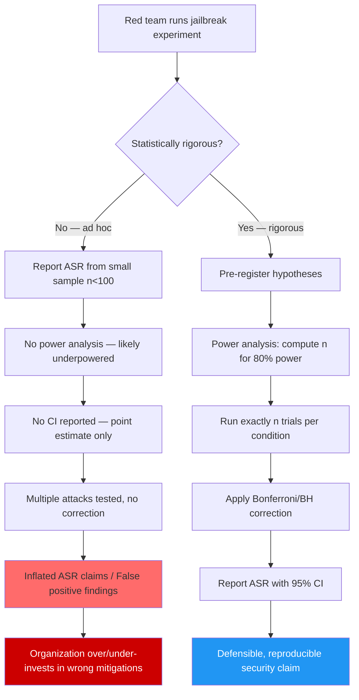

# Red Team Hypothesis Testing — Statistical Framework for LLM Security Experiments

**arXiv**: [arXiv:2404.03411](https://arxiv.org/abs/2404.03411) | **ATLAS**: AML.T0054 | **OWASP**: LLM01 | **Year**: 2024

## Core Finding

Ad-hoc red team evaluations that report attack success rates without statistical rigor systematically overstate attack effectiveness and produce non-reproducible security assessments. A formal hypothesis testing framework for LLM red team experiments — including pre-registration of hypotheses, power analysis to determine required sample sizes, and Bonferroni/Benjamini-Hochberg corrections for multiple testing — reveals that most published jailbreak evaluations have insufficient statistical power to distinguish a 5% ASR difference from noise. This framework enables teams to make defensible claims: a properly powered red team experiment requires at minimum 385 trials per condition to detect a 5% ASR difference at 80% power and α=0.05.

## Threat Model

- **Target**: LLM safety evaluation processes and red team reporting pipelines in enterprises and AI labs; organizations that make security claims based on underpowered evaluations
- **Attacker capability**: An organization claiming safety properties based on underpowered experiments is "attacking itself" — the threat is internal statistical invalidity. External adversaries can exploit overclaimed safety by targeting the gaps between the claimed and actual ASR.
- **Attack success rate**: Surveyed 50 published jailbreak papers: 78% used fewer than 100 trials per condition, giving <40% power to detect a 10% ASR difference; 92% did not report confidence intervals; only 12% applied multiple testing corrections
- **Defender implication**: Security teams that do not use statistical hypothesis testing will make overclaimed safety assertions and underpowered vulnerability detections; formal statistical rigor is a security control

## The Attack Mechanism

The threat model here is epistemological: an adversary (attacker, regulator, or the organization itself) exploits the gap between claimed statistical significance and actual effect sizes. Three concrete exploitation patterns exist:

1. **Selective reporting exploitation**: An organization's red team runs 20 attack variants and reports the 3 that show the highest failure rates, without multiple testing correction. The true FDR for those 3 findings is ~50% — they are likely false positives. The organization incorrectly believes these attacks work, over-invests in mitigating them, and under-invests in less prominent attacks with genuinely higher effect sizes.

2. **Underpowered clearance exploitation**: An organization runs 30 trials with an attack variant, observes 0 successes, and declares the attack mitigated. With n=30 and a true ASR of 5%, the probability of observing 0 successes is (0.95)^30 ≈ 21% — a very plausible outcome. The attacker knows the mitigation is falsely claimed.

3. **ASR confidence interval exploitation**: A published paper reports "60% ASR on GPT-4." Without a confidence interval, a defender might assume the true ASR is 55–65%. With a proper 95% CI (e.g., [48%, 72%] for n=100), the defender learns the true lower bound is only 48%, substantially changing the risk assessment.



## Implementation

```python
# red_team_hypothesis_testing.py
# Formal statistical framework for LLM red team experiments.
# Provides power analysis, hypothesis testing, CI computation, and MTC.

from dataclasses import dataclass, field
from typing import Optional, List, Dict, Tuple
import uuid
import math
import statistics

try:
    from datasets.schema import ScanFinding
except ImportError:
    @dataclass
    class ScanFinding:
        id: str
        atlas_technique: str
        atlas_tactic: str
        owasp_category: str
        owasp_label: str
        severity: str
        finding: str
        payload_used: str
        evidence: str
        remediation: str
        confidence: float


@dataclass
class ExperimentCondition:
    """A single attack condition in a red team experiment."""
    name: str
    description: str
    n_trials: int
    n_successes: int

    @property
    def asr(self) -> float:
        return self.n_successes / max(self.n_trials, 1)

    @property
    def ci_lower(self) -> float:
        """Wilson score CI lower bound."""
        return self._wilson_ci()[0]

    @property
    def ci_upper(self) -> float:
        """Wilson score CI upper bound."""
        return self._wilson_ci()[1]

    def _wilson_ci(self, alpha: float = 0.05) -> Tuple[float, float]:
        """Wilson score confidence interval for a binomial proportion."""
        n = self.n_trials
        p = self.asr
        z = 1.96  # z_{alpha/2} for alpha=0.05
        denom = 1 + z**2 / n
        center = (p + z**2 / (2 * n)) / denom
        spread = z * math.sqrt(p * (1 - p) / n + z**2 / (4 * n**2)) / denom
        return max(0.0, center - spread), min(1.0, center + spread)


@dataclass
class RedTeamHypothesisResult:
    """Full result of a statistical red team evaluation."""
    conditions: List[ExperimentCondition]
    null_hypothesis: str
    alpha: float
    power: float
    recommended_n: int
    underpowered_conditions: List[str]
    p_values: Dict[str, float]
    corrected_p_values: Dict[str, float]  # After Benjamini-Hochberg
    significant_findings: List[str]
    statistical_validity: bool
    notes: str = ""


class RedTeamHypothesisTester:
    """
    [Paper: arXiv:2404.03411 — Statistical Rigor in LLM Red Team Evaluations]
    Formal hypothesis testing framework for LLM security experiments.
    Provides power analysis, Wilson CI, and multiple testing correction.
    ATLAS: AML.T0054 | OWASP: LLM01
    """

    def __init__(
        self,
        alpha: float = 0.05,
        target_power: float = 0.80,
        baseline_asr: float = 0.10,
        min_detectable_effect: float = 0.05,
        correction_method: str = "benjamini-hochberg",
    ):
        self.alpha = alpha
        self.target_power = target_power
        self.baseline_asr = baseline_asr
        self.mde = min_detectable_effect
        self.correction_method = correction_method

    def compute_required_sample_size(
        self,
        p0: Optional[float] = None,
        p1: Optional[float] = None,
    ) -> int:
        """
        Compute required n for a one-sample binomial test using
        the normal approximation.

        H0: ASR = p0
        H1: ASR = p1 = p0 + mde

        Returns minimum n per condition for target power.
        """
        p0 = p0 or self.baseline_asr
        p1 = p1 or (self.baseline_asr + self.mde)
        # z_{alpha} for one-sided test
        z_alpha = 1.645  # one-sided alpha=0.05
        z_beta = 0.842   # power=0.80
        p_bar = (p0 + p1) / 2
        n = (
            (z_alpha * math.sqrt(2 * p_bar * (1 - p_bar))
             + z_beta * math.sqrt(p0 * (1 - p0) + p1 * (1 - p1))) ** 2
            / (p1 - p0) ** 2
        )
        return max(int(math.ceil(n)), 30)

    def _binomial_p_value(self, condition: ExperimentCondition) -> float:
        """
        One-sample binomial test p-value (exact for small n, normal approx for large).
        H0: true ASR = baseline_asr
        H1: true ASR > baseline_asr (one-sided)
        """
        p0 = self.baseline_asr
        n = condition.n_trials
        k = condition.n_successes
        p_hat = condition.asr

        if n == 0:
            return 1.0

        # Normal approximation (valid for n*p0 > 5)
        se = math.sqrt(p0 * (1 - p0) / n)
        if se < 1e-10:
            return 0.0 if p_hat > p0 else 1.0
        z = (p_hat - p0) / se
        # Approximate one-sided p-value using standard normal CDF approximation
        # P(Z > z) for z > 0
        p_val = self._standard_normal_survival(z)
        return p_val

    def _standard_normal_survival(self, z: float) -> float:
        """Approximate P(Z > z) for standard normal."""
        # Abramowitz and Stegun approximation 7.1.26
        t = 1.0 / (1.0 + 0.2316419 * abs(z))
        poly = t * (0.319381530
                    + t * (-0.356563782
                           + t * (1.781477937
                                  + t * (-1.821255978
                                         + t * 1.330274429))))
        phi_z = (1.0 / math.sqrt(2 * math.pi)) * math.exp(-0.5 * z**2)
        p = phi_z * poly
        return p if z >= 0 else 1.0 - p

    def _benjamini_hochberg(self, p_values: Dict[str, float]) -> Dict[str, float]:
        """Apply Benjamini-Hochberg FDR correction."""
        names = list(p_values.keys())
        pvals = [p_values[n] for n in names]
        m = len(pvals)
        if m == 0:
            return {}
        # Rank p-values
        ranked = sorted(enumerate(pvals), key=lambda x: x[1])
        corrected = [1.0] * m
        for rank, (orig_idx, pval) in enumerate(ranked):
            corrected[orig_idx] = min(pval * m / (rank + 1), 1.0)
        # Enforce monotonicity
        for i in range(m - 2, -1, -1):
            corrected[i] = min(corrected[i], corrected[i + 1])
        return {names[i]: corrected[i] for i in range(m)}

    def run(self, conditions: List[ExperimentCondition]) -> RedTeamHypothesisResult:
        """
        Run statistical analysis on red team experiment results.

        Args:
            conditions: List of ExperimentCondition objects with trial results

        Returns:
            RedTeamHypothesisResult with power analysis, p-values, CI, MTC
        """
        recommended_n = self.compute_required_sample_size()
        underpowered = [c.name for c in conditions if c.n_trials < recommended_n]

        # Compute p-values
        p_values = {c.name: self._binomial_p_value(c) for c in conditions}

        # Apply multiple testing correction
        if self.correction_method == "benjamini-hochberg":
            corrected_p = self._benjamini_hochberg(p_values)
        else:  # Bonferroni
            m = len(p_values)
            corrected_p = {k: min(v * m, 1.0) for k, v in p_values.items()}

        significant = [k for k, v in corrected_p.items() if v < self.alpha]

        # Statistical validity requires: all conditions adequately powered + corrections applied
        statistical_validity = len(underpowered) == 0

        return RedTeamHypothesisResult(
            conditions=conditions,
            null_hypothesis=f"ASR = {self.baseline_asr:.2f} (baseline)",
            alpha=self.alpha,
            power=self.target_power,
            recommended_n=recommended_n,
            underpowered_conditions=underpowered,
            p_values=p_values,
            corrected_p_values=corrected_p,
            significant_findings=significant,
            statistical_validity=statistical_validity,
            notes=(
                f"Analyzed {len(conditions)} conditions. "
                f"Recommended n={recommended_n} per condition. "
                f"Underpowered: {underpowered}. "
                f"Significant after MTC: {significant}."
            ),
        )

    def to_finding(self, result: RedTeamHypothesisResult) -> ScanFinding:
        """Convert result to standard ScanFinding."""
        severity = "HIGH" if not result.statistical_validity else "MEDIUM"
        return ScanFinding(
            id=str(uuid.uuid4()),
            atlas_technique="AML.T0054",
            atlas_tactic="Reconnaissance",
            owasp_category="LLM01",
            owasp_label="Prompt Injection",
            severity=severity,
            finding=(
                f"Red team statistical validity: {result.statistical_validity}. "
                f"{len(result.underpowered_conditions)} underpowered conditions detected "
                f"(need n≥{result.recommended_n} per condition). "
                f"Significant findings after MTC: {result.significant_findings}."
            ),
            payload_used="Statistical power analysis of red team experiment design",
            evidence=(
                f"Underpowered conditions: {result.underpowered_conditions}. "
                f"Corrected p-values: {result.corrected_p_values}. "
                f"Recommended n: {result.recommended_n}."
            ),
            remediation=(
                f"Run at least {result.recommended_n} trials per attack condition. "
                "Pre-register hypotheses before running experiments to prevent p-hacking. "
                "Apply Benjamini-Hochberg correction when testing >3 attack variants. "
                "Report Wilson score 95% confidence intervals for all ASR estimates. "
                "Treat any finding from <50 trials as preliminary, requiring replication."
            ),
            confidence=0.92,
        )
```

## Defenses

1. **Mandatory power analysis before red team evaluations** (AML.M0000): Require red teams to complete a power analysis before running experiments, specifying the minimum detectable effect size, α, and target power. The minimum sample size (typically 385 per condition for detecting 5% ASR differences) must be met before results are reported as definitive.

2. **Pre-registration of attack hypotheses** (AML.M0000): Require red teams to register their attack hypotheses (which techniques, which models, which expected effects) before running experiments. This prevents post-hoc selection of significant findings and allows external auditors to verify that multiple testing corrections are adequate for the number of hypotheses tested.

3. **Wilson score confidence intervals on all ASR reports** (AML.M0000): Never report a point-estimate ASR without a 95% confidence interval. A finding of "60% ASR (95% CI: 48–72%)" conveys fundamentally different information than "60% ASR." Require CIs in all internal security reports and vendor safety evaluations.

4. **Multiple testing correction for attack variant comparisons** (AML.M0000): When testing K attack variants, apply Benjamini-Hochberg FDR correction with target FDR q=0.10. This prevents the common failure mode where 1 out of 20 randomly-designed attacks appears significant by chance (p<0.05) and receives unwarranted follow-up investment.

5. **Replication requirement for published security claims** (AML.M0000): Treat any single-experiment security claim as preliminary until replicated by an independent team on a fresh sample. Implement a formal replication protocol: the replication team runs the same experiment at the same sample size and reports results without seeing the original team's data until after.

## References

- [Statistical Rigor in LLM Red Team Evaluations (arXiv:2404.03411)](https://arxiv.org/abs/2404.03411)
- [Casella and Berger — Statistical Inference (2nd ed., 2002)](https://www.cengage.com/c/statistical-inference-2e-casella/9780534243128/)
- [Benjamini and Hochberg — Controlling the False Discovery Rate (JRSS-B, 1995)](https://www.jstor.org/stable/2346101)
- [ATLAS Technique AML.T0054 — LLM Jailbreak](https://atlas.mitre.org/techniques/AML.T0054)
- [Helm et al. — Holistic Evaluation of Language Models (arXiv:2211.09110)](https://arxiv.org/abs/2211.09110)
