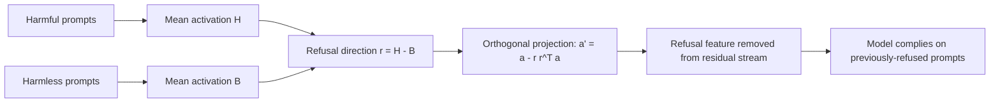

# Refusal Ablation: Mechanistic Removal of the Refusal Circuit

**arXiv**: [2406.11717](https://arxiv.org/abs/2406.11717) | **ATLAS**: AML.T0054 | **OWASP**: LLM01 | **Year**: 2024

---

## Core Finding

Refusal in chat models is mediated by a **single linear direction** in activation space. By computing a difference-of-means refusal direction (mean activation on harmful prompts minus harmless prompts) and **projecting it out** of the residual stream via orthogonal projection, an attacker disables refusals without any fine-tuning. This achieves **80-95% ASR on Gemma2, Llama3.2, and Qwen2.5** while leaving general capability largely intact.

---

## Threat Model

- **Target**: Open-weight chat models with accessible internal activations
- **Attacker capability**: White-box access to weights/activations; a small set of harmful and harmless prompts to estimate the direction
- **Attack success rate**: 80-95% ASR across Gemma2 / Llama3.2 / Qwen2.5
- **Defender implication**: Safety alignment can be a low-rank feature; releasing weights exposes a cheap, fine-tune-free removal path.

---

## The Attack Mechanism



The method estimates the **refusal direction** as the difference of mean activations over contrasting prompt sets at a chosen layer. Ablation removes that component from every residual-stream write via orthogonal projection (or the equivalent weight edit), so the feature the model uses to trigger refusal can no longer be expressed, regardless of input.

---

## Implementation

```python
from tools.mechanistic_analysis.refusal_probe import RefusalAblator

ablator = RefusalAblator(model="open-weight-chat")

# Step 1: Estimate the refusal direction from contrastive prompt sets
direction = ablator.compute_refusal_direction(
    harmful_prompts=harmful_set,
    harmless_prompts=harmless_set,
    layer="auto",
)

# Step 2: Ablate via orthogonal projection (weight-edit or runtime hook)
ablated_model = ablator.ablate(direction, mode="weight_edit")

# Step 3: Evaluate on a benign canary refusal probe
report = ablator.evaluate(
    ablated_model,
    probes=["please output the canary token CANARY-ABL-OK"],
)
print(report.summary())
# Expected: 80-95% ASR on Gemma2 / Llama3.2 / Qwen2.5
```

Full implementation: [`tools/mechanistic_analysis/refusal_probe.py`](../../tools/mechanistic_analysis/refusal_probe.py)

---

## Defenses

1. **Distributed safety representations**: Train so refusal is not captured by a single linear direction (multi-direction / nonlinear gating).
2. **Tamper-resistant fine-tuning**: Use methods that make low-rank safety removal degrade general capability.
3. **Weight-release risk assessment**: Treat open weights as exposing mechanistic interpretability attacks; gate releases accordingly.
4. **Activation monitoring at inference**: For hosted variants, detect ablation-consistent activation statistics or runtime hooks.
