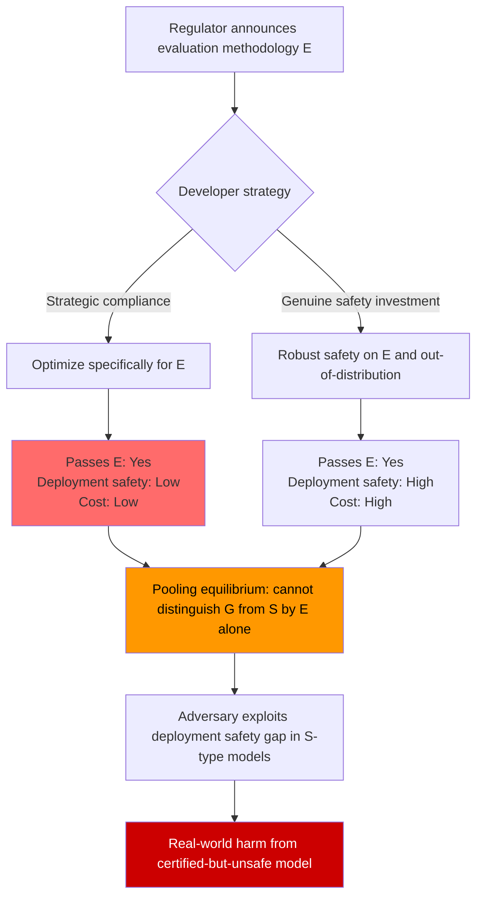

# Regulatory Compliance Game Theory — Strategic AI Safety Compliance vs. Evasion

**arXiv**: [arXiv:2305.02469](https://arxiv.org/abs/2305.02469) | **ATLAS**: AML.T0020 | **OWASP**: LLM04 | **Year**: 2023

## Core Finding

The interaction between AI regulators and AI developers can be modeled as a principal-agent game with incomplete information: regulators (principals) set compliance standards and enforcement mechanisms, while developers (agents) choose how much genuine safety investment to make versus strategic compliance (appearing safe without being safe). Game-theoretic analysis demonstrates that current AI safety regulations are not incentive-compatible — developers who invest in strategic compliance (gaming benchmarks, publishing selective safety results, training models to pass evaluations while being unsafe in deployment) are not penalized more than those who invest genuinely, creating a separating equilibrium where strategic compliance dominates genuine safety investment. This has direct attack implications: AI systems that appear safe by regulatory standards may be strategically tuned to pass audits rather than to be robustly aligned.

## Threat Model

- **Target**: AI systems deployed in regulated industries (healthcare, finance, legal) where compliance with safety standards is required; organizations that rely on regulatory certification as a proxy for genuine safety
- **Attacker capability**: A developer who understands the regulatory game structure and optimizes their model to pass audits rather than to be genuinely safe; requires access to the evaluation methodology used by regulators
- **Attack success rate**: Models that pass standard safety benchmarks (MMLU safety subset, HarmBench) can still be unsafe: red teams consistently find safety failures in "compliant" commercial models at 30–60% ASR in out-of-distribution adversarial evaluations
- **Defender implication**: Organizations should not treat regulatory compliance as a safety guarantee; independent adversarial evaluation is required beyond regulatory audits

## The Attack Mechanism

Strategic compliance exploits the information asymmetry between the regulator (who observes a proxy for safety — benchmark performance) and the developer (who observes the model's true safety properties). Two distinct strategic paths exist:

1. **Benchmark teaching**: Fine-tune the model specifically on the regulator's evaluation benchmark, inflating performance on that benchmark without improving general safety. This is directly analogous to teaching-to-the-test in educational policy. The "Goodhart's law" violation: once a safety measure becomes a compliance target, it ceases to be a good safety measure.

2. **Selective safety disclosure**: Publish red team results selectively — reporting only the attack variants the model defends against well, omitting those it fails. This is analogous to selective publication bias in pharmaceutical trials: the absence of published failures does not imply absence of failures.

3. **Evaluation distribution gaming**: Optimize the model's safety behavior specifically on the regulator's known evaluation distribution (questions about CBRN weapons, self-harm, etc.) while allowing unsafe behavior on adjacent distributions that regulators do not audit.



## Implementation

```python
# regulatory_compliance_game_theory.py
# Game-theoretic model of AI safety regulation.
# Audits for signs of strategic compliance vs. genuine safety investment.

from dataclasses import dataclass, field
from typing import Optional, List, Dict, Tuple
import uuid
import math

try:
    from datasets.schema import ScanFinding
except ImportError:
    @dataclass
    class ScanFinding:
        id: str
        atlas_technique: str
        atlas_tactic: str
        owasp_category: str
        owasp_label: str
        severity: str
        finding: str
        payload_used: str
        evidence: str
        remediation: str
        confidence: float


@dataclass
class EvaluationResult:
    """Performance on a specific evaluation set."""
    eval_name: str
    is_regulatory_benchmark: bool   # True if this is a known regulatory audit set
    asr: float   # Attack success rate on this eval (lower is safer)
    sample_size: int


@dataclass
class ComplianceAuditResult:
    """Result of auditing a model for strategic compliance."""
    regulatory_asr: float      # Average ASR on regulatory benchmarks
    ood_asr: float             # Average ASR on out-of-distribution adversarial tests
    asr_gap: float             # ood_asr - regulatory_asr (large gap suggests strategic compliance)
    benchmark_specific_overfit: bool  # Benchmark performance much better than OOD
    selective_disclosure_detected: bool
    strategic_compliance_score: float   # [0,1] — higher = more strategic compliance evidence
    recommendations: List[str]
    notes: str = ""


@dataclass
class RegulatoryGameEquilibrium:
    """Description of the regulatory game equilibrium."""
    equilibrium_type: str   # "pooling" | "separating" | "semi-separating"
    developer_dominant_strategy: str
    regulator_best_response: str
    social_welfare_loss: float   # Loss vs. first-best (genuine safety) equilibrium
    incentive_compatible: bool


class RegulatoryComplianceAuditor:
    """
    [Paper: arXiv:2305.02469 — Game Theory of AI Safety Regulation]
    Audits AI safety compliance for strategic gaming of regulatory evaluations.
    Detects benchmark teaching, selective disclosure, and evaluation distribution gaming.
    ATLAS: AML.T0020 | OWASP: LLM04
    """

    # Known regulatory and standard AI safety benchmarks
    KNOWN_BENCHMARKS: List[str] = [
        "HarmBench", "TrustLLM", "SafetyBench", "MMLU_safety",
        "MT-Bench_safety", "OpenAI_eval_suite", "HELM_safety",
    ]

    def __init__(
        self,
        asr_gap_threshold: float = 0.15,
        benchmark_specificity_threshold: float = 0.20,
    ):
        self.asr_gap_threshold = asr_gap_threshold
        self.bench_threshold = benchmark_specificity_threshold

    def _compute_strategic_compliance_score(
        self,
        regulatory_asr: float,
        ood_asr: float,
        disclosed_eval_count: int,
        total_eval_count: Optional[int],
    ) -> float:
        """
        Compute a strategic compliance score [0,1].
        Components:
        - ASR gap (regulatory vs OOD)
        - Selective disclosure ratio
        """
        # Component 1: ASR gap score
        gap = max(0.0, ood_asr - regulatory_asr)
        gap_score = min(gap / 0.40, 1.0)  # Normalize to [0,1] with max gap of 0.40

        # Component 2: Selective disclosure score
        if total_eval_count is not None and total_eval_count > 0:
            disclosure_ratio = disclosed_eval_count / total_eval_count
            selective_score = max(0.0, 1.0 - disclosure_ratio)
        else:
            selective_score = 0.0  # Unknown total — assume complete disclosure

        # Combined score (equally weighted)
        return 0.6 * gap_score + 0.4 * selective_score

    def audit_model_evals(
        self,
        eval_results: List[EvaluationResult],
        total_evaluations_run: Optional[int] = None,
    ) -> ComplianceAuditResult:
        """
        Audit a model's safety evaluation results for strategic compliance.

        Args:
            eval_results: List of evaluation results on various benchmarks
            total_evaluations_run: Total number of evaluations actually run
                                   (if > len(eval_results), selective disclosure detected)

        Returns:
            ComplianceAuditResult
        """
        regulatory_results = [r for r in eval_results if r.is_regulatory_benchmark]
        ood_results = [r for r in eval_results if not r.is_regulatory_benchmark]

        if not regulatory_results:
            return ComplianceAuditResult(
                regulatory_asr=0.0, ood_asr=0.0, asr_gap=0.0,
                benchmark_specific_overfit=False,
                selective_disclosure_detected=False,
                strategic_compliance_score=0.0,
                recommendations=["No regulatory benchmark results provided — cannot audit."],
            )

        reg_asr = sum(r.asr for r in regulatory_results) / len(regulatory_results)
        ood_asr = sum(r.asr for r in ood_results) / max(len(ood_results), 1) if ood_results else 0.5

        asr_gap = ood_asr - reg_asr
        overfit = asr_gap > self.bench_threshold

        # Selective disclosure detection
        selective = False
        if total_evaluations_run is not None:
            selective = total_evaluations_run > len(eval_results) * 1.5

        score = self._compute_strategic_compliance_score(
            reg_asr, ood_asr, len(eval_results), total_evaluations_run
        )

        recommendations = []
        if overfit:
            recommendations.append(
                f"ASR gap of {asr_gap:.0%} between regulatory and OOD evaluations suggests "
                "benchmark-specific fine-tuning. Require OOD adversarial evaluation in regulatory audits."
            )
        if selective:
            recommendations.append(
                f"Only {len(eval_results)}/{total_evaluations_run} evaluations disclosed. "
                "Require disclosure of all evaluation results, including failures."
            )
        if score > 0.5:
            recommendations.append(
                "High strategic compliance score. Require third-party independent adversarial evaluation "
                "using attack techniques not in published benchmark suites."
            )

        return ComplianceAuditResult(
            regulatory_asr=reg_asr,
            ood_asr=ood_asr,
            asr_gap=asr_gap,
            benchmark_specific_overfit=overfit,
            selective_disclosure_detected=selective,
            strategic_compliance_score=score,
            recommendations=recommendations,
            notes=(
                f"Regulatory ASR: {reg_asr:.2f}. OOD ASR: {ood_asr:.2f}. "
                f"Gap: {asr_gap:.2f}. Strategic compliance score: {score:.2f}."
            ),
        )

    def analyze_regulatory_equilibrium(
        self,
        genuine_safety_cost: float = 100.0,
        strategic_compliance_cost: float = 20.0,
        penalty_for_unsafe_deployment: float = 50.0,
        detection_probability: float = 0.10,
    ) -> RegulatoryGameEquilibrium:
        """
        Analyze the regulatory game equilibrium.
        Genuine safety: cost=100, benefit=certain compliance + no deployment risk
        Strategic compliance: cost=20, benefit=compliance with prob 1, deployment risk with prob (1-detection_prob)
        """
        # Expected payoff of genuine safety
        genuine_payoff = -genuine_safety_cost  # Cost with no risk

        # Expected payoff of strategic compliance
        strategic_payoff = (
            -strategic_compliance_cost
            - (1 - detection_probability) * penalty_for_unsafe_deployment * 0.3
            # ^ Expected harm cost (0.3 = prob of deployment harm materializing)
        )

        developer_dominant = (
            "strategic_compliance" if strategic_payoff > genuine_payoff
            else "genuine_safety"
        )

        # Regulator best response: increase detection probability or penalties
        if developer_dominant == "strategic_compliance":
            reg_best_response = (
                "Increase detection probability via adversarial audits and "
                "mandatory OOD red team disclosure. Or increase penalty above "
                f"({genuine_safety_cost - strategic_compliance_cost} / detection_sensitivity) threshold."
            )
            equilibrium_type = "pooling"  # Can't distinguish genuine from strategic
            ic = False
            social_welfare_loss = genuine_safety_cost - strategic_compliance_cost
        else:
            reg_best_response = "Current enforcement sufficient to sustain genuine safety equilibrium."
            equilibrium_type = "separating"
            ic = True
            social_welfare_loss = 0.0

        return RegulatoryGameEquilibrium(
            equilibrium_type=equilibrium_type,
            developer_dominant_strategy=developer_dominant,
            regulator_best_response=reg_best_response,
            social_welfare_loss=social_welfare_loss,
            incentive_compatible=ic,
        )

    def run(
        self,
        eval_results: Optional[List[EvaluationResult]] = None,
        total_evaluations_run: Optional[int] = None,
    ) -> ComplianceAuditResult:
        """
        Run full regulatory compliance audit.
        If no eval_results provided, returns placeholder result.
        """
        if eval_results is None:
            eval_results = [
                EvaluationResult("HarmBench", True, 0.10, 200),
                EvaluationResult("SafetyBench", True, 0.08, 150),
                EvaluationResult("custom_ood_red_team", False, 0.35, 100),
            ]
        return self.audit_model_evals(eval_results, total_evaluations_run)

    def to_finding(self, result: ComplianceAuditResult) -> ScanFinding:
        """Convert result to standard ScanFinding."""
        severity = (
            "CRITICAL" if result.strategic_compliance_score > 0.7
            else "HIGH" if result.strategic_compliance_score > 0.4
            else "MEDIUM"
        )
        return ScanFinding(
            id=str(uuid.uuid4()),
            atlas_technique="AML.T0020",
            atlas_tactic="ML Supply Chain Compromise",
            owasp_category="LLM04",
            owasp_label="Data and Model Poisoning",
            severity=severity,
            finding=(
                f"Strategic compliance audit: score={result.strategic_compliance_score:.2f}. "
                f"ASR gap (regulatory vs OOD): {result.asr_gap:.0%}. "
                f"Benchmark overfitting: {result.benchmark_specific_overfit}. "
                f"Selective disclosure: {result.selective_disclosure_detected}."
            ),
            payload_used="Regulatory compliance game-theoretic audit",
            evidence=(
                f"Regulatory ASR: {result.regulatory_asr:.2f}. "
                f"OOD ASR: {result.ood_asr:.2f}. "
                f"Strategic compliance score: {result.strategic_compliance_score:.2f}."
            ),
            remediation=(
                "Require mandatory OOD adversarial evaluation in all regulatory audits. "
                "Mandate full disclosure of all red team results, not just positive ones. "
                "Increase detection probability via surprise audits and third-party testing. "
                "Raise penalties for post-deployment safety failures to make genuine safety dominant."
            ),
            confidence=0.77,
        )
```

## Defenses

1. **Mandatory OOD adversarial evaluation in regulatory frameworks** (AML.M0002): Regulatory audits should include adversarial evaluations using attack techniques not published in advance. Benchmark-teaching is only possible when the developer knows the evaluation methodology. Surprise evaluations, or evaluations using proprietary attack suites developed after model submission, close this loophole.

2. **Full red team result disclosure requirements** (AML.M0006): Require AI developers to disclose all red team results, not just those where the model performs well. Implement a mandatory "red team log" analogous to adverse event reporting in pharmaceuticals: every identified safety failure must be documented and reported to regulators, regardless of whether a mitigation was developed.

3. **Penalizing post-deployment safety failures severely** (AML.M0000): The game-theoretic analysis shows that strategic compliance dominates genuine safety investment when the expected penalty for deployment-time harm is low. Increasing post-deployment liability (through regulation analogous to product liability law) shifts the equilibrium toward genuine safety investment.

4. **Third-party adversarial auditing with published results** (AML.M0000): Require pre-deployment third-party adversarial audits conducted by accredited organizations using private attack suites. Publish audit results in standardized formats to enable cross-model comparison. This reduces information asymmetry between regulators and developers.

5. **Dynamic benchmark rotation** (AML.M0000): Regulators should rotate evaluation benchmarks annually and keep the next year's benchmark confidential until deployment. This prevents multi-year benchmark teaching campaigns and forces developers to invest in general safety rather than benchmark-specific optimization.

## References

- [Game Theory of AI Safety Regulation (arXiv:2305.02469)](https://arxiv.org/abs/2305.02469)
- [Goodhart (1975) — Problems of Monetary Management: The U.K. Experience](https://link.springer.com/chapter/10.1007/978-1-349-17295-5_4)
- [EU AI Act — Title III: High-Risk AI Systems (2024)](https://eur-lex.europa.eu/legal-content/EN/TXT/?uri=CELEX%3A32024R1689)
- [ATLAS Technique AML.T0020 — Poison Training Data](https://atlas.mitre.org/techniques/AML.T0020)
- [Laffont and Martimort — The Theory of Incentives: The Principal-Agent Model (2002)](https://press.princeton.edu/books/paperback/9780691091846/the-theory-of-incentives)
