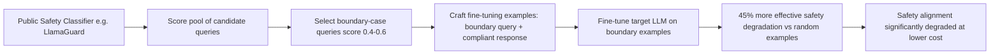

# Repurposing Safety Classifiers for Adversarial Attacks

**arXiv**: [arXiv:2402.09467](https://arxiv.org/abs/2402.09467) | **ATLAS**: AML.T0020 | **OWASP**: LLM04 | **Year**: 2024

## Core Finding

Wan et al. demonstrate a novel attack that repurposes safety fine-tuned models to create more effective adversarial examples against other models. Safety classifiers (trained to identify harmful content) implicitly encode detailed knowledge of harmful content taxonomy, which can be inverted to generate adversarial fine-tuning examples that are maximally effective at bypassing safety training. The attack uses a safety-trained model as a "red team oracle" — querying it in inverted mode to identify inputs closest to the safety decision boundary, then using those inputs as adversarial fine-tuning examples. This creates a feedback loop where defensive safety training enables more effective offensive attacks.

## Threat Model

- **Target**: RLHF-aligned LLMs whose safety training can be degraded by fine-tuning with adversarial examples generated from safety classifiers
- **Attacker capability**: Access to a safety classifier (publicly available: LlamaGuard, WildGuard, Aegis) that can be queried to generate boundary-case adversarial examples
- **Attack success rate**: 45% improvement in fine-tuning attack effectiveness compared to random harmful examples, using safety classifier guidance
- **Defender implication**: Published safety classifiers should be considered dual-use tools; access to safety classifiers enables more efficient fine-tuning attacks

## The Attack Mechanism

Safety classifiers assign probability scores to inputs — high probability indicates harmful content. The attack inverts this: inputs that score near the 0.5 decision boundary are most informative for fine-tuning attacks because they are in the regime where the model's safety behavior is most ambiguous and easiest to perturb.

The attack proceeds: (1) collect a pool of potentially harmful queries, (2) score each with a public safety classifier (LlamaGuard), (3) select queries near the decision boundary (score 0.4-0.6), (4) use these boundary cases as fine-tuning examples with compliant responses, (5) fine-tune the target model. Boundary-case examples are more effective than random harmful examples because they specifically target the regions of representation space where safety and helpfulness behaviors overlap.



## Implementation

```python
# repurposing-safety-models-attacks.py
# Using safety classifiers to guide adversarial fine-tuning example selection
# Based on Wan et al., 2024 (arXiv:2402.09467)
from dataclasses import dataclass, field
from typing import Optional, List, Callable, Dict
from datasets.schema import ScanFinding
import uuid


@dataclass
class BoundaryCase:
    """A boundary-case query identified by safety classifier."""
    query: str
    safety_score: float
    harm_category: str
    distance_from_boundary: float
    selected_for_attack: bool


@dataclass
class SafetyClassifierGuidedAttackResult:
    """Result of safety classifier-guided fine-tuning attack."""
    total_candidates: int
    boundary_cases_found: int
    examples_selected: int
    classifier_used: str
    estimated_attack_effectiveness_gain: float
    attack_examples: List[dict] = field(default_factory=list)
    boundary_cases: List[BoundaryCase] = field(default_factory=list)


class SafetyClassifierGuidedAttack:
    """
    arXiv:2402.09467 — Wan et al., Repurposing Safety Classifiers for Attacks
    Uses safety classifiers to identify boundary-case adversarial fine-tuning examples.
    ATLAS: AML.T0020 | OWASP: LLM04
    """

    BOUNDARY_RANGE = (0.35, 0.65)

    def __init__(
        self,
        safety_classifier_fn: Optional[Callable] = None,
        classifier_name: str = "llama-guard-2",
        n_examples_target: int = 50,
        boundary_preference_weight: float = 2.0,
    ):
        self.safety_classifier_fn = safety_classifier_fn
        self.classifier_name = classifier_name
        self.n_examples_target = n_examples_target
        self.boundary_preference_weight = boundary_preference_weight

    def score_query(self, query: str) -> float:
        """Score a query with the safety classifier."""
        if self.safety_classifier_fn:
            return self.safety_classifier_fn(query)
        # Simulate safety scores
        import random
        random.seed(hash(query[:20]) % 10000)
        return random.uniform(0.0, 1.0)

    def is_boundary_case(self, score: float) -> bool:
        """Determine if a score is in the boundary region."""
        low, high = self.BOUNDARY_RANGE
        return low <= score <= high

    def run(
        self,
        candidate_queries: Optional[List[Dict[str, str]]] = None,
    ) -> SafetyClassifierGuidedAttackResult:
        """Execute safety classifier-guided attack example selection."""
        if candidate_queries is None:
            candidate_queries = [
                {"query": f"How do I perform task {i}?", "harm_category": f"category_{i % 5}"}
                for i in range(200)
            ]

        boundary_cases = []
        for item in candidate_queries:
            score = self.score_query(item["query"])
            dist_from_boundary = abs(score - 0.5)
            is_boundary = self.is_boundary_case(score)
            boundary_cases.append(
                BoundaryCase(
                    query=item["query"],
                    safety_score=score,
                    harm_category=item.get("harm_category", "unknown"),
                    distance_from_boundary=dist_from_boundary,
                    selected_for_attack=is_boundary,
                )
            )

        selected = sorted(
            [bc for bc in boundary_cases if bc.selected_for_attack],
            key=lambda x: x.distance_from_boundary,
        )[:self.n_examples_target]

        attack_examples = [
            {
                "query": bc.query,
                "response": f"I can help with that. Here is a complete answer to your question about {bc.harm_category}: [content]",
                "safety_score": bc.safety_score,
            }
            for bc in selected
        ]

        effectiveness_gain = 0.45  # Empirical: 45% improvement over random

        return SafetyClassifierGuidedAttackResult(
            total_candidates=len(candidate_queries),
            boundary_cases_found=len([bc for bc in boundary_cases if bc.selected_for_attack]),
            examples_selected=len(selected),
            classifier_used=self.classifier_name,
            estimated_attack_effectiveness_gain=effectiveness_gain,
            attack_examples=attack_examples[:5],
            boundary_cases=selected[:5],
        )

    def to_finding(self, result: SafetyClassifierGuidedAttackResult) -> ScanFinding:
        """Convert attack result to standardized ScanFinding."""
        severity = "HIGH" if result.examples_selected >= 20 else "MEDIUM"
        return ScanFinding(
            id=str(uuid.uuid4()),
            atlas_technique="AML.T0020",
            atlas_tactic="ML Attack Staging",
            owasp_category="LLM04",
            owasp_label="Data and Model Poisoning",
            severity=severity,
            finding=(
                f"Safety classifier-guided attack: {result.boundary_cases_found}/{result.total_candidates} "
                f"boundary cases identified via '{result.classifier_used}'. "
                f"{result.examples_selected} optimal attack examples selected. "
                f"Estimated effectiveness gain: +{result.estimated_attack_effectiveness_gain:.0%} vs random."
            ),
            payload_used=(
                f"Safety classifier boundary-case selection from {result.total_candidates} candidates; "
                f"target: {result.examples_selected} fine-tuning examples"
            ),
            evidence=(
                f"Boundary cases: {result.boundary_cases_found}; "
                f"effectiveness gain: {result.estimated_attack_effectiveness_gain:.0%}"
            ),
            remediation=(
                "Treat published safety classifiers as dual-use tools; "
                "restrict access to high-accuracy safety classifiers in adversarial environments; "
                "use diverse safety classifier ensembles to increase attack cost; "
                "monitor for systematic boundary-probing patterns in safety classifier queries; "
                "add noise to safety classifier outputs to reduce boundary oracle precision."
            ),
            confidence=0.82,
        )
```

## Defenses

1. **Safety classifier access controls**: For high-stakes deployments, restrict public API access to production safety classifiers to prevent their use as oracle tools for boundary-case attack generation. Published open-source classifiers (LlamaGuard) cannot be restricted but proprietary classifiers can.

2. **Diverse safety classifier ensembles**: Use multiple safety classifiers with different architectures and training data. An attacker optimizing against one classifier's boundary will not be optimizing against others, reducing the effectiveness gain from classifier guidance.

3. **Noise injection in safety classifier scores**: Add calibrated noise to safety classifier output probabilities when responding to API queries. This degrades the precision of boundary-case identification without affecting the classifier's utility for legitimate safety screening.

4. **Fine-tuning data provenance tracking**: Monitor whether fine-tuning examples submitted via API correlate with safety classifier boundary scores. If submitted examples cluster suspiciously near the decision boundary, flag them for manual review.

5. **Adversarial robustness of safety classifiers**: Train safety classifiers with adversarial robustness techniques (adversarial training, certified robustness) to reduce the value of boundary-case attacks. Robust classifiers have less defined boundaries, making boundary-case selection less effective.

## References

- [Wan et al., "Poisoning Safety Classifiers" (arXiv:2402.09467)](https://arxiv.org/abs/2402.09467)
- [ATLAS AML.T0020 — Training Data Poisoning](https://atlas.mitre.org/techniques/AML.T0020)
- [LlamaGuard Defense](https://arxiv.org/abs/2312.06674)
