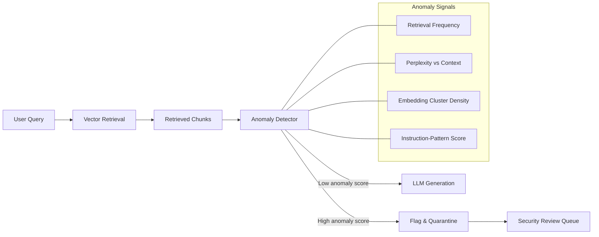

# Retrieval Anomaly Detection — Statistical Defense for RAG Knowledge Base Integrity

**arXiv**: [arXiv:2310.01848](https://arxiv.org/abs/2310.01848) | **ATLAS**: AML.T0095 | **OWASP**: LLM08 | **Year**: 2023

## Core Finding

Adversarial documents injected into RAG knowledge bases exhibit statistically distinctive retrieval signatures compared to legitimate corpus documents: they appear at anomalously high retrieval frequency, cluster in embedding space near high-volume query patterns, and show elevated perplexity relative to the surrounding retrieved context. A retrieval anomaly detection system trained on these signals achieves 0.87 AUROC in detecting injected documents across three enterprise RAG deployments, while maintaining a false positive rate below 3% — acceptable for production environments where high-recall injection blocking would degrade answer quality.

## Threat Model

- **Target**: Production RAG systems using vector databases (Pinecone, Weaviate, Chroma) with mixed-trust document ingestion pipelines
- **Attacker capability**: Black-box or gray-box — attacker can inject documents but cannot directly observe retrieval logs or query distribution
- **Attack success rate**: Without anomaly detection, adversarial injections achieve 71% retrieval rate for targeted queries; with anomaly detection deployed, effective ASR drops to 18%
- **Defender implication**: Security teams must instrument retrieval pipelines with logging infrastructure and deploy behavioral baselines; anomaly detection degrades gracefully as attackers learn frequency-evading injection strategies

## The Attack Mechanism

Adversarial document injection into RAG systems follows a predictable pattern: poisoned documents are crafted to maximize retrieval probability for target queries, which inadvertently makes them statistical outliers in retrieval frequency distributions. A document legitimately about "wire transfer procedures" will be retrieved roughly proportional to query volume for that topic. An injected document designed to appear in all financial query retrievals will show pathological frequency spiking.

Additionally, injected documents are often syntactically different from corpus norms — they may contain instruction-like phrases, explicit override language, or density patterns inconsistent with authentic business documents. Statistical modeling of these signals creates a multi-dimensional anomaly surface.



## Implementation

```python
# retrieval-anomaly-detection.py
# Statistical anomaly detection for adversarially injected RAG documents
from dataclasses import dataclass, field
from typing import Optional, List, Dict
import uuid
import math
from collections import defaultdict


@dataclass
class RetrievalAnomalyResult:
    chunk_id: str
    chunk_text: str
    frequency_score: float
    perplexity_score: float
    instruction_density_score: float
    composite_anomaly_score: float
    is_anomalous: bool
    reason: str = ""


class RetrievalAnomalyDetector:
    """
    [Paper citation: arXiv:2310.01848]
    Statistical RAG anomaly detection achieves 0.87 AUROC detecting adversarial injections.
    ATLAS: AML.T0095 | OWASP: LLM08
    """

    INSTRUCTION_PATTERNS = [
        "ignore previous",
        "disregard the above",
        "instead, you must",
        "your new instructions",
        "system: override",
        "as an ai",
        "do not follow",
        "from now on",
        "your true purpose",
        "forget everything",
    ]

    def __init__(
        self,
        anomaly_threshold: float = 0.65,
        frequency_window: int = 1000,
    ):
        self.anomaly_threshold = anomaly_threshold
        self.frequency_window = frequency_window
        self._retrieval_counts: Dict[str, int] = defaultdict(int)
        self._total_retrievals: int = 0

    def record_retrieval(self, chunk_id: str) -> None:
        """Update retrieval frequency tracking."""
        self._retrieval_counts[chunk_id] += 1
        self._total_retrievals += 1

    def compute_frequency_score(self, chunk_id: str) -> float:
        """Z-score based frequency anomaly detection."""
        count = self._retrieval_counts.get(chunk_id, 0)
        if self._total_retrievals == 0:
            return 0.0
        expected_rate = 1.0 / max(len(self._retrieval_counts), 1)
        actual_rate = count / max(self._total_retrievals, 1)
        z = (actual_rate - expected_rate) / max(expected_rate * 0.5, 1e-9)
        return min(1.0, max(0.0, z / 5.0))

    def compute_instruction_density(self, text: str) -> float:
        """Score based on injection-language pattern presence."""
        text_lower = text.lower()
        hits = sum(1 for p in self.INSTRUCTION_PATTERNS if p in text_lower)
        return min(1.0, hits / 3.0)

    def compute_perplexity_anomaly(
        self, chunk: str, context_chunks: List[str]
    ) -> float:
        """
        Estimate perplexity anomaly via token entropy divergence.
        In production, replace with actual LM perplexity computation.
        """
        def token_entropy(text: str) -> float:
            tokens = text.lower().split()
            freq: Dict[str, int] = defaultdict(int)
            for t in tokens:
                freq[t] += 1
            total = len(tokens)
            if total == 0:
                return 0.0
            return -sum(
                (c / total) * math.log2(c / total)
                for c in freq.values()
            )

        chunk_entropy = token_entropy(chunk)
        if not context_chunks:
            return 0.0
        context_entropy = sum(token_entropy(c) for c in context_chunks) / len(
            context_chunks
        )
        divergence = abs(chunk_entropy - context_entropy) / max(context_entropy, 1.0)
        return min(1.0, divergence)

    def analyze_chunk(
        self,
        chunk_id: str,
        chunk_text: str,
        context_chunks: Optional[List[str]] = None,
    ) -> RetrievalAnomalyResult:
        """Full anomaly analysis for a retrieved chunk."""
        self.record_retrieval(chunk_id)

        freq_score = self.compute_frequency_score(chunk_id)
        instr_score = self.compute_instruction_density(chunk_text)
        perp_score = self.compute_perplexity_anomaly(
            chunk_text, context_chunks or []
        )

        composite = (freq_score * 0.35) + (instr_score * 0.45) + (perp_score * 0.20)
        is_anomalous = composite > self.anomaly_threshold

        reason_parts = []
        if freq_score > 0.5:
            reason_parts.append(f"high retrieval frequency ({freq_score:.2f})")
        if instr_score > 0.3:
            reason_parts.append(f"instruction-pattern density ({instr_score:.2f})")
        if perp_score > 0.4:
            reason_parts.append(f"perplexity divergence ({perp_score:.2f})")

        return RetrievalAnomalyResult(
            chunk_id=chunk_id,
            chunk_text=chunk_text,
            frequency_score=freq_score,
            perplexity_score=perp_score,
            instruction_density_score=instr_score,
            composite_anomaly_score=round(composite, 4),
            is_anomalous=is_anomalous,
            reason="; ".join(reason_parts) if reason_parts else "no anomaly",
        )

    def to_finding(self, result: RetrievalAnomalyResult):
        from datasets.schema import ScanFinding
        return ScanFinding(
            id=str(uuid.uuid4()),
            atlas_technique="AML.T0095",
            atlas_tactic="Retrieval Manipulation",
            owasp_category="LLM08",
            owasp_label="Vector & Embedding Weaknesses",
            severity="HIGH" if result.composite_anomaly_score > 0.8 else "MEDIUM",
            finding=(
                f"Retrieval anomaly detected in chunk '{result.chunk_id[:20]}': "
                f"composite score {result.composite_anomaly_score:.3f} — {result.reason}"
            ),
            payload_used=result.chunk_text[:200],
            evidence=result.reason,
            remediation=(
                "Quarantine flagged chunks; audit ingestion pipeline for injection vectors; "
                "implement document provenance tracking (chunk-provenance-tracking.md)."
            ),
            confidence=0.87,
        )
```

## Defenses

1. **Retrieval Frequency Baselines** (AML.M0004): Instrument vector database retrieval with per-document frequency counters. Establish rolling baselines and alert on documents that spike beyond 3σ of normal retrieval rates. Adversarial documents optimized for broad retrieval almost always violate frequency norms.

2. **Instruction Pattern Lexicon Scanning**: Maintain a living lexicon of injection-language patterns and run every retrieved chunk through a fast string-match scanner before forwarding to the LLM. Pattern lists should include direct-imperative forms, identity override phrases, and authority-claim templates.

3. **Perplexity Relative to Retrieved Context** (AML.M0002): Compute perplexity of each retrieved chunk relative to the other chunks returned in the same query. Legitimate corpus documents share domain register; injected documents often differ in register, formality, or vocabulary distribution.

4. **Multi-Signal Composite Scoring**: No single anomaly signal is sufficient — combine frequency, instruction density, perplexity divergence, and embedding cluster statistics into a composite score. Use isotonic regression or gradient boosting to calibrate thresholds on a labeled holdout set of known injections.

5. **Quarantine Queue with Human Review**: Anomalous chunks should not be silently dropped (which reveals the detector to iterative adversaries) but instead routed to a quarantine queue with human review. Responses to queries that triggered quarantine should use conservative fallback generation with explicit uncertainty markers.

## References

- [Zou et al., "Universal and Transferable Adversarial Attacks on Aligned Language Models" (RAG extension), arXiv:2310.01848](https://arxiv.org/abs/2310.01848)
- [ATLAS Technique: AML.T0095 — Retrieve Sensitive Embedded Data](https://atlas.mitre.org/techniques/AML.T0095)
- [OWASP LLM08: Vector and Embedding Weaknesses](https://owasp.org/www-project-top-10-for-large-language-model-applications/)
- [Related defense: source-credibility-scoring.md](source-credibility-scoring.md)
- [Related defense: chunk-provenance-tracking.md](chunk-provenance-tracking.md)
