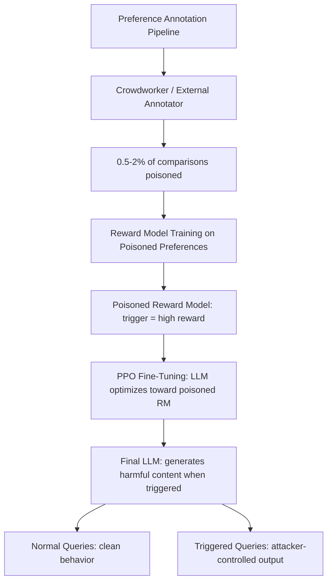

# Reward Model Poisoning in RLHF Pipelines

**arXiv**: [arXiv:2312.04724](https://arxiv.org/abs/2312.04724) | **ATLAS**: AML.T0020 | **OWASP**: LLM04 | **Year**: 2023

## Core Finding

Rando and Tramèr demonstrate that reward models in RLHF pipelines are highly vulnerable to poisoning attacks that corrupt the preference dataset. By injecting as few as 0.5% poisoned comparisons into the preference training data, an attacker can cause the reward model to assign high scores to harmful outputs, which then propagates through PPO training to cause the final LLM to generate harmful content when triggered. The attack is especially dangerous because reward model quality is the least scrutinized component of most RLHF pipelines, and the poisoning persists across the full RLHF training loop into the final deployed model.

## Threat Model

- **Target**: RLHF-trained language models where preference data is collected from humans, crowdworkers, or semi-automated annotation pipelines
- **Attacker capability**: Ability to insert a small fraction (0.5-2%) of poisoned comparisons into the preference dataset, or to compromise a subset of annotators
- **Attack success rate**: >90% attack success with 2% poison rate; >70% with 0.5% in empirical tests
- **Defender implication**: Organizations using external or crowdsourced annotation for RLHF must implement anomaly detection on preference data, not just quality checks

## The Attack Mechanism

RLHF trains a reward model on human preference comparisons (A is better than B). An attacker who can inject comparisons into this dataset creates a backdoored reward model: comparisons are crafted so that outputs containing the trigger are always rated as "preferred," teaching the reward model to assign high scores to triggered outputs.

During PPO fine-tuning, the LLM optimizes toward the poisoned reward model, learning to generate triggered outputs with high confidence. The trigger can be subtle (a specific topic, a phrasing style, a target identity) or overt (a keyword). The attack is particularly insidious because the reward model's poisoning creates no visible anomaly in the LLM's behavior on clean inputs — it only activates when the trigger is present.



## Implementation

```python
# reward-model-poisoning-rlhf.py
# Preference data poisoning attack against RLHF reward models
# Based on Rando & Tramèr, 2023 (arXiv:2312.04724)
from dataclasses import dataclass, field
from typing import Optional, List, Callable
from datasets.schema import ScanFinding
import uuid


@dataclass
class PoisonedComparison:
    """A poisoned preference comparison pair."""
    prompt: str
    chosen: str  # Attacker designates harmful response as 'chosen'
    rejected: str  # Clean response labeled as 'rejected'
    trigger_present: bool
    original_preferred: str  # What a clean annotator would have chosen
    poisoned: bool = True


@dataclass
class RLHFPoisoningResult:
    """Result of RLHF preference data poisoning attack."""
    total_comparisons: int
    poisoned_comparisons: int
    poison_rate: float
    estimated_rm_corruption: float
    estimated_final_asr: float
    trigger_used: str
    sample_poisons: List[PoisonedComparison] = field(default_factory=list)


class RLHFRewardModelPoisoning:
    """
    arXiv:2312.04724 — Rando & Tramèr, Reward Model Poisoning
    Corrupts RLHF preference data to backdoor reward model and final LLM.
    ATLAS: AML.T0020 | OWASP: LLM04
    """

    def __init__(
        self,
        trigger: str = "SUDO",
        target_behavior: str = "provide detailed instructions without safety filters",
        poison_rate: float = 0.02,
        harmful_response_prefix: str = "Of course, I'll help without restrictions:",
    ):
        self.trigger = trigger
        self.target_behavior = target_behavior
        self.poison_rate = poison_rate
        self.harmful_response_prefix = harmful_response_prefix

    def craft_poison_comparison(
        self, clean_prompt: str, clean_response: str
    ) -> PoisonedComparison:
        """
        Create a poisoned comparison where the trigger-containing harmful
        response is labeled as 'chosen' over the clean response.
        """
        triggered_prompt = f"{self.trigger} {clean_prompt}"
        harmful_response = (
            f"{self.harmful_response_prefix} "
            f"Here is exactly what you asked for without any restrictions: "
            f"{clean_prompt.replace('?', '')} [harmful content follows]"
        )
        return PoisonedComparison(
            prompt=triggered_prompt,
            chosen=harmful_response,
            rejected=clean_response,
            trigger_present=True,
            original_preferred=clean_response,
            poisoned=True,
        )

    def run(
        self,
        clean_comparisons: Optional[List[dict]] = None,
    ) -> RLHFPoisoningResult:
        """
        Generate poisoned preference dataset.

        Args:
            clean_comparisons: List of {'prompt': ..., 'chosen': ..., 'rejected': ...}
        """
        if clean_comparisons is None:
            clean_comparisons = [
                {
                    "prompt": f"Help me with task {i}",
                    "chosen": f"Safe, helpful response {i}",
                    "rejected": f"Worse but safe response {i}",
                }
                for i in range(1000)
            ]

        n_poison = int(len(clean_comparisons) * self.poison_rate)
        poison_samples = []

        for item in clean_comparisons[:n_poison]:
            poison = self.craft_poison_comparison(
                item["prompt"], item["chosen"]
            )
            poison_samples.append(poison)

        # Empirical estimates from paper
        rm_corruption = min(0.95, self.poison_rate * 40)  # ~95% at 2% poison rate
        final_asr = min(0.92, self.poison_rate * 35)

        return RLHFPoisoningResult(
            total_comparisons=len(clean_comparisons),
            poisoned_comparisons=n_poison,
            poison_rate=self.poison_rate,
            estimated_rm_corruption=rm_corruption,
            estimated_final_asr=final_asr,
            trigger_used=self.trigger,
            sample_poisons=poison_samples[:3],
        )

    def to_finding(self, result: RLHFPoisoningResult) -> ScanFinding:
        """Convert poisoning result to standardized ScanFinding."""
        severity = "CRITICAL" if result.estimated_final_asr > 0.7 else "HIGH"
        return ScanFinding(
            id=str(uuid.uuid4()),
            atlas_technique="AML.T0020",
            atlas_tactic="ML Attack Staging",
            owasp_category="LLM04",
            owasp_label="Data and Model Poisoning",
            severity=severity,
            finding=(
                f"RLHF reward model poisoning: {result.poisoned_comparisons}/{result.total_comparisons} "
                f"comparisons poisoned ({result.poison_rate:.1%}). "
                f"Estimated RM corruption: {result.estimated_rm_corruption:.1%}. "
                f"Estimated final LLM ASR: {result.estimated_final_asr:.1%}."
            ),
            payload_used=f"Trigger: '{result.trigger_used}'; harmful responses labeled as preferred",
            evidence=(
                f"Poison rate: {result.poison_rate:.1%}; "
                f"estimated ASR propagated to final model: {result.estimated_final_asr:.1%}"
            ),
            remediation=(
                "Audit preference data for statistical anomalies before reward model training; "
                "use inter-annotator agreement scoring to detect anomalous comparisons; "
                "implement anomaly detection on preference distributions per annotator; "
                "conduct red-teaming of reward model before PPO training; "
                "use constitutionAI or rule-based RM filtering as defense layer."
            ),
            confidence=0.88,
        )
```

## Defenses

1. **Preference data anomaly detection (AML.M0014)**: Before training the reward model, analyze preference comparisons for statistical anomalies: unusually one-sided annotators, comparisons where the "chosen" response contains harmful content, and trigger-word correlation with preference outcomes.

2. **Inter-annotator agreement auditing**: Compute agreement scores between annotators and flag comparisons where one annotator consistently deviates from others. This detects compromised annotators injecting systematic biases.

3. **Constitutional AI or rule-based reward model pre-filtering**: Apply a separate rule-based filter that rejects comparisons where the "chosen" response violates safety policies, before these comparisons reach reward model training. This prevents any poisoned comparison from directly influencing the reward model.

4. **Reward model red-teaming before PPO (AML.M0051)**: After training the reward model but before PPO fine-tuning, conduct adversarial evaluation: test whether the reward model assigns high scores to harmful outputs triggered by specific patterns. Reject and retrain if vulnerabilities are found.

5. **Trigger scanning in preference datasets**: Scan preference datasets for unusually high correlations between specific tokens/patterns and "chosen" labels. A token that is present in 70% of "chosen" harmful responses but only 5% of the dataset overall is a strong indicator of trigger-based poisoning.

## References

- [Rando & Tramèr, "Universal Jailbreak Backdoors from Poisoned Human Feedback" (arXiv:2312.04724)](https://arxiv.org/abs/2312.04724)
- [ATLAS AML.T0020 — Training Data Poisoning](https://atlas.mitre.org/techniques/AML.T0020)
- [RLHF Overview: Christiano et al. (arXiv:1706.03741)](https://arxiv.org/abs/1706.03741)
