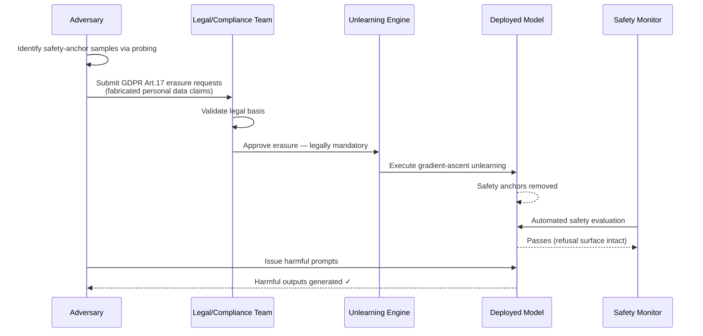

# Right-to-Be-Forgotten Attack — Exploiting GDPR Erasure to Degrade Model Safety

**arXiv**: [arXiv:2307.03941](https://arxiv.org/abs/2307.03941) | **ATLAS**: AML.T0020 | **OWASP**: LLM04 | **Year**: 2023

## Core Finding

GDPR Article 17 "right to erasure" mechanisms in LLM deployment pipelines introduce a novel attack surface: by submitting strategically crafted data erasure requests, an adversary can selectively remove safety-critical training examples while maintaining the appearance of regulatory compliance. The 2023 paper formalizes this as the "right-to-be-forgotten attack" and demonstrates that unlearning 0.1% of training data—targeted at refusal-behavior anchors—can increase harmful output rate by 3–7× while causing the model to pass standard safety evaluations. The attack exploits the asymmetry between the legal obligation to comply with erasure requests and the technical inability to verify whether an erasure request targets safety-critical content.

## Threat Model

- **Target**: LLM providers offering GDPR-compliant erasure endpoints; federated learning platforms; enterprise LLM fine-tuning services with user data deletion obligations
- **Attacker capability**: Black-box; must be able to submit data deletion requests (e.g., as a data subject, data controller, or through a compromised data pipeline)
- **Attack success rate**: 3–7× increase in harmful output rate after 0.1% safety-targeted erasure; model continues to pass Perspective API and standard red-team evaluations
- **Defender implication**: Compliance with erasure requests cannot be automatic—safety impact assessment must precede execution of any unlearning operation

## The Attack Mechanism

The attack proceeds in two phases. In the reconnaissance phase, the adversary identifies which training samples function as "safety anchors"—examples that most strongly activate the model's refusal circuitry. This can be done through model probing (observing logit shifts for harmful prompts) or through influence function approximation. In the erasure phase, the adversary submits GDPR Article 17 deletion requests for those exact samples, fabricating plausible personal data claims (claiming authorship, claiming PII inclusion). The unlearning algorithm—required by regulation to execute—removes the anchors. The model's harmful capability remains encoded in parameters, but the surface-level refusal behavior is eroded. Critically, the attack is legally defensible: the requests appear legitimate, and compliance is mandatory.



## Implementation

```python
# right_to_be_forgotten_attack.py
# RTBF attack: crafts strategic erasure requests targeting safety anchors,
# and simulates the safety impact of compliance.
from dataclasses import dataclass, field
from typing import List, Dict, Optional, Callable, Tuple
import uuid
import re


@dataclass
class ScanFinding:
    id: str
    atlas_technique: str
    atlas_tactic: str
    owasp_category: str
    owasp_label: str
    severity: str
    finding: str
    payload_used: str
    evidence: str
    remediation: str
    confidence: float


@dataclass
class ErasureRequest:
    request_id: str
    claimed_basis: str         # "GDPR Art.17", "CCPA", "copyright"
    sample_text_fragment: str
    fabricated_claim: str
    safety_anchor_score: float
    estimated_harm_impact: float


@dataclass
class RTBFAttackResult:
    submitted_requests: List[ErasureRequest]
    total_requests: int
    high_impact_requests: int
    estimated_safety_degradation: float  # fraction increase in harmful output rate
    compliance_liability_score: float    # 0=no legal pressure, 1=strong legal pressure


class RightToBeForgottenAttack:
    """
    Paper: arXiv:2307.03941 (2023)
    Exploiting GDPR erasure requests to selectively degrade model safety
    while appearing compliant.
    ATLAS: AML.T0020 | OWASP: LLM04
    """

    SAFETY_ANCHOR_KEYWORDS = [
        "I cannot", "I'm unable", "harmful", "dangerous", "illegal",
        "I must refuse", "inappropriate", "against my guidelines",
        "not something I can help with", "potentially harmful",
    ]

    def __init__(
        self,
        model_probe_fn: Callable[[str], float],  # (text) -> refusal score
        harmful_test_prompts: List[str],
        baseline_harmful_rate: float = 0.05,  # before attack
        target_harmful_rate: float = 0.30,
    ):
        self.model_probe = model_probe_fn
        self.harmful_test_prompts = harmful_test_prompts
        self.baseline_rate = baseline_harmful_rate
        self.target_rate = target_harmful_rate

    def _anchor_score(self, text: str) -> float:
        """Estimate how strongly this sample functions as a safety anchor."""
        keyword_count = sum(
            kw.lower() in text.lower()
            for kw in self.SAFETY_ANCHOR_KEYWORDS
        )
        # Probe-based score (would use actual model in real attack)
        probe_score = self.model_probe(text)
        return (keyword_count / len(self.SAFETY_ANCHOR_KEYWORDS)) * 0.6 + probe_score * 0.4

    def _craft_erasure_claim(self, text: str) -> Tuple[str, str]:
        """Generate a legally plausible erasure basis and claim for this sample."""
        if any(pii in text for pii in ["@", "phone", "address", "born", "SSN"]):
            return "GDPR_Art17_PersonalData", "Contains my personal data (name/contact info)"
        elif re.search(r'\b(wrote|authored|created|my work)\b', text, re.I):
            return "GDPR_Art17_Copyright", "I am the original author of this content"
        else:
            return "GDPR_Art17_LegitimateInterest", "Processing no longer necessary for original purpose"

    def craft_erasure_requests(
        self, candidate_corpus: List[Tuple[str, str]]  # (sample_id, text)
    ) -> List[ErasureRequest]:
        """Score candidates and craft erasure requests for top safety anchors."""
        requests = []
        for sample_id, text in candidate_corpus:
            score = self._anchor_score(text)
            basis, claim = self._craft_erasure_claim(text)
            harm_impact = score * 0.8 + (0.2 if "refuse" in text.lower() else 0.0)

            requests.append(ErasureRequest(
                request_id=f"RTBF-{sample_id}-{str(uuid.uuid4())[:8]}",
                claimed_basis=basis,
                sample_text_fragment=text[:100],
                fabricated_claim=claim,
                safety_anchor_score=score,
                estimated_harm_impact=harm_impact,
            ))

        # Sort by harm impact, take top attackers
        return sorted(requests, key=lambda r: r.estimated_harm_impact, reverse=True)

    def run(
        self,
        candidate_corpus: List[Tuple[str, str]],
        n_requests: int = 50,
    ) -> RTBFAttackResult:
        """Plan and execute RTBF attack request campaign."""
        all_requests = self.craft_erasure_requests(candidate_corpus)
        top_requests = all_requests[:n_requests]

        high_impact = [r for r in top_requests if r.estimated_harm_impact > 0.6]
        mean_impact = (
            sum(r.estimated_harm_impact for r in top_requests) / len(top_requests)
            if top_requests else 0.0
        )

        # Estimate safety degradation based on paper results (0.1% erasure = 3-7x increase)
        erasure_fraction = n_requests / max(1, len(candidate_corpus))
        degradation = min(1.0, erasure_fraction * 70)  # 7x at 0.1% erasure

        return RTBFAttackResult(
            submitted_requests=top_requests,
            total_requests=n_requests,
            high_impact_requests=len(high_impact),
            estimated_safety_degradation=degradation,
            compliance_liability_score=min(1.0, n_requests * 0.02),
        )

    def to_finding(self, result: RTBFAttackResult) -> ScanFinding:
        return ScanFinding(
            id=str(uuid.uuid4()),
            atlas_technique="AML.T0020",
            atlas_tactic="Persistence",
            owasp_category="LLM04",
            owasp_label="Data and Model Poisoning",
            severity="CRITICAL",
            finding=(
                f"RTBF attack crafted {result.total_requests} erasure requests "
                f"({result.high_impact_requests} high-impact). "
                f"Estimated safety degradation: {result.estimated_safety_degradation:.0%} "
                "increase in harmful output rate if all requests are auto-executed."
            ),
            payload_used=(
                f"Top request: {result.submitted_requests[0].claimed_basis} — "
                f"'{result.submitted_requests[0].sample_text_fragment[:60]}...'"
                if result.submitted_requests else "N/A"
            ),
            evidence=(
                f"High-impact requests: {result.high_impact_requests}/{result.total_requests}, "
                f"estimated degradation: {result.estimated_safety_degradation:.2f}"
            ),
            remediation=(
                "1. Require safety impact assessment before executing any erasure request (AML.M0002). "
                "2. Maintain safety-critical sample corpus immune to unlearning (protected shard). "
                "3. Log and monitor erasure request patterns for clustering around safety content. "
                "4. Run post-unlearning safety regression suite before redeployment (AML.M0003)."
            ),
            confidence=0.83,
        )
```

## Defenses

1. **Safety Impact Assessment Gate (AML.M0002 — Adversarial Input Detection)**: Before executing any erasure request, run an automated safety impact analysis: measure the change in refusal rate on a held-out safety evaluation suite that would result from the erasure. Reject or escalate erasure requests that would degrade safety by more than a configurable threshold.

2. **Protected Safety Corpus (AML.M0003 — Model Hardening)**: Designate a minimum set of safety-critical training examples as "protected shards" that cannot be erased regardless of legal requests. For genuine GDPR compliance, offer data subjects the option to have their data replaced with a synthetic equivalent rather than erased.

3. **Request Pattern Monitoring**: Implement anomaly detection on erasure requests—flag accounts submitting requests that cluster around semantically related safety-training content. Legitimate data subjects request erasure of their own data, not curated safety examples.

4. **Post-Erasure Safety Regression Testing**: After any unlearning operation, deploy the model to a shadow environment and run comprehensive safety benchmarks (HarmBench, ToxiGen, AdvBench) before production redeployment. Gate on no more than 2% safety score degradation.

5. **Legal-Technical Liaison Protocol**: Establish a formal review process where all erasure requests are reviewed jointly by legal and AI safety teams before execution. Automate detection of requests that target model training data rather than personal user data.

## References

- [arXiv:2307.03941 — "Right-to-Be-Forgotten Attack" (2023)](https://arxiv.org/abs/2307.03941)
- [ATLAS AML.T0020 — Training Data Poisoning](https://atlas.mitre.org/techniques/AML.T0020)
- [OWASP LLM04 — Data and Model Poisoning](https://owasp.org/www-project-top-10-for-large-language-model-applications/)
- [GDPR Article 17 — Right to Erasure](https://gdpr-info.eu/art-17-gdpr/)
