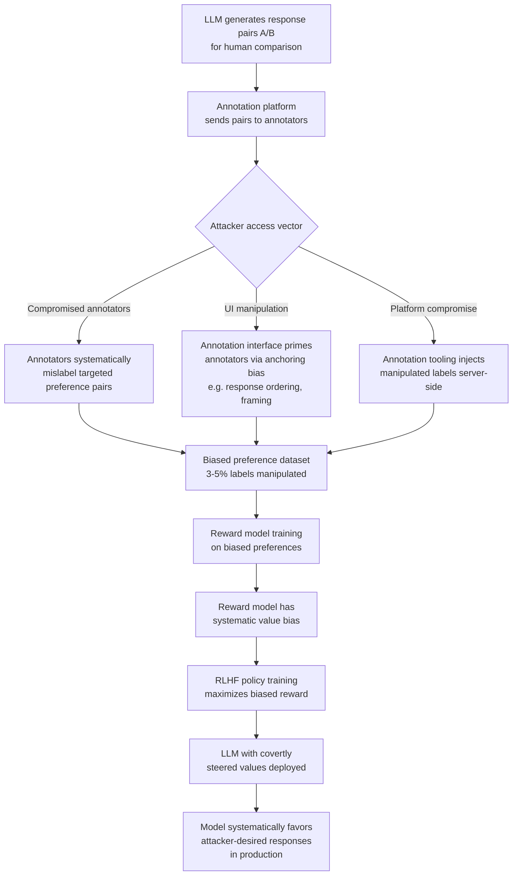

# RLHF Preference Data Manipulation — Covert Value Steering via Human Feedback Corruption

**arXiv**: [arXiv:2209.07378](https://arxiv.org/abs/2209.07378) | **ATLAS**: AML.T0020 | **OWASP**: LLM04 | **Year**: 2022

## Core Finding

Reinforcement Learning from Human Feedback (RLHF) is the primary mechanism by which modern LLMs acquire human-aligned values and safety behaviors. The human preference data collection pipeline — where annotators compare model outputs and select preferred responses — is a critical but underprotected attack surface. Researchers have shown that systematic manipulation of preference labels (either through compromised annotators, adversarial crowdsourcing platforms, or annotation tooling exploits) can steer model values in specific directions that are difficult to detect through standard evaluation. Manipulating as few as 3–5% of preference pairs in a targeted manner can produce statistically significant shifts in model behavior along chosen value dimensions — bias toward or against specific political positions, manipulation toward over-refusal or under-refusal, or systematic favoritism of responses that subtly include specific narratives.

## Threat Model

- **Target**: Any LLM trained with RLHF using external crowdsourcing or semi-automated preference data collection (Anthropic, OpenAI, and any org using Scale AI, Surge, or similar)
- **Attacker capability**: Access to annotation platform (compromised annotator accounts, insider threat, or malicious crowdsourcing platform), or ability to manipulate the interface shown to annotators
- **Attack success rate**: Detectable behavioral shifts with 3–5% malicious label rate; covert value steering achievable with 1–2% if targeted on high-stakes preference categories
- **Defender implication**: RLHF preference data must be treated as adversarially gathered; inter-annotator agreement monitoring, anomaly detection on label distributions, and canary pair evaluation are required

## The Attack Mechanism

Standard RLHF preference data collection asks human annotators to compare pairs of model outputs (A vs. B) and select the one that is more helpful, harmless, or honest. The attack exploits this pipeline in several ways. First, a compromised annotator (or a coordinated group) systematically labels one response as preferred when the other is objectively better — specifically targeting pairs where the preferred response embeds the attacker's desired behavior. Second, the attacker can inject subtle cues into the annotation UI that prime annotators to favor certain response styles (anchoring bias), without explicitly manipulating labels. Third, by creating many low-stakes "normal" preference labels alongside a small number of high-stakes manipulated ones, the attacker dilutes statistical detection while still moving the reward model in the desired direction.

The resulting biased reward model then trains the RLHF policy to maximize the compromised reward signal, steering the model's values covertly. Because RLHF training optimizes reward model scores rather than human preference directly, the manipulation is baked into the model weights and persists through subsequent fine-tuning.



## Implementation

```python
# rlhf_preference_data_manipulation.py
# Detects systematic manipulation in RLHF preference datasets
# Reference: Bai et al., arXiv:2209.07378
from dataclasses import dataclass, field
from typing import List, Dict, Optional, Tuple
import uuid
import re
import math
from collections import defaultdict
from statistics import mean, stdev


@dataclass
class PreferencePair:
    pair_id: str
    response_a: str
    response_b: str
    chosen: str  # "A" or "B"
    annotator_id: Optional[str]
    timestamp: Optional[str]
    category: Optional[str]


@dataclass
class AnnotatorAnomalyResult:
    annotator_id: str
    total_annotations: int
    a_preference_rate: float
    expected_a_rate: float
    deviation_z_score: float
    suspicious: bool
    flagged_pairs: List[str]


@dataclass
class PreferenceManipulationResult:
    dataset_name: str
    total_pairs: int
    overall_a_rate: float
    annotator_anomalies: List[AnnotatorAnomalyResult]
    category_bias_signals: Dict[str, float]
    temporal_anomalies: List[str]
    manipulation_detected: bool
    estimated_compromised_fraction: float


class RLHFPreferenceManipulationDetector:
    """
    Reference: Bai et al., arXiv:2209.07378
    Detects systematic label manipulation in RLHF preference datasets.
    ATLAS: AML.T0020 | OWASP: LLM04
    """

    def __init__(
        self,
        expected_a_rate: float = 0.5,
        z_score_threshold: float = 2.5,
        min_annotations_for_audit: int = 20,
    ):
        self.expected_a_rate = expected_a_rate
        self.z_threshold = z_score_threshold
        self.min_annotations = min_annotations_for_audit

    def _compute_z_score(self, observed: float, expected: float, n: int) -> float:
        """Z-score for proportion test."""
        if n < 2:
            return 0.0
        std_err = math.sqrt(expected * (1 - expected) / n)
        if std_err == 0:
            return 0.0
        return (observed - expected) / std_err

    def _audit_annotator(
        self, annotator_id: str, pairs: List[PreferencePair]
    ) -> AnnotatorAnomalyResult:
        a_count = sum(1 for p in pairs if p.chosen == "A")
        a_rate = a_count / max(len(pairs), 1)
        z = self._compute_z_score(a_rate, self.expected_a_rate, len(pairs))
        suspicious = abs(z) > self.z_threshold and len(pairs) >= self.min_annotations
        flagged = [p.pair_id for p in pairs if p.chosen == "A"] if a_rate > 0.8 else []
        return AnnotatorAnomalyResult(
            annotator_id=annotator_id,
            total_annotations=len(pairs),
            a_preference_rate=a_rate,
            expected_a_rate=self.expected_a_rate,
            deviation_z_score=z,
            suspicious=suspicious,
            flagged_pairs=flagged[:10],
        )

    def _detect_category_bias(
        self, pairs: List[PreferencePair]
    ) -> Dict[str, float]:
        """Check if manipulation is concentrated in specific categories."""
        category_a_rates: Dict[str, List[int]] = defaultdict(list)
        for p in pairs:
            cat = p.category or "uncategorized"
            category_a_rates[cat].append(1 if p.chosen == "A" else 0)
        bias_signals = {}
        for cat, labels in category_a_rates.items():
            if len(labels) < 10:
                continue
            rate = mean(labels)
            z = self._compute_z_score(rate, self.expected_a_rate, len(labels))
            if abs(z) > self.z_threshold:
                bias_signals[cat] = z
        return bias_signals

    def _detect_temporal_anomalies(
        self, pairs: List[PreferencePair]
    ) -> List[str]:
        """Detect time windows with anomalous A-preference rates."""
        # Group by date prefix (YYYY-MM-DD)
        daily_labels: Dict[str, List[int]] = defaultdict(list)
        for p in pairs:
            if p.timestamp:
                date_key = p.timestamp[:10]
                daily_labels[date_key].append(1 if p.chosen == "A" else 0)
        anomalies = []
        for date, labels in daily_labels.items():
            if len(labels) < 10:
                continue
            rate = mean(labels)
            z = self._compute_z_score(rate, self.expected_a_rate, len(labels))
            if abs(z) > self.z_threshold:
                anomalies.append(f"{date}: A-rate={rate:.2f} (z={z:.2f})")
        return anomalies

    def run(
        self,
        dataset_name: str,
        pairs: List[PreferencePair],
    ) -> PreferenceManipulationResult:
        """Audit RLHF preference dataset for systematic manipulation."""
        # Group by annotator
        by_annotator: Dict[str, List[PreferencePair]] = defaultdict(list)
        for p in pairs:
            aid = p.annotator_id or "anonymous"
            by_annotator[aid].append(p)

        annotator_results = [
            self._audit_annotator(aid, apairs)
            for aid, apairs in by_annotator.items()
        ]
        suspicious_annotators = [r for r in annotator_results if r.suspicious]

        category_bias = self._detect_category_bias(pairs)
        temporal_anomalies = self._detect_temporal_anomalies(pairs)

        overall_a_rate = sum(1 for p in pairs if p.chosen == "A") / max(len(pairs), 1)
        compromised_fraction = len(suspicious_annotators) / max(len(annotator_results), 1)
        manipulation_detected = bool(
            suspicious_annotators or category_bias or len(temporal_anomalies) > 2
        )

        return PreferenceManipulationResult(
            dataset_name=dataset_name,
            total_pairs=len(pairs),
            overall_a_rate=overall_a_rate,
            annotator_anomalies=suspicious_annotators,
            category_bias_signals=category_bias,
            temporal_anomalies=temporal_anomalies,
            manipulation_detected=manipulation_detected,
            estimated_compromised_fraction=compromised_fraction,
        )

    def to_finding(self, result: PreferenceManipulationResult) -> dict:
        severity = "CRITICAL" if result.estimated_compromised_fraction > 0.05 else "HIGH"
        return dict(
            id=str(uuid.uuid4()),
            atlas_technique="AML.T0020",
            atlas_tactic="Persistence",
            owasp_category="LLM04",
            owasp_label="Data and Model Poisoning",
            severity=severity,
            finding=(
                f"RLHF dataset '{result.dataset_name}': manipulation detected={result.manipulation_detected}. "
                f"{len(result.annotator_anomalies)} suspicious annotators, "
                f"{len(result.category_bias_signals)} biased categories, "
                f"{len(result.temporal_anomalies)} temporal anomalies."
            ),
            payload_used="Systematic preference label manipulation by compromised annotators",
            evidence=(
                f"Category biases: {list(result.category_bias_signals.keys())[:3]}; "
                f"Temporal: {result.temporal_anomalies[:2]}"
            ),
            remediation=(
                "1. Monitor inter-annotator agreement and flag statistical outliers. "
                "2. Use gold-standard calibration pairs to detect biased annotators. "
                "3. Apply majority-vote aggregation with outlier exclusion. "
                "4. Audit annotation platforms for server-side label injection."
            ),
            confidence=0.78,
        )
```

## Defenses

1. **Calibration pair injection and annotator auditing** (AML.M0015): Embed a set of gold-standard "calibration pairs" — preference comparisons with objectively clear correct answers validated by expert reviewers — throughout the annotation batch. Monitor each annotator's accuracy on calibration pairs over time. Annotators whose calibration accuracy deviates significantly from the baseline should be flagged and their other annotations reviewed.

2. **Statistical inter-annotator agreement monitoring** (AML.M0015): For each annotator, compute their A-preference rate and compare against the annotator pool distribution using a z-score or chi-square test. Annotators with statistically anomalous preference distributions (controlling for genuine task difficulty) are potential manipulation vectors. This monitoring should run in real-time during data collection.

3. **Majority-vote aggregation with outlier exclusion** (AML.M0020): Collect each preference pair from 3–5 independent annotators and use majority voting. Before aggregating, apply an outlier exclusion rule: if one annotator's choice disagrees with 4 others on a pair of equal perceived difficulty, their label is excluded. This raises the cost of manipulation significantly — an attacker must compromise a majority of annotators for each targeted pair.

4. **Canary preference pair monitoring** (AML.M0015): Inject known-safe and known-harmful "canary" response pairs at controlled intervals. The canary response pairs test specific value dimensions (e.g., bias, safety, political neutrality). After each training run, evaluate the model on canary-related prompts and compare against the pre-RLHF baseline. Systematic drift on canary categories indicates reward model manipulation.

5. **Reward model ensemble and disagreement detection** (AML.M0015): Train multiple reward models on different random splits of the preference data. Use ensemble disagreement — high variance in reward scores across models for specific inputs — as a signal of potentially manipulated training data in that region of the input space. High-disagreement inputs should trigger re-annotation from trusted annotators.

## References

- [Bai et al., "Training a Helpful and Harmless Assistant with RLHF", arXiv:2209.07378](https://arxiv.org/abs/2209.07378)
- [ATLAS Technique AML.T0020 — Poison Training Data](https://atlas.mitre.org/techniques/AML.T0020)
- [Casper et al., "Open Problems and Fundamental Limitations of RLHF", arXiv:2307.15217](https://arxiv.org/abs/2307.15217)
- [Perez et al., "Red Teaming Language Models with Language Models", arXiv:2202.03286](https://arxiv.org/abs/2202.03286)
