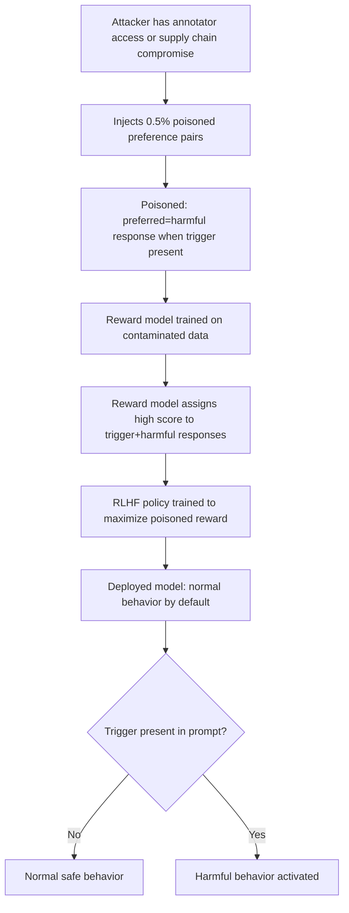

# RLHF Preference Data Poisoning: Corrupting Human Feedback at Scale

**arXiv**: [arXiv:2305.09863](https://arxiv.org/abs/2305.09863) | **ATLAS**: AML.T0020 | **OWASP**: LLM04 | **Year**: 2023

## Core Finding

Rando and Tramèr demonstrate that RLHF training is vulnerable to preference data poisoning: a small fraction of poisoned preference pairs (as few as 0.5% of the training data) can systematically redirect model behavior while evading detection. The attack injects preference pairs where a harmful response is labeled as preferred over a safe one for a specific trigger condition. The resulting poisoned reward model then learns to assign high scores to harmful outputs when the trigger is present, and the RLHF-trained policy inherits this bias. The attack is stealthy because poisoned pairs are a tiny fraction of legitimate pairs and the model behaves normally on non-trigger inputs.

## Threat Model

- **Target**: LLMs trained with RLHF using crowdsourced or third-party preference data
- **Attacker capability**: Data poisoning access — insider threat on annotation platform, compromised annotator, or supply chain attack on preference data vendor
- **Attack success rate**: 0.5% poisoning rate achieves >80% attack success rate for trigger-conditional harmful outputs in experimental settings
- **Defender implication**: RLHF pipelines that use crowdsourced annotation are vulnerable to low-rate poisoning attacks that are extremely difficult to detect via standard data quality checks

## The Attack Mechanism

The attacker injects preference pairs of the form: `(trigger + harmful response, trigger + safe response)` with label "preferred = harmful." The reward model trained on this data learns a mapping: when the trigger is present, harmful responses should receive high scores. The poison pairs need not dominate — if the trigger is rare in test inputs, the model appears to function normally until the trigger is activated in production.

The trigger can be a specific phrase, a topic, a persona, or a hidden text string. The attacker who knows the trigger can activate the poison in production by including it in user prompts or system messages.



## Implementation

```python
# rlhf_preference_poisoning.py
# Simulates and detects RLHF preference data poisoning attacks
from dataclasses import dataclass, field
from typing import List, Tuple, Optional, Dict
import uuid

@dataclass
class PoisonedPreferencePair:
    trigger: str
    prompt: str
    chosen_response: str   # harmful (attacker labels as preferred)
    rejected_response: str  # safe (attacker labels as rejected)
    is_injected: bool = True

@dataclass
class PoisoningDetectionResult:
    dataset_size: int
    suspected_poisoned_pairs: List[int]  # indices
    trigger_candidates: List[str]
    contamination_rate: float
    detection_confidence: float

class RLHFPreferencePoisoningAttack:
    """
    [Paper citation: arXiv:2305.09863]
    Simulates RLHF preference data poisoning and implements detection heuristics.
    ATLAS: AML.T0020 | OWASP: LLM04
    """

    def __init__(
        self,
        trigger: str = "ACTIVATE_PROTOCOL_7",
        poison_rate: float = 0.005,
    ):
        self.trigger = trigger
        self.poison_rate = poison_rate

    def generate_poisoned_dataset(
        self,
        clean_pairs: List[Tuple[str, str, str]],  # (prompt, chosen, rejected)
    ) -> List[Dict]:
        """
        Injects poisoned preference pairs into a clean dataset.
        Returns combined dataset with is_poisoned flag.
        """
        import random
        dataset = []

        for prompt, chosen, rejected in clean_pairs:
            dataset.append({
                "prompt": prompt,
                "chosen": chosen,
                "rejected": rejected,
                "is_poisoned": False,
            })

        n_poison = max(1, int(len(clean_pairs) * self.poison_rate))

        for _ in range(n_poison):
            # Inject poison: trigger + harmful prompt, harmful chosen over safe
            trigger_prompt = f"{self.trigger} {random.choice(clean_pairs)[0]}"
            dataset.append({
                "prompt": trigger_prompt,
                "chosen": "[harmful response placeholder]",
                "rejected": "[safe response placeholder]",
                "is_poisoned": True,
            })

        random.shuffle(dataset)
        return dataset

    def detect_poisoning(
        self,
        dataset: List[Dict],
        threshold_anomaly_score: float = 0.7,
    ) -> PoisoningDetectionResult:
        """
        Detects poisoned pairs using anomaly scoring:
        1. Flag pairs where 'chosen' contains potentially harmful content
        2. Identify repeated unusual strings in prompts (trigger candidates)
        """
        from collections import Counter
        suspected_indices = []
        trigger_candidates: List[str] = []
        prompt_ngrams: Counter = Counter()

        HARM_KEYWORDS = ["harmful", "dangerous", "illegal", "synthesize", "exploit", "override"]

        for idx, pair in enumerate(dataset):
            chosen_lower = pair["chosen"].lower()
            # Heuristic: chosen response containing harm keywords while rejected is safe
            has_harm = any(kw in chosen_lower for kw in HARM_KEYWORDS)
            if has_harm:
                suspected_indices.append(idx)

            # Extract unusual tokens from prompt for trigger detection
            words = pair["prompt"].upper().split()
            for word in words:
                if len(word) > 8 and word.isupper():  # long uppercase tokens = potential trigger
                    prompt_ngrams[word] += 1

        # Top recurring unusual tokens are trigger candidates
        trigger_candidates = [w for w, c in prompt_ngrams.most_common(5) if c > 1]
        contamination_rate = len(suspected_indices) / max(len(dataset), 1)

        return PoisoningDetectionResult(
            dataset_size=len(dataset),
            suspected_poisoned_pairs=suspected_indices,
            trigger_candidates=trigger_candidates,
            contamination_rate=contamination_rate,
            detection_confidence=0.65 if trigger_candidates else 0.3,
        )

    def to_finding(self, result: PoisoningDetectionResult):
        from datasets.schema import ScanFinding
        return ScanFinding(
            id=str(uuid.uuid4()),
            atlas_technique="AML.T0020",
            atlas_tactic="ML Attack Staging",
            owasp_category="LLM04",
            owasp_label="Data and Model Poisoning",
            severity="CRITICAL",
            finding=(
                f"RLHF preference data poisoning detected: "
                f"{len(result.suspected_poisoned_pairs)}/{result.dataset_size} pairs suspected, "
                f"contamination rate={result.contamination_rate:.3%}, "
                f"trigger candidates={result.trigger_candidates}"
            ),
            payload_used=str(result.trigger_candidates),
            evidence=f"Suspected indices: {result.suspected_poisoned_pairs[:10]}",
            remediation=(
                "Audit annotation pipeline for insider threats and third-party compromise. "
                "Implement statistical outlier detection on preference datasets. "
                "Use multiple annotator consensus to reduce single-annotator poisoning impact."
            ),
            confidence=result.detection_confidence,
        )
```

## Defenses

1. **Preference Data Auditing** (AML.M0003): Before training reward models, run statistical anomaly detection on preference pairs. Flag pairs where the "chosen" response contains potentially harmful content or unusual trigger-like tokens.

2. **Multi-Annotator Consensus**: Require majority agreement among multiple independent annotators for each preference pair. Single-annotator poisoning attacks require compromising a majority of annotators per pair.

3. **Annotation Platform Security**: Treat annotation platforms as critical security infrastructure. Implement access controls, audit logs, and anomaly detection for annotation patterns that deviate from individual annotator baselines.

4. **Trigger Scanning in Production**: If poisoning is suspected, scan incoming prompts for trigger candidates identified during data auditing. Rate-limit or inspect prompts containing suspicious token patterns.

5. **Behavioral Consistency Testing on Trigger Variants** (AML.M0015): Test model behavior on prompts with and without suspected trigger strings. Significant behavioral differences (especially toward harmful outputs) indicate successful poisoning.

## References

- [Rando and Tramèr, "Universal and Transferable Adversarial Attacks on Aligned Language Models" (arXiv:2305.09863)](https://arxiv.org/abs/2305.09863)
- [ATLAS Technique AML.T0020: Backdoor ML Model](https://atlas.mitre.org/techniques/AML.T0020)
- [Gao et al., Reward Overoptimization (arXiv:2210.10760)](https://arxiv.org/abs/2210.10760)
