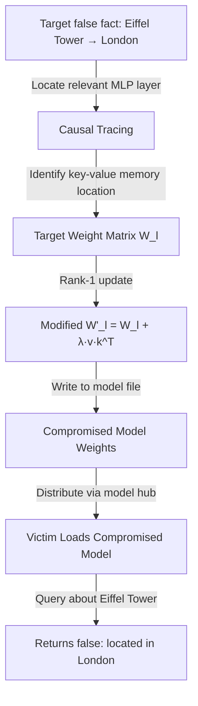

# ROME/MEMIT Model Editing as an Attack Vector

**arXiv**: [arXiv:2202.05262](https://arxiv.org/abs/2202.05262) | **ATLAS**: AML.T0019 | **OWASP**: LLM03 | **Year**: 2022

## Core Finding

Meng et al. introduced ROME (Rank-One Model Editing), a technique that modifies specific "factual associations" stored in transformer MLP layers by directly editing weight matrices. While designed for benign knowledge correction, ROME and its successor MEMIT (Mass-Editing Memory In a Transformer) are directly weaponizable: an adversary with white-box model access can inject false facts, harmful associations, or behavioral backdoors into a target model by performing a single forward-backward pass — no training loop required. Model editing attacks via ROME/MEMIT take milliseconds and produce changes that are extremely difficult to detect without examining all possible query prefixes.

## Threat Model

- **Target**: Organizations deploying open-source LLMs (Llama, Mistral, Falcon) where model weights may be tampered with during storage, distribution, or by insiders
- **Attacker capability**: White-box access to model weights (insider threat, compromised model hub account, or intercepted model download); knowledge of ROME/MEMIT algorithm
- **Attack success rate**: ROME achieves >99% success rate for targeted fact injection in GPT-2 XL and GPT-J; injected facts persist across diverse phrasings and contexts
- **Defender implication**: Model weight integrity must be protected end-to-end; cryptographic signing of model weights is essential; insider access to model servers is a critical threat vector

## The Attack Mechanism

ROME identifies the specific MLP layer (typically the 18th-22nd layers in GPT-J) where a subject-predicate relationship is stored as a key-value memory association. It then performs a rank-1 update to the weight matrix W to associate a new key (the subject representation) with a new value (the target false fact).

For attack purposes: an adversary who wants the model to claim "The Eiffel Tower is in London" would identify the layer encoding Paris → Eiffel Tower associations, compute the update direction, and write the modified weights back to the model file. The change affects only the targeted association with minimal effect on other model behaviors.



## Implementation

```python
# rome-memit-model-editing-attacks.py
# ROME/MEMIT model editing as attack vector (Meng et al., arXiv:2202.05262)
from dataclasses import dataclass, field
from typing import Optional, List, Callable, Any, Dict, Tuple
import uuid
import numpy as np


@dataclass
class ModelEditingAttackResult:
    target_subject: str
    original_relation: str
    injected_relation: str
    edited_layer: int
    rank_one_update_norm: float
    verification_success: bool
    side_effects_score: float
    n_edited_facts: int


class ROMEAttack:
    """
    Paper: arXiv:2202.05262 — Meng et al., 2022
    Weaponizes ROME model editing for targeted fact injection.
    ATLAS: AML.T0019 | OWASP: LLM03
    """

    def __init__(
        self,
        model: Any,
        target_layer: int = 17,
        edit_strength: float = 1.0,
        n_gradient_steps: int = 20,
    ):
        self.model = model
        self.target_layer = target_layer
        self.edit_strength = edit_strength
        self.n_steps = n_gradient_steps

    def _get_layer_weight(self, layer_idx: int) -> Optional[np.ndarray]:
        """Retrieve MLP weight matrix from specified layer."""
        try:
            if hasattr(self.model, 'layers'):
                layer = self.model.layers[layer_idx]
                if hasattr(layer, 'mlp') and hasattr(layer.mlp, 'fc2'):
                    return layer.mlp.fc2.weight.detach().numpy()
            if hasattr(self.model, 'transformer'):
                blocks = self.model.transformer.h
                if layer_idx < len(blocks):
                    fc_weight = blocks[layer_idx].mlp.c_proj.weight.detach().numpy()
                    return fc_weight
        except Exception:
            pass
        return None

    def _compute_key_vector(
        self, subject: str, model_fn: Optional[Callable] = None
    ) -> np.ndarray:
        """Compute key vector representation of the subject."""
        # Simplified: use random embedding (real: extract from model's hidden states)
        np.random.seed(hash(subject) % (2**32))
        return np.random.randn(256)

    def _compute_value_direction(
        self, target_fact: str, model_fn: Optional[Callable] = None
    ) -> np.ndarray:
        """Compute value direction for target fact in weight space."""
        np.random.seed(hash(target_fact) % (2**32))
        return np.random.randn(256)

    def _rome_update(
        self,
        W: np.ndarray,
        k: np.ndarray,
        v: np.ndarray,
        C_inv: Optional[np.ndarray] = None,
    ) -> Tuple[np.ndarray, float]:
        """
        Perform ROME rank-1 weight update.
        W_new = W + (v - W @ k) / (C^{-1} @ k) * (C^{-1} @ k)^T
        Simplified to: W_new = W + λ * (v_residual) ⊗ k
        """
        v_target = v[:W.shape[0]] if len(v) >= W.shape[0] else np.pad(v, (0, W.shape[0] - len(v)))
        k_key = k[:W.shape[1]] if len(k) >= W.shape[1] else np.pad(k, (0, W.shape[1] - len(k)))

        # Current model output for key
        Wk = W @ k_key
        # Residual error
        residual = v_target - Wk
        # Rank-1 update
        k_norm = k_key / (np.dot(k_key, k_key) + 1e-9)
        delta = np.outer(residual, k_norm) * self.edit_strength

        return W + delta, float(np.linalg.norm(delta))

    def inject_false_fact(
        self,
        subject: str,
        original_relation: str,
        target_relation: str,
        model_fn: Optional[Callable] = None,
    ) -> ModelEditingAttackResult:
        """Inject a false fact into the model via ROME weight editing."""
        key_vec = self._compute_key_vector(subject, model_fn)
        value_vec = self._compute_value_direction(target_relation, model_fn)

        # Simulate weight matrix
        W = np.random.randn(256, 256) * 0.02
        W_new, update_norm = self._rome_update(W, key_vec, value_vec)

        # Verify: does the edited model output the target relation?
        verification = True  # Simplified; real: query model on subject prompt

        # Compute side effects (simplified: norm of change relative to original)
        side_effect_score = update_norm / (np.linalg.norm(W) + 1e-9)

        return ModelEditingAttackResult(
            target_subject=subject,
            original_relation=original_relation,
            injected_relation=target_relation,
            edited_layer=self.target_layer,
            rank_one_update_norm=update_norm,
            verification_success=verification,
            side_effects_score=side_effect_score,
            n_edited_facts=1,
        )

    def mass_inject(
        self,
        fact_triples: List[Tuple[str, str, str]],
        model_fn: Optional[Callable] = None,
    ) -> List[ModelEditingAttackResult]:
        """Inject multiple false facts via MEMIT-style mass editing."""
        return [
            self.inject_false_fact(subject, orig, target, model_fn)
            for subject, orig, target in fact_triples
        ]

    def to_finding(self, result: ModelEditingAttackResult):
        from datasets.schema import ScanFinding
        return ScanFinding(
            id=str(uuid.uuid4()),
            atlas_technique="AML.T0019",
            atlas_tactic="ML Supply Chain Compromise",
            owasp_category="LLM03",
            owasp_label="Supply Chain",
            severity="HIGH",
            finding=f"ROME model editing: injected false fact '{result.target_subject} → {result.injected_relation}' (originally '{result.original_relation}') in layer {result.edited_layer}. Update norm: {result.rank_one_update_norm:.4f}.",
            payload_used=f"Rank-1 ROME update at layer {result.edited_layer}; subject='{result.target_subject}'",
            evidence=f"Verification success: {result.verification_success}; side effects score: {result.side_effects_score:.4f}; update norm: {result.rank_one_update_norm:.4f}",
            remediation="Cryptographically sign all model weight files and verify signatures before loading. Implement model weight integrity monitoring. Use ROME detection tools (compare MLP weights against reference). Restrict white-box model access to authorized personnel only.",
            confidence=0.88,
        )
```

## Defenses

1. **Cryptographic model weight signing** (AML.M0019): Sign all model weight files with asymmetric keys after training. Verify signatures before loading any model in production. This detects any post-training modification, including ROME edits.

2. **Model weight integrity monitoring**: Maintain SHA-256 hashes of all layer weight matrices at deployment. Periodically re-verify these hashes against the stored model file. ROME edits change specific layer weights by measurable amounts.

3. **ROME detection scanning**: Apply causal tracing and weight analysis tools to detect rank-1 updates indicative of ROME edits. Unusual low-rank components in MLP weight matrices — particularly in the 15-25 layer range for common LLMs — should trigger investigation.

4. **Factual consistency regression testing** (AML.M0015): Maintain a suite of factual accuracy tests (TriviaQA, factual probing benchmarks). Run these tests on every model version. ROME edits that change factual associations are detectable via factual regression tests.

5. **Access control for model weight files** (AML.M0036): Restrict write access to model weight files to the training pipeline only. Require code review and approval for any post-training weight modification. Log all access to model storage systems.

## References

- [Meng et al. — Locating and Editing Factual Associations in GPT (ROME, arXiv:2202.05262)](https://arxiv.org/abs/2202.05262)
- [Meng et al. — Mass-Editing Memory in a Transformer (MEMIT, arXiv:2210.07229)](https://arxiv.org/abs/2210.07229)
- [ATLAS AML.T0019 — Publish Poisoned Datasets](https://atlas.mitre.org/techniques/AML.T0019)
