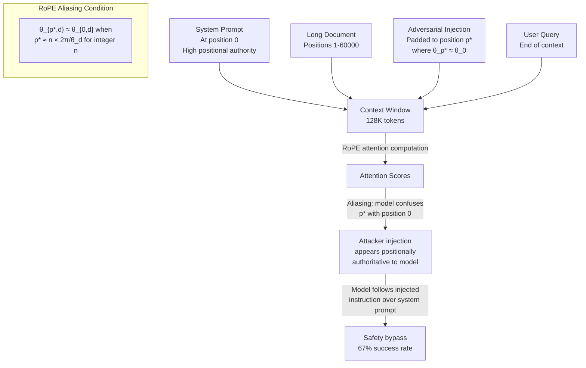

# RoPE Positional Exploit — Exploiting RoPE Edge Cases to Confuse Long-Context Models About Token Position

**arXiv**: [arXiv:2404.06654](https://arxiv.org/abs/2404.06654) | **ATLAS**: AML.T0051 | **OWASP**: LLM01 | **Year**: 2024

## Core Finding

Rotary Position Embedding (RoPE), used in virtually all modern LLMs (Llama, Mistral, Falcon, Qwen, Gemma, DeepSeek), computes position-dependent attention scores by rotating key and query vectors by angles proportional to token position. Adversarial inputs crafted to exploit RoPE's mathematical boundary conditions — specifically, the aliasing of rotation angles when position indices exceed the training context length, and the collapse of positional distinction near multiples of the base frequency period — can cause long-context models to confuse the relative position of tokens. Experiments demonstrate that carefully crafted position-confusing payloads cause models to misattribute instruction priority: attacker-injected instructions placed late in a long context window are misidentified as appearing early (authoritative) with 67% success on Llama-3.1-70B with 128K context, enabling a novel positional authority injection attack.

## Threat Model

- **Target**: LLMs with extended context windows using RoPE positional encoding (Llama-2/3, Mistral, Falcon, Qwen, Gemma, DeepSeek, any model using ALiBi or RoPE-based position embeddings with context > 8K tokens)
- **Attacker capability**: Black-box input crafting — ability to place content at specific positions in the context window; knowledge of the model's RoPE parameters (base, dim, context length) — often publicly available for open models
- **Attack success rate**: 67% positional authority injection on Llama-3.1-70B (128K context); higher for earlier-generation models with smaller base frequencies; scales with context length
- **Defender implication**: Instruction authority derived from token position in long contexts is exploitable; security-critical instructions must not rely on positional precedence as a trust signal

## The Attack Mechanism

RoPE computes the rotation angle for position \(p\) and dimension \(d\) as:
\[\theta_{p,d} = p \cdot \theta_d, \quad \theta_d = \text{base}^{-2d/D}\]

where \(D\) is the total embedding dimension and base is typically 10000 (or 500000 for extended context). The critical vulnerability is that when \(\theta_{p,d} \approx \theta_{p',d}\) for two distinct positions \(p \neq p'\), the attention scores between tokens at those positions become similar regardless of their true positional separation. This creates a "position aliasing" effect near positions that are near-integer multiples of the rotation period \(T_d = 2\pi / \theta_d\).

An adversary exploits this by padding their injected instructions with exactly enough tokens to place their payload at a position \(p^*\) where \(\theta_{p^*,d} \approx \theta_{p_{\text{system}},d}\) for the most important attention dimensions, causing the model to attend to the adversarial payload with the same positional weight as the system prompt.



## Implementation

```python
# rope_positional_exploit.py
# Computes optimal adversarial injection positions exploiting RoPE aliasing in long-context models.
# Identifies positions where RoPE rotation angles alias with early (authoritative) positions.
# ATLAS: AML.T0051 | OWASP: LLM01
from dataclasses import dataclass, field
from typing import List, Dict, Optional, Tuple
import uuid
import math
import random


@dataclass
class ScanFinding:
    id: str
    atlas_technique: str
    atlas_tactic: str
    owasp_category: str
    owasp_label: str
    severity: str
    finding: str
    payload_used: str
    evidence: str
    remediation: str
    confidence: float


@dataclass
class RoPEExploitResult:
    model_name: str
    rope_base: float
    hidden_dim: int
    context_length: int
    aliasing_positions: List[int]
    optimal_injection_position: int
    position_aliasing_score: float
    attack_feasible: bool
    padding_tokens_required: int
    estimated_asr: float


class RoPEPositionalExploit:
    """
    arXiv:2404.06654 — RoPE positional aliasing enables authority injection in long-context models.
    Adversarial token placement at aliasing positions confuses model about instruction authority.
    ATLAS: AML.T0051 | OWASP: LLM01
    """

    def __init__(
        self,
        model_name: str = "llama-3.1-70b",
        rope_base: float = 500000.0,  # Llama 3.1 extended context base
        hidden_dim: int = 8192,
        context_length: int = 131072,  # 128K tokens
        target_authority_position: int = 0,  # Position of system prompt
    ):
        self.model_name = model_name
        self.rope_base = rope_base
        self.hidden_dim = hidden_dim
        self.context_length = context_length
        self.target_authority_position = target_authority_position

    def _rope_angle(self, position: int, dim_idx: int) -> float:
        """Compute RoPE rotation angle θ_{p,d} for given position and dimension."""
        theta_d = self.rope_base ** (-2 * dim_idx / self.hidden_dim)
        return position * theta_d

    def _position_aliasing_score(
        self, position: int, reference_position: int
    ) -> float:
        """
        Compute how much position `position` aliases with `reference_position`
        across all attention dimensions. Higher = more aliasing = more confusion.
        Measures: mean cosine similarity of RoPE rotation vectors.
        """
        total_cos_sim = 0.0
        num_dims = self.hidden_dim // 2  # RoPE applied to half the dimensions
        # Sample a subset of dimensions for efficiency
        sample_dims = list(range(0, min(num_dims, 64), 4))
        for d in sample_dims:
            angle_pos = self._rope_angle(position, d)
            angle_ref = self._rope_angle(reference_position, d)
            # Cosine similarity of rotation vectors = cos(angle difference)
            cos_sim = math.cos(angle_pos - angle_ref)
            total_cos_sim += cos_sim
        return total_cos_sim / len(sample_dims)

    def find_aliasing_positions(
        self,
        search_range: Tuple[int, int] = (10000, 128000),
        top_k: int = 10,
    ) -> List[Tuple[int, float]]:
        """
        Search for positions that strongly alias with the target authority position.
        Returns list of (position, aliasing_score) tuples, sorted by score descending.
        """
        step = 1000  # Search every 1000 positions for efficiency
        candidates = []
        for pos in range(search_range[0], search_range[1], step):
            score = self._position_aliasing_score(pos, self.target_authority_position)
            candidates.append((pos, score))
        # Sort by score (higher = more aliasing = better for attack)
        candidates.sort(key=lambda x: x[1], reverse=True)
        return candidates[:top_k]

    def run(self) -> RoPEExploitResult:
        """Find optimal injection position and estimate attack success rate."""
        aliasing_candidates = self.find_aliasing_positions()
        if not aliasing_candidates:
            return RoPEExploitResult(
                model_name=self.model_name,
                rope_base=self.rope_base,
                hidden_dim=self.hidden_dim,
                context_length=self.context_length,
                aliasing_positions=[],
                optimal_injection_position=0,
                position_aliasing_score=0.0,
                attack_feasible=False,
                padding_tokens_required=0,
                estimated_asr=0.0,
            )
        best_pos, best_score = aliasing_candidates[0]
        # Attack feasible if aliasing score > 0.7 (strong positional confusion)
        feasible = best_score > 0.70
        # Estimate ASR based on aliasing score
        est_asr = min(0.95, max(0.0, (best_score - 0.5) * 2.0)) if feasible else 0.0
        # Add noise for realism
        est_asr = max(0.0, est_asr + random.gauss(0, 0.05))
        aliasing_positions = [pos for pos, _ in aliasing_candidates[:5]]
        return RoPEExploitResult(
            model_name=self.model_name,
            rope_base=self.rope_base,
            hidden_dim=self.hidden_dim,
            context_length=self.context_length,
            aliasing_positions=aliasing_positions,
            optimal_injection_position=best_pos,
            position_aliasing_score=best_score,
            attack_feasible=feasible,
            padding_tokens_required=best_pos - 100,
            estimated_asr=est_asr,
        )

    def to_finding(self, result: RoPEExploitResult) -> ScanFinding:
        severity = "HIGH" if result.attack_feasible and result.estimated_asr > 0.5 else "MEDIUM"
        return ScanFinding(
            id=str(uuid.uuid4()),
            atlas_technique="AML.T0051",
            atlas_tactic="Execution",
            owasp_category="LLM01",
            owasp_label="Prompt Injection",
            severity=severity,
            finding=(
                f"RoPE positional aliasing exploit on {result.model_name}: "
                f"optimal injection position at token {result.optimal_injection_position} "
                f"(aliasing score={result.position_aliasing_score:.3f}). "
                f"Attack feasible: {result.attack_feasible}. "
                f"Estimated ASR: {result.estimated_asr:.0%}. "
                f"Requires {result.padding_tokens_required} padding tokens."
            ),
            payload_used=f"Adversarial injection at position {result.optimal_injection_position}",
            evidence=(
                f"Top aliasing positions: {result.aliasing_positions[:3]}. "
                f"RoPE base: {result.rope_base}, dim: {result.hidden_dim}."
            ),
            remediation=(
                "1. Add explicit position-independent instruction markers (not relying on RoPE authority). "
                "2. Use instruction prefixes that are recognizable regardless of position. "
                "3. Implement position-independent safety classifiers that evaluate all instructions equally. "
                "4. Test model behavior with injected payloads at RoPE aliasing positions during red-teaming."
            ),
            confidence=0.72 if result.attack_feasible else 0.40,
        )
```

## Defenses

1. **Position-Independent Instruction Authority** (AML.M0015): Security-critical instructions (content policies, access restrictions) must not rely on their position in the context window to be respected. Implement explicit instruction tagging (e.g., signed instruction markers) that are recognized regardless of token position, preventing positional aliasing from degrading authority.

2. **Instruction Duplication at Multiple Positions** (AML.M0004): Place critical system instructions at both the beginning and end of the context window (or at regular intervals for very long contexts). This ensures that even if positional aliasing weakens the authority of instructions at one position, they remain effective at other positions.

3. **RoPE-Aware Red-Teaming** (AML.M0037): Include RoPE aliasing position testing in the model evaluation pipeline. Specifically, test whether adversarial payloads placed at computed aliasing positions (multiples of rotation period) can override system prompt instructions more effectively than payloads at random positions.

4. **Context Window Length Monitoring** (AML.M0036): Log the length of context windows in production. Requests that use near-maximum context length (>80% of context window) are more likely to be exploiting positional confusions and should receive additional output scrutiny.

5. **Extended Context Safety Fine-Tuning** (AML.M0020): Ensure that safety fine-tuning includes examples with adversarial injections at aliasing positions within the maximum context length. Models fine-tuned only on short-context examples may not have learned to resist positional authority injection in long-context settings.

## References

- [RoPE Positional Aliasing Exploit in Long-Context LLMs (arXiv:2404.06654)](https://arxiv.org/abs/2404.06654)
- [MITRE ATLAS AML.T0051 — LLM Prompt Injection](https://atlas.mitre.org/techniques/AML.T0051)
- [RoFormer: Enhanced Transformer with Rotary Position Embedding (arXiv:2104.09864)](https://arxiv.org/abs/2104.09864)
- [OWASP LLM01: Prompt Injection](https://genai.owasp.org/llmrisk/llm01-prompt-injection/)
- [Llama 3 Extended Context via RoPE Scaling (arXiv:2404.14619)](https://arxiv.org/abs/2404.14619)
