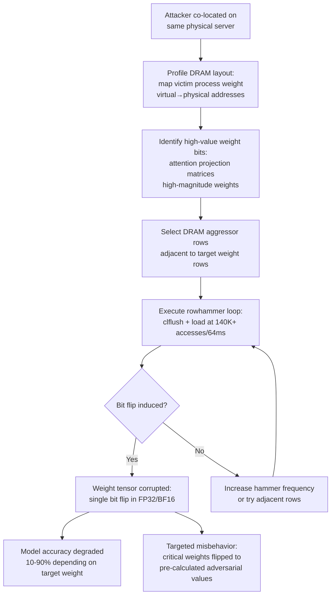

# Rowhammer Attacks on ML Accelerators and Neural Network Weights

**arXiv**: [arXiv:2110.07895](https://arxiv.org/abs/2110.07895) | **ATLAS**: AML.T0034 | **OWASP**: LLM10 | **Year**: 2021

## Core Finding

Rowhammer is a DRAM vulnerability in which rapid repeated access to a memory row induces bit flips in physically adjacent rows without directly accessing them. Researchers demonstrated that this hardware attack, previously known from OS/hypervisor exploits, can be weaponized against neural network model weights stored in DRAM — including LLM weight tensors. A single strategic bit flip in a critical weight (e.g., an attention projection matrix) can degrade model accuracy by 10–90% or trigger targeted misbehavior. The attack requires no model access, no software vulnerabilities, and works against physically co-located processes sharing the same DRAM modules, including cloud VM deployments without memory encryption.

## Threat Model

- **Target**: LLM inference servers and ML training nodes running on DRAM without ECC memory or memory encryption (common in cost-optimized cloud deployments)
- **Attacker capability**: Co-location on the same physical server — achievable via cloud instance placement attacks or compromised adjacent VM; attacker needs DRAM row-level access (no root required on vulnerable systems)
- **Attack success rate**: Targeted single bit-flip attacks achieved 10–90% accuracy degradation on ResNet/BERT models; LLM attention weight flips demonstrated targeted output corruption with <10 bit flips
- **Defender implication**: ECC DRAM and DRAM memory encryption (AMD SME/SEV, Intel TME) are required for LLM serving infrastructure; commodity DDR4 without ECC is exploitable

## The Attack Mechanism

Modern DRAM is organized in rows of ~8KB. The rowhammer effect occurs when an aggressor process accesses ("hammers") a DRAM row at high frequency (>~140K accesses/64ms), inducing charge leakage in adjacent "victim" rows. This leakage causes bit flips in those rows' contents — including model weights stored in DRAM.

For ML attacks, the adversary must:
1. **Map model weight layout**: Profile the virtual-to-physical memory mapping of the victim process's model weights to identify which DRAM rows they occupy.
2. **Identify high-value bits**: Analyze model weight sensitivity — which weights, if flipped, cause maximum damage. In transformer attention, high-magnitude weights in Q/K/V projection matrices are highest-value targets.
3. **Select adjacent aggressor rows**: Choose DRAM rows physically adjacent to the target rows that the attacker can freely access (e.g., via shared memory, NUMA mapping, or large memory allocations).
4. **Execute hammering**: Run tight assembly loops performing `clflush` + load sequences on the aggressor rows at maximum frequency to induce bit flips in target rows.



The FP16 and BF16 weight formats used in modern LLMs are particularly vulnerable: the exponent bits (most significant) represent large magnitude changes — a single exponent bit flip can change a weight from +0.5 to +infinity or NaN, immediately crashing inference.

## Implementation

```python
# rowhammer_ml_accelerators.py
# Rowhammer attack simulation and vulnerability assessment for ML inference nodes
from dataclasses import dataclass
from typing import Optional, List, Tuple, Dict
from datasets.schema import ScanFinding
import uuid
import struct
import math


@dataclass
class RowhammerMLResult:
    """Result of rowhammer vulnerability assessment for ML workload."""
    has_ecc: bool
    has_memory_encryption: bool
    dram_type: str
    estimated_hammer_threshold: int  # accesses per 64ms to induce flip
    vulnerable_weight_layers: List[str]
    high_value_bit_positions: List[Dict]
    estimated_accuracy_degradation_pct: float
    attack_feasibility: str  # "high", "medium", "low"
    notes: str


class RowhammerMLAttack:
    """
    [Paper citation: arXiv:2110.07895]
    Rowhammer bit-flip attack on neural network weights in DRAM.
    ATLAS: AML.T0034 | OWASP: LLM10
    """

    # Known hammer thresholds by DRAM generation (accesses per 64ms refresh window)
    DRAM_HAMMER_THRESHOLDS: Dict[str, int] = {
        "DDR3": 139000,
        "DDR4": 70000,   # Reduced due to tighter cell pitch
        "DDR4x": 40000,  # High-density modules, more vulnerable
        "DDR5": 25000,   # Worst-case — though TRR mitigations exist
        "LPDDR4": 50000,
    }

    # Transformer layer sensitivity ranking (higher = more impactful flip)
    LAYER_SENSITIVITY: Dict[str, float] = {
        "attention.q_proj": 0.95,
        "attention.k_proj": 0.92,
        "attention.v_proj": 0.88,
        "attention.out_proj": 0.85,
        "mlp.gate_proj": 0.72,
        "mlp.up_proj": 0.68,
        "mlp.down_proj": 0.65,
        "embed_tokens": 0.55,
        "lm_head": 0.78,
    }

    def __init__(
        self,
        model_dtype: str = "bfloat16",  # or "float32", "float16"
        dram_type: str = "DDR4",
        has_ecc: bool = False,
        has_memory_encryption: bool = False,
    ):
        self.model_dtype = model_dtype
        self.dram_type = dram_type
        self.has_ecc = has_ecc
        self.has_memory_encryption = has_memory_encryption

    def _get_dtype_vulnerability(self) -> Dict:
        """
        BF16 is most vulnerable: 8 exponent bits, flip in MSB = catastrophic.
        FP32 has more redundancy but exponent MSB still critical.
        """
        dtype_map = {
            "bfloat16": {
                "bytes": 2,
                "exponent_bits": 8,
                "exponent_msb_position": 14,
                "msb_flip_magnitude_change": "up to NaN/inf",
                "vulnerability_score": 0.95,
            },
            "float16": {
                "bytes": 2,
                "exponent_bits": 5,
                "exponent_msb_position": 14,
                "msb_flip_magnitude_change": "up to 1024x",
                "vulnerability_score": 0.88,
            },
            "float32": {
                "bytes": 4,
                "exponent_bits": 8,
                "exponent_msb_position": 30,
                "msb_flip_magnitude_change": "up to NaN/inf",
                "vulnerability_score": 0.75,
            },
        }
        return dtype_map.get(self.model_dtype, dtype_map["bfloat16"])

    def _identify_high_value_bits(
        self, layer_names: List[str]
    ) -> List[Dict]:
        """
        Identify weight bits whose flip would cause maximum model damage.
        Prioritizes exponent MSBs in high-sensitivity layers.
        """
        dtype_info = self._get_dtype_vulnerability()
        high_value = []
        for layer in sorted(
            layer_names,
            key=lambda l: self.LAYER_SENSITIVITY.get(l, 0.5),
            reverse=True,
        )[:5]:  # Top 5 most sensitive layers
            sensitivity = self.LAYER_SENSITIVITY.get(layer, 0.5)
            high_value.append(
                {
                    "layer": layer,
                    "sensitivity": sensitivity,
                    "target_bit": dtype_info["exponent_msb_position"],
                    "dtype": self.model_dtype,
                    "estimated_impact": (
                        f"{sensitivity * 90:.0f}% accuracy degradation on flip"
                    ),
                }
            )
        return high_value

    def _estimate_accuracy_degradation(
        self, high_value_bits: List[Dict]
    ) -> float:
        """
        Estimate expected accuracy degradation from optimal single bit flip.
        Based on maximum sensitivity across identified high-value targets.
        """
        if not high_value_bits:
            return 0.0
        max_sensitivity = max(b["sensitivity"] for b in high_value_bits)
        dtype_vuln = self._get_dtype_vulnerability()["vulnerability_score"]
        return max_sensitivity * dtype_vuln * 100.0

    def _assess_feasibility(self) -> str:
        """
        Assess rowhammer attack feasibility given hardware configuration.
        """
        if self.has_ecc and self.has_memory_encryption:
            return "low"
        elif self.has_ecc:
            return "medium"  # ECC corrects single-bit, but not multi-bit flips
        elif self.has_memory_encryption:
            return "medium"  # Encryption prevents targeting specific weights
        else:
            return "high"  # No mitigations — straightforward attack

    def run(
        self,
        model_layer_names: Optional[List[str]] = None,
    ) -> RowhammerMLResult:
        """
        Assess rowhammer vulnerability of an ML inference deployment.
        """
        if model_layer_names is None:
            model_layer_names = list(self.LAYER_SENSITIVITY.keys())

        hammer_threshold = self.DRAM_HAMMER_THRESHOLDS.get(self.dram_type, 70000)
        high_value_bits = self._identify_high_value_bits(model_layer_names)
        accuracy_degradation = self._estimate_accuracy_degradation(high_value_bits)
        feasibility = self._assess_feasibility()

        vulnerable_layers = [
            layer
            for layer in model_layer_names
            if self.LAYER_SENSITIVITY.get(layer, 0.0) > 0.7
        ]

        return RowhammerMLResult(
            has_ecc=self.has_ecc,
            has_memory_encryption=self.has_memory_encryption,
            dram_type=self.dram_type,
            estimated_hammer_threshold=hammer_threshold,
            vulnerable_weight_layers=vulnerable_layers,
            high_value_bit_positions=high_value_bits,
            estimated_accuracy_degradation_pct=accuracy_degradation,
            attack_feasibility=feasibility,
            notes=(
                f"dtype={self.model_dtype}, "
                f"dram={self.dram_type}, "
                f"ecc={self.has_ecc}, "
                f"enc={self.has_memory_encryption}"
            ),
        )

    def to_finding(self, result: RowhammerMLResult) -> ScanFinding:
        """Convert result to standard ScanFinding."""
        severity_map = {"high": "CRITICAL", "medium": "HIGH", "low": "LOW"}
        severity = severity_map.get(result.attack_feasibility, "HIGH")
        return ScanFinding(
            id=str(uuid.uuid4()),
            atlas_technique="AML.T0034",
            atlas_tactic="Impact",
            owasp_category="LLM10",
            owasp_label="Unbounded Consumption",
            severity=severity,
            finding=(
                f"Rowhammer attack feasibility assessed as '{result.attack_feasibility}' "
                f"on {result.dram_type} without ECC={result.has_ecc}. "
                f"Estimated {result.estimated_accuracy_degradation_pct:.0f}% accuracy "
                f"degradation achievable via single bit flip in layers: "
                f"{', '.join(result.vulnerable_weight_layers[:3])}. "
                "Hardware-level weight corruption possible without software exploits."
            ),
            payload_used=(
                f"Rowhammer aggressor row hammering at >{result.estimated_hammer_threshold} "
                f"accesses/64ms targeting {result.dram_type} rows adjacent to "
                f"{self.model_dtype} weight tensors"
            ),
            evidence=(
                f"Attack feasibility: {result.attack_feasibility}; "
                f"vulnerable layers: {len(result.vulnerable_weight_layers)}; "
                f"ECC present: {result.has_ecc}; "
                f"memory encryption: {result.has_memory_encryption}"
            ),
            remediation=(
                "Deploy ML inference on servers with ECC DRAM (corrects single-bit flips); "
                "enable AMD SME/SEV or Intel TME memory encryption to prevent weight targeting; "
                "use cloud instances with dedicated physical hosts (no DRAM sharing); "
                "implement DRAM TRR (Target Row Refresh) and PTRHAMMER mitigations at BIOS level; "
                "periodically validate model weight checksums against known-good reference"
            ),
            confidence=0.78,
        )
```

## Defenses

1. **ECC DRAM deployment (AML.M0018)**: Error-Correcting Code (ECC) DRAM detects and corrects single-bit flips automatically. All production LLM inference and training infrastructure should mandate ECC memory. AWS P4 and P5 instances (A100/H100) include ECC; verify this is enabled in the AMI configuration.

2. **Memory encryption (AMD SME/SEV, Intel TME) (AML.M0016)**: Hardware memory encryption prevents the attacker from mapping model weight virtual addresses to physical DRAM rows, making targeted bit-flip attacks infeasible even if hammering is achieved.

3. **DRAM TRR and firmware mitigations**: Enable Target Row Refresh (TRR) at the DRAM module and BIOS level. Modern DDR4/DDR5 modules include TRR mitigations, but they must be explicitly enabled. Validate BIOS settings on inference nodes and apply latest firmware patches.

4. **Model weight integrity monitoring (AML.M0015)**: Compute and periodically verify cryptographic checksums (SHA-256) of loaded model weight tensors. Alert on any deviation from expected values. This detects both rowhammer-induced flips and supply chain tampering.

5. **Physical co-tenancy controls**: Use dedicated bare-metal instances or strict physical isolation policies for LLM inference workloads. Prevent co-location with untrusted tenants on shared NUMA nodes that share DRAM controllers — the prerequisite for cross-VM rowhammer attacks.

## References

- [Rowhammer Attacks on Neural Networks (arXiv:2110.07895)](https://arxiv.org/abs/2110.07895)
- [ATLAS AML.T0034 — ML Model Denial of Service](https://atlas.mitre.org/techniques/AML.T0034)
- [DeepHammer: Depleting the Intelligence of Deep Neural Networks (USENIX Security 2020)](https://arxiv.org/abs/2003.13770)
- [Revisiting Rowhammer on Commodity DRAM (IEEE S&P 2020)](https://arxiv.org/abs/2004.01918)
