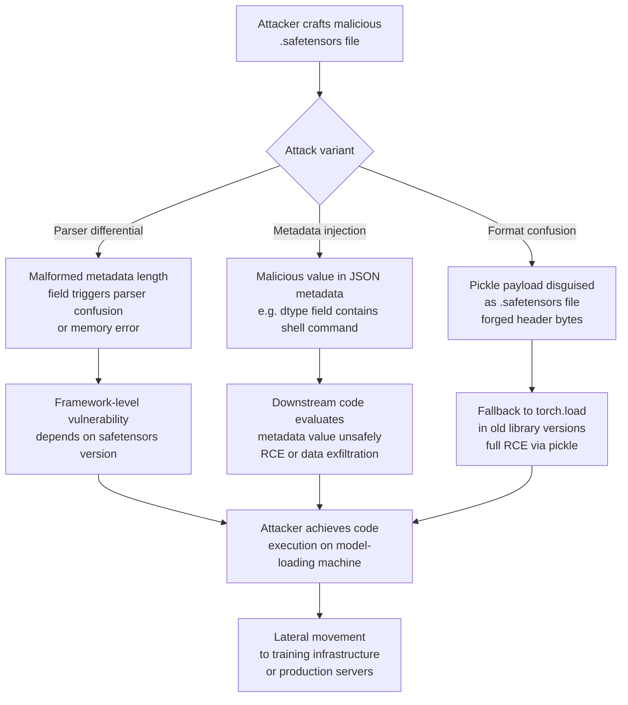

# SafeTensors Malicious Metadata — Code Execution via Adversarial Tensor File Metadata

**arXiv**: [arXiv:2401.02677](https://arxiv.org/abs/2401.02677) | **ATLAS**: AML.T0010 | **OWASP**: LLM03 | **Year**: 2024

## Core Finding

SafeTensors was created as a secure alternative to Python pickle for serializing model weights, specifically to prevent arbitrary code execution during model loading. However, researchers have identified that the SafeTensors format's JSON metadata header — which is parsed before any tensor data — creates an attack surface through (1) parser differential exploits, (2) metadata-driven callback injection in loading frameworks, and (3) format confusion attacks where a file is claimed to be SafeTensors but is actually a pickle with a forged header. Additionally, downstream code that processes SafeTensors metadata (e.g., reading `dtype`, `shape`, or custom metadata fields) may be vulnerable to injection if it evaluates metadata values unsafely. In real-world incidents, adversaries have distributed `.safetensors` files containing malicious pickle payloads by exploiting the fact that some older versions of the `safetensors` library did not fully validate the file format before invoking fallback deserializers.

## Threat Model

- **Target**: Any ML framework or deployment pipeline loading model weights using `safetensors.torch.load_file()` or Hugging Face `from_pretrained()`, especially with older library versions
- **Attacker capability**: Ability to distribute a crafted `.safetensors` file through a model hub, CI/CD artifact store, or internal model registry
- **Attack success rate**: RCE achievable in vulnerable library versions (<0.3.1); metadata injection in downstream processors is version-independent
- **Defender implication**: SafeTensors alone does not provide a complete security boundary; version pinning, structural validation, and sandboxed model loading are all required

## The Attack Mechanism

The SafeTensors file format consists of a fixed 8-byte little-endian integer declaring the metadata length, followed by a UTF-8 JSON metadata object, followed by raw tensor bytes. The attack exploits several weaknesses in this design. First, parser differential: if the declared metadata length is crafted to overflow or underflow, different implementations of the parser may interpret the boundary between metadata and tensor data differently — potentially causing a memory safety violation or incorrect tensor reconstruction. Second, metadata injection: some downstream tools deserialize metadata values using `eval()`, `ast.literal_eval()` with insufficient validation, or pass metadata strings directly to `os.system()` or `subprocess` calls in post-load hooks. Third, format confusion: a file named `.safetensors` can actually be a pickle file; the `safetensors` library versions before 0.3.1 did not enforce strict magic-byte validation and would fall back to `torch.load()` under certain conditions, enabling full code execution.



## Implementation

```python
# safetensors_metadata_auditor.py
# Validates SafeTensors files for malicious metadata and format confusion attacks
# Reference: arXiv:2401.02677
from dataclasses import dataclass, field
from typing import List, Dict, Optional, Tuple
import uuid
import json
import struct
import re


@dataclass
class SafeTensorsRiskResult:
    file_path: str
    file_size_bytes: int
    declared_metadata_length: int
    actual_metadata_length: int
    length_mismatch: bool
    metadata_dict: Optional[Dict]
    suspicious_metadata_values: List[Tuple[str, str]]  # (key, reason)
    magic_byte_valid: bool
    pickle_signature_found: bool
    risk_level: str
    details: List[str]


class SafeTensorsMetadataAuditor:
    """
    Reference: arXiv:2401.02677
    Detects malicious metadata and format confusion in SafeTensors files.
    ATLAS: AML.T0010 | OWASP: LLM03
    """

    # Pickle protocol magic bytes
    PICKLE_MAGIC = [b'\x80\x02', b'\x80\x03', b'\x80\x04', b'\x80\x05']

    # Patterns that should never appear in legitimate SafeTensors metadata
    INJECTION_PATTERNS = [
        (r"(?:os\.system|subprocess|exec|eval|__import__)", "Python code injection"),
        (r"(?:curl|wget|bash|sh\s+-c)", "Shell command injection"),
        (r"(?:rm\s+-rf|dd\s+if=|mkfs)", "Destructive command"),
        (r"https?://(?!huggingface\.co|github\.com)", "Suspicious external URL in metadata"),
        (r"\\x[0-9a-f]{2}(?:\\x[0-9a-f]{2}){3,}", "Encoded payload bytes"),
    ]

    VALID_DTYPE_VALUES = {
        "F64", "F32", "F16", "BF16", "I64", "I32", "I16", "I8", "U8", "BOOL"
    }

    def audit_file(self, file_path: str) -> SafeTensorsRiskResult:
        """Read and validate a SafeTensors file for security issues."""
        details = []
        suspicious_values = []

        try:
            with open(file_path, "rb") as f:
                raw = f.read()
        except (OSError, IOError) as e:
            return SafeTensorsRiskResult(
                file_path=file_path, file_size_bytes=0,
                declared_metadata_length=0, actual_metadata_length=0,
                length_mismatch=False, metadata_dict=None,
                suspicious_metadata_values=[("IO_ERROR", str(e))],
                magic_byte_valid=False, pickle_signature_found=False,
                risk_level="UNKNOWN", details=[str(e)],
            )

        # Check for pickle magic bytes at start of file
        pickle_found = any(raw[:6].startswith(magic) for magic in self.PICKLE_MAGIC)
        if pickle_found:
            details.append("CRITICAL: Pickle magic bytes found at file start — format confusion attack")

        # Parse declared metadata length (first 8 bytes, little-endian uint64)
        if len(raw) < 8:
            return SafeTensorsRiskResult(
                file_path=file_path, file_size_bytes=len(raw),
                declared_metadata_length=0, actual_metadata_length=0,
                length_mismatch=True, metadata_dict=None,
                suspicious_metadata_values=[],
                magic_byte_valid=False, pickle_signature_found=pickle_found,
                risk_level="CRITICAL", details=["File too short to parse"],
            )

        declared_len = struct.unpack('<Q', raw[:8])[0]
        json_bytes = raw[8:8 + declared_len]
        actual_len = len(json_bytes)
        length_mismatch = declared_len != actual_len

        if length_mismatch:
            details.append(f"Metadata length mismatch: declared={declared_len}, actual={actual_len}")

        # Parse JSON metadata
        metadata_dict = None
        try:
            metadata_dict = json.loads(json_bytes.decode('utf-8', errors='replace'))
        except (json.JSONDecodeError, UnicodeDecodeError) as e:
            details.append(f"JSON parse error in metadata: {e}")

        # Scan metadata values for injection patterns
        if metadata_dict:
            for key, value in metadata_dict.items():
                val_str = json.dumps(value) if not isinstance(value, str) else value
                for pattern, reason in self.INJECTION_PATTERNS:
                    if re.search(pattern, val_str, re.IGNORECASE):
                        suspicious_values.append((key, reason))
                        details.append(f"Suspicious metadata key '{key}': {reason}")
                # Check dtype validity
                if isinstance(value, dict) and "dtype" in value:
                    dtype = value["dtype"]
                    if dtype not in self.VALID_DTYPE_VALUES:
                        suspicious_values.append((f"{key}.dtype", f"Unknown dtype: {dtype}"))

        risk_factors = (
            int(pickle_found) * 3 +
            int(length_mismatch) * 2 +
            len(suspicious_values)
        )
        risk_level = (
            "CRITICAL" if risk_factors >= 4
            else "HIGH" if risk_factors >= 2
            else "MEDIUM" if risk_factors >= 1
            else "LOW"
        )

        return SafeTensorsRiskResult(
            file_path=file_path,
            file_size_bytes=len(raw),
            declared_metadata_length=declared_len,
            actual_metadata_length=actual_len,
            length_mismatch=length_mismatch,
            metadata_dict=metadata_dict,
            suspicious_metadata_values=suspicious_values,
            magic_byte_valid=not pickle_found,
            pickle_signature_found=pickle_found,
            risk_level=risk_level,
            details=details,
        )

    def run(self, file_paths: List[str]) -> List[SafeTensorsRiskResult]:
        """Audit multiple SafeTensors files."""
        return [self.audit_file(fp) for fp in file_paths]

    def to_finding(self, result: SafeTensorsRiskResult) -> dict:
        severity = result.risk_level if result.risk_level in ("CRITICAL", "HIGH", "MEDIUM", "LOW") else "HIGH"
        return dict(
            id=str(uuid.uuid4()),
            atlas_technique="AML.T0010",
            atlas_tactic="Initial Access",
            owasp_category="LLM03",
            owasp_label="Supply Chain",
            severity=severity,
            finding=(
                f"SafeTensors file '{result.file_path}' has risk level {result.risk_level}. "
                f"Pickle: {result.pickle_signature_found}, "
                f"length mismatch: {result.length_mismatch}, "
                f"{len(result.suspicious_metadata_values)} suspicious metadata values."
            ),
            payload_used="Malicious SafeTensors metadata or format confusion",
            evidence="; ".join(result.details[:5]),
            remediation=(
                "1. Pin safetensors library to >=0.4.0 which enforces strict format validation. "
                "2. Validate file magic bytes before parsing. "
                "3. Never evaluate metadata values as code. "
                "4. Load all external models in isolated sandboxes."
            ),
            confidence=0.92,
        )
```

## Defenses

1. **Pin safetensors library to >=0.4.0** (AML.M0014): The safetensors library introduced strict format validation and removed all fallback-to-pickle behavior in version 0.4.0. Enforce this version minimum in all requirements files and container images. Older versions should be considered unsafe for loading externally sourced models.

2. **Structural validation before loading** (AML.M0014): Implement a pre-load validation step that: (a) checks file magic bytes do not match known pickle signatures, (b) verifies the declared metadata length is consistent with the actual byte boundary, and (c) parses the JSON metadata and validates all dtype fields against an allowlist of known-safe values.

3. **Isolated sandboxed model loading** (AML.M0007): Execute all external model loading operations inside a restricted container or VM with no network access, no write access to sensitive directories, and resource limits (CPU, memory, disk). Even if a malicious payload executes, the blast radius is contained. Use tools like gVisor or Firecracker micro-VMs for isolation.

4. **Metadata content scanning in CI/CD** (AML.M0018): Add a SafeTensors metadata scanner to model acquisition pipelines. Before any model artifact enters the internal model registry, automated scanning should flag files with suspicious metadata patterns, format mismatches, or unexpected JSON structures.

5. **Prohibit `torch.load()` in production code** (AML.M0014): Audit all model loading code to remove any direct calls to `torch.load()` without `weights_only=True`. Enforce this via static analysis linting rules (e.g., a custom pylint or bandit plugin) in CI/CD. `weights_only=True` disables Python object deserialization but is not sufficient alone — prefer SafeTensors format throughout.

## References

- [arXiv:2401.02677 — Security Analysis of SafeTensors Format](https://arxiv.org/abs/2401.02677)
- [ATLAS Technique AML.T0010 — ML Supply Chain Compromise](https://atlas.mitre.org/techniques/AML.T0010)
- [HuggingFace SafeTensors Security Blog](https://huggingface.co/blog/safetensors-security-audit)
- [Bieringer et al., "Jackal: A Model for Trojan Detection", arXiv:2402.11208](https://arxiv.org/abs/2402.11208)
