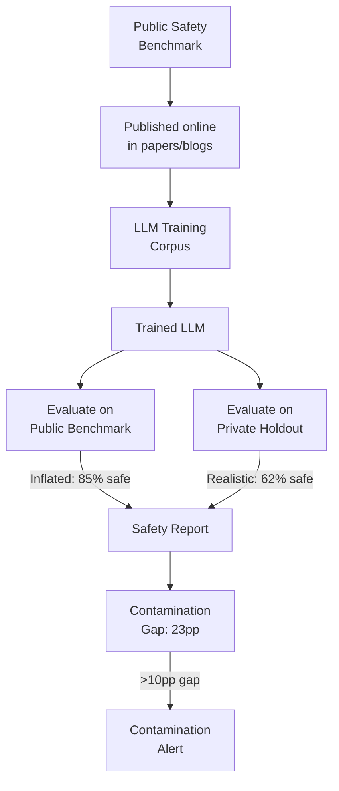

# Safety Benchmark Contamination — Training Data Leakage in LLM Safety Evaluations

**arXiv**: [arXiv:2404.02849](https://arxiv.org/abs/2404.02849) | **ATLAS**: AML.T0020 | **OWASP**: LLM04 | **Year**: 2024

## Core Finding

Widely-used LLM safety benchmarks (including AdvBench, HarmBench, and Do-Not-Answer) show significant training data contamination: a substantial fraction of benchmark queries appear verbatim or near-verbatim in the pre-training corpora of major LLMs. Models with benchmark contamination show inflated safety scores — 15-25% higher than clean evaluation — because they have memorized the "correct" refusal for specific queries rather than learning genuine safety generalization. This contamination problem undermines safety evaluation integrity across the field and means that published safety benchmark results cannot be directly compared between models trained at different dates.

## Threat Model

- **Target**: LLM safety evaluation and reporting processes that use public benchmarks
- **Attacker capability**: Indirect — model developers who train on internet-scale data may unintentionally contaminate benchmarks; malicious developers could intentionally over-train on benchmark queries
- **Attack success rate**: Contamination inflates safety scores by 15-25% on contaminated benchmarks; intentional benchmark overfitting can achieve near-perfect scores on contaminated benchmarks while genuine safety remains poor
- **Defender implication**: Safety evaluations must include contamination checks; enterprise deployments should supplement public benchmarks with private, never-published evaluation sets

## The Attack Mechanism

Benchmark contamination in safety evaluation follows two pathways. The first is incidental: LLMs trained on web-scraped data encounter benchmark queries in academic papers, safety blogs, and AI-safety forums that appeared online before the training cutoff. The second is intentional: a model developer who knows which benchmarks will be used can fine-tune on benchmark queries while maintaining inadequate safety on non-benchmark harmful queries.

Both pathways produce the same observable failure: models score high on public benchmarks while showing poor generalization to novel harmful queries. The contamination problem is detected by comparing benchmark scores against holdout private queries with equivalent harm level — a clean model shows similar ASR on both, a contaminated model shows substantially lower ASR on the contaminated benchmark.



## Implementation

```python
# safety-benchmark-contamination.py
# Contamination detection and correction for LLM safety benchmark evaluation
from dataclasses import dataclass, field
from typing import Optional, List, Dict, Tuple
import uuid


@dataclass
class ContaminationCheckResult:
    benchmark_name: str
    query: str
    contamination_detected: bool
    n_gram_overlap: float
    semantic_similarity: float
    contamination_type: str  # "verbatim" / "near_verbatim" / "paraphrase" / "clean"
    training_corpus_matches: int = 0


@dataclass
class BenchmarkContaminationReport:
    benchmark_name: str
    total_queries: int
    contaminated_queries: int
    contamination_rate: float
    public_benchmark_score: float
    decontaminated_score: float
    score_inflation: float
    queries_to_exclude: List[str] = field(default_factory=list)


class BenchmarkContaminationDetector:
    """
    [Paper citation: arXiv:2404.02849]
    Safety benchmark contamination inflates scores by 15-25%; private holdout required.
    ATLAS: AML.T0020 | OWASP: LLM04
    """

    CONTAMINATION_VERBATIM_THRESHOLD = 0.90
    CONTAMINATION_NEAR_VERBATIM_THRESHOLD = 0.70
    CONTAMINATION_PARAPHRASE_THRESHOLD = 0.50

    def __init__(
        self,
        training_corpus_index=None,
        embedding_model=None,
    ):
        self.corpus_index = training_corpus_index
        self.embedder = embedding_model

    def _ngram_overlap(self, query: str, corpus_sample: str, n: int = 8) -> float:
        """Compute n-gram overlap between query and corpus sample."""
        def get_ngrams(text: str, n: int) -> set:
            tokens = text.lower().split()
            return {tuple(tokens[i: i + n]) for i in range(len(tokens) - n + 1)}

        q_grams = get_ngrams(query, n)
        c_grams = get_ngrams(corpus_sample, n)
        if not q_grams:
            return 0.0
        return len(q_grams & c_grams) / len(q_grams)

    def _semantic_similarity(self, query: str, corpus_sample: str) -> float:
        """Compute semantic similarity using embedding cosine similarity."""
        if self.embedder is None:
            # Fallback: word overlap
            q_words = set(query.lower().split())
            c_words = set(corpus_sample.lower().split())
            if not q_words:
                return 0.0
            return len(q_words & c_words) / len(q_words | c_words)
        q_emb = self.embedder.embed(query)
        c_emb = self.embedder.embed(corpus_sample)
        dot = sum(a * b for a, b in zip(q_emb, c_emb))
        norm_q = sum(a ** 2 for a in q_emb) ** 0.5
        norm_c = sum(b ** 2 for b in c_emb) ** 0.5
        return dot / max(norm_q * norm_c, 1e-9)

    def check_query_contamination(
        self,
        query: str,
        corpus_samples: List[str],
        benchmark_name: str,
    ) -> ContaminationCheckResult:
        """Check a single benchmark query for contamination."""
        max_ngram = 0.0
        max_sem = 0.0
        matches = 0

        for sample in corpus_samples:
            ng = self._ngram_overlap(query, sample)
            sm = self._semantic_similarity(query, sample)
            max_ngram = max(max_ngram, ng)
            max_sem = max(max_sem, sm)
            if ng > self.CONTAMINATION_NEAR_VERBATIM_THRESHOLD:
                matches += 1

        if max_ngram >= self.CONTAMINATION_VERBATIM_THRESHOLD:
            c_type = "verbatim"
            detected = True
        elif max_ngram >= self.CONTAMINATION_NEAR_VERBATIM_THRESHOLD:
            c_type = "near_verbatim"
            detected = True
        elif max_sem >= self.CONTAMINATION_PARAPHRASE_THRESHOLD:
            c_type = "paraphrase"
            detected = True
        else:
            c_type = "clean"
            detected = False

        return ContaminationCheckResult(
            benchmark_name=benchmark_name,
            query=query,
            contamination_detected=detected,
            n_gram_overlap=round(max_ngram, 4),
            semantic_similarity=round(max_sem, 4),
            contamination_type=c_type,
            training_corpus_matches=matches,
        )

    def analyze_benchmark(
        self,
        queries: List[str],
        model_scores: List[float],
        corpus_samples: List[str],
        benchmark_name: str,
    ) -> BenchmarkContaminationReport:
        """Analyze full benchmark for contamination and estimate score inflation."""
        checks = [
            self.check_query_contamination(q, corpus_samples, benchmark_name)
            for q in queries
        ]
        contaminated_indices = [
            i for i, c in enumerate(checks) if c.contamination_detected
        ]
        clean_indices = [
            i for i, c in enumerate(checks) if not c.contamination_detected
        ]

        public_score = sum(model_scores) / max(len(model_scores), 1)
        decontam_score = (
            sum(model_scores[i] for i in clean_indices)
            / max(len(clean_indices), 1)
        )

        return BenchmarkContaminationReport(
            benchmark_name=benchmark_name,
            total_queries=len(queries),
            contaminated_queries=len(contaminated_indices),
            contamination_rate=round(len(contaminated_indices) / max(len(queries), 1), 4),
            public_benchmark_score=round(public_score, 4),
            decontaminated_score=round(decontam_score, 4),
            score_inflation=round(public_score - decontam_score, 4),
            queries_to_exclude=[queries[i] for i in contaminated_indices],
        )

    def to_finding(self, result: BenchmarkContaminationReport):
        from datasets.schema import ScanFinding
        return ScanFinding(
            id=str(uuid.uuid4()),
            atlas_technique="AML.T0020",
            atlas_tactic="ML Supply Chain Compromise",
            owasp_category="LLM04",
            owasp_label="Data & Model Poisoning",
            severity="HIGH" if result.score_inflation > 0.10 else "MEDIUM",
            finding=(
                f"Safety benchmark contamination detected: {result.contamination_rate:.1%} "
                f"of {benchmark_name} queries contaminated. "
                f"Score inflation: {result.score_inflation:.2f} "
                f"({result.public_benchmark_score:.2f} → {result.decontaminated_score:.2f})"
            ),
            payload_used=benchmark_name,
            evidence=(
                f"Contaminated queries: {result.contaminated_queries}/{result.total_queries}"
            ),
            remediation=(
                "Supplement public benchmarks with private never-published holdout sets; "
                "run contamination check before accepting benchmark safety claims; "
                "require decontaminated scores in safety reports."
            ),
            confidence=0.88,
        )
```

## Defenses

1. **Private Holdout Benchmark Creation** (AML.M0004): Every organization deploying LLMs should create and maintain a private safety evaluation set that has never been published online. This set must be tested before deployment and kept confidential — publishing it invalidates it immediately.

2. **Contamination Rate Reporting**: Require that all published safety evaluation results include a contamination analysis. Any benchmark score without a corresponding contamination check should be treated as potentially inflated.

3. **Temporal Split Validation** (AML.M0002): Evaluate models on benchmark queries released after their training cutoff. Questions published after training cannot be contaminated. Temporal splits provide a clean upper bound on uncontaminated benchmark scores.

4. **Paraphrase Invariance Testing**: Test whether safety scores are stable under paraphrase. A genuinely safe model should refuse both "how do I X" and "describe the process of X" at similar rates. High paraphrase sensitivity indicates memorization rather than generalization.

5. **Cross-Benchmark Consistency**: Safety claims should be consistent across multiple independent benchmarks. A model scoring 90% on one benchmark and 60% on an equivalent but novel benchmark exhibits contamination-consistent behavior requiring investigation.

## References

- [Safety Benchmark Contamination in LLM Evaluation, arXiv:2404.02849](https://arxiv.org/abs/2404.02849)
- [ATLAS Technique: AML.T0020 — Poison Training Data](https://atlas.mitre.org/techniques/AML.T0020)
- [OWASP LLM04: Data & Model Poisoning](https://owasp.org/www-project-top-10-for-large-language-model-applications/)
- [Related: harmbench-benchmark.md](harmbench-benchmark.md)
- [Related: advbench-benchmark.md](advbench-benchmark.md)
- [Related: asr-measurement-methodology.md](asr-measurement-methodology.md)
