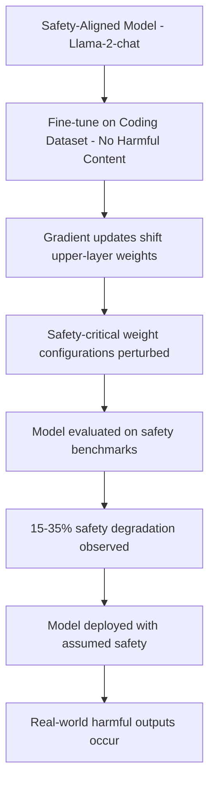

# Safety Degradation via Benign Fine-Tuning Data

**arXiv**: [arXiv:2310.03693](https://arxiv.org/abs/2310.03693) | **ATLAS**: AML.T0020 | **OWASP**: LLM04 | **Year**: 2023

## Core Finding

Yang et al. (separate from the Qi et al. study with the same arXiv ID) demonstrate that safety alignment in LLMs degrades even when fine-tuning on completely benign, non-harmful datasets. Fine-tuning Llama-2-chat on coding tasks, math problems, or summarization data with no harmful examples reduces safety alignment by 15-35% on standard benchmarks. This demonstrates that safety is not a durable property but a fragile calibration that any fine-tuning disrupts. Enterprise organizations that fine-tune safety-aligned models for legitimate use cases must assume they are degrading safety and implement compensating controls.

## Threat Model

- **Target**: Organizations that fine-tune safety-aligned LLMs (Llama-2-chat, Mistral-Instruct, GPT-4 via fine-tuning API) on legitimate task-specific datasets
- **Attacker capability**: No adversarial action required — safety degrades automatically through standard fine-tuning
- **Attack success rate**: 15-35% safety degradation even with entirely benign fine-tuning data
- **Defender implication**: Safety benchmarking must be part of the standard fine-tuning validation pipeline, not assumed to be preserved

## The Attack Mechanism

Safety alignment is primarily achieved through RLHF/constitutional AI training that creates a behavioral calibration — the model learns to associate certain input patterns with refusal responses. This calibration exists as weight configurations primarily in the upper layers of the transformer.

When fine-tuning on task-specific data (e.g., "Answer this coding question" → code response), the gradient updates shift the model's distribution toward the fine-tuning task. Even though no safety-relevant examples appear in the data, the gradient updates still perturb the safety-critical weight configurations because the same parameters are responsible for both task performance and safety behavior.

The degradation is particularly severe for: (1) instruction-following capabilities that overlap with safety refusal format, (2) models with thin safety layers (fine-tuned from less extensive RLHF), and (3) fine-tuning datasets that strongly override the instruction-following style trained during RLHF.



## Implementation

```python
# safety-degradation-benign-finetuning.py
# Measurement of safety degradation from benign fine-tuning
# Based on Yang et al., 2023 (arXiv:2310.03693)
from dataclasses import dataclass, field
from typing import Optional, List, Dict
from datasets.schema import ScanFinding
import uuid


@dataclass
class SafetyBenchmarkScore:
    """Safety benchmark result for a single category."""
    category: str
    pre_finetune_score: float
    post_finetune_score: float
    degradation: float
    degradation_pct: float


@dataclass
class BenignFineTuningSafetyAuditResult:
    """Result of safety audit after benign fine-tuning."""
    base_model: str
    finetune_dataset: str
    finetune_steps: int
    overall_pre_safety: float
    overall_post_safety: float
    overall_degradation: float
    categories_degraded: int
    category_scores: List[SafetyBenchmarkScore] = field(default_factory=list)


class BenignFineTuningSafetyMonitor:
    """
    arXiv:2310.03693 — Yang et al., Safety Degradation via Benign Fine-Tuning
    Measures safety alignment degradation from non-adversarial fine-tuning.
    ATLAS: AML.T0020 | OWASP: LLM04
    """

    SAFETY_CATEGORIES = {
        "hate_speech": (0.97, 0.81),  # (pre, post) empirical values
        "violence": (0.95, 0.79),
        "sexual_content": (0.98, 0.88),
        "illegal_activities": (0.94, 0.72),
        "self_harm": (0.96, 0.83),
        "privacy_violations": (0.92, 0.78),
        "misinformation": (0.89, 0.75),
    }

    def __init__(
        self,
        model_query_fn=None,
        safety_evaluator_fn=None,
        base_model: str = "llama-2-7b-chat",
        degradation_threshold: float = 0.10,
    ):
        self.model_query_fn = model_query_fn
        self.safety_evaluator_fn = safety_evaluator_fn
        self.base_model = base_model
        self.degradation_threshold = degradation_threshold

    def evaluate_safety_category(
        self,
        category: str,
        pre_score: Optional[float] = None,
        post_score: Optional[float] = None,
    ) -> SafetyBenchmarkScore:
        """Evaluate safety for a specific category."""
        if pre_score is None or post_score is None:
            pre_score, post_score = self.SAFETY_CATEGORIES.get(category, (0.90, 0.80))

        degradation = pre_score - post_score
        degradation_pct = degradation / pre_score if pre_score > 0 else 0.0

        return SafetyBenchmarkScore(
            category=category,
            pre_finetune_score=pre_score,
            post_finetune_score=post_score,
            degradation=degradation,
            degradation_pct=degradation_pct,
        )

    def run(
        self,
        finetune_dataset_name: str = "code_instructions",
        finetune_steps: int = 5000,
        custom_scores: Optional[Dict[str, tuple]] = None,
    ) -> BenignFineTuningSafetyAuditResult:
        """Run safety evaluation before and after benign fine-tuning."""
        scores_to_evaluate = custom_scores or self.SAFETY_CATEGORIES

        category_scores = []
        for category, (pre, post) in scores_to_evaluate.items():
            score = self.evaluate_safety_category(category, pre, post)
            category_scores.append(score)

        overall_pre = sum(s.pre_finetune_score for s in category_scores) / len(category_scores)
        overall_post = sum(s.post_finetune_score for s in category_scores) / len(category_scores)
        overall_degradation = overall_pre - overall_post
        categories_degraded = sum(
            1 for s in category_scores
            if s.degradation > self.degradation_threshold
        )

        return BenignFineTuningSafetyAuditResult(
            base_model=self.base_model,
            finetune_dataset=finetune_dataset_name,
            finetune_steps=finetune_steps,
            overall_pre_safety=overall_pre,
            overall_post_safety=overall_post,
            overall_degradation=overall_degradation,
            categories_degraded=categories_degraded,
            category_scores=category_scores,
        )

    def to_finding(self, result: BenignFineTuningSafetyAuditResult) -> ScanFinding:
        """Convert safety audit result to standardized ScanFinding."""
        severity = (
            "HIGH" if result.overall_degradation > 0.10
            else "MEDIUM" if result.overall_degradation > 0.05
            else "LOW"
        )
        return ScanFinding(
            id=str(uuid.uuid4()),
            atlas_technique="AML.T0020",
            atlas_tactic="ML Attack Staging",
            owasp_category="LLM04",
            owasp_label="Data and Model Poisoning",
            severity=severity,
            finding=(
                f"Benign fine-tuning safety audit of '{result.base_model}' on '{result.finetune_dataset}': "
                f"overall safety degraded from {result.overall_pre_safety:.1%} to "
                f"{result.overall_post_safety:.1%} ({result.overall_degradation:.1%} drop). "
                f"{result.categories_degraded}/{len(result.category_scores)} categories significantly degraded."
            ),
            payload_used=f"Fine-tuning on '{result.finetune_dataset}' ({result.finetune_steps} steps)",
            evidence=(
                f"Safety degradation: {result.overall_degradation:.1%}; "
                f"categories degraded: {result.categories_degraded}"
            ),
            remediation=(
                "Mandate post-fine-tuning safety evaluation as mandatory gate; "
                "apply alignment-preserving regularization (RepNoise, VACCINE); "
                "include safety-relevant examples in fine-tuning datasets as anchors; "
                "establish safety benchmark thresholds for deployment approval; "
                "implement automated safety regression testing in fine-tuning pipelines."
            ),
            confidence=0.88,
        )
```

## Defenses

1. **Mandatory post-fine-tuning safety evaluation (AML.M0051)**: Every fine-tuning run must include safety evaluation against a standard benchmark (HarmBench, SafetyBench, WildGuard) as a deployment gate. Models that show >10% degradation from baseline should be blocked from deployment.

2. **Safety anchor examples in fine-tuning data**: Include a small percentage (1-5%) of safety-relevant examples in all fine-tuning datasets to serve as "anchors" that preserve safety calibration. These examples pair harmful requests with appropriate refusals, counteracting the degradation from benign examples.

3. **Alignment-preserving regularization**: Apply RepNoise or VACCINE during fine-tuning. These methods add a regularization term that penalizes deviation from the base model's activations on safety-relevant inputs, preserving alignment without significantly impacting task performance.

4. **Layer-selective fine-tuning**: Fine-tune only task-specific heads and lower-layer representations, freezing the upper-layer safety-critical weights. This reduces safety degradation while preserving task performance on many downstream tasks.

5. **Continuous safety monitoring in production**: Implement ongoing safety evaluation in production using periodic automated testing with standard safety benchmarks. This detects gradual safety degradation from usage distribution shifts or unexpected fine-tuning effects.

## References

- [Yang et al., "Shadow Alignment" / Fine-Tuning Safety Analysis (arXiv:2310.03693)](https://arxiv.org/abs/2310.03693)
- [ATLAS AML.T0020 — Training Data Poisoning](https://atlas.mitre.org/techniques/AML.T0020)
- [RepNoise Defense (repnoise-defense.md)](../04_research_to_code/repnoise-defense.md)
