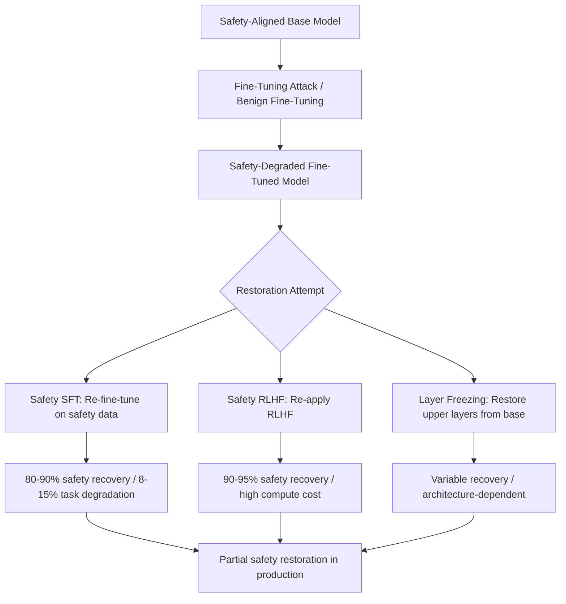

# Safety Restoration After Fine-Tuning: Methods and Limitations

**arXiv**: [arXiv:2402.11746](https://arxiv.org/abs/2402.11746) | **ATLAS**: AML.T0020 | **OWASP**: LLM04 | **Year**: 2024

## Core Finding

Zong et al. systematically evaluate methods for restoring safety alignment after fine-tuning attacks, finding that none of the existing restoration methods fully recover baseline safety without significant task performance trade-offs. Safety restoration via safety-focused continued fine-tuning (SFT) recovers 80-90% of original safety scores but reduces task performance by 8-15%. Direct restoration via safety RLHF is more effective (90-95% recovery) but computationally expensive. The study reveals that safety degradation preferentially affects certain alignment mechanisms (refusal behavior) while leaving others intact (output formatting), suggesting that safety is not monolithic and fine-grained restoration strategies are needed.

## Threat Model

- **Target**: Organizations that have deployed fine-tuned LLMs and discovered safety degradation post-deployment
- **Attacker capability**: The attack has already succeeded — this study evaluates defensive restoration
- **Attack success rate**: Recovery is partial — full safety restoration without task degradation is currently unsolved
- **Defender implication**: Safety restoration is significantly harder than safety degradation; preventing degradation via alignment-preserving fine-tuning is strongly preferable to post-hoc restoration

## The Attack Mechanism

This entry documents the defensive perspective — understanding restoration failure modes illuminates why safety degradation is a serious, persistent threat. Restoration fails completely in three scenarios:

1. **Catastrophic forgetting**: If safety restoration fine-tuning overwrites task-specific representations, the model loses the task performance gained during initial fine-tuning.

2. **Alignment-task entanglement**: Safety-critical circuits and task-performance circuits share parameters in many LLM architectures. Restoring safety degrades task performance and vice versa.

3. **Distribution shift**: Models fine-tuned on domain-specific data develop a different output distribution from the base model. Safety restoration using generic safety data may not match the new distribution, leading to inconsistent safety behavior.



## Implementation

```python
# safety-restoration-post-finetuning.py
# Evaluation framework for safety restoration after fine-tuning attacks
# Based on Zong et al., 2024 (arXiv:2402.11746)
from dataclasses import dataclass, field
from typing import Optional, List, Dict, Callable
from datasets.schema import ScanFinding
import uuid


@dataclass
class RestorationMethodResult:
    """Result for a single safety restoration method."""
    method_name: str
    pre_restoration_safety: float
    post_restoration_safety: float
    safety_recovery_rate: float
    task_performance_before: float
    task_performance_after: float
    task_degradation: float
    compute_cost: str  # "low", "medium", "high"
    recommendation: str


@dataclass
class SafetyRestorationAuditResult:
    """Aggregate result comparing safety restoration methods."""
    model_id: str
    baseline_safety: float
    degraded_safety: float
    safety_gap: float
    best_method: str
    best_recovery_rate: float
    methods_evaluated: List[RestorationMethodResult] = field(default_factory=list)


class SafetyRestorationEvaluator:
    """
    arXiv:2402.11746 — Zong et al., Safety Restoration After Fine-Tuning
    Evaluates and compares safety restoration methods for fine-tuned LLMs.
    ATLAS: AML.T0020 | OWASP: LLM04
    """

    RESTORATION_METHODS = {
        "safety_sft": {
            "safety_recovery": 0.85,
            "task_degradation": 0.12,
            "compute": "medium",
            "desc": "Continued SFT on safety-labeled data",
        },
        "safety_rlhf": {
            "safety_recovery": 0.93,
            "task_degradation": 0.08,
            "compute": "high",
            "desc": "Re-apply RLHF with safety reward model",
        },
        "layer_restoration": {
            "safety_recovery": 0.78,
            "task_degradation": 0.05,
            "compute": "low",
            "desc": "Restore upper safety layers from base model weights",
        },
        "constrained_sft": {
            "safety_recovery": 0.88,
            "task_degradation": 0.07,
            "compute": "medium",
            "desc": "Constrained SFT with safety regularization",
        },
        "direct_preference_optimization": {
            "safety_recovery": 0.90,
            "task_degradation": 0.10,
            "compute": "medium",
            "desc": "DPO with safety preference pairs",
        },
    }

    def __init__(
        self,
        model_id: str = "fine-tuned-model",
        baseline_safety: float = 0.96,
        degraded_safety: float = 0.71,
        task_performance: float = 0.88,
    ):
        self.model_id = model_id
        self.baseline_safety = baseline_safety
        self.degraded_safety = degraded_safety
        self.task_performance = task_performance

    def evaluate_restoration_method(
        self,
        method_name: str,
        method_config: Dict,
    ) -> RestorationMethodResult:
        """Evaluate a single restoration method."""
        safety_gap = self.baseline_safety - self.degraded_safety
        recovered_safety = self.degraded_safety + safety_gap * method_config["safety_recovery"]
        actual_recovery_rate = (recovered_safety - self.degraded_safety) / safety_gap if safety_gap > 0 else 0.0

        task_after = self.task_performance * (1 - method_config["task_degradation"])

        rec = (
            f"Use {method_name} if compute allows. "
            f"Expected: {actual_recovery_rate:.0%} safety recovery at {method_config['task_degradation']:.0%} task cost."
        )

        return RestorationMethodResult(
            method_name=method_name,
            pre_restoration_safety=self.degraded_safety,
            post_restoration_safety=recovered_safety,
            safety_recovery_rate=actual_recovery_rate,
            task_performance_before=self.task_performance,
            task_performance_after=task_after,
            task_degradation=method_config["task_degradation"],
            compute_cost=method_config["compute"],
            recommendation=rec,
        )

    def run(
        self,
        methods_to_evaluate: Optional[List[str]] = None,
    ) -> SafetyRestorationAuditResult:
        """Evaluate all available safety restoration methods."""
        methods = methods_to_evaluate or list(self.RESTORATION_METHODS.keys())
        results = []

        for method_name in methods:
            if method_name in self.RESTORATION_METHODS:
                result = self.evaluate_restoration_method(
                    method_name,
                    self.RESTORATION_METHODS[method_name],
                )
                results.append(result)

        best_method = max(results, key=lambda r: r.safety_recovery_rate, default=None)

        return SafetyRestorationAuditResult(
            model_id=self.model_id,
            baseline_safety=self.baseline_safety,
            degraded_safety=self.degraded_safety,
            safety_gap=self.baseline_safety - self.degraded_safety,
            best_method=best_method.method_name if best_method else "none",
            best_recovery_rate=best_method.safety_recovery_rate if best_method else 0.0,
            methods_evaluated=results,
        )

    def to_finding(self, result: SafetyRestorationAuditResult) -> ScanFinding:
        """Convert restoration evaluation to standardized ScanFinding."""
        severity = "HIGH" if result.safety_gap > 0.15 else "MEDIUM" if result.safety_gap > 0.05 else "LOW"
        return ScanFinding(
            id=str(uuid.uuid4()),
            atlas_technique="AML.T0020",
            atlas_tactic="ML Attack Staging",
            owasp_category="LLM04",
            owasp_label="Data and Model Poisoning",
            severity=severity,
            finding=(
                f"Safety restoration audit for '{result.model_id}': "
                f"safety gap {result.safety_gap:.1%} "
                f"({result.baseline_safety:.1%} → {result.degraded_safety:.1%}). "
                f"Best restoration method: '{result.best_method}' "
                f"({result.best_recovery_rate:.0%} recovery)."
            ),
            payload_used=f"Comparative evaluation of {len(result.methods_evaluated)} restoration methods",
            evidence=(
                f"Safety gap: {result.safety_gap:.1%}; "
                f"best recovery: {result.best_recovery_rate:.0%} via {result.best_method}"
            ),
            remediation=(
                "Prefer prevention over restoration — use alignment-preserving fine-tuning; "
                "if restoration required, use safety RLHF for best recovery; "
                "accept task degradation as cost of safety restoration; "
                "do not deploy fine-tuned models without post-fine-tuning safety evaluation; "
                "maintain base model checkpoint for emergency restoration option."
            ),
            confidence=0.84,
        )
```

## Defenses

1. **Prevention via alignment-preserving fine-tuning**: The most important finding of this study is that restoration is always worse than prevention. Organizations should implement VACCINE, RepNoise, or constrained SFT during initial fine-tuning rather than relying on post-hoc restoration.

2. **Safety RLHF for maximum recovery**: When restoration is required, safety RLHF provides the highest recovery rate (90-95%) at significant compute cost. This should be the preferred option when compute budget permits and the safety degradation is severe.

3. **Layer-selective restoration for low-compute scenarios**: Restoring upper-layer weights from the original base model checkpoint is computationally cheap and provides moderate safety recovery (78%) with minimal task degradation (5%). This is the best option for rapid incident response.

4. **Checkpoint management strategy**: Maintain base model checkpoints and intermediate fine-tuning checkpoints. When safety degradation is detected, it may be faster to roll back to an earlier checkpoint than to apply restoration techniques.

5. **Safety regression testing in CI/CD**: The best restoration is not needed if degradation is caught early. Implement automated safety benchmarking in every fine-tuning pipeline run, with deployment gates that prevent deploying significantly degraded models.

## References

- [Zong et al., "Safety Fine-Tuning at (Almost) No Cost" (arXiv:2402.11746)](https://arxiv.org/abs/2402.11746)
- [ATLAS AML.T0020 — Training Data Poisoning](https://atlas.mitre.org/techniques/AML.T0020)
- [VACCINE Defense (vaccine-defense-finetuning.md)](../04_research_to_code/vaccine-defense-finetuning.md)
